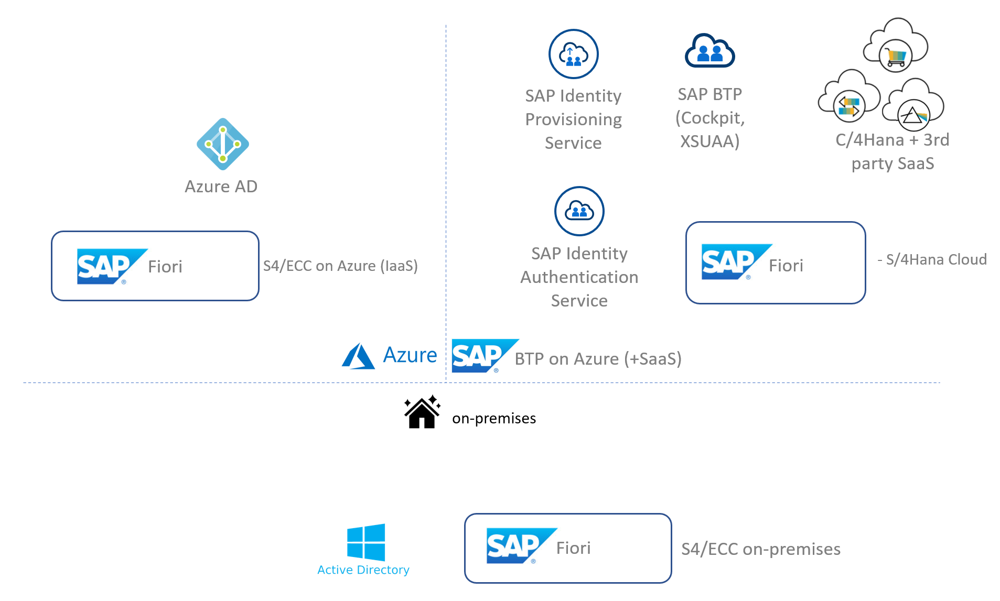
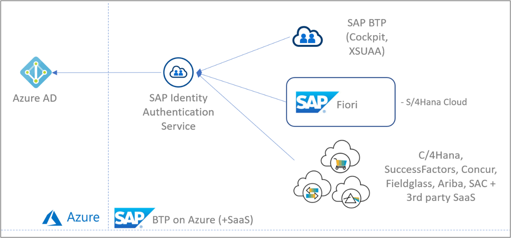
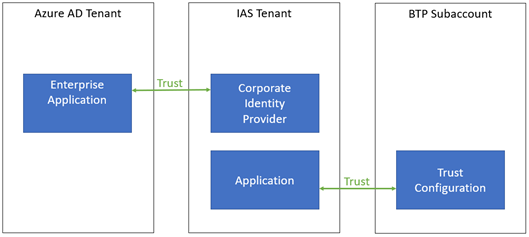
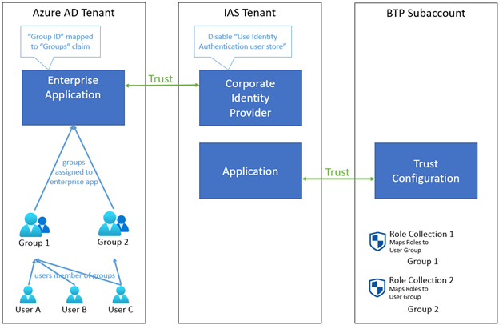
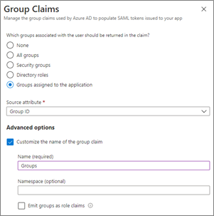
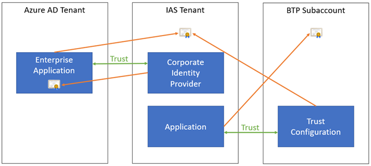

# Scenario - Using Microsoft Entra ID to secure access to SAP platforms and applications

This document provides advice on the **technical design and configuration** of SAP platforms and applications when using Microsoft Entra ID as the primary user authentication service for [SAP Cloud Identity Services](https://help.sap.com/docs/cloud-identity-services/cloud-identity-services/landing-page). SAP Cloud Identity Services includes Identity Authentication, Identity Provisioning, Identity Directory, and Authorization Management. Learn more about the initial setup for authentication in the [Microsoft Entra single sign-on (SSO) integration with SAP Cloud Identity Services tutorial](~/identity/saas-apps/sap-hana-cloud-platform-identity-authentication-tutorial.md). For more information on provisioning and other scenarios, see [plan deploying Microsoft Entra for user provisioning with SAP source and target applications](~/identity/app-provisioning/plan-sap-user-source-and-target.md) and [manage access to your SAP applications](~/id-governance/sap.md).

## Terminology used in this guide

| Abbreviation                                                                                                          | Description                                                                                                                                                                                                   |
| --------------------------------------------------------------------------------------------------------------------- | ------------------------------------------------------------------------------------------------------------------------------------------------------------------------------------------------------------- |
| [BTP](https://www.sap.com/products/technology-platform.html)                                                 |  SAP Business Technology Platform is an innovation platform optimized for SAP applications in the cloud. Most of the SAP technologies discussed here are part of BTP. The products formally known as SAP Cloud Platform are part of SAP BTP. |
| [IAS](https://pages.community.sap.com/topics/cloud-identity-services/identity-authentication)                                       | SAP Cloud Identity Services - Identity Authentication, a component of SAP Cloud Identity Services, is a cloud service for authentication, single sign-on and user management in SAP cloud and on-premises applications. IAS helps users authenticate to their own SAP BTP service instances, as a proxy that integrates with Microsoft Entra single-sign on.           |
| [IPS](https://pages.community.sap.com/topics/cloud-identity-services/identity-provisioning) | SAP Cloud Identity Services - Identity Provisioning, a component of SAP Cloud Identity Services, is a cloud service that helps you provision identities and their authorization to SAP cloud and on-premises application.                                                           |
| [XSUAA](https://blogs.sap.com/2019/01/07/uaa-xsuaa-platform-uaa-cfuaa-what-is-it-all-about/)                          | Extended Services for Cloud Foundry User Account and Authentication. [Cloud Foundry](https://www.cloudfoundry.org/), a platform as a service (PaaS) that can be deployed on different infrastructures, is the environment on which SAP built SAP Business Technology Platform. XSUAA is a multitenant OAuth authorization server that is the central infrastructure component of the Cloud Foundry environment. XSUAA provides for business user authentication and authorization within the SAP BTP.                                                                  |
| [Fiori](https://www.sap.com/products/fiori.html)                                                              | The web-based user experience of SAP (as opposed to the desktop-based experience).                                                                                                                            |

## Overview

There are many services and components in the SAP and Microsoft technology stack that play a role in user authentication and authorization scenarios. The main services are listed in the diagram below.

Since there are many permutations of possible scenarios to be configured, we focus on one scenario that is in-line with a Microsoft Entra identity first strategy. We'll make the following assumptions:

- You want to govern all your identities centrally and only from Microsoft Entra ID.
- You want to reduce maintenance efforts as much as possible and automate authentication and app access across Microsoft and SAP.
- The general guidance for Microsoft Entra ID with IAS applies for apps deployed on BTP and SAP SaaS apps configured in IAS. Specific recommendations will also be provided where applicable to BTP (for example, using role mappings with Microsoft Entra groups) and SAP SaaS apps (for example, using identity provisioning service for role-based authorization).
- We also assume that users are already provisioned in Microsoft Entra ID and towards any SAP systems that require users to be provisioned to function. Regardless of how that was achieved: provisioning could have been through manually, from on-premises Active Directory through Microsoft Entra Connect, or through HR systems like SAP SuccessFactors. In this document therefore, SuccessFactors is considered to be an application like any other that (existing) users will sign on to. We don't cover actual provisioning of users from SuccessFactors into Microsoft Entra ID.  For more information on bringing users into Microsoft Entra ID for use with SAP workloads, see [plan deploying Microsoft Entra for user provisioning with SAP source and target applications](~/identity/app-provisioning/plan-sap-user-source-and-target.md) and [manage access to your SAP applications](~/id-governance/sap.md).

Based on these assumptions, we focus mostly on the products and services presented in the diagram below. These are the various components that are most relevant to authentication and authorization in a cloud-based environment.

If you've been using SAP Identity Management (IDM), then you can migrate identity management scenarios from SAP IDM to Microsoft Entra. For more information, see [Migrate identity management scenarios from SAP IDM to Microsoft Entra](~/identity/app-provisioning/migrate-from-sap-idm.md).

> [!WARNING]
> Be aware of the SAP SAML assertion limits and impact of the length of SAP Cloud Foundry role collection names and number of collections proxied by groups in SAP Cloud Identity Service. For more information, see SAP note [2732890](https://launchpad.support.sap.com/?sap-support-cross-site-visitor-id=b73c7292f9a46d52#/notes/2732890) in SAP for Me. Exceeded limits result in authorization issues.

## Recommendations

### Summary

- [1 - Use Federated Authentication in SAP Business Technology Platform and SAP SaaS applications through SAP Identity Authentication Service](#1---use-federated-authentication-in-sap-business-technology-platform-and-sap-saas-applications-through-sap-identity-authentication-service)
- [2 - Use Microsoft Entra ID for Authentication and IAS/BTP for Authorization](#2---use-azure-ad-for-authentication-and-iasbtp-for-authorization)
- [3 - Use Microsoft Entra groups for Authorization through Role Collections in IAS/BTP](#3---use-azure-ad-groups-for-authorization-through-role-collections-in-iasbtp)
- [4 - Use a single BTP Subaccount only for applications that have similar Identity requirements](#4---use-a-single-btp-subaccount-only-for-applications-that-have-similar-identity-requirements)
- [5 - Use the Production IAS tenant for all end user Authentication and Authorization](#5---use-the-production-ias-tenant-for-all-end-user-authentication-and-authorization)
- [6 - Define a Process for Rollover of SAML Signing Certificates](#6---define-a-process-for-rollover-of-saml-signing-certificates)

### 1 - Use Federated Authentication in SAP Business Technology Platform and SAP SaaS applications through SAP Identity Authentication Service

#### Context

Your applications in BTP can use identity providers through [Trust Configurations](https://help.sap.com/viewer/65de2977205c403bbc107264b8eccf4b/Cloud/en-US/cb1bc8f1bd5c482e891063960d7acd78.html) to authenticate users by using the SAML 2.0 protocol between BTP/XSUAA and the identity provider. Note that only SAML 2.0 is supported, even though the OpenID Connect protocol is used between the application itself and BTP/XSUAA (not relevant in this context).

In BTP, you can choose to set up a trust configuration towards SAP Cloud Identity Services - Identity Authentication (which is the default) but when your authoritative user directory is Microsoft Entra ID, you can set up **federation** so that users can sign in with their existing Microsoft Entra accounts.

On top of federation, you can optionally also set up **user provisioning** so that Microsoft Entra users are provisioned upfront in BTP. However, there's no native support for this (only for Microsoft Entra ID -> SAP Identity Authentication Service); an integrated solution with native support would be the BTP Identity Provisioning Service. Provisioning user accounts upfront could be useful for authorization purposes (for example, to add users to roles). Depending on requirements however, you can also achieve this with Microsoft Entra groups (see below) which could mean you don't need user provisioning at all.

When setting up the federation relationship, there are multiple options:

- You can choose to federate towards Microsoft Entra ID directly from BTP/XSUAA.
- You can choose to federate with IAS that in turn is set up to federate with Microsoft Entra ID as a Corporate Identity Provider (also known as "SAML Proxying").

For SAP SaaS applications IAS is provisioned and pre-configured for easy onboarding of end users. (Examples of this include SuccessFactors, Marketing Cloud, Cloud for Customer, Sales Cloud, and others.) This scenario is less complex, because IAS is directly connected with the target app and not proxied to XSUAA. In any case, the same rules apply for this setup as for Microsoft Entra ID with IAS in general.

#### What are we recommending?

When your authoritative user directory is Microsoft Entra ID, we recommend setting up a trust configuration in BTP towards IAS. IAS in turn is set up to federate with Microsoft Entra ID as a Corporate Identity Provider.

On the trust configuration in BTP, we recommend that "Create Shadow Users During Logon" is enabled. This way, users who haven't yet been created in BTP, automatically get an account when they sign in through IAS / Microsoft Entra ID for the first time. If this setting would be disabled, only pre-provisioned users would be allowed to sign in.

#### Why this recommendation?

When using federation, you can choose to define the trust configuration at the BTP Subaccount level. In that case, you must repeat the configuration for each other Subaccount you're using. By using IAS as an intermediate trust configuration, you benefit from centralized configuration across multiple Subaccounts and you can use IAS features such as [risk-based authentication](https://help.sap.com/viewer/6d6d63354d1242d185ab4830fc04feb1/Cloud/en-US/bc52fbf3d59447bbb6aa22f80d8b6056.html) and centralized [enrichment of assertion attributes](https://help.sap.com/viewer/6d6d63354d1242d185ab4830fc04feb1/Cloud/en-US/7124201682434efb946e1046fde06afe.html). To safeguard the user experience, these advanced security features should only be enforced at a single location. This could either be IAS or when keeping Microsoft Entra ID as the single authoritative user store (as is the premise of this paper), this would centrally be handled by Microsoft Entra [Conditional Access Management](~/identity/conditional-access/overview.md).

Note: to IAS, every Subaccount is considered to be an "application", even though within that Subaccount one or more applications could be deployed. Within IAS, every such application can be set up for federation with the same corporate identity provider (Microsoft Entra ID in this case).

#### Summary of implementation

In Microsoft Entra ID:

- Optionally [configure Microsoft Entra ID for seamless single sign-on](~/identity/hybrid/connect/how-to-connect-sso.md) (Seamless SSO), which automatically signs users in when they are on their corporate devices connected to your corporate network. When enabled, users don't need to type in their passwords to sign in to Microsoft Entra ID, and usually, even type in their usernames.

In Microsoft Entra ID and IAS:

- Follow the documentation to connect Microsoft Entra ID to IAS in federation (proxy) mode ([SAP doc](https://developers.sap.com/tutorials/cp-ias-azure-ad.html), [Microsoft doc](~/identity/saas-apps/sap-hana-cloud-platform-identity-authentication-tutorial.md)). Watch out for the `NameID` setting on your SSO config in Microsoft Entra ID, because UPNs aren't necessarily email-addresses.
- Configure the "Bundled Application" to use Microsoft Entra ID by going to the "[Conditional Authentication](https://help.sap.com/viewer/6d6d63354d1242d185ab4830fc04feb1/Cloud/en-US/0143dce88a604533ab5ab17e639fec09.html)" page and setting the "Default Authenticating Identity Provider" to the Corporate Identity Provider representing your Microsoft Entra directory.

In BTP:

- Set up a trust configuration towards IAS ([SAP doc](https://help.sap.com/viewer/65de2977205c403bbc107264b8eccf4b/Cloud/en-US/7c6aa87459764b179aeccadccd4f91f3.html#loio7c6aa87459764b179aeccadccd4f91f3)) and ensure that "[Available for User Logon](https://help.sap.com/viewer/65de2977205c403bbc107264b8eccf4b/LATEST/en-US/affb201b1a36497996c2144c28683aed.html)" and "Create Shadow Users During Logon" are both enabled.
- Optionally, disable "Available for User Logon" on the default "SAP ID Service" trust configuration so that users always authenticate via Microsoft Entra ID and aren't presented with a screen to choose their identity provider.

### 2 - Use Microsoft Entra ID for Authentication and IAS/BTP for Authorization

#### Context

When BTP and IAS have been configured for user **authentication** via federation towards Microsoft Entra ID, there are multiple options for configuring **authorization**:

- In Microsoft Entra ID, you can assign Microsoft Entra users and groups to the Enterprise Application representing your SAP IAS instance in Microsoft Entra ID.
- In IAS, you can use Risk-based Authentication to allow or block sign-ins and by doing that preventing access to the application in BTP.
- In BTP, you can use Role Collections to define which users and groups can access the application and get certain roles.

#### What are we recommending?

We recommend that you don't put any authorization directly in Microsoft Entra itself and explicitly turn off "[User assignment required](~/identity/enterprise-apps/assign-user-or-group-access-portal.md)" on the Enterprise Application in Microsoft Entra ID. Note that for SAML applications, this setting is enabled by default, so you must take explicit action to disable it.

#### Why this recommendation?

When the application is federated through IAS, from the point of view of Microsoft Entra ID the user is essentially "authenticating to IAS" during the sign-in flow. This means that Microsoft Entra ID has no information about which final BTP application the user is trying to sign in to. That also implies that authorization in Microsoft Entra ID can only be used to do very coarse-grained authorization, for example allowing the user to sign in to *any* application in BTP, or to *none*. This also emphasizes SAP's strategy to isolate apps and authentication mechanisms on the BTP Subaccount level.

While that could be a valid reason for using "User assignment required", it does mean there are now potentially two different places where authorization information needs to be maintained: both in Microsoft Entra ID on the Enterprise Application (where it applies to *all* BTP applications), as well as in each BTP Subaccount. This could lead to confusion and misconfigurations where authorization settings are updated in one place but not the other. For example: a user was allowed in BTP but not assigned to the application in Microsoft Entra ID resulting in a failed authentication.

#### Summary of implementation

On the Microsoft Entra Enterprise Application representing the federation relation with IAS, disable "[User assignment required](~/identity/enterprise-apps/assign-user-or-group-access-portal.md)". This also means you can safely skip assignment of users.

### 3 - Use Microsoft Entra groups for Authorization through Role Collections in IAS/BTP

#### Context

When you want to configure authorization for your BTP applications, there are multiple options:

- You can configure fine-grained access control inside the application itself, based on the signed-in user.
- You can specify access through Roles and Role Collections in BTP, based on user assignments or group assignments.

The final implementation can use a combination of both strategies. However, for the assignment through Role Collections, this can be done on a user-by-user basis, or one can use groups of the configured identity provider.

#### What are we recommending?

If you want to use Microsoft Entra ID as the authoritative source for fine-grained authorization, we recommend using Microsoft Entra groups and assigning them to Role Collections in BTP. Granting users access to certain applications then simply means adding them to the relevant Microsoft Entra group(s) without any further configuration required in IAS/BTP.

With this configuration, we recommend using the Microsoft Entra group's Group ID (Object ID) as the unique identifier of the group, not the display name ("sAMAccountName"). This means you must use the Group ID as the "Groups" assertion in the SAML token issued by Microsoft Entra ID. In addition the Group ID is used for the assignment to the Role Collection in BTP.

#### Why this recommendation?

If you would assign *users* directly to Role Collections in BTP, you aren't centralizing authorization decisions in Microsoft Entra ID. It also means the user must already exist in IAS before they can be assigned to a Role Collection in BTP - and given that we recommend federation instead of user provisioning this means the user's shadow account may not exist yet in IAS at the time you want to do the user assignment. Using Microsoft Entra groups and assigning them to Role Collections eliminates these issues.

Assigning groups to Role Collections may seem to contradict the prior recommendation to not use Microsoft Entra ID for *authorization*. Even in this case however, the authorization decision is still being taken in BTP, it's just that the decision is now based on group membership maintained in Microsoft Entra ID.

We recommend using the Microsoft Entra group's Group ID rather than its name because the Group ID is globally unique, immutable and can never be reused for another group later on; whereas using the group name could lead to issues when the name is changed, and there's a security risk in having a group being deleted and another one getting created with the same name but with users in it that should have no access to the application.

#### Summary of implementation

In Microsoft Entra ID:

- Create groups to which users can be added that need access to applications in BTP (for example, create a Microsoft Entra group for each Role Collection in BTP).
- On the Microsoft Entra Enterprise Application representing the federation relation with IAS, configure the SAML User Attributes & Claims to [add a group claim for security groups](~/identity/hybrid/connect/how-to-connect-fed-group-claims.md#add-group-claims-to-tokens-for-saml-applications-using-sso-configuration):
    - Set the Source attribute to "Group ID" and the Name to `Groups` (spelled exactly like this, with upper case 'G').
    - Further, in order to keep claims payloads small and to avoid running into the limitation whereby Microsoft Entra ID will limit the number of group claims to 150 in SAML assertions, we highly recommend limiting the groups returned in the claims to only those groups that explicitly were assigned:  
        - Under "Which groups associated with the user should be returned in the claim?" answer with "Groups assigned to the application". Then for the groups you want to include as claims, assign them to the Enterprise Application using the "Users and Groups" section and selecting "Add user/group".

        

In IAS:

- On the Corporate Identity Provider configuration, under the Identity Federation options, ensure that you disable "[Use Identity Authentication user store](https://help.sap.com/viewer/6d6d63354d1242d185ab4830fc04feb1/LATEST/en-US/c029bbbaefbf4350af15115396ba14e2.html)"; otherwise, the group information from Microsoft Entra ID would not be preserved in the SAML token towards BTP and authorization would fail.

> [!NOTE]
> If you *need* to use the Identity Authentication user store (for example, to include claims which cannot be sourced from Microsoft Entra ID but that are available in the IAS user store), you can keep this setting enabled. In that case however, you will need to [configure the Default Attributes sent to the application](https://help.sap.com/viewer/6d6d63354d1242d185ab4830fc04feb1/Cloud/en-US/a2f1e4692e7d4379ab82144ab309e7b3.html) to include the relevant claims coming from Microsoft Entra ID (for example with the `${corporateIdP.Groups}` format).

In BTP:

- On the Role Collections that are used by the applications in that Subaccount, [map the Role Collections to User Groups](https://help.sap.com/viewer/65de2977205c403bbc107264b8eccf4b/Cloud/en-US/51acfc82c0c54db59de0a528f343902c.html) by adding a configuration for the IAS Identity Provider and setting the Name to the Group ID (Object ID) of the Microsoft Entra group.

> [!NOTE]
> In case you would have another claim in Microsoft Entra ID to contain the authorization information to be used in BTP, you don't *have* to use the `Groups` claim name. This is what BTP uses when you map the Role Collections to user groups as above, but you can also [map the Role Collections to User Attributes](https://help.sap.com/products/BTP/65de2977205c403bbc107264b8eccf4b/b3fbb1a9232d4cf99967a0b29dd85d4c.html) which gives you a bit more flexibility.

### 4 - Use a single BTP Subaccount only for applications that have similar Identity requirements

#### Context

Within BTP, each Subaccount can contain multiple applications. However, from the IAS point of view a "Bundled Application" is a complete BTP Subaccount, not the more granular applications within it. This means that all Trust settings, Authentication, and Access configuration as well as Branding and Layout options in IAS applies to all applications within that Subaccount. Similarly, all Trust Configurations and Role Collections in BTP also apply to all applications within that Subaccount.

#### What are we recommending?

We recommend that you combine multiple applications in a single BTP Subaccount only if they have similar requirements on the identity level (users, groups, identity providers, roles, trust configuration, branding, ...).

#### Why this recommendation?

By combining multiple applications that have very different identity requirements into a single Subaccount in BTP, you could end up with a configuration which is insecure or can be more easily misconfigured. For example: when a configuration change to a shared resource like an identity provider is made for a single application in BTP, this affects all applications relying on this shared resource.

#### Summary of implementation

Carefully consider how you want to group multiple applications across Subaccounts in BTP. For more information, see the [SAP Account Model documentation](https://help.sap.com/viewer/65de2977205c403bbc107264b8eccf4b/Cloud/en-US/8ed4a705efa0431b910056c0acdbf377.html).

### 5 - Use the Production IAS tenant for all end user Authentication and Authorization

#### Context

When working with IAS, you typically have a Production and a Dev/Test tenant. For different Subaccounts or applications in BTP, you can choose which identity provider (IAS tenant) to use.

#### What are we recommending?

We recommend to always use the Production IAS tenant for any interaction with end users, even in the context of a dev/test version or environment of the *application* they have to sign in to.

We recommend using other IAS tenants only for testing of identity-related configuration, which must be done in isolation from the Production tenant.

#### Why this recommendation?

Because IAS is the centralized component which has been set up to federate with Microsoft Entra ID, there's only a single place where the federation and identity configuration must be set up and maintained. Duplicating this in other IAS tenants can lead to misconfigurations or inconsistencies in end user access between environments.

### 6 - Define a Process for Rollover of SAML Signing Certificates

#### Context

When configuring federation between Microsoft Entra ID and IAS, as well as between IAS and BTP, SAML metadata is exchanged which contains X.509 certificates used for encryption and cryptographic signatures of the SAML tokens being sent between both parties. These certificates have expiration dates and must be updated periodically (even in emergency situations when a certificate was compromised for example).

Note: the default validity period of the initial Microsoft Entra certificate used to sign SAML assertions is 3 years (and note that the certificate is specific to the Enterprise Application, unlike OpenID Connect and OAuth 2.0 tokens which are signed by a global certificate in Microsoft Entra ID). You can choose to [generate a new certificate with a different expiration date](~/identity/enterprise-apps/tutorial-manage-certificates-for-federated-single-sign-on.md#customize-the-expiration-date-for-your-federation-certificate-and-roll-it-over-to-a-new-certificate), or create and import your own certificate.

When certificates expire, they can no longer be used, and new certificates must be configured. Therefore, a process must be established to keep the certificate configuration inside the relying party (which needs to validate the signatures) up to date with the actual certificates being used to sign the SAML tokens.

In some cases, the relying party can do this automatically by providing it with a metadata endpoint which returns the latest metadata information dynamically - that is, typically a publicly accessible URL from which the relying party can periodically retrieve the metadata and update its internal configuration store.

However, IAS only allows Corporate Identity Providers to be set up through an import of the metadata XML file, it does not support providing a metadata endpoint for dynamic retrieval of the Microsoft Entra metadata (for example `https://login.microsoftonline.com/my-azuread-tenant/federationmetadata/2007-06/federationmetadata.xml?appid=my-app-id`). Similarly, BTP does not allow a new Trust Configuration to be set up from the IAS metadata endpoint (for example `https://my-ias-tenant.accounts.ondemand.com/saml2/metadata`), it also needs a one-time upload of a metadata XML file.

#### What are we recommending?

When setting up identity federation between any two systems (for example, Microsoft Entra ID and IAS as well as IAS and BTP), ensure that you capture the expiration date of the certificates being used. Ensure that these certificates can be replaced well in advance, and that there is a documented process to update the new metadata in all relying parties that depend on these certificates.

As discussed before, we recommend setting up a trust configuration in BTP towards IAS, which in turn is set up to federate with Microsoft Entra ID as a Corporate Identity Provider. In this case, the following certificates (which are used for SAML signing and encryption) are important:

- The Subaccount certificate in BTP: when this changes, the Application's SAML 2.0 Configuration in IAS must be updated.
- The tenant certificate in IAS: when this changes, both the Enterprise Application's SAML 2.0 Configuration in Microsoft Entra ID and the Trust Configuration in BTP must be updated.
- The Enterprise Application certificate in Microsoft Entra ID: when this changes, the Corporate Identity Provider's SAML 2.0 Configuration in IAS must be updated.

SAP has example implementations for [client certificate notifications](https://blogs.sap.com/2017/12/06/sap-cloud-platform-integration-automated-notification-of-keystore-entries-reaching-expiry/) with SAP Cloud Integration and [near-expiry handling](https://blogs.sap.com/2019/03/01/sap-cloud-platform-integration-automated-notification-for-client-certificates-reaching-expiry/). This could be adapted with Azure Integration Services or Power Automate. However, they would need to be adapted to work with server certificates. Such approach requires a custom implementation.

#### Why this recommendation?

If the certificates are allowed to expire, or when they are replaced in time but the relying parties that depend on them are not updated with the new certificate information, users will no longer be able to sign in to any application through federation. This can mean significant downtime for all users while you restore the service by reconfiguring the metadata.

#### Summary of implementation

[Add an email notification address for certificate expiration](~/identity/enterprise-apps/tutorial-manage-certificates-for-federated-single-sign-on.md#add-email-notification-addresses-for-certificate-expiration) in Microsoft Entra ID and set it to a group mailbox so that it isn't sent to a single individual (who may even no longer have an account by the time the certificate is about to expire). By default, only the user who created the Enterprise Application will receive a notification.

Consider building automation to execute the entire certificate rollover process. For example, one can periodically check for expiring certificates and replace them while updating all relying parties with the new metadata.

## Next Steps

- Learn more about the initial setup in [this tutorial](~/identity/saas-apps/sap-hana-cloud-platform-identity-authentication-tutorial.md)
- [plan deploying Microsoft Entra for user provisioning with SAP source and target applications](~/identity/app-provisioning/plan-sap-user-source-and-target.md) and
- [manage access to your SAP applications](~/id-governance/sap.md)
- Discover additional [SAP integration scenarios with Microsoft Entra ID](/azure/sap/workloads/integration-get-started#microsoft-entra-id-formerly-azure-ad) and beyond
