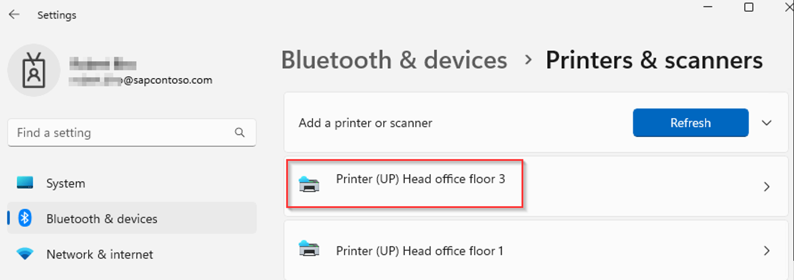
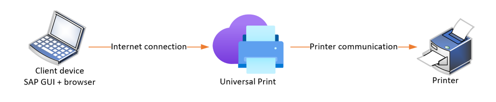
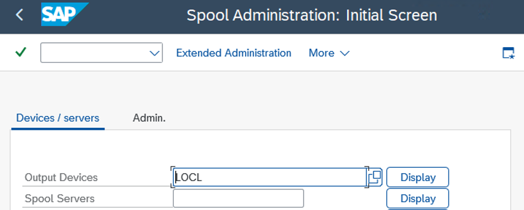
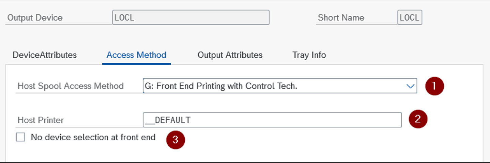

# SAP front-end printing with Universal Print

Printing from your SAP landscape is a requirement for many customers. Depending on your business, printing needs can come in different areas and SAP applications. Examples can be data list printing, mass- or label printing. Such production and batch print scenarios are often solved with specialized hardware, drivers and printing solutions. This article addresses options to use [Universal Print](/universal-print/fundamentals/universal-print-whatis) for SAP front-end printing of the SAP users. For backend printing, see [our blog post](https://community.sap.com/t5/technology-blogs-by-members/it-has-never-been-easier-to-print-from-sap-with-microsoft-universal-print/ba-p/13672206) and [GitHub repos](https://github.com/Azure/universal-print-for-sap-starter-pack).

Universal Print is a cloud-based print solution that enables organizations to manage printers and printer drivers in a centralized manner. Removes the need to use dedicated printer servers and available for use by company employees and applications. While Universal Print runs entirely on Microsoft Azure, for use with SAP systems there's no such requirement. Your SAP landscape can run on Azure, be located on-premises or operate in any other cloud environment. You can use SAP systems deployed by SAP RISE. Similarly, SAP cloud services, which are browser based can be used with Universal Print in most front-end printing scenarios.

## Prerequisites

[SAP front-end printing](https://help.sap.com/docs/SAP_NETWEAVER_750/290ce8983cbc4848a9d7b6f5e77491b9/4e96bc2a7e9e40fee10000000a421937.html) sends an output to a printer available for the user on their front-end device. In other words, a printer accessible by the operating system. Same client computer runs SAP GUI or browser. To use Universal Print, you need to have access to such printer(s). 

- Client OS with support for Universal Print
-	Add Universal Print printer to your Windows client
-	Able to print on Universal Print printer from OS

See the [Universal Print documentation](/universal-print/fundamentals/universal-print-getting-started#step-4-add-a-universal-print-printer-to-a-windows-device.md) for details on these prerequisites. As a result, one or more Universal Print printers are visible in your device’s printer list. For SAP front-end printing, it's not necessary to make it your default printer.

## SAP web applications

A web application such as SAP Fiori or SAP Web GUI is used to access SAP data and display it. It doesn’t matter if you access the SAP system through an internal network, public URL or if your SAP system is an ABAP or Java system, or SAP application running within SAP Business Technology Platform. All SAP application data displayed within a browser can be printed. The print job creation in Universal Print is done by the operating system and doesn't require any SAP configuration at all. There's no SAP integration and communication with Universal Print directly.

## SAP GUI printing
For SAP front-end printing, Universal Print relies on SAP GUI and [SAP printer access method G](https://help.sap.com/docs/SAP_NETWEAVER_750/290ce8983cbc4848a9d7b6f5e77491b9/4e740b270f6f34e1e10000000a42189e.html). Your SAP system likely has one or more SAP printers defined already for such purpose. An example, SAP printer LOCL, defined in SAP transaction code SPAD.

 

For Universal Print use, it’s important the access method (1) is set to ‘G’, as this uses SAP GUI’s integration into the operating system. For host printer field (2), value of __DEFAULT calls the relevant default printer name. Leaving option “No device selection at front end” unchecked (3), you're prompted to select the printer from your OS printer list. With the option checked, print output goes directly to the OS default printer without extra user input.

With such SAP printer definition, SAP GUI uses the operating system printer details. The operating system already knows your added Universal Print printers. As with SAP web applications, there's no direct communication between the SAP system and Universal Print APIs. No settings to configure for your SAP system beyond the available output device for front-end printing.

When using SAP GUI for HTML and front-end printing, you can print to an SAP defined printer, too. In the SAP system, you need a front-end printer with access method ‘G’ and a device type of PDF or derivate. For more information, see [SAP’s documentation](https://help.sap.com/docs/SAP_NETWEAVER_750/290ce8983cbc4848a9d7b6f5e77491b9/4e96c13b7e9e40fee10000000a421937.html). Such print output is displayed in browser as a PDF from the SAP system. You open the common OS printing dialog and select a Universal Print printer installed on your computer.

## Limitations

SAP defines front-end printing with several [constraints](https://help.sap.com/docs/SAP_NETWEAVER_750/290ce8983cbc4848a9d7b6f5e77491b9/4e96cd237e6240fde10000000a421937.html). It can't be used for background printing, nor should it be relied upon for production or mass printing. See if your SAP printer definition is correct, as printers with access method ‘F’ don't work correctly with current SAP releases. More details can be found in [SAP note 2028598 - Technical changes for front-end printing with access method F](https://me.sap.com/notes/2028598).

## Next steps

- [Deploy the SAP backend printing Starter Pack](https://github.com/Azure/universal-print-for-sap-starter-pack)
- [Learn more from our SAP with Universal Print blog post](https://community.sap.com/t5/technology-blogs-by-members/it-has-never-been-easier-to-print-from-sap-with-microsoft-universal-print/ba-p/13672206)

Check out the documentation:

- [Integrating SAP S/4HANA Cloud and Local Printers](https://help.sap.com/docs/SAP_S4HANA_CLOUD/0f69f8fb28ac4bf48d2b57b9637e81fa/1e39bb68bbda4c48af4a79d35f5837e0.html?locale=en-US&version=latest)
- [Universal Print API](/graph/api/resources/print)
