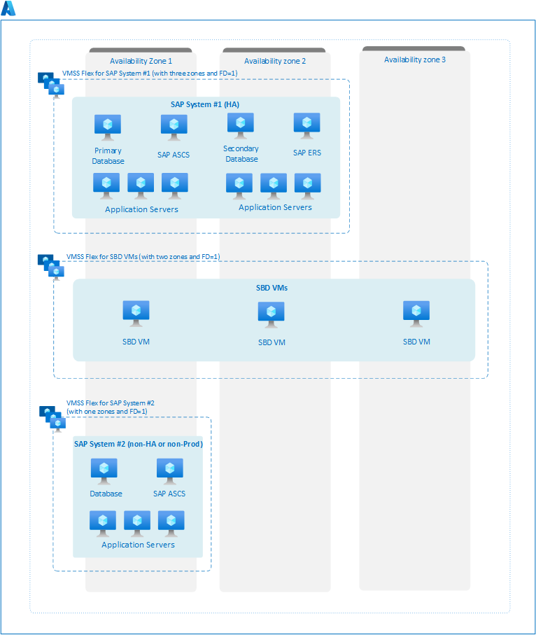

# Virtual Machine Scale Sets for SAP workload

In Azure, [Virtual machine scale sets](../../virtual-machine-scale-sets/overview.md) provide a logical grouping of platform-managed virtual machines.

- Virtual machine scale sets offer two [orchestration modes](../../virtual-machine-scale-sets/virtual-machine-scale-sets-orchestration-modes.md) that enable improved virtual machine management. **For SAP workloads, the Virtual Machines Scale Set with [flexible orchestration](../../virtual-machine-scale-sets/virtual-machine-scale-sets-orchestration-modes.md#scale-sets-with-flexible-orchestration) is the recommended and only supported option**, as it offers the ability to use different virtual machine SKUs and operating systems within a single scale set.
- The flexible orchestration of virtual machine scale set provides the option to create the scale set within a region or span it across availability zones. On creating, the flexible scale set within a region with platformFaultDomainCount>1 (FD>1), the VMs deployed in the scale set would be distributed across specified number of fault domains in the same region. On the other hand, creating the flexible scale set across availability zones with platformFaultDomainCount=1 (FD=1) would distribute the virtual machines across specified zone and the scale set would also [distribute VMs across different fault domains within the zone on a best effort basis](../../virtual-machine-scale-sets/virtual-machine-scale-sets-manage-fault-domains.md). **For SAP workload only flexible scale set with FD=1 is supported.** The advantage of using flexible scale sets with FD=1 for cross zonal deployment, instead of traditional availability zone deployment is that the VMs deployed with the scale set would be distributed across different fault domains within the zone in a best-effort manner.
- There are two ways to configure flexible virtual machine scale sets: with or without a scaling profile. **However, for SAP workload, we recommend creating a flexible virtual machine scale set without a scaling profile**. It is because the autoscaling feature of scale set with a scaling profile doesn't work out of the box for SAP workload. So, currently flexible virtual machine scale set is solely used as a deployment framework for SAP.

## Important consideration of Flexible Virtual Machine Scale Sets for SAP workload

1. Virtual Machine Scale Set with Flexible orchestration is the recommended and supported [orchestration mode](../../virtual-machine-scale-sets/virtual-machine-scale-sets-orchestration-modes.md) for SAP workloads. The Uniform orchestration mode can't be used for SAP workloads.
2. For SAP workloads, flexible orchestration of virtual machine scale sets is supported only with FD=1. Currently regional deployment with FD>1 isn't supported for SAP workload.
3. Deploy each SAP system in a separate flexible scale set.
4. For SAP NetWeaver, it's recommended to deploy all components of a single SAP system within a single flexible scale set. These components include the database, SAP ASCS/ERS, and SAP application servers.
5. Different virtual machine (VM) SKUs, such as D-Series, E-Series, M-Series, and operating systems, including Windows and various Linux distributions, can be included within a single virtual machine scale set with flexible orchestration.
6. When setting up a flexible scale set for SAP workload, `platformFaultDomainCount` can be set to a maximum value of 1. As a result, the virtual machine instances associated with the scale set would be distributed across multiple fault domains on a best effort basis.
7. You can configure flexible virtual machine scale sets with or without a scaling profile. However, it's recommended to create a flexible virtual machine scale set without a scaling profile.
8. The standard load balancer is the only supported load balancer for virtual machines deployed in flexible scale set.
9. To configure Azure fence agent with managed-system identity (MSI) for highly available SAP environment using pacemaker cluster, you can enable system-managed identity on individual VM.
10. Capacity reservation can be enabled at the individual VM level if you're using flexible scale set without a scaling profile to manage your SAP workload. For more information, see the [limitations and restrictions](../../virtual-machines/capacity-reservation-overview.md#limitations-and-restrictions) section as not all SKUs are currently supported for capacity reservation.
11. For SAP workload, we don't advise using a proximity placement group (PPG) in combination with a flexible scale set deployment with FD=1.
12. In a multi-SID SAP ASCS/ERS environment, it's recommended to deploy the first SAP system using a flexible scale set with FD=1. Additionally, it's necessary to set up a separate flexible scale set with FD=1 for the application and database tier of the second system.

> [!IMPORTANT]
> After the creation of the scale set, the orchestration mode and configuration type (with or without scaling profile) cannot be modified or updated at a later time.

## Reference architecture of SAP workload deployed with Flexible Virtual Machine Scale Sets

When creating virtual machine scale set with flexible orchestration across availability zones, it's important to mention all the availability zones where you would be deploying your SAP system. It's worth noting that the availability zones must be specified while creating the scale set, as they can't be modified at a later stage.

By default, when configuring flexible scale set across availability zones, the fault domain count is set to 1. It means that the VM instances belonging to the scale set would be spread across different fault domains on a best-effort basis in each zone.

The diagram illustrates architecture for deploying three separate systems using a flexible virtual machine scale set with FD=1. Three flexible virtual machine scale sets are created, one for each system, with a platform fault domain count set to 1. The first flexible scale set is created for high availability SAP system with two availability zones for  (zone 1, and 2). The second scale set is created to configure SBD device across three availability zones (zone 1, 2, and 3), and third scale set is created for nonproduction or non-HA SAP system with one availability zone (zone 1).

The virtual machines for each system are then manually deployed in their corresponding availability zone within the scale set. For SAP System #1, high availability components, such as primary and secondary databases and ASCS/ERS instances, are deployed across multiple zones. For application tier VMs, the scale set would distribute them across different fault domains within a single zone, on a best-effort basis. **Take note that it wouldn't be feasible to include more VMs for SAP System #1 in availability zone 3 at a later stage. It is because the flexible scale set is limited to only two availability zones, which are zone 1 and 2.** For more information on high availability deployment for SAP workload, see [High-availability architecture and scenarios for SAP NetWeaver](sap-high-availability-architecture-scenarios.md).

For SBD devices, VMs are manually deployed in each availability zone within the scale set. For SAP system #3, which is a nonproduction or non-HA environment, all the components of SAP systems are deployed in a single zone.

[](media/virtual-machine-scale-sets/flexible-scale-set-sap-deployment.png#lightbox)

> [!NOTE]
> When creating a flexible scale set for zonal deployment, it's not possible to set `platformFaultDomainCount` to a value higher than 1.

## Configuration of Flexible Virtual Machine Scale Set without a scaling profile

For SAP workloads, it's recommended to create a flexible virtual machine scale set without a scaling profile. To create a flexible scale set across availability zones, set the fault domain count to 1 and specify the desired zones.

### [Azure portal](#tab/scaleset-portal)

To set up a virtual machine scale set without scaling profile using Azure portal, proceed as follows -

1. Sign in to [Azure portal](https://portal.azure.com).
1. Search for **Virtual machine scale set** and select **create** on the corresponding page.
1. In the basics tab, provide the necessary details:
    1. Under project details, verify the correct **subscription** and choose **my-resource-group** from the resource group dropdown.
    1. For scale set details, name your scale set **myVmssFlex**, choose the appropriate **region**, and specify **availability zone** (For example, zone1, zone2, zone3) for your deployment.
1. Select the **flexible** orchestration mode.
1. Under the scaling section, select **no scaling profile**.
1. For the allocation policy, select **max spreading**.
1. Select **create**.

> [!NOTE]
> For SAP workload only flexible scale set with FD=1 is supported. So, do not configure scale set with "fixed spreading" as the allocation policy.

### [Azure CLI](#tab/scaleset-cli)

```azurecli-interactive
# Login to Azure CLI and specify the subscription and variables for the deployment.
$RGName="my-resource-group"
$Location="azure-region"
$VMSSName="myVmssFlex"

# Create flexible scale set for deployment of SAP workload across availability zones with platform fault domain count set to 1
az vmss create -n $VMSSName -g $RGName -l $Location --orchestration-mode flexible --zones {1,2,3} --platform-fault-domain-count 1

# Create flexible scale set for deployment of SAP workload in a single zone of a region with platform fault domain count set to 1
# Make sure you include --zones in a region with availability zones, even if you want to deploy all component on a single zone
az vmss create -n $VMSSName -g $RGName -l $Location --orchestration-mode flexible --zones 1 --platform-fault-domain-count 1

# Create flexible scale set for deployment of SAP workload in a region with no zones with platform fault domain count set to 1
az vmss create -n $VMSSName -g $RGName -l $Location --orchestration-mode flexible --platform-fault-domain-count 1
```

### [PowerShell](#tab/scaleset-ps)

```azurepowershell-interactive
# Log into Azure PowerShell and specify the subscription and variables for the deployment. 
$RGName = "my-resource-group"
$Location = "azure-region"
$VMSSName = "myVmssFlex"

# Create flexible scale set for deployment of SAP workload across availability zones with platform fault domain count set to 1
$vmssConfig = New-AzVmssConfig -Location $Location -PlatformFaultDomainCount 1 -Zone @(1,2,3)
$VMSS = New-AzVmss -ResourceGroupName $RGName -Name $VMSSName -VirtualMachineScaleSet $vmssConfig -Verbose

# Create flexible scale set for deployment of SAP workload in a single zone of a region with platform fault domain count set to 1
# Make sure you include --zones in a region with availability zones, even if you want to deploy all component on a single zone
$vmssConfig = New-AzVmssConfig -Location $Location -PlatformFaultDomainCount 1 -Zone @(1)
$VMSS = New-AzVmss -ResourceGroupName $RGName -Name $VMSSName -VirtualMachineScaleSet $vmssConfig -Verbose

# Create flexible scale set for deployment of SAP workload in a region with no zones with platform fault domain count set to 1
$vmssConfig = New-AzVmssConfig -Location $Location -PlatformFaultDomainCount 1
$VMSS = New-AzVmss -ResourceGroupName $RGName -Name $VMSSName -VirtualMachineScaleSet $vmssConfig -Verbose
```

---

Once you have created the flexible virtual machine scale set, you can create a virtual machine by following the [quick start guide](../../virtual-machines/linux/quick-create-portal.md). When configuring the virtual machine, be sure to select "**virtual machine scale set**" under availability options and choose the flexible scale set you created. The portal would list all the zones that you included when creating the flexible scale set, so you can select the desired availability zone for your VM. Follow the remaining instructions in the quick start guide to complete the virtual machine configuration.
