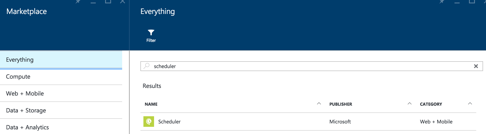
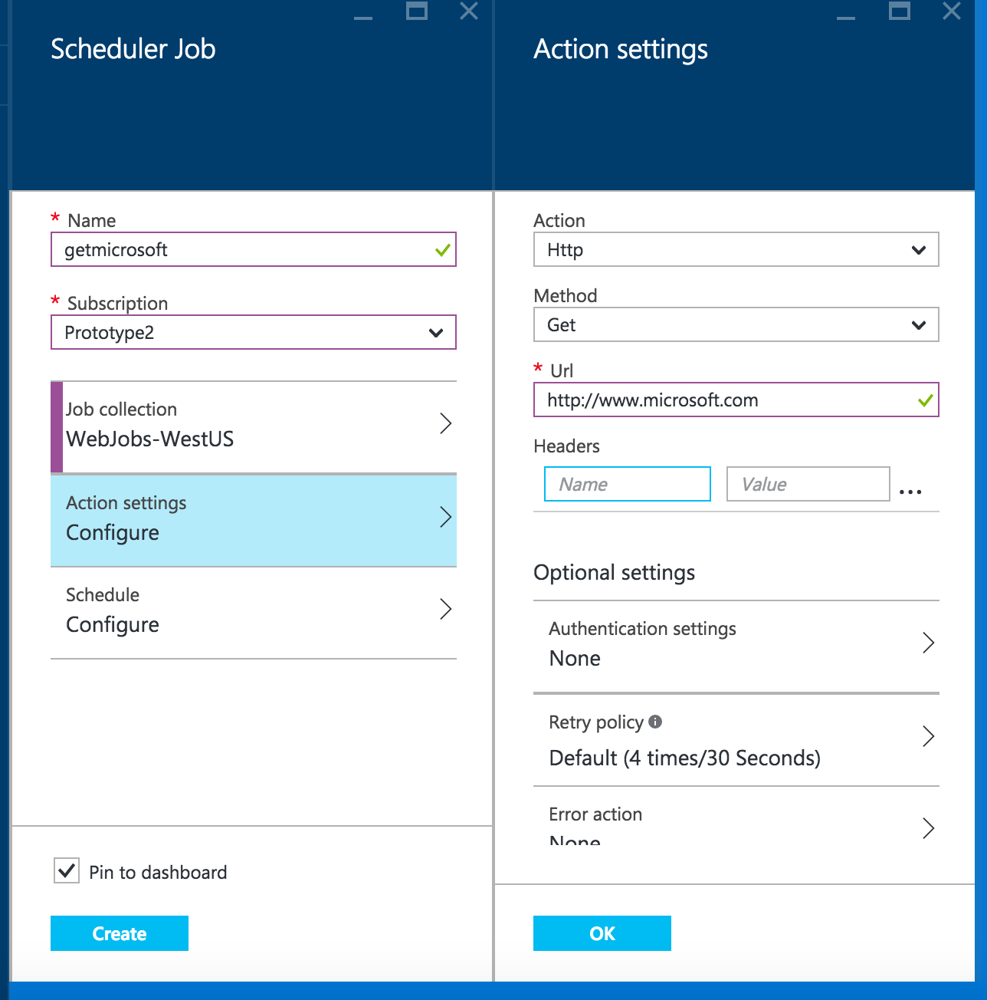
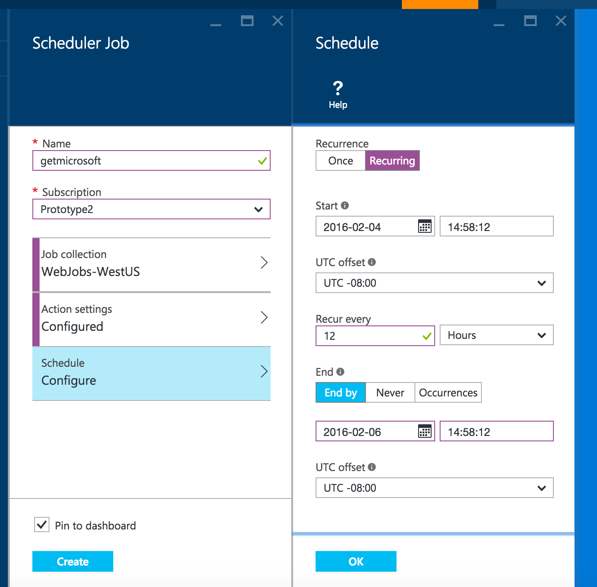
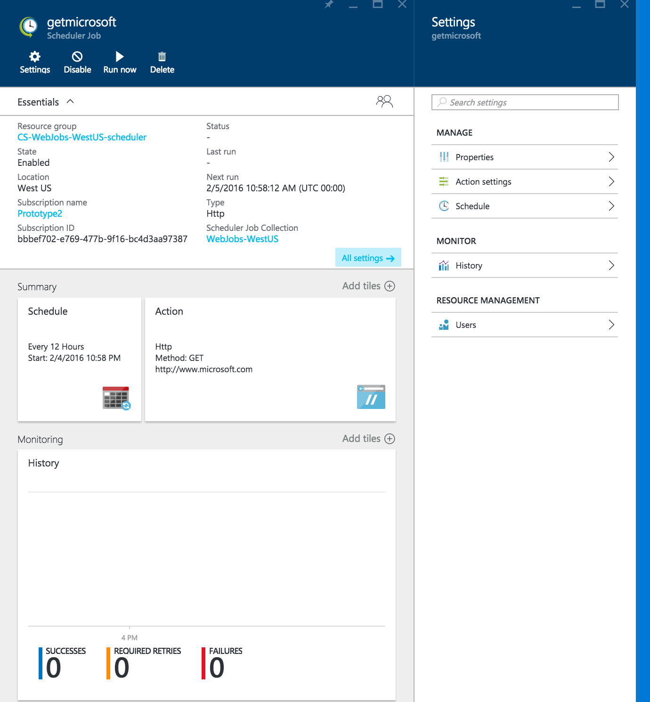
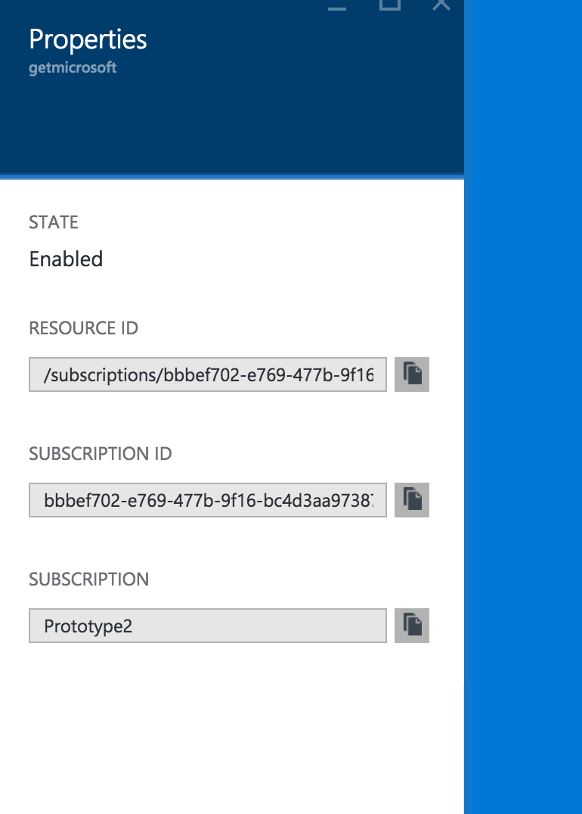
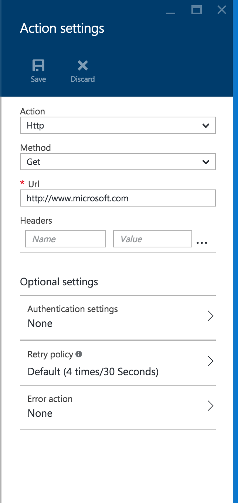
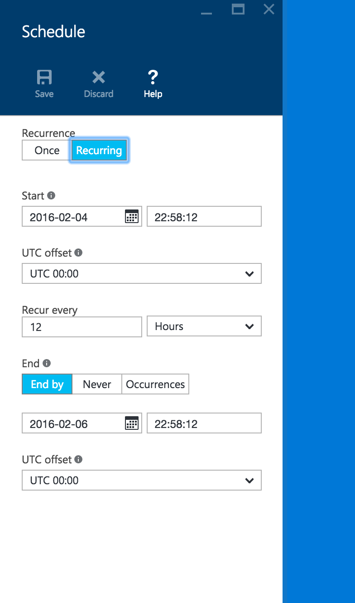
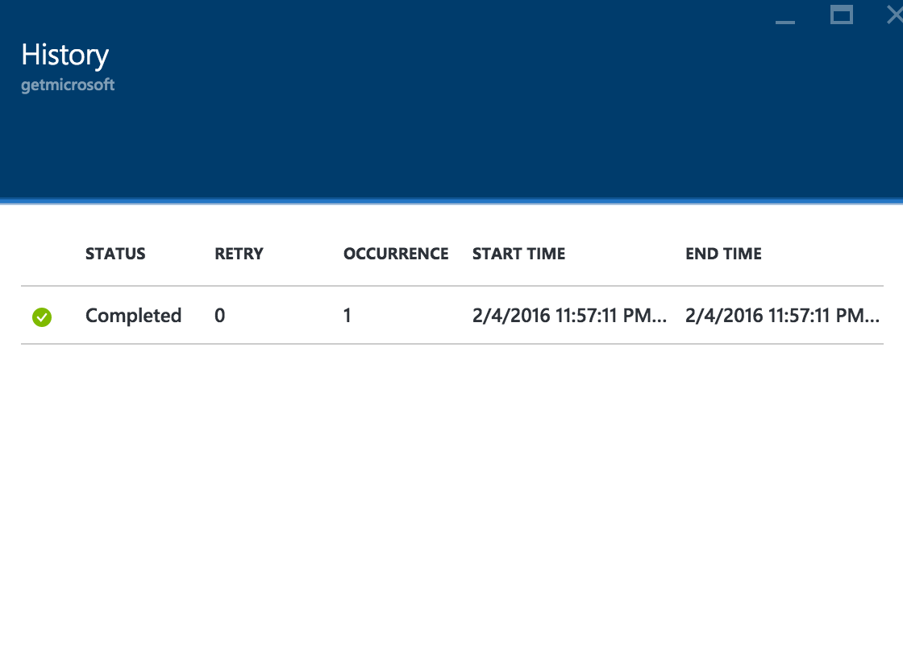
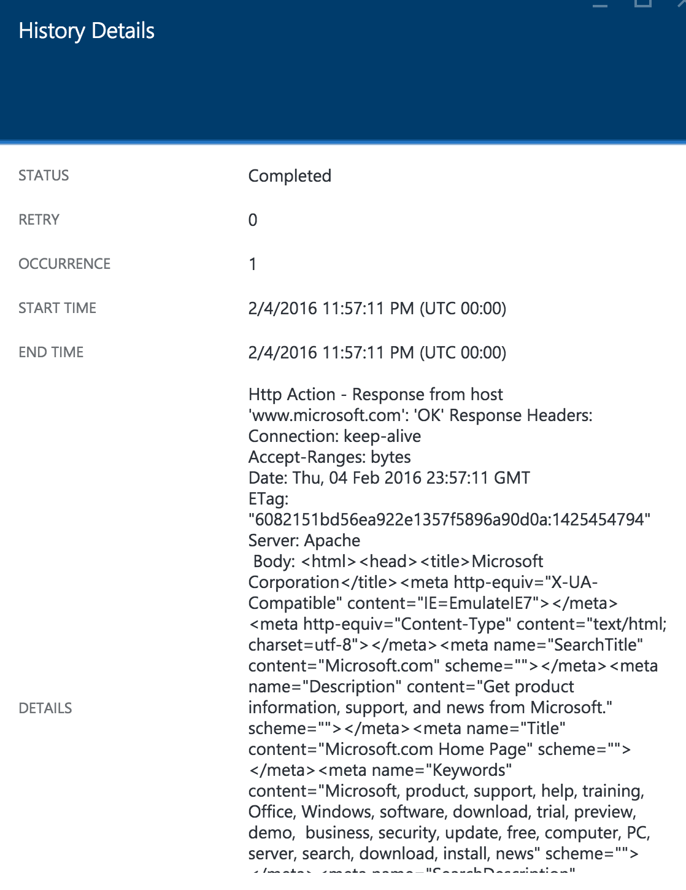

# Create and schedule your first job with Azure Scheduler - Azure portal

> [!IMPORTANT]
> [Azure Logic Apps](../logic-apps/logic-apps-overview.md) 
> is replacing Azure Scheduler, which is being retired. 
> To schedule jobs, [try Azure Logic Apps instead](../scheduler/migrate-from-scheduler-to-logic-apps.md). 

This tutorial shows how easily you can create and schedule a job, 
and then monitor and manage that job. 

If you don't have an Azure subscription, 
<a href="https://azure.microsoft.com/free/" target="_blank">sign up for a free Azure account</a>.

## Create job

1. Sign in to the [Azure portal](https://portal.azure.com/).  

1. On the main Azure menu, select **Create a resource**. 
In the search box, enter "scheduler". From the results list, 
select **Scheduler**, and then choose **Create**.

   

   Now create a job that sends a GET request to this URL: 
   `https://www.microsoft.com/` 

1. Under **Scheduler Job**, enter this information:

   | Property | Example value | Description |
   |----------|---------------|-------------| 
   | **Name** | getMicrosoft | The name for your job | 
   | **Job collection** | <*job-collection-name*> | Create a job collection, or select an existing collection. | 
   | **Subscription** | <*Azure-subscription-name*> | The name for your Azure subscription | 
   |||| 

1. Select **Action settings - Configure**, provide this information, 
and then choose **OK** when you're done:

   | Property | Example value | Description |
   |----------|---------------|-------------| 
   | **Action** | **Http** | The type of action to run | 
   | **Method** | **Get** | The method to call | 
   | **URL** | **https://www.microsoft.com** | The destination URL | 
   |||| 
   
   

1. Select **Schedule - Configure**, define the schedule, 
and then select **OK** when you're done:

   Although you can create a one-time job, 
   this example sets up a recurrence schedule.

   | Property | Example value | Description |
   |----------|---------------|-------------| 
   | **Recurrence** | **Recurring** | Either a one-time or recurring job | 
   | **Start on** | <*today's-date*> | The job's start date | 
   | **Recur every** | **1 Hours** | The recurrence interval and frequency | 
   | **End** | **End by** two days from today's date | The job's end date | 
   | **UTC offset** | **UTC +08:00** | The difference in time between Coordinated Universal Time (UTC) and your location's observed time | 
   |||| 

   

1. When you're ready, choose **Create**.

   After you create your job, Azure deploys 
   your job, which appears on the Azure dashboard. 

1. When Azure shows a notification that deployment succeeded, 
choose **Pin to dashboard**. Otherwise, choose the **Notifications** 
icon (bell) on the Azure toolbar, and then choose **Pin to dashboard**.

## Monitor and manage jobs

To review, monitor, and manage your job, 
on the Azure dashboard, choose your job. 
Under **Settings**, here are the areas 
you can review and manage for your job:

For more information about these areas, select an area:

* [**Properties**](#properties)
* [**Action settings**](#action-settings)
* [**Schedule**](#schedule)
* [**History**](#history)
* [**Users**](#users)

### Properties

To view read-only properties that describe 
the management metadata for your job, 
select **Properties**.

### Action settings

To change your job's advanced settings, 
select **Action settings**. 

| Action type | Description | 
|-------------|-------------| 
| All types | You can change the **Retry policy** and the **Error action** settings. | 
| HTTP and HTTPS | You can change **Method** to any permitted method. You can also add, delete, or change the headers and basic authentication information. | 
| Storage queue| You can change the storage account, queue name, SAS token, and body. | 
| Service Bus | You can change the namespace, topic or queue path, authentication settings, transport type, message properties, and message body. | 
||| 

### Schedule

If you set up a schedule through the job wizard, 
you can change that schedule, such as the start date and time, 
recurrence schedule, and the end date and time for recurring jobs.
You can also build more [complex schedules and advanced recurrences](scheduler-advanced-complexity.md).

To change view or change your job's schedule, 
select **Schedule**:

### History

To view metrics about every run for a selected job, 
select **History**. These metrics provide real-time 
values about your job's health, such as status, 
number of retries, number of occurrences, start time, 
and end time.

To view the history details for each run, 
such as the complete response for each run, 
under **History**, select each run. 

### Users

You can manage access to Azure Scheduler for each user at a 
granular level by using Azure Role-Based Access Control (RBAC). 
To learn how to set up access based on roles, see 
[Manage access using RBAC](../role-based-access-control/role-assignments-portal.md)

## Next steps

* Learn about [concepts, terminology, and entity hierarchy](scheduler-concepts-terms.md)
* [Build complex schedules and advanced recurrence](scheduler-advanced-complexity.md)
* Learn about [high-availability and reliability for Scheduler](scheduler-high-availability-reliability.md)
* Learn about [Limits, quotas, default values, and error codes](scheduler-limits-defaults-errors.md)
