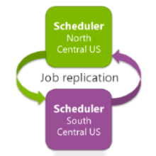
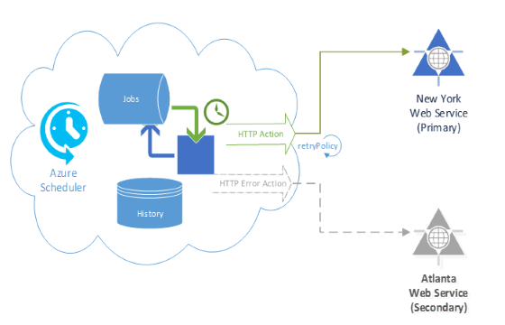

# High availability and reliability for Azure Scheduler

> [!IMPORTANT]
> [Azure Logic Apps](../logic-apps/logic-apps-overview.md) is replacing Azure Scheduler, which is 
> [being retired](../scheduler/migrate-from-scheduler-to-logic-apps.md#retire-date). 
> To continue working with the jobs that you set up in Scheduler, please 
> [migrate to Azure Logic Apps](../scheduler/migrate-from-scheduler-to-logic-apps.md) as soon as possible. 
>
> Scheduler is no longer available in the Azure portal, but the [REST API](/rest/api/scheduler) 
> and [Azure Scheduler PowerShell cmdlets](scheduler-powershell-reference.md) remain available 
> at this time so that you can manage your jobs and job collections.

Azure Scheduler provides both [high availability](https://docs.microsoft.com/azure/architecture/framework/#resiliency) and reliability for your jobs. For more information, see [SLA for Scheduler](https://azure.microsoft.com/support/legal/sla/scheduler).

## High availability

Azure Scheduler is [highly available] 
and uses both geo-redundant service deployment and geo-regional job replication.

### Geo-redundant service deployment

Azure Scheduler is available across almost [every geographical region supported by Azure today](https://azure.microsoft.com/global-infrastructure/regions/#services). So, if an Azure datacenter in a hosted region becomes unavailable, you can still use Azure Scheduler because the service's failover capabilities make Scheduler available from another datacenter.

### Geo-regional job replication

Your own jobs in Azure Scheduler are replicated across Azure regions. 
So if one region has an outage, Azure Scheduler fails over and makes sure 
that your job runs from another datacenter in the paired geographic region.

For example, if you create a job in South Central US, 
Azure Scheduler automatically replicates that job in 
North Central US. If a failure happens in South Central US, 
Azure Scheduler runs the job in North Central US. 

Azure Scheduler also makes sure your data stays within the same but wider 
geographic region, just in case a failure happens in Azure. So, you don't 
have to duplicate your jobs when you just want high availability. 
Azure Scheduler automatically provides high-availability for your jobs.

## Reliability

Azure Scheduler guarantees its own high-availability but 
takes a different approach to user-created jobs. For example, 
suppose your job invokes an HTTP endpoint that's unavailable. 
Azure Scheduler still tries to run your job successfully by 
giving you alternative ways for handling failures: 

* Set up retry policies.
* Set up alternate endpoints.

### Retry policies

Azure Scheduler lets you set up retry policies. If a job fails, 
then by default, Scheduler retries the job four more times at 
30-second intervals. You can make this retry policy more aggressive, 
such as 10 times at 30-second intervals, or less aggressive, 
such as two times at daily intervals.

For example, suppose you create a weekly job that calls an HTTP endpoint. 
If the HTTP endpoint becomes unavailable for a few hours when your job runs, 
you might not want to wait another week for the job to run again, 
which happens because the default retry policy won't work in this case. 
So, you might want to change the standard retry policy so that retries 
happen, for example, every three hours, rather than every 30 seconds. 

To learn how to set up a retry policy, see 
[retryPolicy](scheduler-concepts-terms.md#retrypolicy).

### Alternate endpoints

If your Azure Scheduler job calls an endpoint that is unreachable, 
even after following the retry policy, Scheduler falls back to an 
alternate endpoint that can handle such errors. So, if you set up 
this endpoint, Scheduler calls that endpoint, which makes your 
own jobs highly available when failures happen.

For example, this diagram shows how Scheduler follows the retry 
policy when calling a web service in New York. If the retries fail, 
Scheduler checks for an alternate endpoint. If the endpoint exists, 
Scheduler starts sending requests to the alternate endpoint. 
The same retry policy applies to both the original action and 
the alternate action.

The action type for the alternate action can differ from the original action. 
For example, although the original action calls an HTTP endpoint, 
the alternate action might log errors by using a Storage queue, 
Service Bus queue, or Service Bus topic action.

To learn how to set up an alternate endpoint, see 
[errorAction](scheduler-concepts-terms.md#error-action).

## Next steps

* [Concepts, terminology, and entity hierarchy](scheduler-concepts-terms.md)
* [Azure Scheduler REST API reference](/rest/api/scheduler)
* [Azure Scheduler PowerShell cmdlets reference](scheduler-powershell-reference.md)
* [Limits, quotas, default values, and error codes](scheduler-limits-defaults-errors.md)
