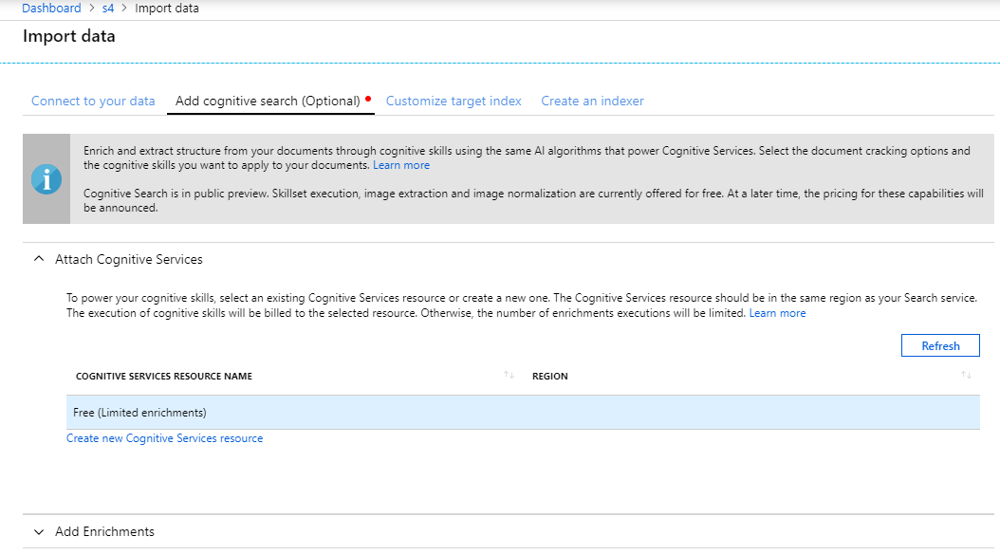
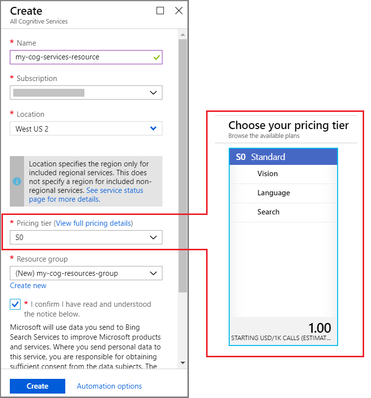
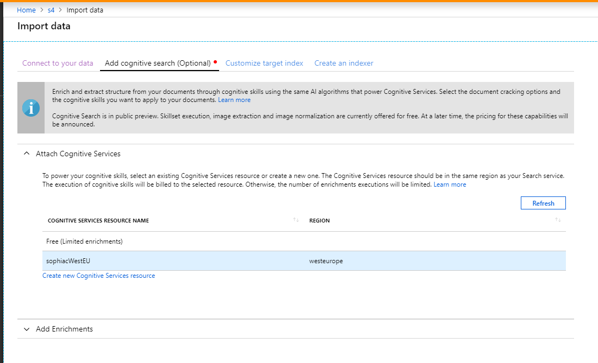
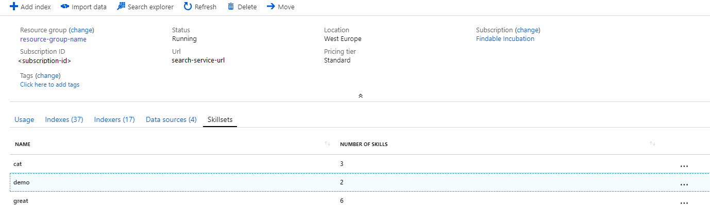
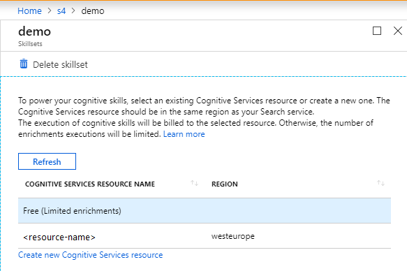

# Attach a Cognitive Services resource to a skillset in Azure Cognitive Search

When configuring a [AI enrichment pipeline](cognitive-search-concept-intro.md) in Azure Cognitive Search, you can enrich a limited number of documents free of charge. For larger and more frequent workloads, you should attach a billable "all-in-one" Cognitive Services resource. An "all-in-one" subscription references "Cognitive Services" as the offering, rather than individual services, with access granted through a single API key. 

An "all-in-one" key is specified in a skillset definition and allows Microsoft to charge you for using these APIs:

+ [Computer Vision](https://azure.microsoft.com/services/cognitive-services/computer-vision/) for image analysis and optical character recognition (OCR)
+ [Text Analytics](https://azure.microsoft.com/services/cognitive-services/text-analytics/) for language detection, entity recognition, sentiment analysis, and key phrase extraction
+ [Text Translation](https://azure.microsoft.com/services/cognitive-services/translator-text-api/)

The key is used for billing, but not connections. Internally, a search service connects to a Cognitive Services resource that's co-located in the same physical region, even if the key happens to be for a resource in a different region. The [product availability](https://azure.microsoft.com/global-infrastructure/services/?products=search) page shows regional availability side by side.

## Key requirements

A key is required for billable [built-in skills](cognitive-search-predefined-skills.md) that are used more than 20 times a day on the same indexer: Document Extraction, Entity Linking, Entity Recognition, Image Analysis, Key Phrase Extraction, Language Detection, OCR, PII Detection, Sentiment, or Text Translation. 

You can omit the key and the Cognitive Services section for skillsets that consist solely of custom skills, Custom Entity Lookup skill, or utility skills (Conditional, Shaper, Text Merge, Text Split). You can also omit the section if your usage of billable skills is under 20 transactions per indexer per day.

## How billing works

+ Azure Cognitive Search uses the Cognitive Services resource key you provide on a skillset to bill for image and text enrichment. Execution of billable skills is at the [Cognitive Services pay-as-you go price](https://azure.microsoft.com/pricing/details/cognitive-services/).

+ Image extraction is an Azure Cognitive Search operation that occurs when documents are cracked prior to enrichment. Image extraction is billable on all tiers except the free tier. Image extraction costs apply to image files inside blobs, embedded images in other files (PDF and other app files), and for images extracted using the Document Extraction skill. For image extraction pricing, see the [Azure Cognitive Search pricing page](https://azure.microsoft.com/pricing/details/search/).

+ Text extraction also occurs during the [document cracking](search-indexer-overview.md#document-cracking) phrase. It is not billable.

+ Skills that do not call Cognitive Services, including Conditional, Custom Entity Lookup, Shaper, Text Merge, and Text Split skills, are not billable. 

  Custom Entity Lookup is a special case. It doesn't call Cognitive Services and thus does not require a key, but it is billable. See the [pricing page](https://azure.microsoft.com/pricing/details/search/#pricing) for details.

> [!TIP]
> [Incremental enrichment (preview)](cognitive-search-incremental-indexing-conceptual.md) lowers the cost of skillset processing by caching and reusing enrichments that are unaffected by changes made to a skillset. Caching requires Azure Storage (see [pricing](/pricing/details/storage/blobs/) but the cumulative cost of skillset execution is lower if existing enrichments can be reused, especially for skillsets that use image extraction and analysis.

## Same-region requirement

Both Cognitive Search and Cognitive Services must exist within the same physical region, as indicated on the [product availability](https://azure.microsoft.com/global-infrastructure/services/?products=search) page. Most regions that offer Cognitive Search also offer Cognitive Services.

If you attempt AI enrichment in region that doesn't have both services, you'll see this message: "Provided key is not a valid CognitiveServices type key for the region of your search service."

> [!NOTE]
> Some built-in skills are based on non-regional Cognitive Services (for example, the [Text Translation Skill](cognitive-search-skill-text-translation.md)). Using a non-regional skill means that your request might be serviced in a region other than the Azure Cognitive Search region. For more information non-regional services, see the [Cognitive Services product by region](https://aka.ms/allinoneregioninfo) page.

## Use Free resources

You can use a limited, free processing option to complete the AI enrichment tutorial and quickstart exercises.

Free (Limited enrichments) resources are restricted to 20 documents per day, per indexer. You can [reset the indexer](search-howto-run-reset-indexers.md) to reset the counter.

If you are using the **Import data** wizard for AI enrichment, you'll find the "Attach Cognitive Services" options on the **Add AI enrichment (Optional)** page.



## Use billable resources

For workloads that create more than 20 billable enrichments per day, make sure to attach a Cognitive Services resource. 

If you're using the **Import data** wizard, you can configure a billable resource from the **Add AI enrichment (Optional)** page.

1. Expand **Attach Cognitive Services** and then select **Create new Cognitive Services resource**. A new tab opens so that you can create the resource:

   

1. In the **Location** list, select the same region that has your search service.

1. In the **Pricing tier** list, select **S0** to get the all-in-one collection of Cognitive Services features, including the Vision and Language features that back the built-in skills provided by Azure Cognitive Search.

   For the S0 tier, you can find rates for specific workloads on the [Cognitive Services pricing page](https://azure.microsoft.com/pricing/details/cognitive-services/).
  
   + In the **Select Offer** list, make sure **Cognitive Services** is selected.
   + Under **Language** features, the rates for **Text Analytics Standard** apply to AI indexing.
   + Under **Vision** features, the rates for **Computer Vision S1** apply.

1. Select **Create** to provision the new Cognitive Services resource.

1. Return to the previous tab. Select **Refresh** to show the Cognitive Services resource, and then select the resource:

   

1. Expand the **Add cognitive skills** section to select the specific cognitive skills that you want to run on your data. Complete the rest of the wizard.

## Attach an existing skillset to a Cognitive Services resource

If you have an existing skillset, you can attach it to a new or different Cognitive Services resource.

1. On the search service overview page, select **Skillsets**:

   

1. Select the name of the skillset, and then select an existing resource or create a new one. Select **OK** to confirm your changes.

   

   Remember that the **Free (Limited enrichments)** option limits you to 20 documents daily, and that you can use **Create new Cognitive Services resource** to provision a new billable resource. If you create a new resource, select **Refresh** to refresh the list of Cognitive Services resources, and then select the resource.

## Attach Cognitive Services programmatically

When you're defining the skillset programmatically, add a `cognitiveServices` section to the skillset. In that section, include the key of the Cognitive Services resource that you want to associate with the skillset. Remember that the resource must be in the same region as your Azure Cognitive Search resource. Also include `@odata.type`, and set it to `#Microsoft.Azure.Search.CognitiveServicesByKey`.

The following example shows this pattern. Notice the `cognitiveServices` section at the end of the definition.

```http
PUT https://[servicename].search.windows.net/skillsets/[skillset name]?api-version=2020-06-30
api-key: [admin key]
Content-Type: application/json
{
    "name": "skillset name",
    "skills": 
    [
      {
        "@odata.type": "#Microsoft.Skills.Text.V3.EntityRecognitionSkill",
        "categories": [ "Organization" ],
        "defaultLanguageCode": "en",
        "inputs": [
          {
            "name": "text", "source": "/document/content"
          }
        ],
        "outputs": [
          {
            "name": "organizations", "targetName": "organizations"
          }
        ]
      }
    ],
    "cognitiveServices": {
        "@odata.type": "#Microsoft.Azure.Search.CognitiveServicesByKey",
        "description": "mycogsvcs",
        "key": "<your key goes here>"
    }
}
```

## Example: Estimate costs

To estimate the costs associated with Cognitive Search indexing, start with an idea of what an average document looks like so you can run some numbers. For example, you might approximate:

+ 1,000 PDFs.
+ Six pages each.
+ One image per page (6,000 images).
+ 3,000 characters per page.

Assume a pipeline that consists of document cracking of each PDF, image and text extraction, optical character recognition (OCR) of images, and entity recognition of organizations.

The prices shown in this article are hypothetical. They're used to illustrate the estimation process. Your costs could be lower. For the actual prices of transactions, see See [Cognitive Services pricing](https://azure.microsoft.com/pricing/details/cognitive-services).

1. For document cracking with text and image content, text extraction is currently free. For 6,000 images, assume $1 for every 1,000 images extracted. That's a cost of $6.00 for this step.

2. For OCR of 6,000 images in English, the OCR cognitive skill uses the best algorithm (DescribeText). Assuming a cost of $2.50 per 1,000 images to be analyzed, you would pay $15.00 for this step.

3. For entity extraction, you'd have a total of three text records per page. Each record is 1,000 characters. Three text records per page multiplied by 6,000 pages equals 18,000 text records. Assuming $2.00 per 1,000 text records, this step would cost $36.00.

Putting it all together, you'd pay about $57.00 to ingest 1,000 PDF documents of this type with the described skillset.

## Next steps

+ [Azure Cognitive Search pricing page](https://azure.microsoft.com/pricing/details/search/)
+ [How to define a skillset](cognitive-search-defining-skillset.md)
+ [Create Skillset (REST)](/rest/api/searchservice/create-skillset)
+ [How to map enriched fields](cognitive-search-output-field-mapping.md)
