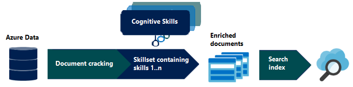
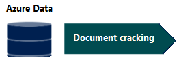
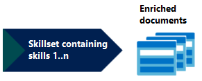

# AI enrichment in Azure Cognitive Search

AI enrichment is an extension of [indexers](search-indexer-overview.md) that can be used to extract text from images, blobs, and other unstructured data sources. Enrichment and extraction make your content more searchable in indexer output objects, either a [search index](search-what-is-an-index.md) or a [knowledge store](knowledge-store-concept-intro.md). 

Extraction and enrichment are implemented using *cognitive skills* attached to the indexer-driven pipeline. You can use built-in skills from Microsoft or embed external processing into a [*custom skill*](cognitive-search-create-custom-skill-example.md) that you create. Examples of a custom skill might be a custom entity module or document classifier targeting a specific domain such as finance, scientific publications, or medicine.

Built-in skills fall into these categories: 

+ **Natural language processing** skills include [entity recognition](cognitive-search-skill-entity-recognition.md), [language detection](cognitive-search-skill-language-detection.md), [key phrase extraction](cognitive-search-skill-keyphrases.md), text manipulation, [sentiment detection](cognitive-search-skill-sentiment.md), and [PII detection](cognitive-search-skill-pii-detection.md). With these skills, unstructured text is mapped as searchable and filterable fields in an index.

+ **Image processing** skills include [Optical Character Recognition (OCR)](cognitive-search-skill-ocr.md) and identification of [visual features](cognitive-search-skill-image-analysis.md), such as facial detection, image interpretation, image recognition (famous people and landmarks) or attributes like image orientation. These skills create text representations of image content, making it searchable using the query capabilities of Azure Cognitive Search.

Built-in skills in Azure Cognitive Search are based on pre-trained machine learning models in Cognitive Services APIs: [Computer Vision](https://docs.microsoft.com/azure/cognitive-services/computer-vision/) and [Text Analytics](https://docs.microsoft.com/azure/cognitive-services/text-analytics/overview). You can attach a Cognitive Services resource if you want to leverage these resources during content processing.

Natural language and image processing is applied during the data ingestion phase, with results becoming part of a document's composition in a searchable index in Azure Cognitive Search. Data is sourced as an Azure data set and then pushed through an indexing pipeline using whichever [built-in skills](cognitive-search-predefined-skills.md) you need.  

## When to use AI enrichment

You should consider using built-in cognitive skills if your raw content is unstructured text, image content, or content that needs language detection and translation. Applying AI through the built-in cognitive skills can unlock this content, increasing its value and utility in your search and data science apps. 

Additionally, you might consider adding a custom skill if you have open-source, third-party, or first-party code that you'd like to integrate into the pipeline. Classification models that identify salient characteristics of various document types fall into this category, but any package that adds value to your content could be used.

### More about built-in skills

A [skillset](cognitive-search-defining-skillset.md) that's assembled using built-in skills is well suited for the following application scenarios:

+ Scanned documents (JPEG) that you want to make full-text searchable. You can attach an optical character recognition (OCR) skill to identify, extract, and ingest text from JPEG files.

+ PDFs with combined image and text. Text in PDFs can be extracted during indexing without the use of enrichment steps, but the addition of image and natural language processing can often produce a better outcome than a standard indexing provides.

+ Multi-lingual content against which you want to apply language detection and possibly text translation.

+ Unstructured or semi-structured documents containing content that has inherent meaning or context that is hidden in the larger document. 

  Blobs in particular often contain a large body of content that is packed into a singled "field". By attaching image and natural language processing skills to an indexer, you can create new information that is extant in the raw content, but not otherwise surfaced as distinct fields. Some ready-to-use built-in cognitive skills that can help: key phrase extraction, sentiment analysis, and entity recognition (people, organizations, and locations).

  Additionally, built-in skills can also be used restructure content through text split, merge, and shape operations.

### More about custom skills

Custom skills can support more complex scenarios, such as recognizing forms, or custom entity detection using a model that you provide and wrap in the [custom skill web interface](cognitive-search-custom-skill-interface.md). Several examples of custom skills include [Forms Recognizer](/azure/cognitive-services/form-recognizer/overview), integration of the [Bing Entity Search API](https://docs.microsoft.com/azure/search/cognitive-search-create-custom-skill-example), and [custom entity recognition](https://github.com/Microsoft/SkillsExtractorCognitiveSearch).

<a name="enrichment-steps"> ## Steps in an enrichment pipeline </a>

An enrichment pipeline is based on [*indexers*](search-indexer-overview.md). Indexers populate an index based on field-to-field mappings between the index and your data source for document cracking. Skills, now attached to indexers, intercept and enrich documents according to the skillset(s) you define. Once indexed, you can access content via search requests through all [query types supported by Azure Cognitive Search](search-query-overview.md).  If you are new to indexers, this section walks you through the steps.

### Step 1: Connection and document cracking phase

At the start of the pipeline, you have unstructured text or non-text content (such as images, scanned documents, or JPEG files). Data must exist in an Azure data storage service that can be accessed by an indexer. Indexers can "crack" source documents to extract text from source data. Document cracking is the process of extracting or creating text content from non-text sources during indexing.

 Supported sources include Azure blob storage, Azure table storage, Azure SQL Database, and Azure Cosmos DB. Text-based content can be extracted from the following file types: PDFs, Word, PowerPoint, CSV files. For the full list, see [Supported formats](search-howto-indexing-azure-blob-storage.md#supported-document-formats). Indexing takes time so start with a small, representative data set and then build it up incrementally as your solution matures.

### Step 2: Cognitive skills and enrichment phase

Enrichment is performed with *cognitive skills* performing atomic operations. For example, once you have cracked a PDF, you can apply entity recognition, language detection, or key phrase extraction to produce new fields in your index that are not available natively in the source. Altogether, the collection of skills used in your pipeline is called a *skillset*.  

A skillset is based on [built-in cognitive skills](cognitive-search-predefined-skills.md) or [custom skills](cognitive-search-create-custom-skill-example.md) you provide and connect to the skillset. A skillset can be minimal or highly complex, and determines not only the type of processing, but also the order of operations. A skillset plus the field mappings defined as part of an indexer fully specifies the enrichment pipeline. For more information about pulling all of these pieces together, see [Define a skillset](cognitive-search-defining-skillset.md).

Internally, the pipeline generates a collection of enriched documents. You can decide which parts of the enriched documents should be mapped to indexable fields in your search index. For example, if you applied the key phrase extraction and the entity recognition skills, those new fields would become part of the enriched document, and can be mapped to fields on your index. See [Annotations](cognitive-search-concept-annotations-syntax.md) to learn more about input/output formations.

#### Add a knowledgeStore element to save enrichments

[Search REST api-version=2020-06-30](https://docs.microsoft.com/rest/api/searchservice/) extends skillsets with a `knowledgeStore` definition that provides an Azure storage connection and projections that describe how the enrichments are stored. This is in addition to your index. In a standard AI pipeline, enriched documents are transitory, used only during indexing and then discarded. With knowledge store, enriched documents are preserved. For more information, see [Knowledge store](knowledge-store-concept-intro.md).

### Step 3: Search index and query-based access

When processing is finished, you have a search index consisting of enriched documents, fully text-searchable in Azure Cognitive Search. [Querying the index](search-query-overview.md) is how developers and users access the enriched content generated by the pipeline. 

The index is like any other you might create for Azure Cognitive Search: you can supplement with custom analyzers, invoke fuzzy search queries, add filtered search, or experiment with scoring profiles to reshape the search results.

Indexes are generated from an index schema that defines the fields, attributes, and other constructs attached to a specific index, such as scoring profiles and synonym maps. Once an index is defined and populated, you can index incrementally to pick up new and updated source documents. Certain modifications require a full rebuild. You should use a small data set until the schema design is stable. For more information, see [How to rebuild an index](search-howto-reindex.md).

**Checklist: A typical workflow**

1. Subset your Azure source data into a representative sample. Indexing takes time so start with a small, representative data set and then build it up incrementally as your solution matures.

1. Create a [data source object](https://docs.microsoft.com/rest/api/searchservice/create-data-source) in Azure Cognitive Search to provide a connection string for data retrieval.

1. Create a [skillset](https://docs.microsoft.com/rest/api/searchservice/create-skillset) with enrichment steps.

1. Define the [index schema](https://docs.microsoft.com/rest/api/searchservice/create-index). The *Fields* collection includes fields from source data. You should also stub out additional fields to hold generated values for content created during enrichment.

1. Define the [indexer](https://docs.microsoft.com/rest/api/searchservice/create-indexer) referencing the data source, skillset, and index.

1. Within the indexer, add *outputFieldMappings*. This section maps output from the skillset (in step 3) to the inputs fields in the index schema (in step 4).

1. Send *Create Indexer* request you just created (a POST request with an indexer definition in the request body) to express the indexer in Azure Cognitive Search. This step is how you run the indexer, invoking the pipeline.

1. Run queries to evaluate results and modify code to update skillsets, schema, or indexer configuration.

1. [Reset the indexer](search-howto-reindex.md) before rebuilding the pipeline.

## Next steps

+ [AI enrichment documentation links](cognitive-search-resources-documentation.md)
+ [Example: Creating a custom skill for AI enrichment (C#)](cognitive-search-create-custom-skill-example.md)
+ [Quickstart: Try AI enrichment in a portal walk-through](cognitive-search-quickstart-blob.md)
+ [Tutorial: Learn about the AI enrichment APIs](cognitive-search-tutorial-blob.md)
+ [Knowledge store](knowledge-store-concept-intro.md)
+ [Create a knowledge store in REST](knowledge-store-create-rest.md)
+ [Troubleshooting tips](cognitive-search-concept-troubleshooting.md)
