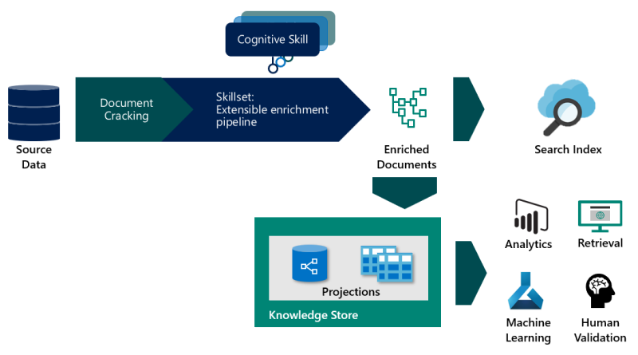

# AI enrichment in Azure Cognitive Search

Azure Cognitive Search enables content enrichment through built-in cognitive skills and custom skills as part of indexing. Enrichments create new information where none previously existed: extracting information from images, detecting sentiment, key phrases, and entities from text, to name a few. Enrichments also add structure to undifferentiated text. All of these processes result in documents that make full text search more effective. In many instances, enriched documents are useful for scenarios other than search, such as for knowledge mining.

AI enrichment is defined by a [skillset](cognitive-search-working-with-skillsets.md) that's attached to an [indexer](search-indexer-overview.md). The indexer will extract and set up the content, while the skillset identifies, analyzes, and creates new information and structures from images, blobs, and other unstructured data sources. The output of enrichment is either a [search index](search-what-is-an-index.md) or a [knowledge store](knowledge-store-concept-intro.md).

A skillset can contain built-in skills from Cognitive Search or embed external processing that you provide in a [*custom skill*](cognitive-search-create-custom-skill-example.md). Examples of a custom skill might be a custom entity module or document classifier targeting a specific domain such as finance, scientific publications, or medicine.

Built-in skills fall into these categories:

+ **Natural language processing** skills include [entity recognition](cognitive-search-skill-entity-recognition-v3.md), [language detection](cognitive-search-skill-language-detection.md), [key phrase extraction](cognitive-search-skill-keyphrases.md), text manipulation, [sentiment detection (including opinion mining)](cognitive-search-skill-sentiment-v3.md), and [PII detection](cognitive-search-skill-pii-detection.md). With these skills, unstructured text is mapped as searchable and filterable fields in an index.

+ **Image processing** skills include [Optical Character Recognition (OCR)](cognitive-search-skill-ocr.md) and identification of [visual features](cognitive-search-skill-image-analysis.md), such as facial detection, image interpretation, image recognition (famous people and landmarks) or attributes like image orientation. These skills create text representations of image content, making it searchable using the query capabilities of Azure Cognitive Search.

Built-in skills in Azure Cognitive Search are based on pre-trained machine learning models in Cognitive Services APIs: [Computer Vision](../cognitive-services/computer-vision/index.yml) and [Text Analytics](../cognitive-services/text-analytics/overview.md). You can attach a Cognitive Services resource if you want to leverage these resources during content processing.

Natural language and image processing is applied during the data ingestion phase, with results becoming part of a document's composition in a searchable index in Azure Cognitive Search. Data is sourced as an Azure data set and then pushed through an indexing pipeline using whichever [built-in skills](cognitive-search-predefined-skills.md) you need.  

## Feature availability

AI enrichment is available in regions where Azure Cognitive Services is also available. You can check the current availability of AI enrichment on the [Azure products available by region](https://azure.microsoft.com/global-infrastructure/services/?products=search) page. AI enrichment is available in all supported regions except:

+ Australia Southeast
+ China North 2
+ Norway East
+ Germany West Central

If your search service is located in one of these regions, you will not be able to create and use skillsets, but all other search service functionality is available and fully supported.

## When to use AI enrichment

You should consider enrichment if your raw content is unstructured text, image content, or content that needs language detection and translation. Applying AI through the built-in cognitive skills can unlock this content, increasing its value and utility in your search and data science apps. 

Additionally, you might consider adding a custom skill if you have open-source, third-party, or first-party code that you'd like to integrate into the pipeline. Classification models that identify salient characteristics of various document types fall into this category, but any package that adds value to your content could be used.

### Use-cases for built-in skills

A [skillset](cognitive-search-defining-skillset.md) that's assembled using built-in skills is well-suited for the following application scenarios:

+ Optical Character Recognition (OCR) that recognizes typeface and handwritten text in scanned documents (JPEG) is perhaps the most commonly used skill. Attaching the [OCR skill](cognitive-search-skill-ocr.md) will identify, extract, and ingest text from JPEG files.

+ Text translation of multilingual content is another commonly used skill. Language detection is built into [Text Translation](cognitive-search-skill-text-translation.md), but you can also run [Language Detection](cognitive-search-skill-language-detection.md) independently if you just want the language codes of the content in your corpus.

+ PDFs with combined image and text. Text in PDFs can be extracted during indexing without the use of enrichment steps, but the addition of image and natural language processing can often produce a better outcome than a standard indexing provides.

+ Unstructured or semi-structured documents containing content that has inherent meaning or context that is hidden in the larger document. 

  Blobs in particular often contain a large body of content that is packed into a single "field". By attaching image and natural language processing skills to an indexer, you can create new information that is extant in the raw content, but not otherwise surfaced as distinct fields. Some ready-to-use built-in cognitive skills that can help: [key phrase extraction](cognitive-search-skill-keyphrases.md) and [entity recognition](cognitive-search-skill-entity-recognition-v3.md) (people, organizations, and locations to name a few).

  Additionally, built-in skills can also be used restructure content through text split, merge, and shape operations.

### Use-cases for custom skills

Custom skills can support more complex scenarios, such as recognizing forms, or custom entity detection using a model that you provide and wrap in the [custom skill web interface](cognitive-search-custom-skill-interface.md). Several examples of custom skills include [Forms Recognizer](../cognitive-services/form-recognizer/overview.md), integration of the [Bing Entity Search API](./cognitive-search-create-custom-skill-example.md), and [custom entity recognition](https://github.com/Microsoft/SkillsExtractorCognitiveSearch).

## Enrichment steps 

An enrichment pipeline consists of [*indexers*](search-indexer-overview.md) that have [*skillsets*](cognitive-search-working-with-skillsets.md). A skillset defines the enrichment steps, and the indexer drives the skillset. When configuring an indexer, you can include properties like output field mappings that send enriched content to a [search index](search-what-is-an-index.md) or a [knowledge store](knowledge-store-concept-intro.md).

Post-indexing, you can access content via search requests through all [query types supported by Azure Cognitive Search](search-query-overview.md).

### Step 1: Connection and document cracking phase

Indexers connect to external sources using information provided in an indexer data source. When the indexer connects to the resource, it will ["crack documents"](search-indexer-overview.md#document-cracking) to extract text and images. Image content can be routed to skills that perform image processing, while text content is queued for text processing. 

This step assembles all of the initial or raw content that will undergo AI enrichment. For each document, an enrichment tree is created. Initially, the tree is just a root node representation, but it will grow and gain structure during skillset execution.

### Step 2: Skillset enrichment phase

A skillset defines the atomic operations that are performed on each document. For example, for text and images extracted from a PDF, a skillset might apply entity recognition, language detection, or key phrase extraction to produce new fields in your index that are not available natively in the source. 

 skillset can be minimal or highly complex, and determines not only the type of processing, but also the order of operations. Most skillsets contain about three to five skills.

A skillset, plus the [output field mappings](cognitive-search-output-field-mapping.md) defined as part of an indexer, fully specifies the enrichment pipeline. For more information about pulling all of these pieces together, see [Define a skillset](cognitive-search-defining-skillset.md).

Internally, the pipeline generates a collection of enriched documents. You can decide which parts of the enriched documents should be mapped to indexable fields in your search index. For example, if you applied the key phrase extraction and the entity recognition skills, those new fields would become part of the enriched document, and can be mapped to fields on your index. See [Annotations](cognitive-search-concept-annotations-syntax.md) to learn more about input/output formations.

### Step 3: Indexing

Indexing is the process wherein raw and enriched content is ingested as fields in a search index, and as [projections](knowledge-store-projection-overview.md) if you are also creating a knowledge store. The same enriched content can appear in both, using implicit or explicit field mappings to send the content to the correct fields.

The mechanics of indexing are internal to the service, and the search engine sets up the physical structures and inverted indexes required for your content. In the case of a knowledge store, you'll specify the physical structure of the output. 

After indexing is complete, the results are persisted and accessible to users and apps.

## Saving enriched output

In Azure Cognitive Search, an indexer saves the output it creates. One of the outputs is always a [searchable index](search-what-is-an-index.md). Specifying an index is a required component of an indexer, and when you attach a skillset, the output of the skillset, plus any fields that are imported directly from the source, are used to populate the index. Usually, the outputs of specific skills, such as key phrases or sentiment scores, are ingested into the index in a field created for that purpose.

Optionally, an indexer can also send the output to a [knowledge store](knowledge-store-concept-intro.md) for consumption in other tools or processes. A knowledge store is defined as part of the skillset. Its definition determines whether your enriched documents are projected as tables or objects (files or blobs). Tabular projections are well suited for interactive analysis in tools like Power BI, whereas files and blobs are typically used in data science or similar processes.

Finally, an indexer can [cache enriched documents](cognitive-search-incremental-indexing-conceptual.md) in Azure Blob Storage for potential reuse in subsequent skillset executions. Cached enrichments are consumable by the same skillset that you rerun at a later date. Caching is particularly helpful if your skillset include image analysis or OCR, and you want to avoid the time and expense of re-processing image files.

Indexes and knowledge stores are fully independent of each other. While you must attach an index per indexer requirements, if your sole objective is a knowledge store, you can ignore the index after it's populated. Avoid deleting it though. If you want to rerun the indexer and skillset, you'll need the index in order for the indexer to run.

## Using enriched content

When processing is finished, you have a [search index](search-what-is-an-index.md) consisting of enriched documents, fully text-searchable in Azure Cognitive Search. [Querying the index](search-query-overview.md) is how developers and users access the enriched content generated by the pipeline. You might also have a [knowledge store](knowledge-store-concept-intro.md).

The index is like any other you might create for Azure Cognitive Search: you can supplement with custom analyzers, invoke fuzzy search queries, add filtered search, or experiment with scoring profiles to reshape the search results.

The knowledge store can contain [cached enrichments for reuse in skillsets](cognitive-search-incremental-indexing-conceptual.md), or projections intended for consumption in knowledge mining scenarios like analytics or machine learning.

## Checklist: A typical workflow

1. When beginning a project, it's helpful to work with a subset of data. Indexer and skillset design is an iterative process, and you'll iterate more quickly if you're working with a small, representative data set.

1. Create a [data source object](/rest/api/searchservice/create-data-source) in Azure Cognitive Search to provide a connection string for data retrieval.

1. Create a [skillset](/rest/api/searchservice/create-skillset) with enrichment steps.

1. Define the [index schema](/rest/api/searchservice/create-index). The *Fields* collection includes fields from source data. You should also stub out additional fields to hold generated values for content created during enrichment.

1. Define the [indexer](/rest/api/searchservice/create-indexer) referencing the data source, skillset, and index.

1. Within the indexer, add *outputFieldMappings*. These properties map connect a skillset's output to the correct fields in the index schema.

1. Send *Create Indexer* request you just created (a POST request with an indexer definition in the request body) to express the indexer in Azure Cognitive Search. This step is how you run the indexer, invoking the pipeline.

1. Run queries to evaluate results and modify code to update skillsets, schema, or indexer configuration.

1. [Reset the indexer](search-howto-reindex.md) before rebuilding the pipeline, or delete and recreate the objects on each run (recommended if you are using the free tier).

## Next steps

+ [AI enrichment documentation links](cognitive-search-resources-documentation.md)
+ [Example: Creating a custom skill for AI enrichment (C#)](cognitive-search-create-custom-skill-example.md)
+ [Quickstart: Try AI enrichment in a portal walk-through](cognitive-search-quickstart-blob.md)
+ [Tutorial: Learn about the AI enrichment APIs](cognitive-search-tutorial-blob.md)
+ [Knowledge store](knowledge-store-concept-intro.md)
+ [Create a knowledge store in REST](knowledge-store-create-rest.md)
+ [Troubleshooting tips](cognitive-search-concept-troubleshooting.md)
