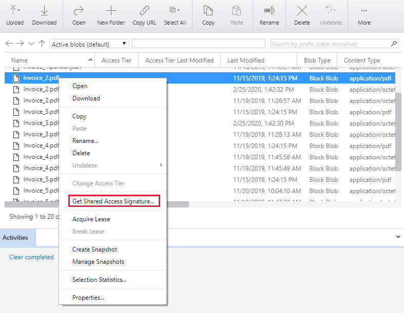

# Example: Create a Form Recognizer custom skill

In this Azure Cognitive Search skillset example, you'll learn how to create a Form Recognizer custom skill using C# and Visual Studio. Form Recognizer analyzes documents and extracts key/value pairs and table data. By wrapping Form Recognizer into the [custom skill interface](cognitive-search-custom-skill-interface.md), you can add this capability as a step in an end-to-end enrichment pipeline. The pipeline can then load the documents and do other transformations.

## Prerequisites

- [Visual Studio 2019](https://visualstudio.microsoft.com/downloads/) (any edition).
- At least five forms of the same type. You can use sample data provided with this guide.

## Create a Form Recognizer resource

[!INCLUDE [create resource](../cognitive-services/form-recognizer/includes/create-resource.md)]

## Train your model

You'll need to train a Form Recognizer model with your input forms before you use this skill. Follow the [cURL quickstart](https://docs.microsoft.com/azure/cognitive-services/form-recognizer/quickstarts/curl-train-extract) to learn how to train a model. You can use the sample forms provided in that quickstart, or you can use your own data. Once the model is trained, copy its ID value to a secure location.

## Set up the custom skill

This tutorial uses the [AnalyzeForm](https://github.com/Azure-Samples/azure-search-power-skills/tree/master/Vision/AnalyzeForm) project in the [Azure Search Power Skills](https://github.com/Azure-Samples/azure-search-power-skills) GitHub repository. Clone this repository to your local machine and navigate to **Vision/AnalyzeForm/** to access the project. Then open _AnalyzeForm.csproj_ in Visual Studio. This project creates an Azure Function resource that fulfills the [custom skill interface](cognitive-search-custom-skill-interface.md) and can be used for Azure Cognitive Search enrichment. It takes form documents as inputs, and it outputs (as text) the key/value pairs that you specify.

First, add project-level environment variables. Locate the **AnalyzeForm** project on the left pane, right-click it and select **Properties**. In the **Properties** window, click the **Debug** tab and then find the **Environment variables** field. Click **Add** to add the following variables:
* `FORMS_RECOGNIZER_ENDPOINT_URL` with the value set to your endpoint URL.
* `FORMS_RECOGNIZER_API_KEY` with the value set to your subscription key.
* `FORMS_RECOGNIZER_MODEL_ID` with the value set to the ID of the model you trained.
* `FORMS_RECOGNIZER_RETRY_DELAY` with the value set to 1000. This value is the time in milliseconds that the program will wait before retrying the query.
* `FORMS_RECOGNIZER_MAX_ATTEMPTS` with the value set to 100. This value is the number of times the program will query the service while attempting to get a successful response.

Next, open _AnalyzeForm.cs_ and find the `fieldMappings` variable, which references the *field-mappings.json* file. This file (and the variable that references it) defines the list of keys you want to extract from your forms and a custom label for each key. For example, a value of `{ "Address:", "address" }, { "Invoice For:", "recipient" }` means the script will only save the values for the detected `Address:` and `Invoice For:` fields, and it will label those values with `"address"` and `"recipient"`, respectively.

Finally, note the `contentType` variable. This script runs the given Form Recognizer model on remote documents that are referenced by URL, so the content type is `application/json`. If you want to analyze local files by including their byte streams in the HTTP requests, you'll need to change the `contentType` to the appropriate [MIME type](https://developer.mozilla.org/docs/Web/HTTP/Basics_of_HTTP/MIME_types/Complete_list_of_MIME_types) for your file.

## Test the function from Visual Studio

After you've edited your project, save it and set the **AnalyzeForm** project as the startup project in Visual Studio (if it isn't set already). Then press **F5** to run the function in your local environment. Use a REST service like [Postman](https://www.postman.com/) to call the function.

### HTTP request

You'll make the following request to call the function.

```HTTP
POST https://localhost:7071/api/analyze-form
```

### Request body

Start with the request body template below.

```json
{
    "values": [
        {
            "recordId": "record1",
            "data": { 
                "formUrl": "<your-form-url>",
                "formSasToken": "<your-sas-token>"
            }
        }
    ]
}
```

Here you'll need to provide the URL of a form that has the same type as the forms you trained with. For testing purposes, you can use one of your training forms. If you followed the cURL quickstart, your forms will be located in an Azure blob storage account. Open Azure Storage Explorer, locate a form file, right-click it, and select **Get Shared Access Signature**. The next dialog window will provide a URL and SAS token. Enter these strings in the `"formUrl"` and `"formSasToken"` fields of your request body, respectively.

> [!div class="mx-imgBorder"]
> 

If you want to analyze a remote document that isn't in Azure blob storage, paste its URL in the `"formUrl"` field and leave the `"formSasToken"` field blank.

> [!NOTE]
> When the skill is integrated in a skillset, the URL and token will be provided by Cognitive Search.

### Response

You should see a response similar to the following example:

```json
{
    "values": [
        {
            "recordId": "record1",
            "data": {
                "address": "1111 8th st. Bellevue, WA 99501 ",
                "recipient": "Southridge Video 1060 Main St. Atlanta, GA 65024 "
            },
            "errors": null,
            "warnings": null
        }
    ]
}
```

## Publish the function to Azure

When you're satisfied with the function behavior, you can publish it.

1. In the **Solution Explorer** in Visual Studio, right-click the project and select **Publish**. Choose **Create New** > **Publish**.
1. If you haven't already connected Visual Studio to your Azure account, select **Add an account....**
1. Follow the on-screen prompts. Specify a unique name for your app service, the Azure subscription, the resource group, the hosting plan, and the storage account you want to use. You can create a new resource group, a new hosting plan, and a new storage account if you don't already have these. When you're finished, select **Create**.
1. After the deployment is complete, notice the Site URL. This URL is the address of your function app in Azure. Save it to a temporary location.
1. In the [Azure portal](https://portal.azure.com), navigate to the Resource Group, and look for the `AnalyzeForm` Function you published. Under the **Manage** section, you should see Host Keys. Copy the *default* host key and save it to a temporary location.

## Connect to your pipeline

To use this skill in a Cognitive Search pipeline, you'll need to add a skill definition to your skillset. The following JSON block is a sample skill definition (you should update the inputs and outputs to reflect your particular scenario and skillset environment). Replace `AzureFunctionEndpointUrl` with your function URL, and replace `AzureFunctionDefaultHostKey` with your host key.

```json
{ 
  "description":"Skillset that invokes the Form Recognizer custom skill",
  "skills":[ 
    "[... your existing skills go here]",
    { 
      "@odata.type":"#Microsoft.Skills.Custom.WebApiSkill",
      "name":"formrecognizer",
      "description":"Extracts fields from a form using a pre-trained form recognition model",
      "uri":"[AzureFunctionEndpointUrl]/api/analyze-form?code=[AzureFunctionDefaultHostKey]",
      "httpMethod":"POST",
      "timeout":"PT30S",
      "context":"/document",
      "batchSize":1,
      "inputs":[ 
        { 
          "name":"formUrl",
          "source":"/document/metadata_storage_path"
        },
        { 
          "name":"formSasToken",
          "source":"/document/metadata_storage_sas_token"
        }
      ],
      "outputs":[ 
        { 
          "name":"address",
          "targetName":"address"
        },
        { 
          "name":"recipient",
          "targetName":"recipient"
        }
      ]
    }
  ]
}
```

## Next steps

In this guide, you created a custom skill from the Azure Form Recognizer service. To learn more about custom skills, see the following resources. 

* [Azure Search Power Skills: a repository of custom skills](https://github.com/Azure-Samples/azure-search-power-skills)
* [Add a custom skill to an AI enrichment pipeline](cognitive-search-custom-skill-interface.md)
* [Define a skillset](cognitive-search-defining-skillset.md)
* [Create a skillset (REST)](https://docs.microsoft.com/rest/api/searchservice/create-skillset)
* [Map enriched fields](cognitive-search-output-field-mapping.md)
