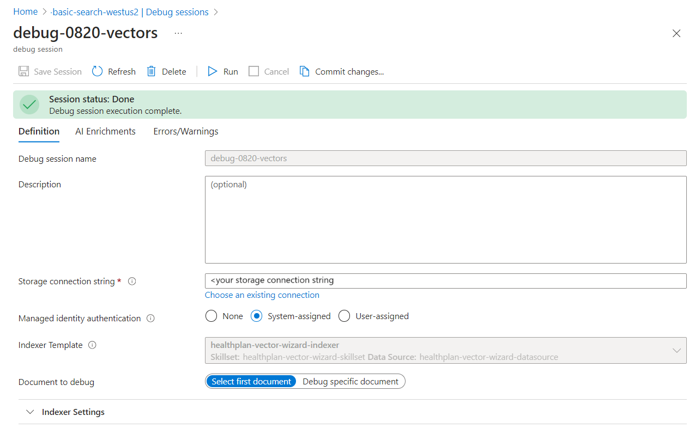
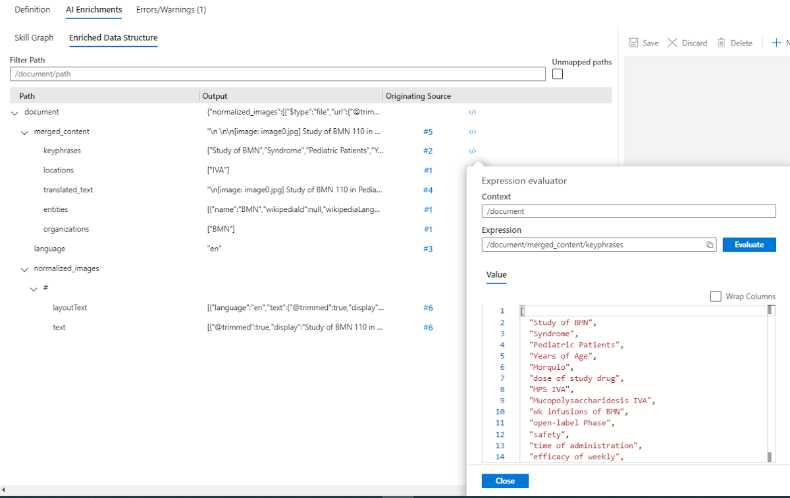

# Debug sessions in Azure Cognitive Search

Debug sessions is a visual editor that works with an existing skillset in the Azure portal. Within a debug session you can identify and resolve errors, validate changes, and push changes to a production skillset in the AI enrichment pipeline.

> [!Important]
> Debug sessions is a preview feature provided without a service level agreement, and is not recommended for production workloads. For more information, see [Supplemental Terms of Use for Microsoft Azure Previews](https://azure.microsoft.com/support/legal/preview-supplemental-terms/).
>

## Using debug sessions

When you start a session, the service creates a copy of the skillset, indexer, and index where a single document is used to test the skillset. Changes made within the session are saved to the session. The changes made within the debug session will not affect the production skillset unless the changes are committed to it. Committing changes will overwrite the production skillset.

During a debug session you can edit a skillset, inspect, and validate each node in the enrichment tree in the context of a specific document. Once the enrichment pipeline issues are resolved, changes can be saved to the session and committed to the skillset in production. 

If the enrichment pipeline does not have any errors, a debug session can be used to incrementally enrich a document, test and validate each change before committing the changes.

## Creating a debug session

To start a debug session you must have an existing AI enrichment pipeline including; a data source, a skillset, an indexer, and an index. To configure a debug session, you need to name the session, and provide a general-purpose storage account that will be used to cache the skill executions during the indexer run. You will also need to select the indexer that will be running. The indexer has references stored to the data source, skillset, and index. The debug session will default to the first document in the data source or you can specify a document in the data source to step through.

> [!div class="mx-imgBorder"]
> 

## Debug session features

The debug session begins by executing the skillset on the selected document. The debug session will record additional metadata associated with each operation in the skillset. The metadata created by the pipeline's skill executions, informs the following set of features that are then used to help identify and fix issues with the skillset.

## AI Enrichments

As skills execute a tree of enrichments, representing the document, grows. Using a tree to visualize the outputs of skills or enrichments provides a comprehensive look at all the enrichments performed. You can look across the entire document and inspect each node of the enrichment tree. This perspective makes it easier to shape objects. This format also provides visual cues to the type, path, and contents of each node in the tree.

## Skill Graph

The **Skill Graph** view provides a hierarchical, visual representation of the skillset. The graph is a top to bottom representation of the order in which the skills are executed. Skills that are dependent upon the output of other skills will be shown lower in the graph. Skills at the same level in the hierarchy can execute in parallel. 

Selecting a skill in the graph will highlight the skills connected to it, the nodes that create its inputs and the nodes that accept its outputs. Each skill node displays its type, errors or warnings, and execution counts. The **Skill Graph** is where you will select which skill to debug or enhance. When you select a skill its details will be displayed in the skill details pane to the right of the graph.

> [!div class="mx-imgBorder"]
> 

## Skill details

The skill details pane displays a set of areas for working with a specific skill, when that skill is highlighted in the **Skill Graph**. You can review and edit the details of the skill's settings. The skill's JSON definition is provided. The details of the skill's execution and the errors and warnings are also displayed. The **Skill Settings** tab & **Skill JSON Editor** allow for direct edits to the skill. The [`</>`](#expression-evaluator) opens a window for viewing and editing the expressions of the skills inputs and outputs.

Nested input controls in the skill settings window can be used to build complex shapes for projections, output field mappings for a complex type field, or an input to a skill. When used with the **Expression evaluator**, nested inputs provide an easy test and validate expression builder.

## Skill execution history

A skill can execute multiple times in a skillset for a single document. For example, the OCR skill will execute once for each image extracted from each document. In the skill details pane  the **Executions** tab displays the skill's execution history providing a deeper look into each invocation of the skill. 

The execution history enables tracking a specific enrichment back to the skill that generated it. Clicking on a skill input navigates to the skill that generated that input. This allows identification of the root cause of a problem that may manifest in a downstream skill. 

When a potential issue is identified, the execution history displays links to the skills that generated the specific inputs, providing a stack-trace like feature. Clicking on the skill associated with an input, navigates to the skill to fix any bugs or continue to trace the specific issue.

When building a custom skill or debugging an error with a custom skill, there is the option to generate a request for a skill invocation in the execution history.

## Enriched Data Structure

The **Enriched Data Structure** pane shows the document's enrichments through the skillset, detailing the context for each enrichment and the originating skill. The **Expression evaluator** can also be used to view the contents for each enrichment.

> [!div class="mx-imgBorder"]
> 

## Expression evaluator

**Expression evaluator** gives a quick peek into the value of any path. It allows for editing the path and testing the results before updating any of the inputs or context for a skill or projection.

## Errors/Warnings

This window displays all of the errors and warnings the skillset produces as it is executed against the document in the debug session.

## Limitations

Debug sesisons work with all generally available data sources amd most preview data sources. The MongoDB API(preview) and Cassandra API(preview) of Cosmos DB are currently not supported.

## Next steps

Now that you understand the elements of Debug sessions try the tutorial for a hands-on experience.

> [!div class="nextstepaction"]
> [Explore Debug sessions feature tutorial](https://docs.microsoft.com/azure/search/cognitive-search-tutorial-debug-sessions)