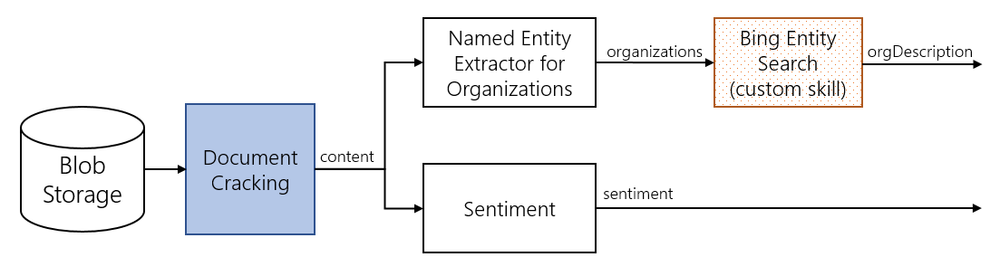
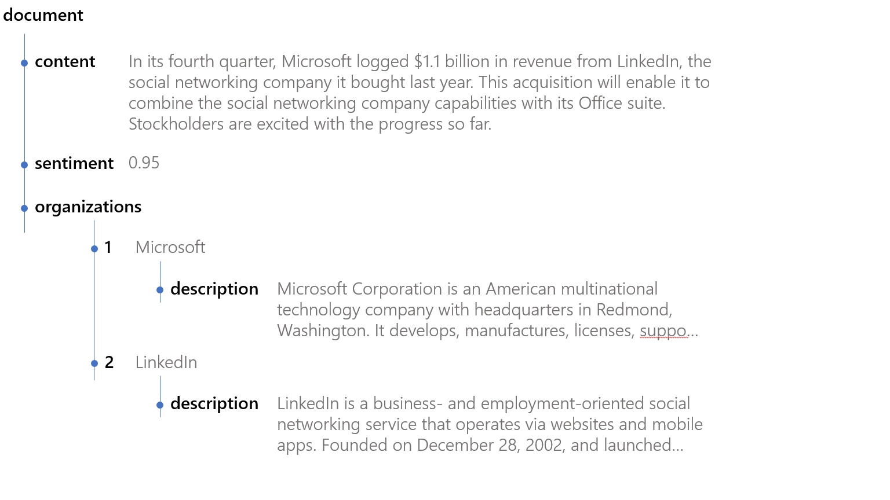

# Create a skillset in Azure Cognitive Search


A skillset defines the operations that extract and enrich data to make it searchable. A skillset executes after text and image content are extracted from source documents, and after any fields from the source document are (optionally) mapped to destination fields in an index or knowledge store.

A skillset contains one or more *cognitive skills* that represent a specific enrichment operation, like translating text, extracting key phrases, or performing optical character recognition from an image file. To create a skillset, you can use [built-in skills](cognitive-search-predefined-skills.md) from Microsoft, or custom skills that contain models or processing logic that you provide (see [Example: Creating a custom skill in an AI enrichment pipeline](cognitive-search-create-custom-skill-example.md) for more information).

In this article, you learn how to create an enrichment pipeline for the skills you want to use. A skillset is attached to an Azure Cognitive Search [indexer](search-indexer-overview.md). One part of pipeline design, covered in this article, is constructing the skillset itself. 

> [!NOTE]
> Another part of pipeline design is specifying an indexer, covered in the [next step](#next-step). An indexer definition includes a reference to the skillset, plus field mappings used for connecting inputs to outputs in the target index.

Key points to remember:

+ You can only have one skillset per indexer.
+ A skillset must have at least one skill.
+ You can create multiple skills of the same type (for example, variants of an image analysis skill).

## Begin with the end in mind

A recommended initial step is deciding which data to extract from your raw data and how you want to use that data in a search solution. Creating an illustration of the entire enrichment pipeline can help you identify the necessary steps.

Suppose you are interested in processing a set of financial analyst comments. For each file, you want to extract company names and the general sentiment of the comments. You might also want to write a custom enricher that uses the Bing Entity Search service to find additional information about the company, such as what kind of business the company is engaged in. Essentially, you want to extract information like the following, indexed for each document:

| record-text | companies | sentiment | company descriptions |
|--------|-----|-----|-----|
|sample-record| ["Microsoft", "LinkedIn"] | 0.99 | ["Microsoft Corporation is an American multinational technology company ..." , "LinkedIn is a business- and employment-oriented social networking..."]

The following diagram illustrates a hypothetical enrichment pipeline:



Once you have fair idea of what you want in the pipeline, you can express the skillset that provides these steps. Functionally, the skillset is expressed when you upload your indexer definition to Azure Cognitive Search. To learn more about how to upload your indexer, see the [indexer-documentation](/rest/api/searchservice/create-indexer).

In the diagram, the *document cracking* step happens automatically. Essentially, Azure Cognitive Search knows how to open well-known files and creates a *content* field containing the text extracted from each document. The white boxes are built-in enrichers, and the dotted "Bing Entity Search" box represents a custom enricher that you are creating. As illustrated, the skillset contains three skills.

## Skillset definition in REST

A skillset is defined as an array of skills. Each skill defines the source of its inputs and the name of the outputs produced. The following example uses the [Create Skillset REST API](/rest/api/searchservice/create-skillset).

After the name and description, a skillset has four main properties:

+ `skills`, an unordered collection of skills, for which the search service determines the sequence of execution based on the inputs required for each skill. If skills are independent, they can execute in parallel. Skills can be utilitarian (like splitting text), transformational (based on AI from Cognitive Services), or custom skills that you provide.

+ `cognitiveServices`, the key of a Cognitive Services resource that performs image and text processing for skillsets that include built-in skills.

+ `knowledgeStore`, (optional) a set of properties that specify an Azure Storage account and instructions for projecting data into tables, blobs, and files. 

+ `encryptionKey`, (optional) a set of properties that specify an Azure Key Vault and specifications for retrieving customer-managed keys used to encrypt sensitive content.

A skillset is authored in JSON. The following example shows the main sections:

```json
{
  "name": "reviews-ss",
  "description": "Extract company names from customer reviews, and detect positive or negative sentiment from the same reviews.",
  "skills": [ ],
  "cognitiveServices": 
    {
       "@odata.type": "#Microsoft.Azure.Search.CognitiveServicesByKey",
       "description": "mycogsvcs resource in West US 2",
       "key": "<your cognitive services all-in-one key goes here>"
    },
  "knowledgeStore": { },
  "encryptionKey": { }
}
```

### Example of a skills definition

The skills property specifies the skills used in the skillset. This example shows two built-in skills, with a third for a custom skill that is part of the skillset, but executes externally in a module that you provide.

```json
"skills":
[
  {
    "@odata.type": "#Microsoft.Skills.Text.V3.EntityRecognitionSkill",
    "context": "/document",
    "categories": [ "Organization" ],
    "defaultLanguageCode": "en",
    "inputs": [
      {
        "name": "text",
        "source": "/document/content"
      }
    ],
    "outputs": [
      {
        "name": "organizations",
        "targetName": "orgs"
      }
    ]
  },
  {
    "@odata.type": "#Microsoft.Skills.Text.SentimentSkill",
    "inputs": [
      {
        "name": "text",
        "source": "/document/content"
      }
    ],
    "outputs": [
      {
        "name": "score",
        "targetName": "mySentiment"
      }
    ]
  },
  {
    "@odata.type": "#Microsoft.Skills.Custom.WebApiSkill",
    "description": "Calls an Azure function, which in turn calls Bing Entity Search",
    "uri": "https://indexer-e2e-webskill.azurewebsites.net/api/InvokeTextAnalyticsV3?code=foo",
    "httpHeaders": {
        "Ocp-Apim-Subscription-Key": "foobar"
    },
    "context": "/document/orgs/*",
    "inputs": [
      {
        "name": "query",
        "source": "/document/orgs/*"
      }
    ],
    "outputs": [
      {
        "name": "description",
        "targetName": "companyDescription"
      }
    ]
  }
]
```

## Create a skillset

While creating a skillset, you can provide a description to make the skillset self-documenting. A description is optional, but useful for keeping track of what a skillset does. Because skillset is a JSON document, which does not allow comments, you must use a `description` element for this.

The next piece in the skillset is an array of skills. You can think of each skill as a primitive of enrichment. Each skill performs a small task in this enrichment pipeline. Each one takes an input (or a set of inputs), and returns some outputs. The next few sections focus on how to specify built-in and custom skills, chaining skills together through input and output references. Inputs can come from source data or from another skill. Outputs can be mapped to a field in a search index or used as an input to a downstream skill.

> [!NOTE]
> You can build complex skillsets with looping and branching, using the [Conditional skill](cognitive-search-skill-conditional.md) to create the expressions. The syntax is based on the [JSON Pointer](https://tools.ietf.org/html/rfc6901) path notation, with a few modifications to identify nodes in the enrichment tree. A `"/"` traverses a level lower in the tree and  `"*"` acts as a for-each operator in the context. Numerous examples in this article illustrate the syntax. 

## Add built-in skills

Let's look at the first skill, which is the built-in [entity recognition skill](cognitive-search-skill-entity-recognition-v3.md):

```json
    {
      "@odata.type": "#Microsoft.Skills.Text.V3.EntityRecognitionSkill",
      "context": "/document",
      "categories": [ "Organization" ],
      "defaultLanguageCode": "en",
      "inputs": [
        {
          "name": "text",
          "source": "/document/content"
        }
      ],
      "outputs": [
        {
          "name": "organizations",
          "targetName": "orgs"
        }
      ]
    }
```

* Every built-in skill has `odata.type`, `input`, and `output` properties. Skill-specific properties provide additional information applicable to that skill. For entity recognition, `categories` is one entity among a fixed set of entity types that the pretrained model can recognize.

* Each skill should have a ```"context"```. The context represents the level at which operations take place. In the skill above, the context is the whole document, meaning that the entity recognition skill is called once per document. Outputs are also produced at that level. The skill returns a property called ```organizations``` that is captured as ```orgs```. More specifically, ```"orgs"``` is now added as a member of ```"/document"```. In downstream skills, you can refer to this newly created enrichment as ```"/document/orgs"```.  If the ```"context"``` field is not explicitly set, the default context is the document.

* Outputs from the one skill can conflict with outputs from a different skill. If you have multiple skills returning a ```result``` property, you can use the ```targetName``` property of skill outputs to capture a named JSON output from a skill into a different property.

* The skill has one input called "text", with a source input set to ```"/document/content"```. The skill (entity recognition) operates on the *content* field of each document, which is a standard field created by the Azure Blob indexer. 

* The skill has one output called ```"organizations"``` that is captured in a property ```orgs```. Outputs exist only during processing. To chain this output to a downstream skill's input, reference the output as ```"/document/orgs"```.

* For a particular document, the value of ```"/document/orgs"``` is an array of organizations extracted from the text. For example:

  ```json
  ["Microsoft", "LinkedIn"]
  ```

Some situations call for referencing each element of an array separately. For example, suppose you want to pass each element of ```"/document/orgs"``` separately to another skill (such as the custom Bing entity search enricher). You can refer to each element of the array by adding an asterisk to the path: ```"/document/orgs/*"``` 

The second skill for sentiment extraction follows the same pattern as the first enricher. It takes ```"/document/content"``` as input, and returns a sentiment score for each content instance. Since you did not set the ```"context"``` field explicitly, the output (mySentiment) is now a child of ```"/document"```.

```json
    {
      "@odata.type": "#Microsoft.Skills.Text.SentimentSkill",
      "inputs": [
        {
          "name": "text",
          "source": "/document/content"
        }
      ],
      "outputs": [
        {
          "name": "score",
          "targetName": "mySentiment"
        }
      ]
    },
```

## Add a custom skill

Recall the structure of the custom Bing entity search enricher:

```json
    {
      "@odata.type": "#Microsoft.Skills.Custom.WebApiSkill",
     "description": "This skill calls an Azure function, which in turn calls Bing Entity Search",
      "uri": "https://indexer-e2e-webskill.azurewebsites.net/api/InvokeTextAnalyticsV3?code=foo",
      "httpHeaders": {
          "Ocp-Apim-Subscription-Key": "foobar"
      },
      "context": "/document/orgs/*",
      "inputs": [
        {
          "name": "query",
          "source": "/document/orgs/*"
        }
      ],
      "outputs": [
        {
          "name": "description",
          "targetName": "companyDescription"
        }
      ]
    }
```

This definition is a [custom skill](cognitive-search-custom-skill-web-api.md) that calls a web API as part of the enrichment process. For each organization identified by entity recognition, this skill calls a web API to find the description of that organization. The orchestration of when to call the web API and how to flow the information received is handled internally by the enrichment engine. However, the initialization necessary for calling this custom API must be provided in the JSON (such as uri, httpHeaders, and the inputs expected). For guidance in creating a custom web API for the enrichment pipeline, see [How to define a custom interface](cognitive-search-custom-skill-interface.md).

Notice that the "context" field is set to ```"/document/orgs/*"``` with an asterisk, meaning the enrichment step is called *for each* organization under ```"/document/orgs"```. 

Output, in this case a company description, is generated for each organization identified. When referring to the description in a downstream step (for example, in key phrase extraction), you would use the path ```"/document/orgs/*/description"``` to do so. 

## Add structure

The skillset generates structured information out of unstructured data. Consider the following example:

*"In its fourth quarter, Microsoft logged $1.1 billion in revenue from LinkedIn, the social networking company it bought last year. The acquisition enables Microsoft to combine LinkedIn capabilities with its CRM and Office capabilities. Stockholders are excited with the progress so far."*

A likely outcome would be a generated structure similar to the following illustration:



Until now, this structure has been internal-only, memory-only, and used only in Azure Cognitive Search indexes. The addition of a knowledge store gives you a way to save shaped enrichments for use outside of search.

## Add a knowledge store

[Knowledge store](knowledge-store-concept-intro.md) is a feature in Azure Cognitive Search for saving your enriched document. A knowledge store that you create, backed by an Azure storage account, is the repository where your enriched data lands. 

A knowledge store definition is added to a skillset. For a  walkthrough of the entire process, see [Create a knowledge store in REST](knowledge-store-create-rest.md).

```json
"knowledgeStore": {
  "storageConnectionString": "<an Azure storage connection string>",
  "projections" : [
    {
      "tables": [ ]
    },
    {
      "objects": [
        {
          "storageContainer": "containername",
          "source": "/document/EnrichedShape/",
          "key": "/document/Id"
        }
      ]
    }
  ]
}
```

You can choose to save the enriched documents as tables with hierarchical relationships preserved or as JSON documents in blob storage. Output from any of the skills in the skillset can be sourced as the input for the projection. If you are looking to project the data into a specific shape, the updated [shaper skill](cognitive-search-skill-shaper.md) can now model complex types for you to use. 

<a name="next-step"></a>

## Next steps

Now that you are familiar with the enrichment pipeline and skillsets, continue with [How to reference annotations in a skillset](cognitive-search-concept-annotations-syntax.md) or [How to map outputs to fields in an index](cognitive-search-output-field-mapping.md).