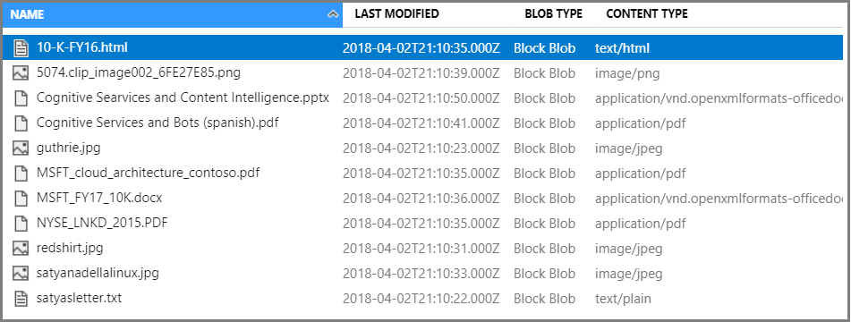
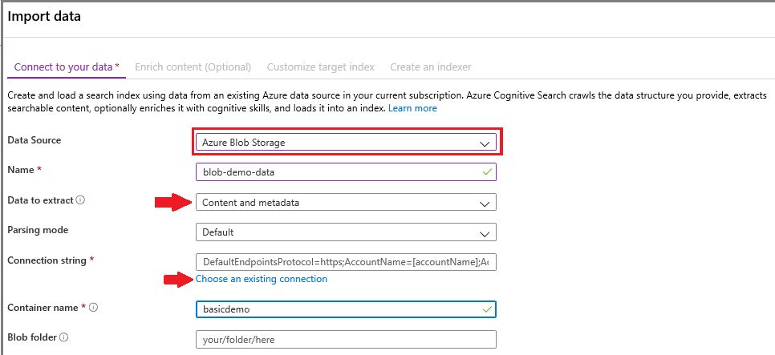
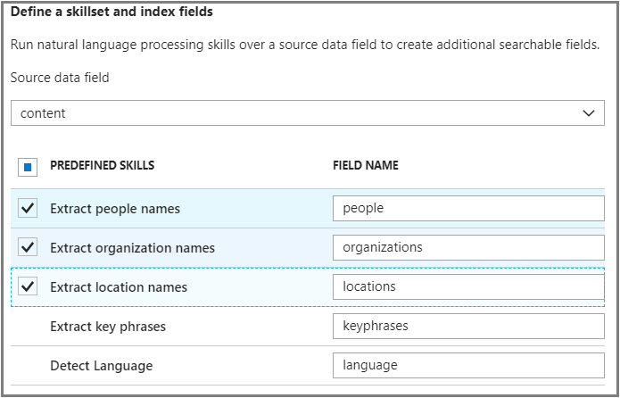
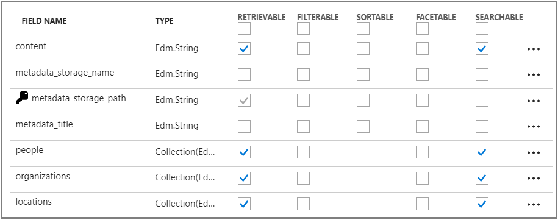
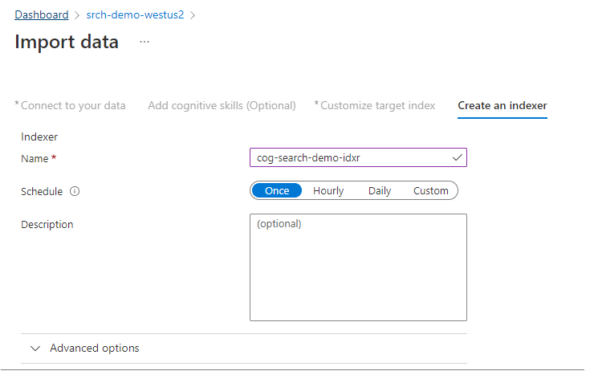
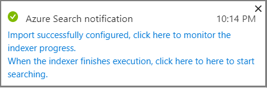
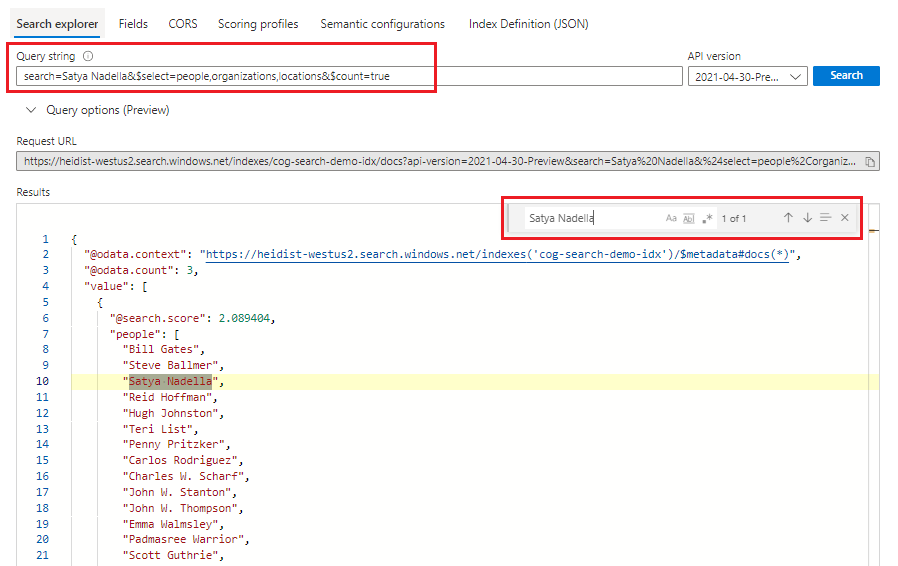

# Quickstart: Create a cognitive search pipeline using skills and sample data

Cognitive search (preview) adds data extraction, natural language processing (NLP), and image processing skills to an Azure Search indexing pipeline, making unsearchable or unstructured content more searchable. 
Information created by a skill, such as entity recognition or image analysis, gets added to an index in Azure Search.

In this quickstart, try the enrichment pipeline in the [Azure portal](https://portal.azure.com) before writing a single line of code:

* Begin with sample data in Azure Blob storage
* Configure the [Import data wizard](search-import-data-portal.md) for indexing and enrichment 
* Run the wizard (an entity skill detects people, location, and organizations)
* Use [Search explorer](search-explorer.md) to query the enriched data.

You can try out cognitive search in an Azure Search service created in the following regions:

* South Central US
* West Europe

If you don't have an Azure subscription, create a [free account](https://azure.microsoft.com/free/?WT.mc_id=A261C142F) before you begin.

> [!NOTE]
> Cognitive Search is in public preview. Skillset execution, and image extraction and normalization are currently offered for free. At a later time, the pricing for these capabilities will be announced. 

## Prerequisites

["What is cognitive search?"](cognitive-search-concept-intro.md) introduces the enrichment architecture and components. 

Azure services are used exclusively in this scenario. Creating the services you need is part of the preparation.

+ Azure Blob storage provides the source data.
+ Azure Search handles data ingestion and indexing, cognitive search enrichment, and full text search queries.

### Set up Azure Search

First, sign up for the Azure Search service. 

1. Go to the [Azure portal](https://portal.azure.com) and sign in by using your Azure account.

1. Click **Create a resource**, search for Azure Search, and click **Create**. See [Create an Azure Search service in the portal](search-create-service-portal.md) if you are setting up a search service for the first time and you need more help.

  

1. For Resource group, create a resource group to contain all the resources you create in this quickstart. This makes it easier to clean up the resources after you have finished the quickstart.

1. For Location, choose either **South Central US** or **West Europe**. Currently, the preview is available only in these regions.

1. For Pricing tier, you can create a **Free** service to complete tutorials and quickstarts. For deeper investigation using your own data, create a [paid service](https://azure.microsoft.com/pricing/details/search/) such as **Basic** or **Standard**. 

  A Free service is limited to 3 indexes, 16 MB maximum blob size, and 2 minutes of indexing, which is insufficient for exercising the full capabilities of cognitive search. To review limits for different tiers, see [Service Limits](search-limits-quotas-capacity.md).

  > [!NOTE]
  > Cognitive search is in public preview. Skillset execution is currently available in all tiers, including free. At a later time, the pricing for this capability will be announced.

1. Pin the service to the dashboard for fast access to service information.

  

### Set up Azure Blob service and load sample data

The enrichment pipeline pulls from Azure data sources supported by [Azure Search indexers](search-indexer-overview.md). For this exercise, we use blob storage to showcase multiple content types.

1. [Download sample data](https://1drv.ms/f/s!As7Oy81M_gVPa-LCb5lC_3hbS-4) consisting of a small file set of different types. 

1. Sign up for Azure Blob storage, create a storage account, sign in to Storage Explorer, and create a container. See [Azure Storage Explorer Quickstart](../storage/blobs/storage-quickstart-blobs-storage-explorer.md) for instructions on all the steps.

1. Using the Azure Storage Explorer, in the container you created, click **Upload** to upload the sample files.

  

## Create the enrichment pipeline

Go back to the Azure Search service dashboard page and click **Import data** on the command bar to set up enrichment in four steps.

### Step 1: Create a data source

In **Connect to your data** > **Azure Blob storage**, select the account and container you created. Give the data source a name, and use default values for the rest. 

   

Click **OK** to create the data source.

One advantage of using the **Import data** wizard is that it can also create your index. As the data source is created, the wizard simultaneously constructs an index schema. It can take a few seconds to create the index.

### Step 2: Add cognitive skills

Next, add enrichment steps to the indexing pipeline. The portal gives you predefined cognitive skills for image analysis and text analysis. In the portal, a skillset operates over a single source field. That might seem like a small target, but for Azure blobs the `content` field contains most of the blob document (for example, a Word doc or PowerPoint deck). As such, this field is an ideal input because all of a blob's content is there.

Sometimes you would like to extract the textual representation from files that are composed of mostly scanned images, like a PDF that gets generated by a scanner. Azure Search can automatically extract content from embedded images in the document. To do that, select the **Enable OCR and merge all text into merged_content field** option. This will automatically create a `merged_content` field that contains both the text extracted from the document as well as the textual representation of images embedded in the document. When you select this option the `Source data field` will be set to `merged_content`.

In **Add cognitive skills**, choose skills that perform natural language processing. For this quickstart, choose entity recognition for people, organizations, and locations.

Click **OK** to accept the definition.
   
  

Natural language processing skills operate over text content in the sample data set. Since we didn't select any image processing options, the JPEG files found in the sample data set won't be processed in this quickstart. 

### Step 3: Configure the index

Remember the index that was created with the data source? In this step, you can view its schema and potentially revise any settings. 

For this quickstart, the wizard does a good job setting reasonable defaults: 

+ Every index must have a name. For this data source type, the default name is *azureblob-index*.

+ Every document must have a key. The wizard chooses a field having unique values. In this quickstart, the key is *metadata_storage_path*.

+ Every field collection must have fields with a data type describing its values, and each field should have index attributes that describe how its used in a search scenario. 

Because you defined a skillset, the wizard assumes that you want the source data field, plus the output fields created by the skills. For this reason, the portal adds index fields for `content`, `people`, `organizations`, and `locations`. Notice that the wizard automatically enables Retrievable and Searchable for these fields.

In **Customize index**, review the attributes on the fields to see how they are used in an index. Searchable indicates a field can be searched. Retrievable means it can be returned in results. 

Consider clearing Retrievable from the `content` field. In blobs, this field can run into thousands of lines, difficult to read in a tool like **Search explorer**.

Click **OK** to accept the index definition.

  

> [!NOTE]
> Unused fields have been trimmed from the screenshot for brevity. If you are following along in the portal, your list shows extra fields.

### Step 4: Configure the indexer

The indexer is a high-level resource that drives the indexing process. It specifies the data source name, the index, and frequency of execution. The end result of the **Import data** wizard is always an indexer that you can run repeatedly.

In the **Indexer** page, give the indexer a name and use the default "run once" to run it immediately. 

  

Click **OK** to import, enrich, and index the data.

  

Indexing and enrichment can take time, which is why smaller data sets are recommended for early exploration. You can monitor indexing in the Notifications page of the Azure portal. 

## Query in Search explorer

After an index is created, you can submit queries to return documents from the index. In the portal, use **Search explorer** to run queries and view results. 

1. On the search service dashboard page, click **Search explorer** on the command bar.

1. Select **Change Index** at the top to select the index you created.

1. Enter a search string to query the index, such as "John F. Kennedy".

Results are returned in JSON, which can be verbose and hard to read, especially in large documents originating from Azure blobs. 

If you can't scan results easily, use CTRL-F to search within documents. For this query, you could search within the JSON on "John F. Kennedy" to view instances of that search term. 

CTRL-F can also help you determine how many documents are in a given result set. For Azure blobs, the portal chooses "metadata_storage_path" as the key because each value is unique to the document. Using CTRL-F, search for "metadata_storage_path" to get a count of documents. For this query, two documents in the result set contain the term "John F. Kennedy".

  

## Takeaways

You've now completed your first enriched indexing exercise. The purpose of this quickstart was to introduce important concepts and walk you through the wizard so that you can quickly prototype a cognitive search solution using your own data.

Some key concepts that we hope you picked up include the dependency on Azure data sources. Cognitive search enrichment is bound to indexers, and indexers are Azure and source-specific. Although this quickstart uses Azure Blob storage, other Azure data sources are possible. For more information, see [Indexers in Azure Search](search-indexer-overview.md).

Another important concept is that skills operate over input fields. In the portal, you have to choose a single source field for all the skills. In code, inputs can be other fields, or the output of an upstream skill.

 Inputs to a skill are mapped to an output field in an index. Internally, the portal sets up [annotations](cognitive-search-concept-annotations-syntax.md) and defines a [skillset](cognitive-search-defining-skillset.md), establishing the order of operations and general flow. These steps are hidden in the portal, but when you start writing code, these concepts become important.

Finally, you learned that viewing results is achieved by querying the index. In the end, what Azure Search provides is a searchable index, which you can query using either the [simple](https://docs.microsoft.com/rest/api/searchservice/simple-query-syntax-in-azure-search) or [fully extended query syntax](https://docs.microsoft.com/rest/api/searchservice/lucene-query-syntax-in-azure-search). An index containing enriched fields is like any other. If you want to incorporate standard or [custom analyzers](search-analyzers.md), [scoring profiles](https://docs.microsoft.com/rest/api/searchservice/add-scoring-profiles-to-a-search-index), [synonyms](search-synonyms.md), [faceted filters](search-filters-facets.md), geo-search, or any other Azure Search feature, you can certainly do so.

## Clean up resources

If your exploration is concluded, the fastest way to clean up is by deleting the resource group containing the Azure Search service and Azure Blob service.  

Assuming you put both services in the same group, delete the resource group now to permanently delete everything in it, including the services and any stored content you created for this exercise. In the portal, the resource group name is on the Overview page of each service.

## Next steps

You can experiment with indexing and enrichment by rerunning the wizard with different skills and source data fields. To repeat the steps, delete the index and indexer, then recreate the indexer with a new mix of selections.

+ In **Overview** > **Indexes**, select the index you created, and then click **Delete**.

+ In **Overview**, double-click the **Indexers** tile. Find the indexer you created and delete it.

Alternatively, reuse the sample data and services you created, and learn how to perform the same tasks programmatically in the next tutorial. 

> [!div class="nextstepaction"]
> [Tutorial: Learn the cognitive search REST APIs](cognitive-search-tutorial-blob.md)