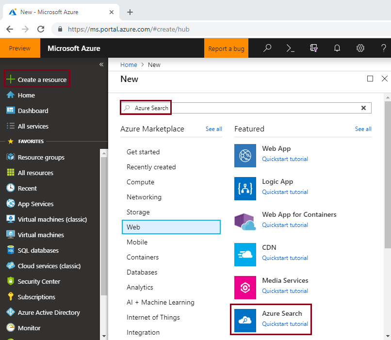
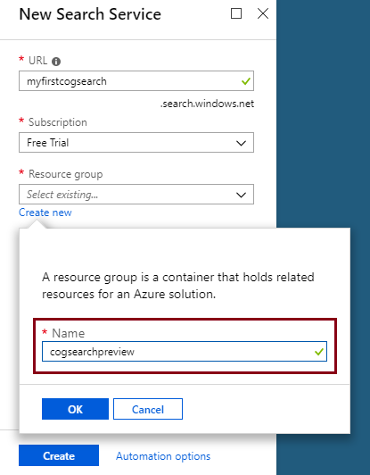
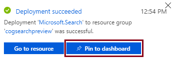
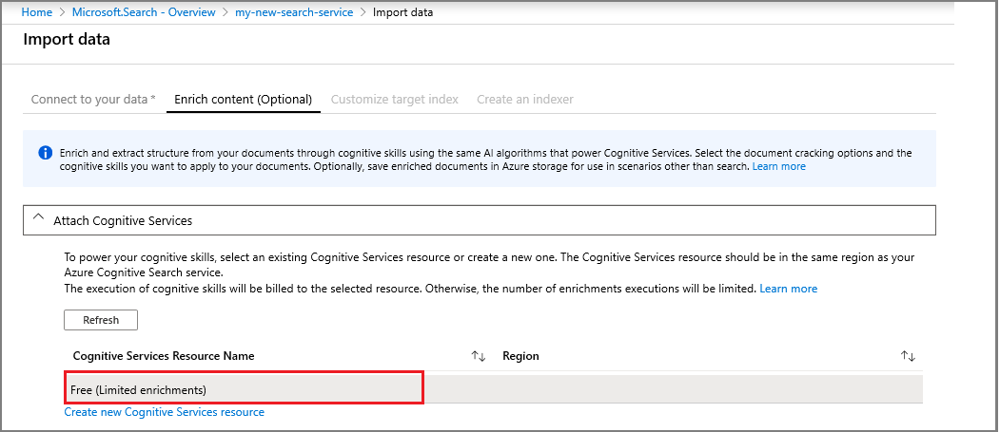

# Quickstart: Create a cognitive search pipeline using skills and sample data

Cognitive search (preview) adds data extraction, natural language processing (NLP), and image processing skills to an Azure Search indexing pipeline, making unsearchable or unstructured content more searchable. 

A cognitive search pipeline integrates [Cognitive Services resources](https://azure.microsoft.com/services/cognitive-services/) - such as [OCR](cognitive-search-skill-ocr.md), [language detection](cognitive-search-skill-language-detection.md), [entity recognition](cognitive-search-skill-entity-recognition.md) - into an indexing process. The AI algorithms of Cognitive Services are used to find patterns, features, and characteristics in source data, returning structures and textual content that can be used in full-text search solutions based on Azure Search.

In this quickstart, create your first enrichment pipeline in the [Azure portal](https://portal.azure.com) before writing a single line of code:

> [!div class="checklist"]
> * Begin with sample data in Azure Blob storage
> * Configure the [**Import data**](search-import-data-portal.md) wizard for cognitive indexing and enrichment 
> * Run the wizard (an entity skill detects people, location, and organizations)
> * Use [**Search explorer**](search-explorer.md) to query the enriched data

##  Supported Regions

You can try out cognitive search in an Azure Search service created in the following regions:

* West Central US
* South Central US
* East US
* East US 2
* West US 2
* Canada Central
* West Europe
* UK South
* North Europe
* Brazil South
* Southeast Asia
* Central India
* Australia East

If you don't have an Azure subscription, create a [free account](https://azure.microsoft.com/free/?WT.mc_id=A261C142F) before you begin.

> [!NOTE]
> Starting December 21, 2018, you will be able to associate a Cognitive Services resource with an Azure Search skillset. This will allow us to start charging for skillset execution. On this date, we will also begin charging for image extraction as part of the document-cracking stage. Text extraction from documents will continue to be offered at no additional cost.
>
> The execution of built-in skills will be charged at the existing [Cognitive Services pay-as-you go price](https://azure.microsoft.com/pricing/details/cognitive-services/)
. Image extraction pricing will be charged at preview pricing, and is described on the [Azure Search pricing page](https://go.microsoft.com/fwlink/?linkid=2042400). Learn [more](cognitive-search-attach-cognitive-services.md).

## Prerequisites

["What is cognitive search?"](cognitive-search-concept-intro.md) introduces the enrichment architecture and components. 

Azure services are used exclusively in this scenario. Creating the services you need is part of the preparation.

+ [Azure Blob storage](https://azure.microsoft.com/services/storage/blobs/) provides the source data
+ [Cognitive Services](https://azure.microsoft.com/services/cognitive-services/) provides the AI (you can create these resources in-line, when specifying the pipeline)
+ [Azure Search](https://azure.microsoft.com/services/search/) provides the enriched indexing pipeline and a rich free form text search experience for use in custom apps

### Set up Azure Search

First, sign up for the Azure Search service. 

1. Go to the [Azure portal](https://portal.azure.com) and sign in by using your Azure account.

1. Click **Create a resource**, search for Azure Search, and click **Create**. See [Create an Azure Search service in the portal](search-create-service-portal.md) if you are setting up a search service for the first time and you need more help.

   

1. For Resource group, create a new resource group to contain all the resources you create in this quickstart. This makes it easier to clean up the resources after you have finished the quickstart.

1. For Location, choose one of the [supported regions](#supported-regions) for cognitive search.

1. For Pricing tier, you can create a **Free** service to complete tutorials and quickstarts. For deeper investigation using your own data, create a [paid service](https://azure.microsoft.com/pricing/details/search/) such as **Basic** or **Standard**. 

   A Free service is limited to 3 indexes, 16 MB maximum blob size, and 2 minutes of indexing, which is insufficient for exercising the full capabilities of cognitive search. To review limits for different tiers, see [Service Limits](search-limits-quotas-capacity.md).

   

   > [!NOTE]
   > Cognitive search is in public preview. Skillset execution is currently available in all tiers, including free. You will be able to perform a limited number of enrichments without associating a paid Cognitive Services resource. Learn [more](cognitive-search-attach-cognitive-services.md).

1. Pin the service to the dashboard for fast access to service information.

   

### Set up Azure Blob service and load sample data

The enrichment pipeline pulls from Azure data sources supported by [Azure Search indexers](search-indexer-overview.md). Please note that Azure Table Storage is not supported for cognitive search. For this exercise, we use blob storage to showcase multiple content types.

1. [Download sample data](https://1drv.ms/f/s!As7Oy81M_gVPa-LCb5lC_3hbS-4) consisting of a small file set of different types. 

1. Sign up for Azure Blob storage, create a storage account, open the Blob services pages, and create a container. 

1. On the container, set the public access level to **Container (anonymous read access for containers and blobs)**. For more information, see ["Create a container" section](../storage/blobs/storage-unstructured-search.md#create-a-container) in the *Search unstructured data* tutorial.

1. In the container you created, click **Upload** to upload the sample files you downloaded in a previous step.

   

## Create the enrichment pipeline

Return to the Azure Search service dashboard page and click **Import data** on the command bar to set up cognitive enrichment in four steps.

  

### Step 1: Create a data source

In **Connect to your data**, choose **Azure Blob storage**, select the account and container you created. Give the data source a name, and use default values for the rest. 

  

Continue to the next page.

  

### Step 2: Add cognitive skills

Next, add enrichment steps to the indexing pipeline. If you do not have a Cognitive Services resource, you can sign up for a free version that gives you 20 transactions daily. The sample data consists of 14 files, so your daily allocation will be mostly used up once you run this wizard.

1. Expand **Attach Cognitive Services** to view options for resourcing the Cognitive Services APIs. For the purposes of this tutorial, you can use the **Free** resource.

   

2. Expand **Add Enrichments** and select skills that perform natural language processing. For this quickstart, choose entity recognition for people, organizations, and locations.

   

   The portal offers built-in skills for OCR processing and text analysis. In the portal, a skillset operates over a single source field. That might seem like a small target, but for Azure blobs the `content` field contains most of the blob document (for example, a Word doc or PowerPoint deck). As such, this field is an ideal input because all of a blob's content is there.

3. Continue to the next page.

   

> [!NOTE]
> Natural language processing skills operate over text content in the sample data set. Since we didn't select the OCR option, the JPEG and PNG files found in the sample data set won't be processed in this quickstart. 

### Step 3: Configure the index

The wizard can usually infer a default index. In this step, you can view the generated index schema and potentially revise any settings. Below is the default index created for the demo Blob data set.

For this quickstart, the wizard does a good job setting reasonable defaults: 

+ Default name is *azureblob-index* based on the data source type. 

+ Default fields are based on the original source data field (`content`), plus the output fields (`people`, `organizations`, and `locations`) created by the cognitive pipeline. Default data types are inferred from metadata and data sampling.

+ Default key is *metadata_storage_path* (this field contains unique values).

+ Default attributes are **Retrievable** and **Searchable** for these fields. **Searchable** indicates a field can be searched. **Retrievable** means it can be returned in results. The wizard assumes you want these fields to be retrievable and searchable because you created them via a skillset.

  

Notice the strikethrough and question mark on the **Retrievable** attribute by the `content` field. For text-heavy blob documents, the `content` field contains the bulk of the file, potentially running into thousands of lines. If you need to pass file contents to client code, make sure that **Retrievable** stays selected. Otherwise, consider clearing this attribute on `content` if the extracted elements (`people`, `organizations`, and `locations`) are sufficient for your purposes.

Marking a field as **Retrievable** does not mean that the field *must* be present in the search results. You can precisely control search results composition by using the **$select** query parameter to specify which fields to include. For text-heavy fields like `content`, the **$select** parameter is your solution for providing manageable search results to the human users of your application, while ensuring client code has access to all the information it needs via the **Retrievable** attribute.
  
Continue to the next page.

  

### Step 4: Configure the indexer

The indexer is a high-level resource that drives the indexing process. It specifies the data source name, a target index, and frequency of execution. The end result of the **Import data** wizard is always an indexer that you can run repeatedly.

In the **Indexer** page, you can accept the default name and use the **Run once** schedule option to run it immediately. 

  

Click **Submit** to create and simultaneously run the indexer.

## Monitor indexing

Enrichment steps take longer to complete than typical text-based indexing. The wizard should open the Indexer list in the overview page so that you can track progress. For self-navigation, go to the Overview page and click **Indexers**.

The warning occurs because JPG and PNG files are image files, and we omitted the OCR skill from this pipeline. You'll also find truncation notifications. Azure Search limits extraction to 32,000 characters on the Free tier.

  

Indexing and enrichment can take time, which is why smaller data sets are recommended for early exploration. 

## Query in Search explorer

After an index is created, you can submit queries to return documents from the index. In the portal, use **Search explorer** to run queries and view results. 

1. On the search service dashboard page, click **Search explorer** on the command bar.

1. Select **Change Index** at the top to select the index you created.

1. Enter a search string to query the index, such as `search=Microsoft&searchFields=organizations`.

Results are returned in JSON, which can be verbose and hard to read, especially in large documents originating from Azure blobs. If you can't scan results easily, use CTRL-F to search within documents. For this query, you could search within the JSON for specific terms. 

CTRL-F can also help you determine how many documents are in a given result set. For Azure blobs, the portal chooses "metadata_storage_path" as the key because each value is unique to the document. Using CTRL-F, search for "metadata_storage_path" to get a count of documents. 

  

## Takeaways

You've now completed your first cognitive-enriched indexing exercise. The purpose of this quickstart was to introduce important concepts and walk you through the wizard so that you can quickly prototype a cognitive search solution using your own data.

Some key concepts that we hope you picked up include the dependency on Azure data sources. Cognitive search enrichment is bound to indexers, and indexers are Azure and source-specific. Although this quickstart uses Azure Blob storage, other Azure data sources are possible. For more information, see [Indexers in Azure Search](search-indexer-overview.md).

Another important concept is that skills operate over input fields. In the portal, you have to choose a single source field for all the skills. In code, inputs can be other fields, or the output of an upstream skill.

 Inputs to a skill are mapped to an output field in an index. Internally, the portal sets up [annotations](cognitive-search-concept-annotations-syntax.md) and defines a [skillset](cognitive-search-defining-skillset.md), establishing the order of operations and general flow. These steps are hidden in the portal, but when you start writing code, these concepts become important.

Finally, you learned that viewing results is achieved by querying the index. In the end, what Azure Search provides is a searchable index, which you can query using either the [simple](https://docs.microsoft.com/rest/api/searchservice/simple-query-syntax-in-azure-search) or [fully extended query syntax](https://docs.microsoft.com/rest/api/searchservice/lucene-query-syntax-in-azure-search). An index containing enriched fields is like any other. If you want to incorporate standard or [custom analyzers](search-analyzers.md), [scoring profiles](https://docs.microsoft.com/rest/api/searchservice/add-scoring-profiles-to-a-search-index), [synonyms](search-synonyms.md), [faceted filters](search-filters-facets.md), geo-search, or any other Azure Search feature, you can certainly do so.

## Clean up resources

If your exploration is concluded, the fastest way to clean up is by deleting the resource group containing the Azure Search service and Azure Blob service.  

Assuming you put both services in the same group, delete the resource group now to permanently delete everything in it, including the services and any stored content you created for this exercise. In the portal, the resource group name is on the Overview page of each service.

## Next steps

Depending on how you provisioned Cognitive Services resource, you can experiment with indexing and enrichment by rerunning the wizard with different skills and source data fields. To repeat the steps, delete the index and indexer, then recreate the indexer with a new mix of selections.

+ In **Overview** > **Indexes**, select the index you created, and then click **Delete**.

+ In **Overview**, double-click the **Indexers** tile. Find the indexer you created and delete it.

Alternatively, reuse the sample data and services you created, and learn how to perform the same tasks programmatically in the next tutorial. 

> [!div class="nextstepaction"]
> [Tutorial: Learn the cognitive search REST APIs](cognitive-search-tutorial-blob.md)
