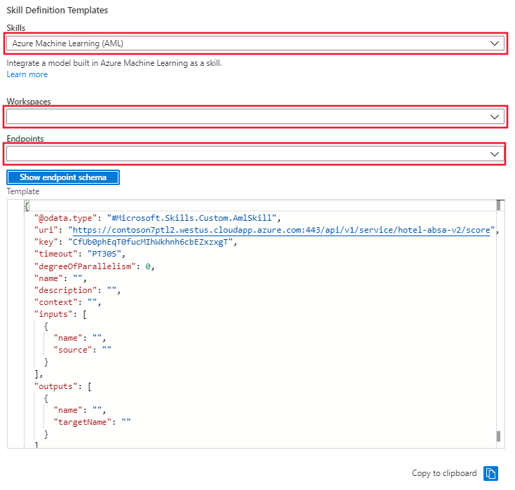

# Tutorial: Build and deploy a custom skill with Azure Machine Learning 

In this tutorial, you will use the [hotel reviews dataset](https://www.kaggle.com/datafiniti/hotel-reviews) (distributed under the Creative Commons license [CC BY-NC-SA 4.0](https://creativecommons.org/licenses/by-nc-sa/4.0/legalcode.txt)) to create a [custom skill](https://docs.microsoft.com/azure/search/cognitive-search-aml-skill) using Azure Machine Learning to extract aspect-based sentiment from the reviews. This allows for the assignment of positive and negative sentiment within the same review to be correctly ascribed to identified entities like staff, room, lobby, or pool.

To train the aspect-based sentiment model in Azure Machine Learning, you will be using the [nlp recipes repository](https://github.com/microsoft/nlp-recipes/tree/master/examples/sentiment_analysis/absa). The model will then be deployed as an endpoint on an Azure Kubernetes cluster. Once deployed, the endpoint is added to the enrichment pipeline as an AML skill for use by the Cognitive Search service.

There are two datasets provided. If you wish to train the model yourself, the hotel_reviews_1000.csv file is required. Prefer to skip the training step? Download the hotel_reviews_100.csv.

> [!div class="checklist"]
> * Create an Azure Cognitive Search instance
> * Create an Azure Machine Learning workspace (the search service and workspace should be in the same subscription)
> * Train and deploy a model to an Azure Kubernetes cluster
> * Link an AI enrichment pipeline to the deployed model
> * Ingest output from deployed model as a custom skill

## Prerequisites

* Azure subscription - get a [free subscription](https://azure.microsoft.com/free/?WT.mc_id=A261C142F).
* [Cognitive Search service](https://docs.microsoft.com/azure/search/search-get-started-arm)
* [Cognitive Services resource](https://docs.microsoft.com/azure/cognitive-services/cognitive-services-apis-create-account?tabs=multiservice%2Cwindows)
* [Azure Storage account](https://docs.microsoft.com/azure/storage/common/storage-account-create?toc=%2Fazure%2Fstorage%2Fblobs%2Ftoc.json&tabs=azure-portal)
* [Azure Machine Learning workspace](https://docs.microsoft.com/azure/machine-learning/how-to-manage-workspace)

## Setup

* Clone or download the contents of [the sample repository](https://github.com/Azure-Samples/azure-search-python-samples/tree/master/AzureML-Custom-Skill).
* Extract contents if the download is a zip file. Make sure the files are read-write.
* While setting up the Azure accounts and services, copy the names and keys to an easily accessed text file. The names and keys will be added to the first cell in the notebook where variables for accessing the Azure services are defined.
* If you are unfamiliar with Azure Machine Learning and its requirements, you will want to review these documents before getting started:
 * [Configure a development environment for Azure Machine Learning](https://docs.microsoft.com/azure/machine-learning/how-to-configure-environment)
 * [Create and manage Azure Machine Learning workspaces in the Azure portal](https://docs.microsoft.com/azure/machine-learning/how-to-manage-workspace)
 * When configuring the development environment for Azure Machine Learning, consider using the [cloud-based compute instance](https://docs.microsoft.com/azure/machine-learning/how-to-configure-environment#compute-instance) for speed and ease in getting started.
* Upload the dataset file to a container in the storage account. The larger file is necessary if you wish to perform the training step in the notebook. If you prefer to skip the training step, the smaller file is recommended.

## Open notebook and connect to Azure services

1. Put all of the required information for the variables that will allow access to the Azure services inside the first cell and run the cell.
1. Running the second cell will confirm that you have connected to the search service for your subscription.
1. Sections 1.1 - 1.5 will create the search service datastore, skillset, index, and indexer.

At this point you can choose to skip the steps to create the training data set and experiment in Azure Machine Learning and skip directly to registering the two models that are provided in the models folder of the GitHub repo. If you skip these steps, in the notebook you will then skip to section 3.5, Write scoring script. This will save time; the data download and upload steps can take up to 30 minutes to complete.

## Creating and training the models

Section 2 has six cells that download the glove embeddings file from the nlp recipes repository. After downloading, the file is then uploaded to the Azure Machine Learning data store. The .zip file is about 2G and it will take some time to perform these tasks. Once uploaded, training data is then extracted and now you are ready to move on to section 3.

## Train the aspect based sentiment model and deploy your endpoint

Section 3 of the notebook will train the models that were created in section 2, register those models and deploy them as an endpoint in an Azure Kubernetes cluster. If you are unfamiliar with Azure Kubernetes, it is highly recommended that you review the following articles before attempting to create an inference cluster:

* [Azure Kubernetes service overview](https://docs.microsoft.com/azure/aks/intro-kubernetes)
* [Kubernetes core concepts for Azure Kubernetes Service (AKS)](https://docs.microsoft.com/azure/aks/concepts-clusters-workloads)
* [Quotas, virtual machine size restrictions, and region availability in Azure Kubernetes Service (AKS)](https://docs.microsoft.com/azure/aks/quotas-skus-regions)

Creating and deploying the inference cluster can take up to 30 minutes. Testing the web service before moving on to the final steps, updating your skillset and running the indexer, is recommended.

## Update the skillset

Section 4 in the notebook has four cells that update the skillset and indexer. Alternatively, you can use the portal to select and apply the new skill to the skillset and then run the indexer to update the search service.

> [!VIDEO https://channel9.msdn.com/Shows/AI-Show/Active-Learning-with-Azure-Cognitive-Search/player#time=19m35s:paused/03/player]

In the portal, go to Skillset and select the Skillset Definition (JSON) link. The portal will display the JSON of your skillset that was created in the first cells of the notebook. To the right of the display there is a dropdown menu where you can select the skill definition template. Select the Azure Machine Learning (AML) template. provide the name of the Azure ML workspace and the endpoint for the model deployed to the inference cluster. The template will be updated with the endpoint uri and key.

> [!div class="mx-imgBorder"]
> 

Copy the skillset template from the window and paste it into the skillset definition on the left. Edit the template to provide the missing values for:

* Name
* Description
* Context
* 'inputs' name and source
* 'outputs' name and targetName

Save the skillset.

After saving the skillset, go to the indexer and select the Indexer Definition (JSON) link. The portal will display the JSON of the indexer that was created in the first cells of the notebook. The output field mappings will need to be updated with additional field mappings to ensure that the indexer can handle and pass them correctly. Save the changes and then select Run. 

## Clean up resources

When you're working in your own subscription, it's a good idea at the end of a project to identify whether you still need the resources you created. Resources left running can cost you money. You can delete resources individually or delete the resource group to delete the entire set of resources.

You can find and manage resources in the portal, using the **All resources** or **Resource groups** link in the left-navigation pane.

If you are using a free service, remember that you are limited to three indexes, indexers, and data sources. You can delete individual items in the portal to stay under the limit.

## Next steps

> [!div class="nextstepaction"]
> [Review the custom skill web api](https://docs.microsoft.com/azure/search/cognitive-search-custom-skill-web-api)
> [Learn more about adding custom skills to the enrichment pipeline](https://docs.microsoft.com/azure/search/cognitive-search-custom-skill-interface)