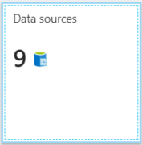

# Tutorial: Use .NET and AI to generate searchable content from Azure blobs

If you have unstructured text or images in Azure Blob Storage, an [AI enrichment pipeline](cognitive-search-concept-intro.md) in Azure AI Search can extract information and create new content for full-text search or knowledge mining scenarios. 

In this C# tutorial, you learn how to:

> [!div class="checklist"]
> * Set up a development environment.
> * Define a pipeline that uses OCR, language detection, entity recognition, and key phrase extraction.
> * Execute the pipeline to invoke transformations, and to create and load a search index.
> * Explore results using full text search and a rich query syntax.

If you don't have an Azure subscription, open a [free account](https://azure.microsoft.com/free/?WT.mc_id=A261C142F) before you begin.

## Overview

This tutorial uses C# and the [**Azure.Search.Documents** client library](/dotnet/api/overview/azure/search.documents-readme) to create a data source, index, indexer, and skillset.

The indexer connects to sample data in a blob container that's specified in the data source object, and sends all enriched content to a search index.

The skillset is attached to the indexer. It uses built-in skills from Microsoft to find and extract information. Steps in the pipeline include Optical Character Recognition (OCR) on images, language detection on text, key phrase extraction, and entity recognition (organizations). New information created by the pipeline is stored in new fields in an index. Once the index is populated, you can use the fields in queries, facets, and filters.

## Prerequisites

* [Visual Studio](https://visualstudio.microsoft.com/downloads/)
* [Azure.Search.Documents 11.x NuGet package](https://www.nuget.org/packages/Azure.Search.Documents) 
* [Azure Storage](https://azure.microsoft.com/services/storage/)
* [Azure AI Search](https://azure.microsoft.com/services/search/)
* [Sample data](https://github.com/Azure-Samples/azure-search-sample-data/tree/main/ai-enrichment-mixed-media)

> [!Note]
> You can use the free search service for this tutorial. A free search service limits you to three indexes, three indexers, and three data sources. This tutorial creates one of each. Before starting, make sure you have room on your service to accept the new resources.

## Download files

The sample data consists of 14 files of mixed content type that you will upload to Azure Blob Storage in a later step.

1. Get the files from [azure-search-sample-data/ai-enrichment-mixed-media/](https://github.com/Azure-Samples/azure-search-sample-data/tree/main/ai-enrichment-mixed-media) and copy them to your local computer. 

1. Next, get the source code for this tutorial. Source code is in the **tutorial-ai-enrichment/v11** folder in the [azure-search-dotnet-samples](https://github.com/Azure-Samples/azure-search-dotnet-samples) repository.

## 1 - Create services

This tutorial uses Azure AI Search for indexing and queries, Azure AI services on the backend for AI enrichment, and Azure Blob Storage to provide the data. This tutorial stays under the free allocation of 20 transactions per indexer per day on Azure AI services, so the only services you need to create are search and storage.

If possible, create both in the same region and resource group for proximity and manageability. In practice, your Azure Storage account can be in any region.

### Start with Azure Storage

1. Sign in to the [Azure portal](https://portal.azure.com) and click **+ Create Resource**.

1. Search for *storage account* and select Microsoft's Storage Account offering.

   

1. In the Basics tab, the following items are required. Accept the defaults for everything else.

   + **Resource group**. Select an existing one or create a new one, but use the same group for all services so that you can manage them collectively.

   + **Storage account name**. If you think you might have multiple resources of the same type, use the name to disambiguate by type and region, for example *blobstoragewestus*. 

   + **Location**. If possible, choose the same location used for Azure AI Search and Azure AI services. A single location voids bandwidth charges.

   + **Account Kind**. Choose the default, *StorageV2 (general purpose v2)*.

1. Select **Review + Create** to create the service.

1. Once it's created, select **Go to the resource** to open the Overview page.

1. Select **Blobs** service.

1. Select **+ Container** to create a container and name it *cog-search-demo*.

1. Select *cog-search-demo* and then select **Upload** to open the folder where you saved the download files. Select all of the files. Select **Upload**.

   :::image type="content" source="media/cognitive-search-tutorial-blob/sample-files.png" alt-text="Screenshot of the files in File Explorer." border="true":::

1. Before you leave Azure Storage, get a connection string so that you can formulate a connection in Azure AI Search. 

   1. Browse back to the Overview page of your storage account (we used *blobstragewestus* as an example). 

   1. In the left navigation pane, select **Access keys** and copy one of the connection strings. 

   The connection string is a URL similar to the following example:

      ```http
      DefaultEndpointsProtocol=https;AccountName=cogsrchdemostorage;AccountKey=<your account key>;EndpointSuffix=core.windows.net
      ```

1. Save the connection string to Notepad. You'll need it later when setting up the data source connection.

<!-- The next section says that a key isn't required, but the code won't run without it. Is there a way to make the key declaration work as null? It would be nice to keep the appsetting so that people know how to set it up, but at the same time, the other versions of this sample don't require a key, so this one shouldn't either. -->

### Azure AI services

AI enrichment is backed by Azure AI services, including Language service and Azure AI Vision for natural language and image processing. If your objective was to complete an actual prototype or project, you would at this point provision Azure AI services (in the same region as Azure AI Search) so that you can attach it to indexing operations.

For this exercise, however, you can skip resource provisioning because Azure AI Search can connect to Azure AI services behind the scenes and give you 20 free transactions per indexer run. Since this tutorial uses 14 transactions, the free allocation is sufficient. For larger projects, plan on provisioning Azure AI services at the pay-as-you-go S0 tier. For more information, see [Attach Azure AI services](cognitive-search-attach-cognitive-services.md).

### Azure AI Search

The third component is Azure AI Search, which you can [create in the portal](search-create-service-portal.md) or [find an existing search service](https://portal.azure.com/#blade/HubsExtension/BrowseResourceBlade/resourceType/Microsoft.Search%2FsearchServices) in your subscription.

You can use the Free tier to complete this walkthrough. 

### Copy an admin api-key and URL for Azure AI Search

To interact with your Azure AI Search service you will need the service URL and an access key.

1. Sign in to the [Azure portal](https://portal.azure.com), and in your search service **Overview** page, get the name of your search service. You can confirm your service name by reviewing the endpoint URL. If your endpoint URL were `https://mydemo.search.windows.net`, your service name would be `mydemo`.

1. In **Settings** > **Keys**, get an admin key for full rights on the service. You can copy either the primary or secondary key.

   

Having a valid key establishes trust, on a per request basis, between the application sending the request and the service that handles it.

## 2 - Set up your environment

Begin by opening Visual Studio and creating a new Console App project that can run on .NET Core.

### Install Azure.Search.Documents

The [Azure AI Search .NET SDK](/dotnet/api/overview/azure/search) consists of a client library that enables you to manage your indexes, data sources, indexers, and skillsets, as well as upload and manage documents and execute queries, all without having to deal with the details of HTTP and JSON. This client library is distributed as a NuGet package.

For this project, install version 11 or later of the `Azure.Search.Documents` and the latest version of `Microsoft.Extensions.Configuration`.

1. In Visual Studio, select  **Tools** > **NuGet Package Manager** > **Manage NuGet Packages for Solution...**

1. Browse for [Azure.Search.Document](https://www.nuget.org/packages/Azure.Search.Documents).

1. Select the latest version and then click **Install**.

1. Repeat the previous steps to install [Microsoft.Extensions.Configuration](https://www.nuget.org/packages/Microsoft.Extensions.Configuration) and [Microsoft.Extensions.Configuration.Json](https://www.nuget.org/packages/Microsoft.Extensions.Configuration.Json).

### Add service connection information

1. Right-click on your project in the Solution Explorer and select **Add** > **New Item...** . 

1. Name the file `appsettings.json` and select **Add**. 

1. Include this file in your output directory.
    1. Right-click on `appsettings.json` and select **Properties**. 
    1. Change the value of **Copy to Output Directory** to **Copy if newer**.

1. Copy the below JSON into your new JSON file.

    ```json
    {
      "SearchServiceUri": "<YourSearchServiceUri>",
      "SearchServiceAdminApiKey": "<YourSearchServiceAdminApiKey>",
      "SearchServiceQueryApiKey": "<YourSearchServiceQueryApiKey>",
      "AzureAIServicesKey": "<YourMultiRegionAzureAIServicesKey>",
      "AzureBlobConnectionString": "<YourAzureBlobConnectionString>"
    }
    ```

Add your search service and blob storage account information. Recall that you can get this information from the service provisioning steps indicated in the previous section.

For **SearchServiceUri**, enter the full URL.

### Add namespaces

In `Program.cs`, add the following namespaces.

```csharp
using Azure;
using Azure.Search.Documents.Indexes;
using Azure.Search.Documents.Indexes.Models;
using Microsoft.Extensions.Configuration;
using System;
using System.Collections.Generic;
using System.Linq;

namespace EnrichwithAI
```

### Create a client

Create an instance of a `SearchIndexClient` and a `SearchIndexerClient` under `Main`.

```csharp
public static void Main(string[] args)
{
    // Create service client
    IConfigurationBuilder builder = new ConfigurationBuilder().AddJsonFile("appsettings.json");
    IConfigurationRoot configuration = builder.Build();

    string searchServiceUri = configuration["SearchServiceUri"];
    string adminApiKey = configuration["SearchServiceAdminApiKey"];
    string azureAiServicesKey = configuration["AzureAIServicesKey"];

    SearchIndexClient indexClient = new SearchIndexClient(new Uri(searchServiceUri), new AzureKeyCredential(adminApiKey));
    SearchIndexerClient indexerClient = new SearchIndexerClient(new Uri(searchServiceUri), new AzureKeyCredential(adminApiKey));
}
```

> [!NOTE]
> The clients connect to your search service. In order to avoid opening too many connections, you should try to share a single instance in your application if possible. The methods are thread-safe to enable such sharing.
> 

### Add function to exit the program during failure

This tutorial is meant to help you understand each step of the indexing pipeline. If there is a critical issue that prevents the program from creating the data source, skillset, index, or indexer the program will output the error message and exit so that the issue can be understood and addressed.

Add `ExitProgram` to `Main` to handle scenarios that require the program to exit.

```csharp
private static void ExitProgram(string message)
{
    Console.WriteLine("{0}", message);
    Console.WriteLine("Press any key to exit the program...");
    Console.ReadKey();
    Environment.Exit(0);
}
```

## 3 - Create the pipeline

In Azure AI Search, AI processing occurs during indexing (or data ingestion). This part of the walkthrough creates four objects: data source, index definition, skillset, indexer. 

### Step 1: Create a data source

`SearchIndexerClient` has a [`DataSourceName`](/dotnet/api/azure.search.documents.indexes.models.searchindexer.datasourcename) property that you can set to a `SearchIndexerDataSourceConnection` object. This object provides all the methods you need to create, list, update, or delete Azure AI Search data sources.

Create a new `SearchIndexerDataSourceConnection` instance by calling `indexerClient.CreateOrUpdateDataSourceConnection(dataSource)`. The following code creates a data source of type `AzureBlob`.

```csharp
private static SearchIndexerDataSourceConnection CreateOrUpdateDataSource(SearchIndexerClient indexerClient, IConfigurationRoot configuration)
{
    SearchIndexerDataSourceConnection dataSource = new SearchIndexerDataSourceConnection(
        name: "demodata",
        type: SearchIndexerDataSourceType.AzureBlob,
        connectionString: configuration["AzureBlobConnectionString"],
        container: new SearchIndexerDataContainer("cog-search-demo"))
    {
        Description = "Demo files to demonstrate Azure AI Search capabilities."
    };

    // The data source does not need to be deleted if it was already created
    // since we are using the CreateOrUpdate method
    try
    {
        indexerClient.CreateOrUpdateDataSourceConnection(dataSource);
    }
    catch (Exception ex)
    {
        Console.WriteLine("Failed to create or update the data source\n Exception message: {0}\n", ex.Message);
        ExitProgram("Cannot continue without a data source");
    }

    return dataSource;
}
```

For a successful request, the method will return the data source that was created. If there is a problem with the request, such as an invalid parameter, the method will throw an exception.

Now add a line in `Main` to call the `CreateOrUpdateDataSource` function that you've just added.

```csharp
// Create or Update the data source
Console.WriteLine("Creating or updating the data source...");
SearchIndexerDataSourceConnection dataSource = CreateOrUpdateDataSource(indexerClient, configuration);
```

Build and run the solution. Since this is your first request, check the Azure portal to confirm the data source was created in Azure AI Search. On the search service overview page, verify the Data Sources list has a new item. You might need to wait a few minutes for the portal page to refresh.

  

### Step 2: Create a skillset

In this section, you define a set of enrichment steps that you want to apply to your data. Each enrichment step is called a *skill* and the set of enrichment steps, a *skillset*. This tutorial uses [built-in skills](cognitive-search-predefined-skills.md) for the skillset:

* [Optical Character Recognition](cognitive-search-skill-ocr.md) to recognize printed and handwritten text in image files.

* [Text Merger](cognitive-search-skill-textmerger.md) to consolidate text from a collection of fields into a single "merged content" field.

* [Language Detection](cognitive-search-skill-language-detection.md) to identify the content's language.

* [Entity Recognition](cognitive-search-skill-entity-recognition-v3.md) for extracting the names of organizations from content in the blob container.

* [Text Split](cognitive-search-skill-textsplit.md) to break large content into smaller chunks before calling the key phrase extraction skill and the entity recognition skill. Key phrase extraction and entity recognition accept inputs of 50,000 characters or less. A few of the sample files need splitting up to fit within this limit.

* [Key Phrase Extraction](cognitive-search-skill-keyphrases.md) to pull out the top key phrases.

During initial processing, Azure AI Search cracks each document to extract content from different file formats. Text originating in the source file is placed into a generated `content` field, one for each document. As such, set the input as `"/document/content"` to use this text. Image content is placed into a generated `normalized_images` field, specified in a skillset as `/document/normalized_images/*`.

Outputs can be mapped to an index, used as input to a downstream skill, or both as is the case with language code. In the index, a language code is useful for filtering. As an input, language code is used by text analysis skills to inform the linguistic rules around word breaking.

For more information about skillset fundamentals, see [How to define a skillset](cognitive-search-defining-skillset.md).

### OCR skill

The [`OcrSkill`](/dotnet/api/azure.search.documents.indexes.models.ocrskill) extracts text from images. This skill assumes that a normalized_images field exists. To generate this field, later in the tutorial we'll set the ```"imageAction"``` configuration in the indexer definition to ```"generateNormalizedImages"```.

```csharp
private static OcrSkill CreateOcrSkill()
{
    List<InputFieldMappingEntry> inputMappings = new List<InputFieldMappingEntry>();
    inputMappings.Add(new InputFieldMappingEntry("image")
    {
        Source = "/document/normalized_images/*"
    });

    List<OutputFieldMappingEntry> outputMappings = new List<OutputFieldMappingEntry>();
    outputMappings.Add(new OutputFieldMappingEntry("text")
    {
        TargetName = "text"
    });

    OcrSkill ocrSkill = new OcrSkill(inputMappings, outputMappings)
    {
        Description = "Extract text (plain and structured) from image",
        Context = "/document/normalized_images/*",
        DefaultLanguageCode = OcrSkillLanguage.En,
        ShouldDetectOrientation = true
    };

    return ocrSkill;
}
```

### Merge skill

In this section, you'll create a [`MergeSkill`](/dotnet/api/azure.search.documents.indexes.models.mergeskill) that merges the document content field with the text that was produced by the OCR skill.

```csharp
private static MergeSkill CreateMergeSkill()
{
    List<InputFieldMappingEntry> inputMappings = new List<InputFieldMappingEntry>();
    inputMappings.Add(new InputFieldMappingEntry("text")
    {
        Source = "/document/content"
    });
    inputMappings.Add(new InputFieldMappingEntry("itemsToInsert")
    {
        Source = "/document/normalized_images/*/text"
    });
    inputMappings.Add(new InputFieldMappingEntry("offsets")
    {
        Source = "/document/normalized_images/*/contentOffset"
    });

    List<OutputFieldMappingEntry> outputMappings = new List<OutputFieldMappingEntry>();
    outputMappings.Add(new OutputFieldMappingEntry("mergedText")
    {
        TargetName = "merged_text"
    });

    MergeSkill mergeSkill = new MergeSkill(inputMappings, outputMappings)
    {
        Description = "Create merged_text which includes all the textual representation of each image inserted at the right location in the content field.",
        Context = "/document",
        InsertPreTag = " ",
        InsertPostTag = " "
    };

    return mergeSkill;
}
```

### Language detection skill

The [`LanguageDetectionSkill`](/dotnet/api/azure.search.documents.indexes.models.languagedetectionskill) detects the language of the input text and reports a single language code for every document submitted on the request. We'll use the output of the **Language Detection** skill as part of the input to the **Text Split** skill.

```csharp
private static LanguageDetectionSkill CreateLanguageDetectionSkill()
{
    List<InputFieldMappingEntry> inputMappings = new List<InputFieldMappingEntry>();
    inputMappings.Add(new InputFieldMappingEntry("text")
    {
        Source = "/document/merged_text"
    });

    List<OutputFieldMappingEntry> outputMappings = new List<OutputFieldMappingEntry>();
    outputMappings.Add(new OutputFieldMappingEntry("languageCode")
    {
        TargetName = "languageCode"
    });

    LanguageDetectionSkill languageDetectionSkill = new LanguageDetectionSkill(inputMappings, outputMappings)
    {
        Description = "Detect the language used in the document",
        Context = "/document"
    };

    return languageDetectionSkill;
}
```

### Text split skill

The below [`SplitSkill`](/dotnet/api/azure.search.documents.indexes.models.splitskill) will split text by pages and limit the page length to 4,000 characters as measured by `String.Length`. The algorithm will try to split the text into chunks that are at most `maximumPageLength` in size. In this case, the algorithm will do its best to break the sentence on a sentence boundary, so the size of the chunk may be slightly less than `maximumPageLength`.

```csharp
private static SplitSkill CreateSplitSkill()
{
    List<InputFieldMappingEntry> inputMappings = new List<InputFieldMappingEntry>();
    inputMappings.Add(new InputFieldMappingEntry("text")
    {
        Source = "/document/merged_text"
    });
    inputMappings.Add(new InputFieldMappingEntry("languageCode")
    {
        Source = "/document/languageCode"
    });

    List<OutputFieldMappingEntry> outputMappings = new List<OutputFieldMappingEntry>();
    outputMappings.Add(new OutputFieldMappingEntry("textItems")
    {
        TargetName = "pages",
    });

    SplitSkill splitSkill = new SplitSkill(inputMappings, outputMappings)
    {
        Description = "Split content into pages",
        Context = "/document",
        TextSplitMode = TextSplitMode.Pages,
        MaximumPageLength = 4000,
        DefaultLanguageCode = SplitSkillLanguage.En
    };

    return splitSkill;
}
```

### Entity recognition skill

This `EntityRecognitionSkill` instance is set to recognize category type `organization`. The [`EntityRecognitionSkill`](/dotnet/api/azure.search.documents.indexes.models.entityrecognitionskill) can also recognize category types `person` and `location`.

Notice that the "context" field is set to ```"/document/pages/*"``` with an asterisk, meaning the enrichment step is called for each page under ```"/document/pages"```.

```csharp
private static EntityRecognitionSkill CreateEntityRecognitionSkill()
{
    List<InputFieldMappingEntry> inputMappings = new List<InputFieldMappingEntry>();
    inputMappings.Add(new InputFieldMappingEntry("text")
    {
        Source = "/document/pages/*"
    });

    List<OutputFieldMappingEntry> outputMappings = new List<OutputFieldMappingEntry>();
    outputMappings.Add(new OutputFieldMappingEntry("organizations")
    {
        TargetName = "organizations"
    });

    EntityRecognitionSkill entityRecognitionSkill = new EntityRecognitionSkill(inputMappings, outputMappings)
    {
        Description = "Recognize organizations",
        Context = "/document/pages/*",
        DefaultLanguageCode = EntityRecognitionSkillLanguage.En
    };
    entityRecognitionSkill.Categories.Add(EntityCategory.Organization);

    return entityRecognitionSkill;
}
```

### Key phrase extraction skill

Like the `EntityRecognitionSkill` instance that was just created, the [`KeyPhraseExtractionSkill`](/dotnet/api/azure.search.documents.indexes.models.keyphraseextractionskill) is called for each page of the document.

```csharp
private static KeyPhraseExtractionSkill CreateKeyPhraseExtractionSkill()
{
    List<InputFieldMappingEntry> inputMappings = new List<InputFieldMappingEntry>();
    inputMappings.Add(new InputFieldMappingEntry("text")
    {
        Source = "/document/pages/*"
    });
    inputMappings.Add(new InputFieldMappingEntry("languageCode")
    {
        Source = "/document/languageCode"
    });

    List<OutputFieldMappingEntry> outputMappings = new List<OutputFieldMappingEntry>();
    outputMappings.Add(new OutputFieldMappingEntry("keyPhrases")
    {
        TargetName = "keyPhrases"
    });

    KeyPhraseExtractionSkill keyPhraseExtractionSkill = new KeyPhraseExtractionSkill(inputMappings, outputMappings)
    {
        Description = "Extract the key phrases",
        Context = "/document/pages/*",
        DefaultLanguageCode = KeyPhraseExtractionSkillLanguage.En
    };

    return keyPhraseExtractionSkill;
}
```

### Build and create the skillset

Build the [`SearchIndexerSkillset`](/dotnet/api/azure.search.documents.indexes.models.searchindexerskillset) using the skills you created.

```csharp
private static SearchIndexerSkillset CreateOrUpdateDemoSkillSet(SearchIndexerClient indexerClient, IList<SearchIndexerSkill> skills,string azureAiServicesKey)
{
    SearchIndexerSkillset skillset = new SearchIndexerSkillset("demoskillset", skills)
    {
        // Azure AI services was formerly known as Cognitive Services.
        // The APIs still use the old name, so we need to create a CognitiveServicesAccountKey object.
        Description = "Demo skillset",
        CognitiveServicesAccount = new CognitiveServicesAccountKey(azureAiServicesKey)
    };

    // Create the skillset in your search service.
    // The skillset does not need to be deleted if it was already created
    // since we are using the CreateOrUpdate method
    try
    {
        indexerClient.CreateOrUpdateSkillset(skillset);
    }
    catch (RequestFailedException ex)
    {
        Console.WriteLine("Failed to create the skillset\n Exception message: {0}\n", ex.Message);
        ExitProgram("Cannot continue without a skillset");
    }

    return skillset;
}
```

Add the following lines to `Main`.

```csharp
// Create the skills
Console.WriteLine("Creating the skills...");
OcrSkill ocrSkill = CreateOcrSkill();
MergeSkill mergeSkill = CreateMergeSkill();
EntityRecognitionSkill entityRecognitionSkill = CreateEntityRecognitionSkill();
LanguageDetectionSkill languageDetectionSkill = CreateLanguageDetectionSkill();
SplitSkill splitSkill = CreateSplitSkill();
KeyPhraseExtractionSkill keyPhraseExtractionSkill = CreateKeyPhraseExtractionSkill();

// Create the skillset
Console.WriteLine("Creating or updating the skillset...");
List<SearchIndexerSkill> skills = new List<SearchIndexerSkill>();
skills.Add(ocrSkill);
skills.Add(mergeSkill);
skills.Add(languageDetectionSkill);
skills.Add(splitSkill);
skills.Add(entityRecognitionSkill);
skills.Add(keyPhraseExtractionSkill);

SearchIndexerSkillset skillset = CreateOrUpdateDemoSkillSet(indexerClient, skills, azureAiServicesKey);
```

### Step 3: Create an index

In this section, you define the index schema by specifying which fields to include in the searchable index, and the search attributes for each field. Fields have a type and can take attributes that determine how the field is used (searchable, sortable, and so forth). Field names in an index are not required to identically match the field names in the source. In a later step, you add field mappings in an indexer to connect source-destination fields. For this step, define the index using field naming conventions pertinent to your search application.

This exercise uses the following fields and field types:

| Field names | Field types |
| --- | --- |
| `id` | Edm.String |
| `content` | Edm.String |
| `languageCode` | Edm.String |
| `keyPhrases` | List<Edm.String> |
| `organizations` | List<Edm.String> |

#### Create DemoIndex Class

The fields for this index are defined using a model class. Each property of the model class has attributes which determine the search-related behaviors of the corresponding index field. 

We'll add the model class to a new C# file. Right click on your project and select **Add** > **New Item...**, select "Class" and name the file `DemoIndex.cs`, then select **Add**.

Make sure to indicate that you want to use types from the `Azure.Search.Documents.Indexes` and `System.Text.Json.Serialization` namespaces.

Add the below model class definition to `DemoIndex.cs` and include it in the same namespace where you'll create the index.

```csharp
using Azure.Search.Documents.Indexes;
using System.Text.Json.Serialization;

namespace EnrichwithAI
{
    // The SerializePropertyNamesAsCamelCase is currently unsupported as of this writing. 
    // Replace it with JsonPropertyName
    public class DemoIndex
    {
        [SearchableField(IsSortable = true, IsKey = true)]
        [JsonPropertyName("id")]
        public string Id { get; set; }

        [SearchableField]
        [JsonPropertyName("content")]
        public string Content { get; set; }

        [SearchableField]
        [JsonPropertyName("languageCode")]
        public string LanguageCode { get; set; }

        [SearchableField]
        [JsonPropertyName("keyPhrases")]
        public string[] KeyPhrases { get; set; }

        [SearchableField]
        [JsonPropertyName("organizations")]
        public string[] Organizations { get; set; }
    }
}
```

Now that you've defined a model class, back in `Program.cs` you can create an index definition fairly easily. The name for this index will be `demoindex`. If an index already exists with that name, it will be deleted.

```csharp
private static SearchIndex CreateDemoIndex(SearchIndexClient indexClient)
{
    FieldBuilder builder = new FieldBuilder();
    var index = new SearchIndex("demoindex")
    {
        Fields = builder.Build(typeof(DemoIndex))
    };

    try
    {
        indexClient.GetIndex(index.Name);
        indexClient.DeleteIndex(index.Name);
    }
    catch (RequestFailedException ex) when (ex.Status == 404)
    {
        //if the specified index not exist, 404 will be thrown.
    }

    try
    {
        indexClient.CreateIndex(index);
    }
    catch (RequestFailedException ex)
    {
        Console.WriteLine("Failed to create the index\n Exception message: {0}\n", ex.Message);
        ExitProgram("Cannot continue without an index");
    }

    return index;
}
```

During testing, you may find that you're attempting to create the index more than once. Because of this, check to see if the index that you're about to create already exists before attempting to create it.

Add the following lines to `Main`.

```csharp
// Create the index
Console.WriteLine("Creating the index...");
SearchIndex demoIndex = CreateDemoIndex(indexClient);
```

Add the following using statement to resolve the disambiguate reference.

```csharp
using Index = Azure.Search.Documents.Indexes.Models;
```

To learn more about index concepts, see [Create Index (REST API)](/rest/api/searchservice/create-index).

### Step 4: Create and run an indexer

So far you have created a data source, a skillset, and an index. These three components become part of an [indexer](search-indexer-overview.md) that pulls each piece together into a single multi-phased operation. To tie these together in an indexer, you must define field mappings.

* The fieldMappings are processed before the skillset, mapping source fields from the data source to target fields in an index. If field names and types are the same at both ends, no mapping is required.

* The outputFieldMappings are processed after the skillset, referencing sourceFieldNames that don't exist until document cracking or enrichment creates them. The targetFieldName is a field in an index.

In addition to hooking up inputs to outputs, you can also use field mappings to flatten data structures. For more information, see [How to map enriched fields to a searchable index](cognitive-search-output-field-mapping.md).

```csharp
private static SearchIndexer CreateDemoIndexer(SearchIndexerClient indexerClient, SearchIndexerDataSourceConnection dataSource, SearchIndexerSkillset skillSet, SearchIndex index)
{
    IndexingParameters indexingParameters = new IndexingParameters()
    {
        MaxFailedItems = -1,
        MaxFailedItemsPerBatch = -1,
    };
    indexingParameters.Configuration.Add("dataToExtract", "contentAndMetadata");
    indexingParameters.Configuration.Add("imageAction", "generateNormalizedImages");

    SearchIndexer indexer = new SearchIndexer("demoindexer", dataSource.Name, index.Name)
    {
        Description = "Demo Indexer",
        SkillsetName = skillSet.Name,
        Parameters = indexingParameters
    };

    FieldMappingFunction mappingFunction = new FieldMappingFunction("base64Encode");
    mappingFunction.Parameters.Add("useHttpServerUtilityUrlTokenEncode", true);

    indexer.FieldMappings.Add(new FieldMapping("metadata_storage_path")
    {
        TargetFieldName = "id",
        MappingFunction = mappingFunction

    });
    indexer.FieldMappings.Add(new FieldMapping("content")
    {
        TargetFieldName = "content"
    });

    indexer.OutputFieldMappings.Add(new FieldMapping("/document/pages/*/organizations/*")
    {
        TargetFieldName = "organizations"
    });
    indexer.OutputFieldMappings.Add(new FieldMapping("/document/pages/*/keyPhrases/*")
    {
        TargetFieldName = "keyPhrases"
    });
    indexer.OutputFieldMappings.Add(new FieldMapping("/document/languageCode")
    {
        TargetFieldName = "languageCode"
    });

    try
    {
        indexerClient.GetIndexer(indexer.Name);
        indexerClient.DeleteIndexer(indexer.Name);
    }
    catch (RequestFailedException ex) when (ex.Status == 404)
    {
        //if the specified indexer not exist, 404 will be thrown.
    }

    try
    {
        indexerClient.CreateIndexer(indexer);
    }
    catch (RequestFailedException ex)
    {
        Console.WriteLine("Failed to create the indexer\n Exception message: {0}\n", ex.Message);
        ExitProgram("Cannot continue without creating an indexer");
    }

    return indexer;
}
```

Add the following lines to `Main`.

```csharp
// Create the indexer, map fields, and execute transformations
Console.WriteLine("Creating the indexer and executing the pipeline...");
SearchIndexer demoIndexer = CreateDemoIndexer(indexerClient, dataSource, skillset, demoIndex);
```

Expect indexer processing to take some time to complete. Even though the data set is small, analytical skills are computation-intensive. Some skills, such as image analysis, are long-running.

> [!TIP]
> Creating an indexer invokes the pipeline. If there are problems reaching the data, mapping inputs and outputs, or order of operations, they appear at this stage.

### Explore creating the indexer

The code sets `"maxFailedItems"`  to -1, which instructs the indexing engine to ignore errors during data import. This is useful because there are so few documents in the demo data source. For a larger data source, you would set the value to greater than 0.

Also notice the `"dataToExtract"` is set to `"contentAndMetadata"`. This statement tells the indexer to automatically extract the content from different file formats as well as metadata related to each file.

When content is extracted, you can set `imageAction` to extract text from images found in the data source. The `"imageAction"` set to `"generateNormalizedImages"` configuration, combined with the OCR Skill and Text Merge Skill, tells the indexer to extract text from the images (for example, the word "stop" from a traffic Stop sign), and embed it as part of the content field. This behavior applies to both the images embedded in the documents (think of an image inside a PDF), as well as images found in the data source, for instance a JPG file.

<a name="check-indexer-status"></a>

## 4 - Monitor indexing

Once the indexer is defined, it runs automatically when you submit the request. Depending on which skills you defined, indexing can take longer than you expect. To find out whether the indexer is still running, use the `GetStatus` method.

```csharp
private static void CheckIndexerOverallStatus(SearchIndexerClient indexerClient, SearchIndexer indexer)
{
    try
    {
        var demoIndexerExecutionInfo = indexerClient.GetIndexerStatus(indexer.Name);

        switch (demoIndexerExecutionInfo.Value.Status)
        {
            case IndexerStatus.Error:
                ExitProgram("Indexer has error status. Check the Azure Portal to further understand the error.");
                break;
            case IndexerStatus.Running:
                Console.WriteLine("Indexer is running");
                break;
            case IndexerStatus.Unknown:
                Console.WriteLine("Indexer status is unknown");
                break;
            default:
                Console.WriteLine("No indexer information");
                break;
        }
    }
    catch (RequestFailedException ex)
    {
        Console.WriteLine("Failed to get indexer overall status\n Exception message: {0}\n", ex.Message);
    }
}
```

`demoIndexerExecutionInfo` represents the current status and execution history of an indexer.

Warnings are common with some source file and skill combinations and do not always indicate a problem. In this tutorial, the warnings are benign (for example, no text inputs from the JPEG files).

Add the following lines to `Main`.

```csharp
// Check indexer overall status
Console.WriteLine("Check the indexer overall status...");
CheckIndexerOverallStatus(indexerClient, demoIndexer);
```

## 5 - Search

In Azure AI Search tutorial console apps, we typically add a 2-second delay before running queries that return results, but because enrichment takes several minutes to complete, we'll close the console app and use another approach instead.

The easiest option is [Search explorer](search-explorer.md) in the portal. You can first run an empty query that returns all documents, or a more targeted search that returns new field content created by the pipeline. 

1. In Azure portal, in the search Overview page, select **Indexes**.

1. Find **`demoindex`** in the list. It should have 14 documents. If the document count is zero, the indexer is either still running or the page hasn't been refreshed yet. 

1. Select **`demoindex`**. Search explorer is the first tab.

1. Content is searchable as soon as the first document is loaded. To verify content exists, run an unspecified query by clicking **Search**. This query returns all currently indexed documents, giving you an idea of what the index contains.

1. Next, paste in the following string for more manageable results: `search=*&$select=id, languageCode, organizations`

<a name="reset"></a>

## Reset and rerun

In the early experimental stages of development, the most practical approach for design iteration is to delete the objects from Azure AI Search and allow your code to rebuild them. Resource names are unique. Deleting an object lets you recreate it using the same name.

The sample code for this tutorial checks for existing objects and deletes them so that you can rerun your code. You can also use the portal to delete indexes, indexers, data sources, and skillsets.

## Takeaways

This tutorial demonstrated the basic steps for building an enriched indexing pipeline through the creation of component parts: a data source, skillset, index, and indexer.

[Built-in skills](cognitive-search-predefined-skills.md) were introduced, along with skillset definition and the mechanics of chaining skills together through inputs and outputs. You also learned that `outputFieldMappings` in the indexer definition is required for routing enriched values from the pipeline into a searchable index on an Azure AI Search service.

Finally, you learned how to test results and reset the system for further iterations. You learned that issuing queries against the index returns the output created by the enriched indexing pipeline. You also learned how to check indexer status, and which objects to delete before rerunning a pipeline.

## Clean up resources

When you're working in your own subscription, at the end of a project, it's a good idea to remove the resources that you no longer need. Resources left running can cost you money. You can delete resources individually or delete the resource group to delete the entire set of resources.

You can find and manage resources in the portal, using the All resources or Resource groups link in the left-navigation pane.

## Next steps

Now that you're familiar with all of the objects in an AI enrichment pipeline, let's take a closer look at skillset definitions and individual skills.

> [!div class="nextstepaction"]
> [How to create a skillset](cognitive-search-defining-skillset.md)
