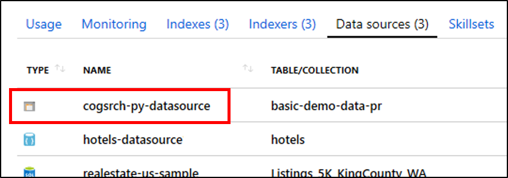
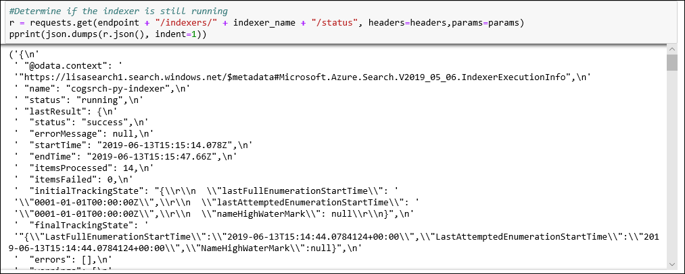
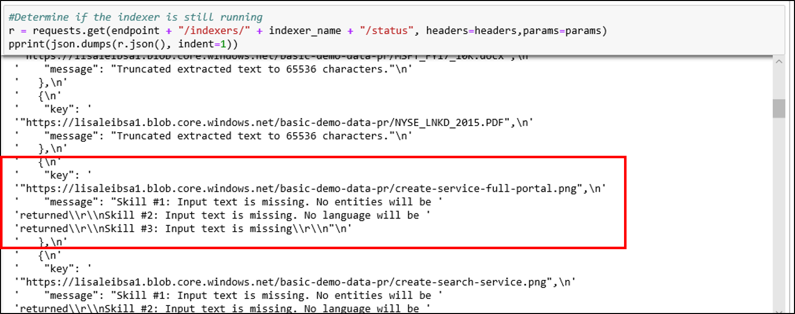
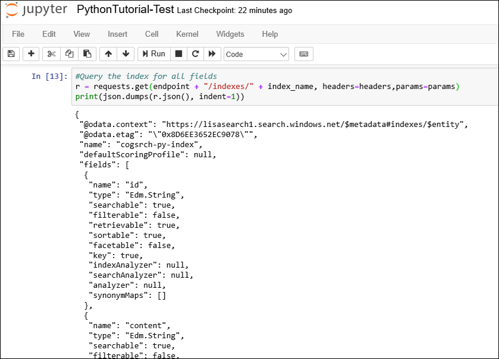

# Python Tutorial: Call Cognitive Services APIs in an Azure Search indexing pipeline

In this tutorial, you learn the mechanics of programming data enrichment in Azure Search using *cognitive skills*. Skills are backed by natural language processing (NLP) and image analysis capabilities in Cognitive Services. Through skillset composition and configuration, you can extract text and text representations of an image or scanned document file. You can also detect language, entities, key phrases, and more. The result is rich additional content in an Azure Search index, created with AI enrichments in an indexing pipeline. 

In this tutorial, you'll use Python to do the following tasks:

> [!div class="checklist"]
> * Create an indexing pipeline that enriches sample data in route to an index
> * Apply built-in skills: entity recognition, language detection, text manipulation, key phrase extraction
> * Learn how to chain skills together by mapping inputs to outputs in a skillset
> * Execute requests and review results
> * Reset the index and indexers for further development

Output is a full text searchable index on Azure Search. You can enhance the index with other standard capabilities, such as [synonyms](search-synonyms.md), [scoring profiles](https://docs.microsoft.com/rest/api/searchservice/add-scoring-profiles-to-a-search-index), [analyzers](search-analyzers.md), and [filters](search-filters.md). 

This tutorial runs on the Free service, but the number of free transactions is limited to 20 documents per day. If you want to run this tutorial more than once in the same day, use a smaller file set so that you can fit in more runs.

> [!NOTE]
> As you expand scope by increasing the frequency of processing, adding more documents, or adding more AI algorithms, you will need to [attach a billable Cognitive Services resource](cognitive-search-attach-cognitive-services.md). Charges accrue when calling APIs in Cognitive Services, and for image extraction as part of the document-cracking stage in Azure Search. There are no charges for text extraction from documents.
>
> Execution of built-in skills is charged at the existing [Cognitive Services pay-as-you go price](https://azure.microsoft.com/pricing/details/cognitive-services/). Image extraction pricing is described on the [Azure Search pricing page](https://go.microsoft.com/fwlink/?linkid=2042400).

If you don't have an Azure subscription, create a [free account](https://azure.microsoft.com/free/?WT.mc_id=A261C142F) before you begin.

## Prerequisites

The following services, tools, and data are used in this tutorial. 

+ [Create an Azure storage account](https://docs.microsoft.com/azure/storage/common/storage-quickstart-create-account) for storing the sample data. Make sure the storage account is in the same region as Azure Search.

+ [Anaconda 3.x](https://www.anaconda.com/distribution/#download-section), providing Python 3.x and Jupyter Notebooks.

+ [Sample data](https://1drv.ms/f/s!As7Oy81M_gVPa-LCb5lC_3hbS-4) consists of a small file set of different types. 

+ [Create an Azure Search service](search-create-service-portal.md) or [find an existing service](https://ms.portal.azure.com/#blade/HubsExtension/BrowseResourceBlade/resourceType/Microsoft.Search%2FsearchServices) under your current subscription. You can use a free service for this tutorial.

## Get a key and URL

To interact with your Azure Search service, you will need the service URL and an access key. A search service is created with both, so if you added Azure Search to your subscription, follow these steps to get the necessary information:

1. [Sign in to the Azure portal](https://portal.azure.com/), and in your search service **Overview** page, get the URL. An example endpoint might look like `https://mydemo.search.windows.net`.

1. In **Settings** > **Keys**, get an admin key for full rights on the service. There are two interchangeable admin keys, provided for business continuity in case you need to roll one over. You can use either the primary or secondary key on requests for adding, modifying, and deleting objects.


All requests require an api-key on every request sent to your service. A valid key establishes trust, on a per request basis, between the application sending the request and the service that handles it.

## Prepare sample data

The enrichment pipeline pulls from Azure data sources. Source data must originate from a supported data source type of an [Azure Search indexer](search-indexer-overview.md). Azure Table Storage is not supported for cognitive search. For this exercise, we use blob storage to showcase multiple content types.

1. [Sign in to the Azure portal](https://portal.azure.com), navigate to your Azure storage account, click **Blobs**, and then click **+ Container**.

1. [Create a Blob container](https://docs.microsoft.com/azure/storage/blobs/storage-quickstart-blobs-portal) to contain sample data. You can set the Public Access Level to any of its valid values.

1. After the container is created, open it and select **Upload** on the command bar to upload the sample files you downloaded in a previous step.

   

1. After sample files are loaded, get the container name and a connection string for your Blob storage. You could do that by navigating to your storage account in the Azure portal. Click **Access keys**, and then copy the **Connection String**  field.

The connection string will have this format:
`DefaultEndpointsProtocol=https;AccountName=<YOUR-STORAGE-ACCOUNT-NAME>;AccountKey=<YOUR-STORAGE-ACCOUNT-KEY>;EndpointSuffix=core.windows.net`

Keep the connection string handy. You will need it in a future step.

There are other ways to specify the connection string, such as providing a shared access signature. To learn more about data source credentials, see [Indexing Azure Blob Storage](search-howto-indexing-azure-blob-storage.md#Credentials).

## Create a Jupyter notebook

> [!Note]
> This article shows you how to build a data source, index, indexer and skillset using a series of Python scripts. To download the complete notebook example, go to the [Azure-Search-python-samples repo](https://github.com/Azure-Samples/azure-search-python-samples/tree/master/Tutorial-AI-Enrichment-Jupyter-Notebook).

Use Anaconda Navigator to launch Jupyter Notebook and create a new Python 3 notebook.

## Connect to Azure Search

In your notebook, run this script to load the libraries used for working with JSON and formulating HTTP requests.

```python
import json
import requests
from pprint import pprint
```

Next, define the names for the data source, index, indexer, and skillset. Run this script to set up the names for this tutorial.

```python
#Define the names for the data source, skillset, index and indexer
datasource_name="cogsrch-py-datasource"
skillset_name="cogsrch-py-skillset"
index_name="cogsrch-py-index"
indexer_name="cogsrch-py-indexer"
```

> [!Tip]
> On a free service, you are limited to three indexes, indexers, and data sources. This tutorial creates one of each. Make sure you have room to create new objects before going any further.

In the following script, replace the placeholders for your search service (YOUR-SEARCH-SERVICE-NAME) and admin API key (YOUR-ADMIN-API-KEY), and then run it to set up the search service endpoint.

```python
#Setup the endpoint
endpoint = 'https://<YOUR-SEARCH-SERVICE-NAME>.search.windows.net/'
headers = {'Content-Type': 'application/json',
        'api-key': '<YOUR-ADMIN-API-KEY>' }
params = {
    'api-version': '2019-05-06'
}
```

## Create a data source

Now that your services and source files are prepared, start assembling the components of your indexing pipeline. Begin with a data source object that tells Azure Search how to retrieve external source data.

In the following script, replace the placeholder YOUR-BLOB-RESOURCE-CONNECTION-STRING with the connection string for the blob you created in the previous step. Then, run the script to create a data source named `cogsrch-py-datasource`.

```python
#Create a data source
datasourceConnectionString = "<YOUR-BLOB-RESOURCE-CONNECTION-STRING>"
datasource_payload = {
    "name": datasource_name,
    "description": "Demo files to demonstrate cognitive search capabilities.",
    "type": "azureblob",
    "credentials": {
    "connectionString": datasourceConnectionString
   },
    "container": {
     "name": "basic-demo-data-pr"
   }
}
r = requests.put( endpoint + "/datasources/" + datasource_name, data=json.dumps(datasource_payload), headers=headers, params=params )
print (r.status_code)
```

The request should return a status code of 201 confirming success.

In the Azure portal, on the search service dashboard page, verify that the cogsrch-py-datasource appears in the **Data sources** list. Click **Refresh** to update the page.



## Create a skillset

In this step, you will define a set of enrichment steps to apply to your data. You call each enrichment step a *skill*, and the set of enrichment steps a *skillset*. This tutorial uses [built-in cognitive skills](cognitive-search-predefined-skills.md) for the skillset:

+ [Language Detection](cognitive-search-skill-language-detection.md) to identify the content's language.

+ [Text Split](cognitive-search-skill-textsplit.md) to break large content into smaller chunks before calling the key phrase extraction skill. Key phrase extraction accepts inputs of 50,000 characters or less. A few of the sample files need splitting up to fit within this limit.

+ [Entity Recognition](cognitive-search-skill-entity-recognition.md) for extracting the names of organizations from content in the blob container.

+ [Key Phrase Extraction](cognitive-search-skill-keyphrases.md) to pull out the top key phrases. 

### Python script
Run the following script to create a skillset called `cogsrch-py-skillset`.

```python
#Create a skillset
skillset_payload = {
  "name": skillset_name,
  "description":
  "Extract entities, detect language and extract key-phrases",
  "skills":
  [
    {
      "@odata.type": "#Microsoft.Skills.Text.EntityRecognitionSkill",
      "categories": [ "Organization" ],
      "defaultLanguageCode": "en",
      "inputs": [
        {
          "name": "text", "source": "/document/content"
        }
      ],
      "outputs": [
        {
          "name": "organizations", "targetName": "organizations"
        }
      ]
    },
    {
      "@odata.type": "#Microsoft.Skills.Text.LanguageDetectionSkill",
      "inputs": [
        {
          "name": "text", "source": "/document/content"
        }
      ],
      "outputs": [
        {
          "name": "languageCode",
          "targetName": "languageCode"
        }
      ]
    },
    {
      "@odata.type": "#Microsoft.Skills.Text.SplitSkill",
      "textSplitMode" : "pages",
      "maximumPageLength": 4000,
      "inputs": [
        {
          "name": "text",
          "source": "/document/content"
        },
        {
          "name": "languageCode",
          "source": "/document/languageCode"
        }
      ],
      "outputs": [
        {
          "name": "textItems",
          "targetName": "pages"
        }
      ]
    },
    {
      "@odata.type": "#Microsoft.Skills.Text.KeyPhraseExtractionSkill",
      "context": "/document/pages/*",
      "inputs": [
        {
          "name": "text", "source": "/document/pages/*"
        },
        {
          "name":"languageCode", "source": "/document/languageCode"
        }
      ],
      "outputs": [
        {
          "name": "keyPhrases",
          "targetName": "keyPhrases"
        }
      ]
    }
  ]
}

r = requests.put(endpoint + "/skillsets/" + skillset_name, data=json.dumps(skillset_payload), headers=headers, params=params)
print(r.status_code)
```

The request should return a status code of 201 confirming success.

The key phrase extraction skill is applied for each page. By setting the context to `"document/pages/*"`, you run this enricher for each member of the document/pages array (for each page in the document).

Each skill executes on the content of the document. During processing, Azure Search cracks each document to read content from different file formats. Text found in the source file is placed into a `content` field, one for each document. Therefore, set the input as `"/document/content"`.

A graphical representation of the skillset is shown below.


Outputs can be mapped to an index, used as input to a downstream skill, or both, as is the case with language code. In the index, a language code is useful for filtering. As an input, language code is used by text analysis skills to inform the linguistic rules around word breaking.

For more information about skillset fundamentals, see [How to define a skillset](cognitive-search-defining-skillset.md).

## Create an index

In this section, you define the index schema by specifying the fields to include in the searchable index, and setting the search attributes for each field. Fields have a type and can take attributes that determine how the field is used (searchable, sortable, and so forth). Field names in an index are not required to identically match the field names in the source. In a later step, you add field mappings in an indexer to connect source-destination fields. For this step, define the index using field naming conventions pertinent to your search application.

This exercise uses the following fields and field types:

| field-names: | id         | content   | languageCode | keyPhrases         | organizations     |
|--------------|----------|-------|----------|--------------------|-------------------|
| field-types: | Edm.String|Edm.String| Edm.String| List<Edm.String>  | List<Edm.String>  |

Run this script to create the index named `cogsrch-py-index`.

```python
#Create an index
index_payload = {
    "name": index_name,
    "fields": [
      {
        "name": "id",
        "type": "Edm.String",
        "key": "true",
        "searchable": "true",
        "filterable": "false",
        "facetable": "false",
        "sortable": "true"
      },
      {
        "name": "content",
        "type": "Edm.String",
        "sortable": "false",
        "searchable": "true",
        "filterable": "false",
        "facetable": "false"
      },
      {
        "name": "languageCode",
        "type": "Edm.String",
        "searchable": "true",
        "filterable": "false",
        "facetable": "false"
      },
      {
        "name": "keyPhrases",
        "type": "Collection(Edm.String)",
        "searchable": "true",
        "filterable": "false",
        "facetable": "false"
      },
      {
        "name": "organizations",
        "type": "Collection(Edm.String)",
        "searchable": "true",
        "sortable": "false",
        "filterable": "false",
        "facetable": "false"
      }
   ]
}

r = requests.put(endpoint + "/indexes/" + index_name, data=json.dumps(index_payload), headers=headers, params=params)
print(r.status_code)
```

The request should return a status code of 201 confirming success.

To learn more about defining an index, see [Create Index (Azure Search REST API)](https://docs.microsoft.com/rest/api/searchservice/create-index).

## Create an indexer, map fields, and execute transformations

So far, you have created a data source, a skillset, and an index. These three components become part of an [indexer](search-indexer-overview.md) that pulls each piece together into a single multi-phased operation. To tie these objects together in an indexer, you must define field mappings.

+ The fieldMappings are processed before the skillset, mapping source fields from the data source to target fields in an index. If field names and types are the same at both ends, no mapping is required.

+ The outputFieldMappings are processed after the skillset, referencing sourceFieldNames that don't exist until document cracking or enrichment creates them. The targetFieldName is a field in an index.

Besides hooking up inputs to outputs, you can also use field mappings to flatten data structures. For more information, see [How to map enriched fields to a searchable index](cognitive-search-output-field-mapping.md).

Run this script to create an indexer named `cogsrch-py-indexer`.

```python
# Create an indexer
indexer_payload = {
    "name": indexer_name,
    "dataSourceName": datasource_name,
    "targetIndexName": index_name,
    "skillsetName": skillset_name,
    "fieldMappings" : [
    {
      "sourceFieldName" : "metadata_storage_path",
      "targetFieldName" : "id",
      "mappingFunction" :
        { "name" : "base64Encode" }
    },
    {
      "sourceFieldName" : "content",
      "targetFieldName" : "content"
    }
  ],
   "outputFieldMappings" :
  [
    {
      "sourceFieldName" : "/document/organizations",
      "targetFieldName" : "organizations"
    },
    {
      "sourceFieldName" : "/document/pages/*/keyPhrases/*",
      "targetFieldName" : "keyPhrases"
    },
    {
      "sourceFieldName": "/document/languageCode",
      "targetFieldName": "languageCode"
    }
  ],
   "parameters":
  {
    "maxFailedItems":-1,
    "maxFailedItemsPerBatch":-1,
    "configuration":
    {
      "dataToExtract": "contentAndMetadata",
      "imageAction": "generateNormalizedImages"
    }
  }
}

r = requests.put(endpoint + "/indexers/" + indexer_name, data=json.dumps(indexer_payload), headers=headers, params=params)
print(r.status_code)
```

The request should quickly return a status code of 201, however, the processing can take several minutes to complete. Although the data set is small, analytical skills, such as image analysis, are computationally intensive and take time.

Use the [Check indexer status](#check-indexer-status) script in the next section to determine when the indexer process is complete.

> [!TIP]
> Creating an indexer invokes the pipeline. If there is a problem accessing the data, mapping inputs and outputs, or with the order of operations, it will appear at this stage. To re-run the pipeline with code or script changes, you may need to delete objects first. For more information, see [Reset and re-run](#reset).

#### Explore the request body

The script sets `"maxFailedItems"`  to -1, which instructs the indexing engine to ignore errors during data import. This is useful because there are so few documents in the demo data source. For a larger data source, you would set the value to greater than 0.

Also notice the `"dataToExtract":"contentAndMetadata"` statement in the configuration parameters. This statement tells the indexer to  extract the content from different file formats and the metadata related to each file.

When content is extracted, you can set `imageAction` to extract text from images found in the data source. The `"imageAction":"generateNormalizedImages"` configuration, combined with the OCR Skill and Text Merge Skill, tells the indexer to extract text from the images (for example, the word "stop" from a traffic Stop sign), and embed it as part of the content field. This behavior applies to both the images embedded in the documents (think of an image inside a PDF)and images found in the data source, for instance a JPG file.

<a name="check-indexer-status"></a>

## Check indexer status

Once the indexer is defined, it runs automatically when you submit the request. Depending on which cognitive skills you defined, indexing can take longer than you expect. To find out whether the indexer  processing is complete, run the following script.

```python
#Get indexer status
r = requests.get(endpoint + "/indexers/" + indexer_name + "/status", headers=headers,params=params)
pprint(json.dumps(r.json(), indent=1))
```

In the response, monitor the "lastResult" for its "status" and "endTime" values. Periodically run the script to check the status. When the indexer has completed, the status will be set to "success", an "endTime" will be specified, and the response will include any errors and warnings that occurred during enrichment.



Warnings are common with some source file and skill combinations and do not always indicate a problem. In this tutorial, the warnings are benign. For example, one of the JPEG files that does not have text will show the warning in this screenshot.



## Query your index

After indexing is finished, run queries that return the contents of individual fields. By default, Azure Search returns the top 50 results. The sample data is small so the default works fine. However, when working with larger data sets, you might need to include parameters in the query string to return more results. For instructions, see [How to page results in Azure Search](search-pagination-page-layout.md).

As a verification step, query the index for all of the fields.

```python
#Query the index for all fields
r = requests.get(endpoint + "/indexes/" + index_name, headers=headers,params=params)
pprint(json.dumps(r.json(), indent=1))
```

The results should look similar to the following example. The screenshot only shows a part of the response.



The output is the index schema, with the name, type, and attributes of each field.

Submit a second query for `"*"` to return all contents of a single field, such as `organizations`.

```python
#Query the index to return the contents of organizations
r = requests.get(endpoint + "/indexes/" + index_name + "/docs?&search=*&$select=organizations", headers=headers, params=params)
pprint(json.dumps(r.json(), indent=1))
```

The results should look similar to the following example. The screenshot only shows a part of the response.


Repeat for additional fields: content, languageCode, keyPhrases, and organizations in this exercise. You can return multiple fields via `$select` using a comma-delimited list.

You can use GET or POST, depending on query string complexity and length. For more information, see [Query using the REST API](https://docs.microsoft.com/rest/api/searchservice/search-documents).
it 
<a name="reset"></a>

## Reset and rerun

In the early experimental stages of pipeline development, the most practical approach for design iterations is to delete the objects from Azure Search and allow your code to rebuild them. Resource names are unique. Deleting an object lets you recreate it using the same name.

To reindex your documents with the new definitions:

1. Delete the index to remove persisted data. Delete the indexer to recreate it on your service.
2. Modify the skillset and index definitions.
3. Recreate an index and indexer on the service to run the pipeline.

You can use the portal to delete indexes, indexers, and skillsets. When you delete the indexer, you can optionally, selectively delete the index, skillset, and data source at the same time.


You can also delete them using a script. The following script will delete the skillset we created. You can easily modify the request to delete the index, indexer, and data source.

```python
#delete the skillset
r = requests.delete(endpoint + "/skillsets/" + skillset_name, headers=headers, params=params)
pprint(json.dumps(r.json(), indent=1))
```

As your code matures, you might want to refine a rebuild strategy. For more information, see [How to rebuild an index](search-howto-reindex.md).

## Takeaways

This tutorial demonstrates the basic steps for building an enriched indexing pipeline through the creation of component parts: a data source, skillset, index, and indexer.

[Predefined skills](cognitive-search-predefined-skills.md) were introduced, along with skillset definitions and a way to chain skills together through inputs and outputs. You also learned that `outputFieldMappings` in the indexer definition is required for routing enriched values from the pipeline into a searchable index on an Azure Search service.

Finally, you learned how to test the results and reset the system for further iterations. You learned that issuing queries against the index returns the output created by the enriched indexing pipeline. In this release, there is a mechanism for viewing internal constructs (enriched documents created by the system). You also learned how to check the indexer status and what  objects must be deleted before rerunning a pipeline.

## Clean up resources

The fastest way to clean up after a tutorial is by deleting the resource group containing the Azure Search service and Azure Blob service. Assuming you put both services in the same group, delete the resource group to permanently delete everything in it, including the services and any stored content that you created for this tutorial. In the portal, the resource group name is on the Overview page of each service.

## Next steps

Customize or extend the pipeline with custom skills. Creating a custom skill and adding it to a skillset allows you to onboard text or image analysis that you write yourself.

> [!div class="nextstepaction"]
> [Example: Creating a custom skill for cognitive search](cognitive-search-create-custom-skill-example.md)
