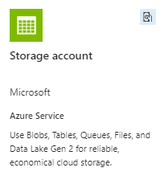
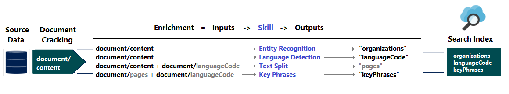
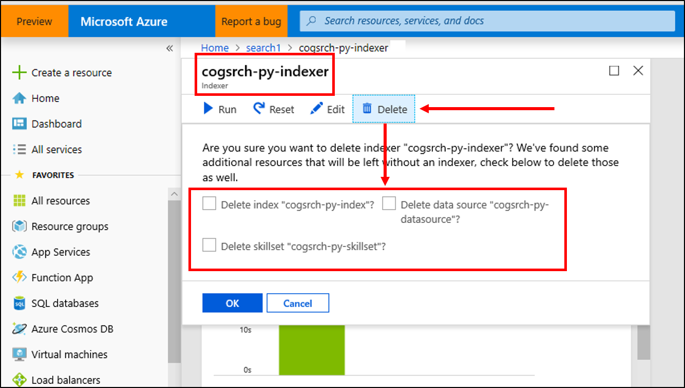

# Tutorial: Use REST and AI to generate searchable content from Azure blobs

If you have unstructured text or images in Azure Blob Storage, an [AI enrichment pipeline](cognitive-search-concept-intro.md) can extract information and create new content for full-text search or knowledge mining scenarios.

In this REST tutorial, you'll learn how to:

> [!div class="checklist"]
> * Set up a development environment.
> * Define a pipeline that uses OCR, language detection, entity recognition, and key phrase extraction.
> * Execute the pipeline to invoke transformations, and to create and load a search index.
> * Explore results using full text search and a rich query syntax.

If you don't have an Azure subscription, open a [free account](https://azure.microsoft.com/free/?WT.mc_id=A261C142F) before you begin.

## Overview

This tutorial uses Postman and the [Azure AI Search REST APIs](/rest/api/searchservice/) to create a data source, index, indexer, and skillset.

The indexer connects to Azure Blob Storage and retrieves the content, which you must load in advance. The indexer then invokes a [skillset](cognitive-search-working-with-skillsets.md) for specialized processing, and ingests the enriched content into a [search index](search-what-is-an-index.md).

The skillset is attached to an [indexer](search-indexer-overview.md). It uses built-in skills from Microsoft to find and extract information. Steps in the pipeline include Optical Character Recognition (OCR) on images, language detection, key phrase extraction, and entity recognition (organizations, locations, people). New information created by the pipeline is stored in new fields in an index. Once the index is populated, you can use those fields in queries, facets, and filters.

## Prerequisites

* [Postman app](https://www.postman.com/downloads/)
* [Azure Storage](https://azure.microsoft.com/services/storage/)
* [Azure AI Search](https://azure.microsoft.com/services/search/)
* [Sample data](https://github.com/Azure-Samples/azure-search-sample-data/tree/master/ai-enrichment-mixed-media)

> [!NOTE]
> You can use the free service for this tutorial. A free search service limits you to three indexes, three indexers, and three data sources. This tutorial creates one of each. Before starting, make sure you have room on your service to accept the new resources.

## Download files

The sample data consists of 14 files of mixed content type that you'll upload to Azure Blob Storage in a later step.

1. Get the files from [azure-search-sample-data/ai-enrichment-mixed-media/](https://github.com/Azure-Samples/azure-search-sample-data/tree/master/ai-enrichment-mixed-media) and copy them to your local computer.

1. Next, get the source code, a Postman collection file, for this tutorial. Source code can be found at [azure-search-postman-samples/tree/master/Tutorial](https://github.com/Azure-Samples/azure-search-postman-samples/tree/master/Tutorial).

## 1 - Create services

This tutorial uses Azure AI Search for indexing and queries, Azure AI services on the backend for AI enrichment, and Azure Blob Storage to provide the data. This tutorial stays under the free allocation of 20 transactions per indexer per day on Azure AI services, so the only services you need to create are search and storage.

If possible, create both in the same region and resource group for proximity and manageability. In practice, your Azure Storage account can be in any region.

### Start with Azure Storage

1. Sign in to the [Azure portal](https://portal.azure.com) and select **+ Create Resource**.

1. Search for *storage account* and select Microsoft's Storage Account offering.

   

1. In the Basics tab, the following items are required. Accept the defaults for everything else.

   + **Resource group**. Select an existing one or create a new one, but use the same group for all services so that you can manage them collectively.

   + **Storage account name**. If you think you might have multiple resources of the same type, use the name to disambiguate by type and region, for example *blobstoragewestus*.

   + **Location**. If possible, choose the same location used for Azure AI Search and Azure AI services. A single location voids bandwidth charges.

   + **Account Kind**. Choose the default, *StorageV2 (general purpose v2)*.

1. Select **Review + Create** to create the service.

1. Once it's created, select **Go to the resource** to open the Overview page.

1. Select **Blobs** service.

1. Select **+ Container** to create a container and name it *cog-search-demo*.

1. Select *cog-search-demo* and then select **Upload** to open the folder where you saved the download files. Select all of the files. Select **Upload**.

   :::image type="content" source="media/cognitive-search-tutorial-blob/sample-files.png" alt-text="Screenshot of the files in File Explorer." border="true":::

1. Before you leave Azure Storage, get a connection string so that you can formulate a connection in Azure AI Search.

   1. Browse back to the Overview page of your storage account (we used *blobstragewestus* as an example).

   1. In the left navigation pane, select **Access keys** and copy one of the connection strings.

   The connection string is a URL similar to the following example:

      ```http
      DefaultEndpointsProtocol=https;AccountName=cogsrchdemostorage;AccountKey=<your account key>;EndpointSuffix=core.windows.net
      ```

1. Save the connection string to Notepad. You'll need it later when setting up the data source connection.

### Azure AI services

AI enrichment is backed by Azure AI services, including Language service and Azure AI Vision for natural language and image processing. If your objective was to complete an actual prototype or project, you would at this point provision Azure AI services (in the same region as Azure AI Search) so that you can [attach it to a skillset](cognitive-search-attach-cognitive-services.md).

For this exercise, however, you can skip resource provisioning because Azure AI Search can connect to Azure AI services execute 20 transactions per indexer run, free of charge. Since this tutorial uses 14 transactions, the free allocation is sufficient. For larger projects, plan on provisioning Azure AI services at the pay-as-you-go S0 tier.

### Azure AI Search

The third component is Azure AI Search, which you can [create in the portal](search-create-service-portal.md) or [find an existing search service](https://portal.azure.com/#blade/HubsExtension/BrowseResourceBlade/resourceType/Microsoft.Search%2FsearchServices) in your subscription.

You can use the Free tier to complete this walkthrough.

### Copy an admin api-key and URL for Azure AI Search

To interact with your Azure AI Search service you'll need the service URL and an access key.

1. Sign in to the [Azure portal](https://portal.azure.com), and in your search service **Overview** page, get the name of your search service. You can confirm your service name by reviewing the endpoint URL. If your endpoint URL were `https://mydemo.search.windows.net`, your service name would be `mydemo`.

1. In **Settings** > **Keys**, get an admin key for full rights on the service. You can copy either the primary or secondary key.

   

All HTTP requests to a search service require an API key. A valid key establishes trust, on a per request basis, between the application sending the request and the service that handles it.

## 2 - Set up Postman

1. Start Postman, import the collection, and set up the environment variables. If you're unfamiliar with this tool, see [Explore Azure AI Search REST APIs](search-get-started-rest.md).

1. You'll need to provide a search service name, an admin API key, an index name, a connection string to your Azure Storage account, and the container name.

   :::image type="content" source="media/cognitive-search-tutorial-blob/postman-setup.png" alt-text="Screenshot of the Variables page in Postman." border="true":::

The request methods used in this collection are **PUT** and **GET**. You'll use the methods to create a data source, a skillset, an index, and an indexer.

## 3 - Create the pipeline

In Azure AI Search, enrichment occurs during indexing (or data ingestion). This part of the walkthrough creates four objects: data source, index definition, skillset, indexer.

### Step 1: Create a data source

Call [Create Data Source](/rest/api/searchservice/create-data-source) to set the connection string to the Blob container containing the sample data files.

1. Select the "Create a data source" request.

1. The body of the request is JSON and includes properties of an indexer data source object. The connection string includes credentials for accessing the service.

    ```json
    {
        "description" : "Demo files to demonstrate Azure AI Search capabilities.",
        "type" : "azureblob",
        "credentials" : {
           "connectionString": "{{azure_storage_connection_string}}"
        },
      "container" : {
        "name" : "{{container_name}}"
      }
    }
    ```

1. Send the request. You should see a status code of 201 confirming success.

If you got a 403 or 404 error, check the search admin API key and the Azure Storage connection string.

### Step 2: Create a skillset

Call [Create Skillset](/rest/api/searchservice/create-skillset) to specify which enrichment steps are applied to your content.

1. Select the "Create a skillset" request.

1. The body of the request specifies the following built-in skills:

   | Skill                 | Description    |
   |-----------------------|----------------|
   | [Optical Character Recognition](cognitive-search-skill-ocr.md) | Recognizes text and numbers in image files. |
   | [Text Merge](cognitive-search-skill-textmerger.md)  | Creates "merged content" that recombines previously separated content, useful for documents with embedded images (PDF, DOCX, and so forth). Images and text are separated during the document cracking phase. The merge skill recombines them by inserting any recognized text, image captions, or tags created during enrichment into the same location where the image was extracted from in the document. </p>When you're working with merged content in a skillset, this node will be inclusive of all text in the document, including text-only documents that never undergo OCR or image analysis. |
   | [Language Detection](cognitive-search-skill-language-detection.md) | Detects the language and outputs either a language name or code. In multilingual data sets, a language field can be useful for filters. |
   | [Entity Recognition](cognitive-search-skill-entity-recognition-v3.md) | Extracts the names of people, organizations, and locations from merged content. |
   | [Text Split](cognitive-search-skill-textsplit.md)  | Breaks large merged content into smaller chunks before calling the key phrase extraction skill. Key phrase extraction accepts inputs of 50,000 characters or less. A few of the sample files need splitting up to fit within this limit. |
   | [Key Phrase Extraction](cognitive-search-skill-keyphrases.md) | Pulls out the top key phrases.|

   Each skill executes on the content of the document. During processing, Azure AI Search cracks each document to read content from different file formats. Found text originating in the source file is placed into a generated `content` field, one for each document. As such, the input becomes `"/document/content"`.

   For key phrase extraction, because we use the text splitter skill to break larger files into pages, the context for the key phrase extraction skill is `"document/pages/*"` (for each page in the document) instead of `"/document/content"`.

    ```json
    {
      "description": "Apply OCR, detect language, extract entities, and extract key-phrases.",
      "cognitiveServices": null,
      "skills":
      [
        {
          "@odata.type": "#Microsoft.Skills.Vision.OcrSkill",
          "context": "/document/normalized_images/*",
          "defaultLanguageCode": "en",
          "detectOrientation": true,
          "inputs": [
            {
              "name": "image",
              "source": "/document/normalized_images/*"
            }
          ],
          "outputs": [
            {
              "name": "text"
            }
          ]
        },
        {
          "@odata.type": "#Microsoft.Skills.Text.MergeSkill",
          "description": "Create merged_text, which includes all the textual representation of each image inserted at the right location in the content field. This is useful for PDF and other file formats that supported embedded images.",
          "context": "/document",
          "insertPreTag": " ",
          "insertPostTag": " ",
          "inputs": [
            {
              "name":"text",
              "source": "/document/content"
            },
            {
              "name": "itemsToInsert",
              "source": "/document/normalized_images/*/text"
            },
            {
              "name":"offsets",
              "source": "/document/normalized_images/*/contentOffset"
            }
          ],
          "outputs": [
            {
              "name": "mergedText",
              "targetName" : "merged_text"
            }
          ]
        },
        {
          "@odata.type": "#Microsoft.Skills.Text.SplitSkill",
          "textSplitMode": "pages",
          "maximumPageLength": 4000,
          "defaultLanguageCode": "en",
          "context": "/document",
          "inputs": [
            {
              "name": "text",
              "source": "/document/merged_text"
            }
          ],
          "outputs": [
            {
              "name": "textItems",
              "targetName": "pages"
            }
          ]
        },
        {
          "@odata.type": "#Microsoft.Skills.Text.LanguageDetectionSkill",
          "description": "If you have multilingual content, adding a language code is useful for filtering",
          "context": "/document",
          "inputs": [
            {
              "name": "text",
              "source": "/document/merged_text"
            }
          ],
          "outputs": [
            {
              "name": "languageName",
              "targetName": "language"
            }
          ]
        },
        {
          "@odata.type": "#Microsoft.Skills.Text.KeyPhraseExtractionSkill",
          "context": "/document/pages/*",
          "inputs": [
            {
              "name": "text",
              "source": "/document/pages/*"
            }
          ],
          "outputs": [
            {
              "name": "keyPhrases",
              "targetName": "keyPhrases"
            }
          ]
        },
        {
          "@odata.type": "#Microsoft.Skills.Text.V3.EntityRecognitionSkill",
          "categories": ["Organization"],
          "context": "/document",
          "inputs": [
            {
              "name": "text",
              "source": "/document/merged_text"
            }
          ],
          "outputs": [
            {
              "name": "organizations",
              "targetName": "organizations"
            }
          ]
        },
        {
          "@odata.type": "#Microsoft.Skills.Text.V3.EntityRecognitionSkill",
          "categories": ["Location"],
          "context": "/document",
          "inputs": [
            {
              "name": "text",
              "source": "/document/merged_text"
            }
          ],
          "outputs": [
            {
              "name": "locations",
              "targetName": "locations"
            }
          ]
        },
        {
          "@odata.type": "#Microsoft.Skills.Text.V3.EntityRecognitionSkill",
          "categories": ["Person"],
          "context": "/document",
          "inputs": [
            {
              "name": "text",
              "source": "/document/merged_text"
            }
          ],
          "outputs": [
            {
              "name": "persons",
              "targetName": "persons"
            }
          ]
        }
      ]
    }
    ```

    A graphical representation of a portion of the skillset is shown below.

    

1. Send the request. Postman should return a status code of 201 confirming success.

> [!NOTE]
> Outputs can be mapped to an index, used as input to a downstream skill, or both as is the case with language code. In the index, a language code is useful for filtering. For more information about skillset fundamentals, see [How to define a skillset](cognitive-search-defining-skillset.md).

### Step 3: Create an index

Call [Create Index](/rest/api/searchservice/create-index) to provide the schema used to create inverted indexes and other constructs in Azure AI Search. The largest component of an index is the fields collection, where data type and attributes determine content and behavior in Azure AI Search.

1. Select the "Create an index" request.

1. The body of the request defines the schema of the search index. A fields collection requires one field to be designated as the key. For blob content, this field is often the "metadata_storage_path" that uniquely identifies each blob in the container.

   In this schema, the "text" field receives OCR output, "content" receives merged output, "language" receives language detection output. Key phrases, entities, and several fields lifted from blob storage comprise the remaining entries.

    ```json
    {
      "fields": [
        {
          "name": "text",
          "type": "Collection(Edm.String)",
          "searchable": true,
          "sortable": false,
          "filterable": true,
          "facetable": false
        },
        {
          "name": "content",
          "type": "Edm.String",
          "searchable": true,
          "sortable": false,
          "filterable": false,
          "facetable": false
        },
        {
          "name": "language",
          "type": "Edm.String",
          "searchable": false,
          "sortable": true,
          "filterable": true,
          "facetable": false
        },
        {
          "name": "keyPhrases",
          "type": "Collection(Edm.String)",
          "searchable": true,
          "sortable": false,
          "filterable": true,
          "facetable": true
        },
        {
          "name": "organizations",
          "type": "Collection(Edm.String)",
          "searchable": true,
          "sortable": false,
          "filterable": true,
          "facetable": true
        },
        {
          "name": "persons",
          "type": "Collection(Edm.String)",
          "searchable": true,
          "sortable": false,
          "filterable": true,
          "facetable": true
        },
        {
          "name": "locations",
          "type": "Collection(Edm.String)",
          "searchable": true,
          "sortable": false,
          "filterable": true,
          "facetable": true
        },
        {
          "name": "metadata_storage_path",
          "type": "Edm.String",
          "key": true,
          "searchable": true,
          "sortable": false,
          "filterable": false,
          "facetable": false
        },
        {
          "name": "metadata_storage_name",
          "type": "Edm.String",
          "searchable": true,
          "sortable": false,
          "filterable": false,
          "facetable": false
        }
      ]
    }
    ```

1. Send the request. Postman should return a status code of 201 confirming success.

### Step 4: Create and run an indexer

Call [Create Indexer](/rest/api/searchservice/create-indexer) to drive the pipeline. The three components you have created thus far (data source, skillset, index) are inputs to an indexer. Creating the indexer on Azure AI Search is the event that puts the entire pipeline into motion.

1. Select the "Create an indexer" request.

1. The body of the request includes references to the previous objects, configuration properties required for image processing, and two types of field mappings.

   `"fieldMappings"` are processed before the skillset, sending content from the data source to target fields in an index. You'll use field mappings to send existing, unmodified content to the index. If field names and types are the same at both ends, no mapping is required.

   `"outputFieldMappings"` are for fields created by skills, after skillset execution. The references to `sourceFieldName` in `outputFieldMappings` don't exist until document cracking or enrichment creates them. The `targetFieldName` is a field in an index, defined in the index schema.

    ```json
    {
      "dataSourceName" : "{{index_name}}-datasource",
      "targetIndexName" : "{{index_name}}",
      "skillsetName" : "{{index_name}}-skillset",
      "fieldMappings" : [
            {
              "sourceFieldName" : "metadata_storage_path",
              "targetFieldName" : "metadata_storage_path",
              "mappingFunction" : { "name" : "base64Encode" }
            },
            {
              "sourceFieldName": "metadata_storage_name",
              "targetFieldName": "metadata_storage_name"
            }
       ],
      "outputFieldMappings" :
      [
        {
              "sourceFieldName": "/document/merged_text",
              "targetFieldName": "content"
            },
            {
                "sourceFieldName" : "/document/normalized_images/*/text",
                "targetFieldName" : "text"
            },
          {
              "sourceFieldName" : "/document/organizations",
              "targetFieldName" : "organizations"
            },
            {
              "sourceFieldName": "/document/language",
              "targetFieldName": "language"
            },
          {
              "sourceFieldName" : "/document/persons",
              "targetFieldName" : "persons"
            },
          {
              "sourceFieldName" : "/document/locations",
              "targetFieldName" : "locations"
            },
            {
              "sourceFieldName" : "/document/pages/*/keyPhrases/*",
              "targetFieldName" : "keyPhrases"
            }
        ],
      "parameters":
      {
      "batchSize": 1,
        "maxFailedItems":-1,
        "maxFailedItemsPerBatch":-1,
        "configuration":
      {
          "dataToExtract": "contentAndMetadata",
          "imageAction": "generateNormalizedImages"
      }
      }
    }
    ```

1. Send the request. Postman should return a status code of 201 confirming successful processing.

   Expect this step to take several minutes to complete. Even though the data set is small, analytical skills are computation-intensive.

> [!NOTE]
> Creating an indexer invokes the pipeline. If there are problems reaching the data, mapping inputs and outputs, or order of operations, they appear at this stage. To re-run the pipeline with code or script changes, you might need to drop objects first. For more information, see [Reset and re-run](#reset).

#### About indexer parameters

The script sets ```"maxFailedItems"```  to -1, which instructs the indexing engine to ignore errors during data import. This is acceptable because there are so few documents in the demo data source. For a larger data source, you would set the value to greater than 0.

The ```"dataToExtract":"contentAndMetadata"``` statement tells the indexer to automatically extract the values from the blob's content property and the metadata of each object.

When content is extracted, you can set ```imageAction``` to extract text from images found in the data source. The ```"imageAction":"generateNormalizedImages"``` configuration, combined with the OCR Skill and Text Merge Skill, tells the indexer to extract text from the images (for example, the word "stop" from a traffic Stop sign), and embed it as part of the content field. This behavior applies to both embedded images (think of an image inside a PDF) and standalone image files, for instance a JPG file.

## 4 - Monitor indexing

Indexing and enrichment commence as soon as you submit the Create Indexer request. Depending on which cognitive skills you defined, indexing can take a while.

To find out whether the indexer is still running, call [Get Indexer Status](/rest/api/searchservice/get-indexer-status) to check the indexer status.

1. Select and then send the "Check indexer status" request.

1. Review the response to learn whether the indexer is running, or to view error and warning information.

Warnings are common in some scenarios and do not always indicate a problem. For example, if a blob container includes image files, and the pipeline doesn't handle images, you'll get a warning stating that images were not processed.

In this sample, there is a PNG file that contains no text. All five of the text-based skills (language detection, entity recognition of locations, organizations, people, and key phrase extraction) fail to execute on this file. The resulting notification shows up in execution history.

## 5 - Search

Now that you've created an index that contains AI-generated content, call [Search Documents](/rest/api/searchservice/search-documents) to run some queries to see the results.

Recall that we started with blob content, where the entire document is packaged into a single `content` field. You can search this field and find matches to your queries.

1. Open the "Search" request and run it to get your first look at index content. This request is an empty search ("search=*") so it will return content for each of the 14 documents. The $select parameter constrains results to the file name, the language name, and one of the recognized entities.

   ```http
    GET /indexes//{{index_name}}/docs?search=*&$select=metadata_storage_name,language,organizations&$count=true&api-version=2020-06-30
   ```

1. Revise the previous query to search for "creating boundaryless opportunities". This phrase was obtained through OCR of an embedded image file in a PDF document. Include "highlight" to apply formatting on matching terms in densely populated fields.

   ```http
    GET /indexes//{{index_name}}/docs?search=creating boundaryless opportunities&$select=content&highlight=content&$count=true&api-version=2020-06-30
   ```

1. For the next query, apply a filter. Recall that the language field and all entity fields are filterable.

   ```http
    GET /indexes/{{index_name}}/docs?search=*&$filter=organizations/any(organizations: organizations eq 'Microsoft')&$select=metadata_storage_name,organizations&$count=true&api-version=2020-06-30
   ```

These queries illustrate a few of the ways you can work with query syntax and filters on new fields created by Azure AI Search. For more query examples, see [Examples in Search Documents REST API](/rest/api/searchservice/search-documents#bkmk_examples), [Simple syntax query examples](search-query-simple-examples.md), and [Full Lucene query examples](search-query-lucene-examples.md).

<a name="reset"></a>

## Reset and rerun

During early stages of development, iteration over the design is common. You will most likely delete and rebuild the same objects frequently.

If you use the portal for deletion, and delete the indexer first, the portal will prompt you to delete the associated objects.



Alternatively, you can use **DELETE** and provide URLs to each object. The following command deletes an indexer.

```http
DELETE https://[YOUR-SERVICE-NAME].search.windows.net/indexers/cog-search-demo-idxr?api-version=2020-06-30
```

Status code 204 is returned on successful deletion.

## Takeaways

This tutorial demonstrates the basic steps for building an enriched indexing pipeline through the creation of component parts: a data source, skillset, index, and indexer.

[Built-in skills](cognitive-search-predefined-skills.md) were introduced, along with skillset definition and the mechanics of chaining skills together through inputs and outputs. You also learned that `outputFieldMappings` in the indexer definition is required for routing enriched values from the pipeline into a searchable index on an Azure AI Search service.

Finally, you learned how to test results and reset the system for further iterations. You learned that issuing queries against the index returns the output created by the enriched indexing pipeline.

## Clean up resources

When you're working in your own subscription, at the end of a project, it's a good idea to remove the resources that you no longer need. Resources left running can cost you money. You can delete resources individually or delete the resource group to delete the entire set of resources.

You can find and manage resources in the portal, using the All resources or Resource groups link in the left-navigation pane.

## Next steps

Now that you're familiar with all of the objects in an AI enrichment pipeline, let's take a closer look at skillset definitions and individual skills.

> [!div class="nextstepaction"]
> [How to create a skillset](cognitive-search-defining-skillset.md)
