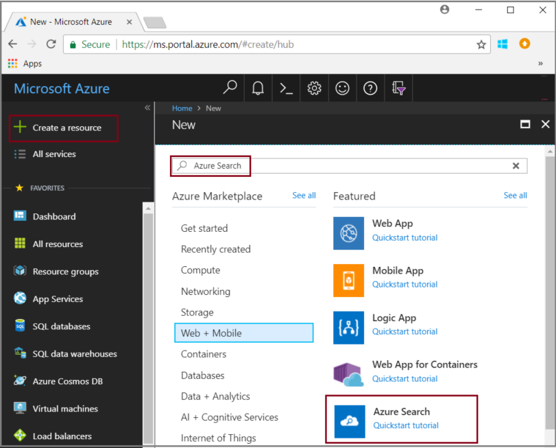
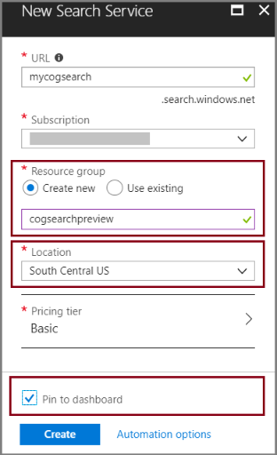
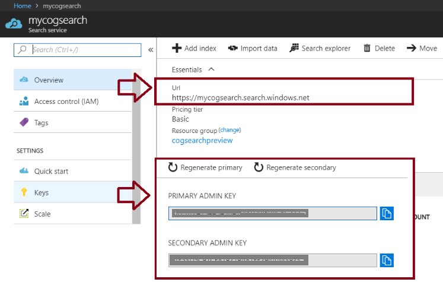

# Tutorial: Learn how to call cognitive search APIs (Preview)

In this tutorial, you learn the mechanics of programming data enrichment in Azure Search using *cognitive skills*. Cognitive skills are natural language processing (NLP) and image analysis operations that extract text and text representations of an image, detect language, entities, key phrases, and more. The end result is rich additional content in an Azure Search index, created by a cognitive search indexing pipeline. 

In this tutorial, you make REST API calls to perform following tasks:

> [!div class="checklist"]
> * Create an indexing pipeline that enriches sample data in route to an index
> * Apply built-in skills: entity recognition, language detection, text manipulation, key phrase extraction
> * Learn how to chain skills together by mapping inputs to outputs in a skillset
> * Execute requests and review results
> * Reset the index and indexers for further development

Output is a full text searchable index on Azure Search. You can enhance the index with other standard capabilities, such as [synonyms](search-synonyms.md), [scoring profiles](https://docs.microsoft.com/rest/api/searchservice/add-scoring-profiles-to-a-search-index), [analyzers](search-analyzers.md), and [filters](search-filters.md).

If you don't have an Azure subscription, create a [free account](https://azure.microsoft.com/free/?WT.mc_id=A261C142F) before you begin.

> [!NOTE]
> Cognitive Search is in public preview. Skillset execution, and image extraction and normalization are currently offered for free. At a later time, the pricing for these capabilities will be announced. 

## Prerequisites

New to cognitive search? Read ["What is cognitive search?"](cognitive-search-concept-intro.md) to get acquainted, or try the [portal quickstart](cognitive-search-quickstart-blob.md) for a hands-on introduction to important concepts.

To make REST calls to Azure Search, use PowerShell or a web test tool like Telerik Fiddler or Postman to formulate HTTP requests. If these tools are new to you, see [Explore Azure Search REST APIs using Fiddler or Postman](search-fiddler.md).

Use the [Azure portal](https://portal.azure.com/) to create services used in an end-to-end workflow. 

### Set up Azure Search

First, sign up for the Azure Search service. 

1. Go to the [Azure portal](https://portal.azure.com) and sign in by using your Azure account.

1. Click **Create a resource**, search for Azure Search, and click **Create**. See [Create an Azure Search service in the portal](search-create-service-portal.md) if you are setting up a search service for the first time.

  

1. For Resource group, create a resource group to contain all the resources you create in this tutorial. This makes it easier to clean up the resources after you have finished the tutorial.

1. For Location, choose either **South Central US** or **West Europe**. Currently, the preview is available only in these regions.

1. For Pricing tier, you can create a **Free** service to complete tutorials and quickstarts. For deeper investigation using your own data, create a [paid service](https://azure.microsoft.com/pricing/details/search/) such as **Basic** or **Standard**. 

  A Free service is limited to 3 indexes, 16 MB maximum blob size, and 2 minutes of indexing, which is insufficient for exercising the full capabilities of cognitive search. To review limits for different tiers, see [Service Limits](search-limits-quotas-capacity.md).

  > [!NOTE]
  > Cognitive search is in public preview. Skillset execution is currently available in all tiers, including free. At a later time, the pricing for this capability will be announced.

1. Pin the service to the dashboard for fast access to service information.

  

1. After the service is created, collect the following information: **URL** from the Overview page, and **api-key** (either primary or secondary) from the Keys page.

  

### Set up Azure Blob service and load sample data

The enrichment pipeline pulls from Azure data sources. Source data must originate from a supported data source type of an [Azure Search indexer](search-indexer-overview.md). For this exercise, we use blob storage to showcase multiple content types.

1. [Download sample data](https://1drv.ms/f/s!As7Oy81M_gVPa-LCb5lC_3hbS-4). Sample data consists of a small file set of different types. 

1. Sign up for Azure Blob storage, create a storage account, sign in to Storage Explorer, and create a container named `basicdemo`. See [Azure Storage Explorer Quickstart](../storage/blobs/storage-quickstart-blobs-storage-explorer.md) for instructions on all the steps.

1. Using the Azure Storage Explorer, in the `basicdemo` container you created, click **Upload** to upload the sample files.

1. After sample files are loaded, get the container name and a connection string for your Blob storage. You could do that by navigating to your storage account in the Azure portal. On **Access keys**, and then copy the **Connection String**  field.

  The connection string should be a URL similar to the following example:

      ```http
      DefaultEndpointsProtocol=https;AccountName=cogsrchdemostorage;AccountKey=<your account key>;EndpointSuffix=core.windows.net
      ```

There are other ways to specify the connection string, such as providing a shared access signature. To learn more about data source credentials, see [Indexing Azure Blob Storage](search-howto-indexing-azure-blob-storage.md#Credentials).

## Create a data source

Now that your services and source files are prepared, start assembling the components of your indexing pipeline. Begin with a [data source object](https://docs.microsoft.com/rest/api/searchservice/create-data-source) that tells Azure Search how to retrieve external source data.

For this tutorial, use the REST API and a tool that can formulate and send HTTP requests, such as PowerShell, Postman, or Fiddler. In the request header, provide the service name you used while creating the Azure Search service, and the api-key generated for your search service. In the request body, specify the blob container name and connection string.

### Sample Request
```http
POST https://[service name].search.windows.net/datasources?api-version=2017-11-11-Preview
Content-Type: application/json  
api-key: [admin key]  
```
#### Request Body Syntax
```json
{   
    "name" : "demodata",  
    "description" : "Demo files to demonstrate cognitive search capabilities.",  
    "type" : "azureblob",
    "credentials" :
    { "connectionString" :
      "DefaultEndpointsProtocol=https;AccountName=<your account name>;AccountKey=<your account key>;"
    },  
    "container" : { "name" : "<your blob container name>" }
}  
```
Send the request. The web test tool should return a status code of 201 confirming success. 

Since this is your first request, check the Azure portal to confirm the data source was created in Azure Search. On the search service dashboard page, verify the Data Sources tile has a new item. You might need to wait a few minutes for the portal page to refresh. 

  

If you got a 403 or 404 error, check the request construction: `api-version=2017-11-11-Preview` should be on the endpoint, `api-key` should be in the Header after `Content-Type`, and its value must be valid for a search service. You can reuse the header for the remaining steps in this tutorial.

> [!TIP]
> Now, before you do a lot of work, is a good time to verify that the search service is running in one of the supported locations providing the preview feature: South Central US or West Europe.

## Create a skillset

In this step, you define a set of enrichment steps that you want to apply to your data. You call each enrichment step a *skill*, and the set of enrichment steps a *skillset*. This tutorial uses [predefined cognitive skills](cognitive-search-predefined-skills.md) for the skillset:

+ [Language Detection](cognitive-search-skill-language-detection.md) to identify the content's language.

+ [Text Split](cognitive-search-skill-textsplit.md) to break large content into smaller chunks before calling the key phrase extraction skill. Key phrase extraction accepts inputs of 50,000 characters or less. A few of the sample files need splitting up to fit within this limit.

+ [Named Entity Recognition](cognitive-search-skill-named-entity-recognition.md) for extracting the names of organizations from content in the blob container.

+ [Key Phrase Extraction](cognitive-search-skill-keyphrases.md) to pull out the top key phrases. 

### Sample Request
Before you make this REST call, remember to replace the service name and the admin key in the request below if your tool does not preserve the request header between calls. 

This request creates a skillset. Reference the skillset name ```demoskillset``` for the rest of this tutorial.

```http
PUT https://[servicename].search.windows.net/skillsets/demoskillset?api-version=2017-11-11-Preview
api-key: [admin key]
Content-Type: application/json
```
#### Request Body Syntax
```json
{
  "description": 
  "Extract entities, detect language and extract key-phrases",
  "skills":
  [
    {
      "@odata.type": "#Microsoft.Skills.Text.NamedEntityRecognitionSkill",
      "categories": [ "Organization" ],
      "defaultLanguageCode": "en",
      "inputs": [
        {
          "name": "text", "source": "/document/content"
        }
      ],
      "outputs": [
        {
          "name": "organizations", "targetName": "organizations"
        }
      ]
    },
    {
      "@odata.type": "#Microsoft.Skills.Text.LanguageDetectionSkill",
      "inputs": [
        {
          "name": "text", "source": "/document/content"
        }
      ],
      "outputs": [
        {
          "name": "languageCode",
          "targetName": "languageCode"
        }
      ]
    },
    {
      "@odata.type": "#Microsoft.Skills.Text.SplitSkill",
      "textSplitMode" : "pages", 
      "maximumPageLength": 4000,
      "inputs": [
      {
        "name": "text",
        "source": "/document/content"
      },
      { 
        "name": "languageCode",
        "source": "/document/languageCode"
      }
    ],
    "outputs": [
      {
            "name": "textItems",
            "targetName": "pages"
      }
    ]
  },
  {
      "@odata.type": "#Microsoft.Skills.Text.KeyPhraseExtractionSkill",
      "context": "/document/pages/*",
      "inputs": [
        {
          "name": "text", "source": "/document/pages/*"
        },
        {
          "name":"languageCode", "source": "/document/languageCode"
        }
      ],
      "outputs": [
        {
          "name": "keyPhrases",
          "targetName": "keyPhrases"
        }
      ]
    }
  ]
}
```

Send the request. The web test tool should return a status code of 201 confirming success. 

#### About the request

Notice how the key phrase extraction skill is applied for each page. By setting the context to ```"document/pages/*"``` you run this enricher for each member of the document/pages array (for each page in the document).

Each skill executes on the content of the document. During processing, Azure Search cracks each document to read content from different file formats. Found text originating in the source file is placed into a generated ```content``` field, one for each document. As such, set the input as ```"/document/content"```.

A graphical representation of the skillset is shown below. 


Outputs can be mapped to an index, used as input to a downstream skill, or both as is the case with language code. In the index, a language code is useful for filtering. As an input, language code is used by text analysis skills to inform the linguistic rules around word breaking.

For more information about skillset fundamentals, see [How to define a skillset](cognitive-search-defining-skillset.md).

## Create an index

In this section, you define the index schema by specifying which fields to include in the searchable index, and the search attributes for each field. Fields have a type and can take attributes that determine how the field is used (searchable, sortable, and so forth). Field names in an index are not required to identically match the field names in the source. In a later step, you add field mappings in an indexer to connect source-destination fields. For this step, define the index using field naming conventions pertinent to your search application.

This exercise uses the following fields and field types:

| field-names: | id       | content   | languageCode | keyPhrases         | organizations     |
|--------------|----------|-------|----------|--------------------|-------------------|
| field-types: | Edm.String|Edm.String| Edm.String| List<Edm.String>  | List<Edm.String>  |


### Sample Request
Before you make this REST call, remember to replace the service name and the admin key in the request below if your tool does not preserve the request header between calls. 

This request creates an index. Use the index name ```demoindex``` for the rest of this tutorial.

```http
PUT https://[servicename].search.windows.net/indexes/demoindex?api-version=2017-11-11-Preview
api-key: [api-key]
Content-Type: application/json
```
#### Request Body Syntax

```json
{
  "fields": [
    {
      "name": "id",
      "type": "Edm.String",
      "key": true,
      "searchable": true,
      "filterable": false,
      "facetable": false,
      "sortable": true
    },
    {
      "name": "content",
      "type": "Edm.String",
      "sortable": false,
      "searchable": true,
      "filterable": false,
      "facetable": false
    },
    {
      "name": "languageCode",
      "type": "Edm.String",
      "searchable": true,
      "filterable": false,
      "facetable": false
    },
    {
      "name": "keyPhrases",
      "type": "Collection(Edm.String)",
      "searchable": true,
      "filterable": false,
      "facetable": false
    },
    {
      "name": "organizations",
      "type": "Collection(Edm.String)",
      "searchable": true,
      "sortable": false,
      "filterable": false,
      "facetable": false
    }
  ]
}
```
Send the request. The web test tool should return a status code of 201 confirming success. 

To learn more about defining an index, see [Create Index (Azure Search REST API)](https://docs.microsoft.com/rest/api/searchservice/create-index).


## Create an indexer, map fields, and execute transformations

So far you have created a data source, a skillset, and an index. These three components become part of an [indexer](search-indexer-overview.md) that pulls each piece together into a single multi-phased operation. To tie these together in an indexer, you must define field mappings. Field mappings are part of the indexer definition and execute the transformations when you submit the request.

For non-enriched indexing, the indexer definition provides an optional *fieldMappings* section if field names or data types do not precisely match, or if you want to use a function.

For cognitive search workloads having an enrichment pipeline, an indexer requires *outputFieldMappings*. These mappings are used when an internal process (the enrichment pipeline) is the source of field values. Behaviors unique to *outputFieldMappings* include the ability to handle complex types created as part of enrichment (through the shaper skill). Also, there may be many elements per document (for instance, multiple organizations in a document). The *outputFieldMappings* construct can direct the system to "flatten" collections of elements into a single record.

### Sample Request

Before you make this REST call, remember to replace the service name and the admin key in the request below if your tool does not preserve the request header between calls. 

Also, provide the name of your indexer. You can reference it as ```demoindexer``` for the rest of this tutorial.

```http
PUT https://[servicename].search.windows.net/indexers/demoindexer?api-version=2017-11-11-Preview
api-key: [api-key]
Content-Type: application/json
```
#### Request Body Syntax

```json
{
  "name":"demoindexer",	
  "dataSourceName" : "demodata",
  "targetIndexName" : "demoindex",
  "skillsetName" : "demoskillset",
  "fieldMappings" : [
        {
          "sourceFieldName" : "metadata_storage_path",
          "targetFieldName" : "id",
          "mappingFunction" : 
            { "name" : "base64Encode" }
        },
        {
          "sourceFieldName" : "content",
          "targetFieldName" : "content"
        }
   ],
  "outputFieldMappings" : 
  [
        {
          "sourceFieldName" : "/document/organizations", 
          "targetFieldName" : "organizations"
        },
        {
          "sourceFieldName" : "/document/pages/*/keyPhrases/*", 
          "targetFieldName" : "keyPhrases"
        },
        {
            "sourceFieldName": "/document/languageCode",
            "targetFieldName": "languageCode"
        }      
  ],
  "parameters":
  {
  	"maxFailedItems":-1,
  	"maxFailedItemsPerBatch":-1,
  	"configuration": 
    {
    	"dataToExtract": "contentAndMetadata",
     	"imageAction": "generateNormalizedImages"
		}
  }
}
```

Send the request. The web test tool should return a status code of 201 confirming successful processing. 

Expect this step to take several minutes to complete. Even though the data set is small, analytical skills are computation-intensive. Some skills, such as image analysis, are long-running.

> [!TIP]
> Creating an indexer invokes the pipeline. If there are problems reaching the data, mapping inputs and outputs, or order of operations, they appear at this stage. To re-run the pipeline with code or script changes, you might need to drop objects first. For more information, see [Reset and re-run](#reset).

### Explore the request body

The script sets ```"maxFailedItems"```  to -1, which instructs the indexing engine to ignore errors during data import. This is useful because there are so few documents in the demo data source. For a larger data source, you would set the value to greater than 0.

Also notice the ```"dataToExtract":"contentAndMetadata"``` statement in the configuration parameters. This statement tells the indexer to automatically extract the content from different file formats as well as metadata related to each file. 

When content is extracted, you can set ```ImageAction``` to extract text from images found in the data source. The ```"ImageAction":"generateNormalizedImages"``` tells the indexer to extract text from the images (for example, the word "stop" from a traffic Stop sign), and embed it as part of the content field. This behavior applies to both the images embedded in the documents (think of an image inside a PDF), as well as images found in the data source, for instance a JPG file.

In this preview, ```"generateNormalizedImages"``` is the only valid value for ```"ImageAction"```.

## Check indexer status

Once the indexer is defined, it runs automatically when you submit the request. Depending on which cognitive skills you defined, indexing can take longer than you expect. To find out whether the indexer is still running, send the following request to check the indexer status.

```http
GET https://[servicename].search.windows.net/indexers/demoindexer/status?api-version=2017-11-11-Preview
api-key: [api-key]
Content-Type: application/json
```

The response tells you whether the indexer is running. After indexing is finished, use another HTTP GET to the STATUS endpoint (as above) to see reports of any errors and warnings that occurred during enrichment.  

Warnings are common with some source file and skill combinations and do not always indicate a problem. In this tutorial, the warnings are benign (for example, no text inputs from the JPEG files). You can review the status response for verbose information about warnings emitted during indexing.
 
## Verify content

After indexing is finished, run queries that return the contents of individual fields. By default, Azure Search returns the top 50 results. The sample data is small so the default works fine. However, when working with larger data sets, you might need to include parameters in the query string to return more results. For instructions, see [How to page results in Azure Search](search-pagination-page-layout.md).

As a verification step, query the index for all of the fields.

```http
GET https://[servicename].search.windows.net/indexes/demoindex?api-version=2017-11-11-Preview
api-key: [api-key]
Content-Type: application/json
```

The output is the index schema, with the name, type, and attributes of each field.

Submit a second query for `"*"` to return all contents of a single field, such as `organizations`.

```http
GET https://[servicename].search.windows.net/indexes/demoindex/docs?search=*&$select=organizations&api-version=2017-11-11-Preview
api-key: [api-key]
Content-Type: application/json
```

Repeat for additional fields: content, language, keyphrases, and organizations in this exercise. You can return multiple fields via `$select` using a comma-delimited list.

You can use GET or POST, depending on query string complexity and length. For more information, see [Query using the REST API](https://docs.microsoft.com/azure/search/search-query-rest-api).

<a name="access-enriched-document"></a>

## Accessing the enriched document

Cognitive search allows you to see the structure of the enriched document. Enriched documents are temporary structures created during enrichment, and then deleted when the process is complete.

To capture a snapshot of the enriched document created during indexing, add a field called ```enriched``` to your index. The indexer automatically dumps into the field a string representation of all the enrichments for that document.

The ```enriched``` field will contain a string that is a logical representation of the in-memory enriched document in JSON.  The field value is a valid JSON document, however. Quotes are escaped so you'll need to replace `\"` with `"` in order to view the document as formatted JSON.  

The ```enriched``` field is intended for debugging purposes, only to help you understand the logical shape of the content that expressions are being evaluated against. It can be a useful tool to understand and debug your skillset.

Repeat the previous exercise, including an `enriched` field to capture the contents of an enriched document:

### Request Body Syntax
```json
{
  "fields": [
    {
      "name": "id",
      "type": "Edm.String",
      "key": true,
      "searchable": true,
      "filterable": false,
      "facetable": false,
      "sortable": true
    },
    {
      "name": "content",
      "type": "Edm.String",
      "sortable": false,
      "searchable": true,
      "filterable": false,
      "facetable": false
    },
    {
      "name": "languageCode",
      "type": "Edm.String",
      "searchable": true,
      "filterable": false,
      "facetable": false
    },
    {
      "name": "keyPhrases",
      "type": "Collection(Edm.String)",
      "searchable": true,
      "filterable": false,
      "facetable": false
    },
    {
      "name": "organizations",
      "type": "Collection(Edm.String)",
      "searchable": true,
      "sortable": false,
      "filterable": false,
      "facetable": false
    },
    {
      "name": "enriched",
      "type": "Edm.String",
      "searchable": false,
      "sortable": false,
      "filterable": false,
      "facetable": false
    }
  ]
}
```
<a name="reset"></a>

## Reset and rerun

In the early experimental stages of pipeline development, the most practical approach for design iterations is to delete the objects from Azure Search and allow your code to rebuild them. Resource names are unique. Deleting an object lets you recreate it using the same name.

To reindex your documents with the new definitions:

1. Delete the index to remove persisted data. Delete the indexer to recreate it on your service.
2. Modify a skillset and index definition.
3. Recreate an index and indexer on the service to run the pipeline. 

You can use the portal to delete indexes and indexers. Skillsets can only be deleted through an HTTP command, should you decide to delete it.

```http
DELETE https://[servicename].search.windows.net/skillsets/demoskillset?api-version=2017-11-11-Preview
api-key: [api-key]
Content-Type: application/json
```

Status code 204 is returned on successful deletion.

As your code matures, you might want to refine a rebuild strategy. For more information, see [How to rebuild an index](search-howto-reindex.md).

## Takeaways

This tutorial demonstrates the basic steps for building an enriched indexing pipeline through the creation of component parts: a data source, skillset, index, and indexer.

[Predefined skills](cognitive-search-predefined-skills.md) were introduced, along with skillset definition and the mechanics of chaining skills together through inputs and outputs. You also learned that `outputFieldMappings` in the indexer definition is required for routing enriched values from the pipeline into a searchable index on an Azure Search service.

Finally, you learned how to test results and reset the system for further iterations. You learned that issuing queries against the index returns the output created by the enriched indexing pipeline. In this release, there is a mechanism for viewing internal constructs (enriched documents created by the system). You also learned how to check indexer status, and which objects to delete before rerunning a pipeline.

## Clean up resources

The fastest way to clean up after a tutorial is by deleting the resource group containing the Azure Search service and Azure Blob service. Assuming you put both services in the same group, delete the resource group now to permanently delete everything in it, including the services and any stored content that you created for this tutorial. In the portal, the resource group name is on the Overview page of each service.

## Next steps

Customize or extend the pipeline with custom skills. Creating a custom skill and adding it to a skillset allows you to onboard text or image analysis that you write yourself. 

> [!div class="nextstepaction"]
> [Example: create a custom skill](cognitive-search-create-custom-skill-example.md)
