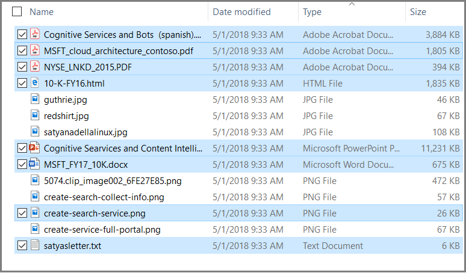
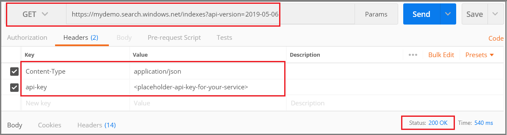
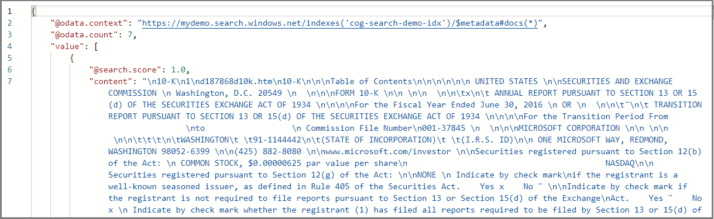
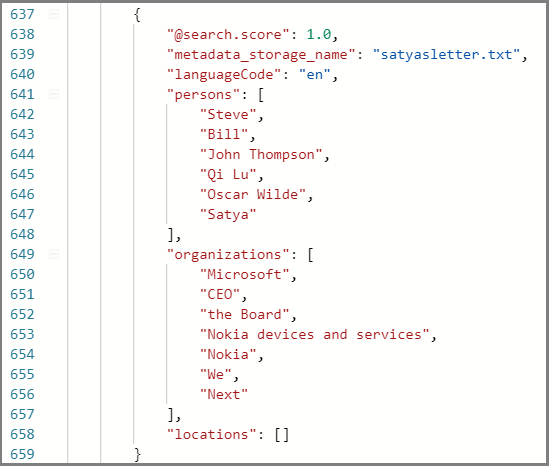
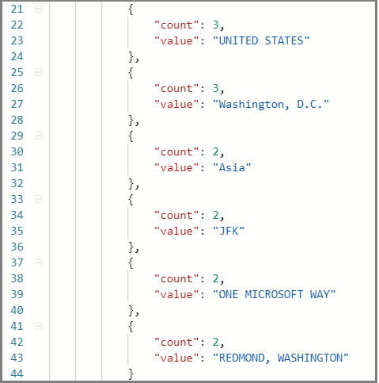

# Tutorial: Use REST and AI to generate searchable content from Azure blobs

If you have unstructured text or images in Azure Blob storage, an [AI enrichment pipeline](cognitive-search-concept-intro.md) can extract information and create new content that is useful for full-text search or knowledge mining scenarios. Although a pipeline can process images, this REST tutorial focuses on text, applying language detection and natural language processing to create new fields that you can leverage in queries, facets, and filters.

This tutorial uses Postman and the [Search REST APIs](https://docs.microsoft.com/rest/api/searchservice/) to perform the following tasks:

> [!div class="checklist"]
> * Start with whole documents (unstructured text) such as PDF, HTML, DOCX, and PPTX in Azure Blob storage.
> * Define a pipeline that extracts text, detects language, recognizes entities, and detects key phrases.
> * Define an index to store the output (raw content, plus pipeline-generated name-value pairs).
> * Execute the pipeline to start transformations and analysis, and to create and load the index.
> * Explore results using full text search and a rich query syntax.

If you don't have an Azure subscription, open a [free account](https://azure.microsoft.com/free/?WT.mc_id=A261C142F) before you begin.

## Prerequisites

+ [Azure Storage](https://azure.microsoft.com/services/storage/)
+ [Postman desktop app](https://www.getpostman.com/)
+ [Create](search-create-service-portal.md) or [find an existing search service](https://ms.portal.azure.com/#blade/HubsExtension/BrowseResourceBlade/resourceType/Microsoft.Search%2FsearchServices) 

> [!Note]
> You can use the free service for this tutorial. A free search service limits you to three indexes, three indexers, and three data sources. This tutorial creates one of each. Before starting, make sure you have room on your service to accept the new resources.

## Download files

1. Open this [OneDrive folder](https://1drv.ms/f/s!As7Oy81M_gVPa-LCb5lC_3hbS-4) and on the top-left corner, click **Download** to copy the files to your computer. 

1. Right-click the zip file and select **Extract All**. There are 14 files of various types. You'll use 7 for this exercise.

## 1 - Create services

This tutorial uses Azure Cognitive Search for indexing and queries, Cognitive Services on the backend for AI enrichment, and Azure Blob storage to provide the data. This tutorial stays under the free allocation of 20 transactions per indexer per day on Cognitive Services, so the only services you need to create are search and storage.

If possible, create both in the same region and resource group for proximity and manageability. In practice, your Azure Storage account can be in any region.

### Start with Azure Storage

1. [Sign in to the Azure portal](https://portal.azure.com/) and click **+ Create Resource**.

1. Search for *storage account* and select Microsoft's Storage Account offering.

   

1. In the Basics tab, the following items are required. Accept the defaults for everything else.

   + **Resource group**. Select an existing one or create a new one, but use the same group for all services so that you can manage them collectively.

   + **Storage account name**. If you think you might have multiple resources of the same type, use the name to disambiguate by type and region, for example *blobstoragewestus*. 

   + **Location**. If possible, choose the same location used for Azure Cognitive Search and Cognitive Services. A single location voids bandwidth charges.

   + **Account Kind**. Choose the default, *StorageV2 (general purpose v2)*.

1. Click **Review + Create** to create the service.

1. Once it's created, click **Go to the resource** to open the Overview page.

1. Click **Blobs** service.

1. Click **+ Container** to create a container and name it *cog-search-demo*.

1. Select *cog-search-demo* and then click **Upload** to open the folder where you saved the download files. Select all of the non-image files. You should have 7 files. Click **OK** to upload.

   

1. Before you leave Azure Storage, get a connection string so that you can formulate a connection in Azure Cognitive Search. 

   1. Browse back to the Overview page of your storage account (we used *blobstragewestus* as an example). 
   
   1. In the left navigation pane, select **Access keys** and copy one of the connection strings. 

   The connection string is a URL similar to the following example:

      ```http
      DefaultEndpointsProtocol=https;AccountName=cogsrchdemostorage;AccountKey=<your account key>;EndpointSuffix=core.windows.net
      ```

1. Save the connection string to Notepad. You'll need it later when setting up the data source connection.

### Cognitive Services

AI enrichment is backed by Cognitive Services, including Text Analytics and Computer Vision for natural language and image processing. If your objective was to complete an actual prototype or project, you would at this point provision Cognitive Services (in the same region as Azure Cognitive Search) so that you can attach it to indexing operations.

For this exercise, however, you can skip resource provisioning because Azure Cognitive Search can connect to Cognitive Services behind the scenes and give you 20 free transactions per indexer run. Since this tutorial uses 7 transactions, the free allocation is sufficient. For larger projects, plan on provisioning Cognitive Services at the pay-as-you-go S0 tier. For more information, see [Attach Cognitive Services](cognitive-search-attach-cognitive-services.md).

### Azure Cognitive Search

The third component is Azure Cognitive Search, which you can [create in the portal](search-create-service-portal.md). You can use the Free tier to complete this walkthrough. 

As with Azure Blob storage, take a moment to collect the access key. Further on, when you begin structuring requests, you will need to provide the endpoint and admin api-key used to authenticate each request.

### Get an admin api-key and URL for Azure Cognitive Search

1. [Sign in to the Azure portal](https://portal.azure.com/), and in your search service **Overview** page, get the name of your search service. You can confirm your service name by reviewing the endpoint URL. If your endpoint URL were `https://mydemo.search.windows.net`, your service name would be `mydemo`.

2. In **Settings** > **Keys**, get an admin key for full rights on the service. There are two interchangeable admin keys, provided for business continuity in case you need to roll one over. You can use either the primary or secondary key on requests for adding, modifying, and deleting objects.

   Get the query key as well. It's a best practice to issue query requests with read-only access.

   

All requests require an api-key in the header of every request sent to your service. A valid key establishes trust, on a per request basis, between the application sending the request and the service that handles it.

## 2 - Set up Postman

Start Postman and set up an HTTP request. If you are unfamiliar with this tool, see [Explore Azure Cognitive Search REST APIs using Postman](search-get-started-postman.md).

The request methods used in this tutorial are **POST**, **PUT**, and **GET**. You'll use the methods to make four API calls to your search service: create a data source, a skillset, an index, and an indexer.

In Headers, set "Content-type" to `application/json` and set `api-key` to the admin api-key of your Azure Cognitive Search service. Once you set the headers, you can use them for every request in this exercise.

  

## 3 - Create the pipeline

In Azure Cognitive Search, AI processing occurs during indexing (or data ingestion). This part of the walkthrough creates four objects: data source, index definition, skillset, indexer. 

### Step 1: Create a data source

A [data source object](https://docs.microsoft.com/rest/api/searchservice/create-data-source) provides the connection string to the Blob container containing the files.

1. Use **POST** and the following URL, replacing YOUR-SERVICE-NAME with the actual name of your service.

   ```http
   https://[YOUR-SERVICE-NAME].search.windows.net/datasources?api-version=2020-06-30
   ```

1. In request **Body**, copy the following JSON definition, replacing the `connectionString` with the actual connection of your storage account. 

   Remember to edit the container name as well. We suggested "cog-search-demo" for the container name in an earlier step.

    ```json
    {
      "name" : "cog-search-demo-ds",
      "description" : "Demo files to demonstrate cognitive search capabilities.",
      "type" : "azureblob",
      "credentials" :
      { "connectionString" :
        "DefaultEndpointsProtocol=https;AccountName=<YOUR-STORAGE-ACCOUNT>;AccountKey=<YOUR-ACCOUNT-KEY>;"
      },
      "container" : { "name" : "<YOUR-BLOB-CONTAINER-NAME>" }
    }
    ```
1. Send the request. You should see a status code of 201 confirming success. 

If you got a 403 or 404 error, check the request construction: `api-version=2020-06-30` should be on the endpoint, `api-key` should be in the Header after `Content-Type`, and its value must be valid for a search service. You might want to run the JSON document through an online JSON validator to make sure the syntax is correct. 

### Step 2: Create a skillset

A [skillset object](https://docs.microsoft.com/rest/api/searchservice/create-skillset) is a set of enrichment steps applied to your content. 

1. Use **PUT** and the following URL, replacing YOUR-SERVICE-NAME with the actual name of your service.

    ```http
    https://[YOUR-SERVICE-NAME].search.windows.net/skillsets/cog-search-demo-ss?api-version=2020-06-30
    ```

1. In request **Body**, copy the JSON definition below. This skillset consists of the following built-in skills.

   | Skill                 | Description    |
   |-----------------------|----------------|
   | [Entity Recognition](cognitive-search-skill-entity-recognition.md) | Extracts the names of people, organizations, and locations from content in the blob container. |
   | [Language Detection](cognitive-search-skill-language-detection.md) | Detects the content's language. |
   | [Text Split](cognitive-search-skill-textsplit.md)  | Breaks large content into smaller chunks before calling the key phrase extraction skill. Key phrase extraction accepts inputs of 50,000 characters or less. A few of the sample files need splitting up to fit within this limit. |
   | [Key Phrase Extraction](cognitive-search-skill-keyphrases.md) | Pulls out the top key phrases. |

   Each skill executes on the content of the document. During processing, Azure Cognitive Search cracks each document to read content from different file formats. Found text originating in the source file is placed into a generated ```content``` field, one for each document. As such, the input becomes ```"/document/content"```.

   For key phrase extraction, because we use the text splitter skill to break larger files into pages, the context for the key phrase extraction skill is ```"document/pages/*"``` (for each page in the document) instead of ```"/document/content"```.

    ```json
    {
      "description": "Extract entities, detect language and extract key-phrases",
      "skills":
      [
        {
          "@odata.type": "#Microsoft.Skills.Text.EntityRecognitionSkill",
          "categories": [ "Person", "Organization", "Location" ],
          "defaultLanguageCode": "en",
          "inputs": [
            { "name": "text", "source": "/document/content" }
          ],
          "outputs": [
            { "name": "persons", "targetName": "persons" },
            { "name": "organizations", "targetName": "organizations" },
            { "name": "locations", "targetName": "locations" }
          ]
        },
        {
          "@odata.type": "#Microsoft.Skills.Text.LanguageDetectionSkill",
          "inputs": [
            { "name": "text", "source": "/document/content" }
          ],
          "outputs": [
            { "name": "languageCode", "targetName": "languageCode" }
          ]
        },
        {
          "@odata.type": "#Microsoft.Skills.Text.SplitSkill",
          "textSplitMode" : "pages",
          "maximumPageLength": 4000,
          "inputs": [
            { "name": "text", "source": "/document/content" },
            { "name": "languageCode", "source": "/document/languageCode" }
          ],
          "outputs": [
            { "name": "textItems", "targetName": "pages" }
          ]
        },
        {
          "@odata.type": "#Microsoft.Skills.Text.KeyPhraseExtractionSkill",
          "context": "/document/pages/*",
          "inputs": [
            { "name": "text", "source": "/document/pages/*" },
            { "name":"languageCode", "source": "/document/languageCode" }
          ],
          "outputs": [
            { "name": "keyPhrases", "targetName": "keyPhrases" }
          ]
        }
      ]
    }
    ```
    A graphical representation of the skillset is shown below. 

    

1. Send the request. Postman should return a status code of 201 confirming success. 

> [!NOTE]
> Outputs can be mapped to an index, used as input to a downstream skill, or both as is the case with language code. In the index, a language code is useful for filtering. As an input, language code is used by text analysis skills to inform the linguistic rules around word breaking. For more information about skillset fundamentals, see [How to define a skillset](cognitive-search-defining-skillset.md).

### Step 3: Create an index

An [index](https://docs.microsoft.com/rest/api/searchservice/create-index) provides the schema used to create the physical expression of your content in inverted indexes and other constructs in Azure Cognitive Search. The largest component of an index is the fields collection, where data type and attributes determine contents and behaviors in Azure Cognitive Search.

1. Use **PUT** and the following URL, replacing YOUR-SERVICE-NAME with the actual name of your service, to name your index.

   ```http
   https://[YOUR-SERVICE-NAME].search.windows.net/indexes/cog-search-demo-idx?api-version=2020-06-30
   ```

1. In request **Body**, copy the following JSON definition. The `content` field stores the document itself. Additional fields for `languageCode`, `keyPhrases`, and `organizations` represent new information (fields and values) created by the skillset.

    ```json
    {
      "fields": [
        {
          "name": "id",
          "type": "Edm.String",
          "key": true,
          "searchable": true,
          "filterable": false,
          "facetable": false,
          "sortable": true
        },
        {
          "name": "metadata_storage_name",
          "type": "Edm.String",
          "searchable": false,
          "filterable": false,
          "facetable": false,
          "sortable": false
        },
        {
          "name": "content",
          "type": "Edm.String",
          "sortable": false,
          "searchable": true,
          "filterable": false,
          "facetable": false
        },
        {
          "name": "languageCode",
          "type": "Edm.String",
          "searchable": true,
          "filterable": false,
          "facetable": false
        },
        {
          "name": "keyPhrases",
          "type": "Collection(Edm.String)",
          "searchable": true,
          "filterable": false,
          "facetable": false
        },
        {
          "name": "persons",
          "type": "Collection(Edm.String)",
          "searchable": true,
          "sortable": false,
          "filterable": true,
          "facetable": true
        },
        {
          "name": "organizations",
          "type": "Collection(Edm.String)",
          "searchable": true,
          "sortable": false,
          "filterable": true,
          "facetable": true
        },
        {
          "name": "locations",
          "type": "Collection(Edm.String)",
          "searchable": true,
          "sortable": false,
          "filterable": true,
          "facetable": true
        }
      ]
    }
    ```

1. Send the request. Postman should return a status code of 201 confirming success. 

### Step 4: Create and run an indexer

An [Indexer](https://docs.microsoft.com/rest/api/searchservice/create-indexer) drives the pipeline. The three components you have created thus far (data source, skillset, index) are inputs to an indexer. Creating the indexer on Azure Cognitive Search is the event that puts the entire pipeline into motion. 

1. Use **PUT** and the following URL, replacing YOUR-SERVICE-NAME with the actual name of your service, to name your indexer.

   ```http
   https://[servicename].search.windows.net/indexers/cog-search-demo-idxr?api-version=2020-06-30
   ```

1. In request **Body**, copy the JSON definition below. Notice the field mapping elements; these mappings are important because they define the data flow. 

   The `fieldMappings` are processed before the skillset, sending content from the data source to target fields in an index. You'll use field mappings to send existing, unmodified content to the index. If field names and types are the same at both ends, no mapping is required.

   The `outputFieldMappings` are for fields created by skills, and thus processed after the skillset has run. The references to `sourceFieldNames` in `outputFieldMappings` don't exist until document cracking or enrichment creates them. The `targetFieldName` is a field in an index, defined in the index schema.

    ```json
    {
      "name":"cog-search-demo-idxr",	
      "dataSourceName" : "cog-search-demo-ds",
      "targetIndexName" : "cog-search-demo-idx",
      "skillsetName" : "cog-search-demo-ss",
      "fieldMappings" : [
        {
          "sourceFieldName" : "metadata_storage_path",
          "targetFieldName" : "id",
          "mappingFunction" :
            { "name" : "base64Encode" }
        },
        {
          "sourceFieldName" : "metadata_storage_name",
          "targetFieldName" : "metadata_storage_name",
          "mappingFunction" :
            { "name" : "base64Encode" }
        },
        {
          "sourceFieldName" : "content",
          "targetFieldName" : "content"
        }
      ],
      "outputFieldMappings" :
      [
        {
          "sourceFieldName" : "/document/persons",
          "targetFieldName" : "persons"
        },
        {
          "sourceFieldName" : "/document/organizations",
          "targetFieldName" : "organizations"
        },
        {
          "sourceFieldName" : "/document/locations",
          "targetFieldName" : "locations"
        },
        {
          "sourceFieldName" : "/document/pages/*/keyPhrases/*",
          "targetFieldName" : "keyPhrases"
        },
        {
          "sourceFieldName": "/document/languageCode",
          "targetFieldName": "languageCode"
        }
      ],
      "parameters":
      {
        "maxFailedItems":-1,
        "maxFailedItemsPerBatch":-1,
        "configuration":
        {
          "dataToExtract": "contentAndMetadata",
          "parsingMode": "default",
          "firstLineContainsHeaders": false,
          "delimitedTextDelimiter": ","
        }
      }
    }
    ```

1. Send the request. Postman should return a status code of 201 confirming successful processing. 

   Expect this step to take several minutes to complete. Even though the data set is small, analytical skills are computation-intensive. 

> [!NOTE]
> Creating an indexer invokes the pipeline. If there are problems reaching the data, mapping inputs and outputs, or order of operations, they appear at this stage. To re-run the pipeline with code or script changes, you might need to drop objects first. For more information, see [Reset and re-run](#reset).

#### About indexer parameters

The script sets ```"maxFailedItems"```  to -1, which instructs the indexing engine to ignore errors during data import. This is acceptable because there are so few documents in the demo data source. For a larger data source, you would set the value to greater than 0.

The ```"dataToExtract":"contentAndMetadata"``` statement tells the indexer to automatically extract the content from different file formats as well as metadata related to each file. 

When content is extracted, you can set ```imageAction``` to extract text from images found in the data source. The ```"imageAction":"generateNormalizedImages"``` configuration, combined with the OCR Skill and Text Merge Skill, tells the indexer to extract text from the images (for example, the word "stop" from a traffic Stop sign), and embed it as part of the content field. This behavior applies to both the images embedded in the documents (think of an image inside a PDF), as well as images found in the data source, for instance a JPG file.

## 4 - Monitor indexing

Indexing and enrichment commence as soon as you submit the Create Indexer request. Depending on which cognitive skills you defined, indexing can take a while. To find out whether the indexer is still running, send the following request to check the indexer status.

1. Use **GET** and the following URL, replacing YOUR-SERVICE-NAME with the actual name of your service, to name your indexer.

   ```http
   https://[YOUR-SERVICE-NAME].search.windows.net/indexers/cog-search-demo-idxr/status?api-version=2020-06-30
   ```

1. Review the response to learn whether the indexer is running, or to view error and warning information.  

If you are using the Free tier, the following message is expected: `"Could not extract content or metadata from your document. Truncated extracted text to '32768' characters". This message appears because blob indexing on the Free tier has a[32K limit on character extraction](search-limits-quotas-capacity.md#indexer-limits). You won't see this message for this data set on higher tiers. 

> [!NOTE]
> Warnings are common in some scenarios and do not always indicate a problem. For example, if a blob container includes image files, and the pipeline doesn't handle images, you'll get a warning stating that images were not processed.

## 5 - Search

Now that you've created new fields and information, let's run some queries to understand the value of cognitive search as it relates to a typical search scenario.

Recall that we started with blob content, where the entire document is packaged into a single `content` field. You can search this field and find matches to your queries.

1. Use **GET** and the following URL, replacing YOUR-SERVICE-NAME with the actual name of your service, to search for instances of a term or phrase, returning the `content` field and a count of the matching documents.

   ```http
   https://[YOUR-SERVICE-NAME].search.windows.net/indexes/cog-search-demo-idx?search=*&$count=true&$select=content?api-version=2020-06-30
   ```
   
   The results of this query return document contents, which is the same result you would get if used the blob indexer without the cognitive search pipeline. This field is searchable, but unworkable if you want to use facets, filters, or autocomplete.

   
   
1. For the second query, return some of the new fields created by the pipeline (persons, organizations, locations, languageCode). We're omitting keyPhrases for brevity, but you should include it if you want to see those values.

   ```http
   https://mydemo.search.windows.net/indexes/cog-search-demo-idx/docs?search=*&$count=true&$select=metadata_storage_name,persons,organizations,locations,languageCode&api-version=2020-06-30
   ```
   The fields in the $select statement contain new information created from the natural language processing capabilities of Cognitive Services. As you might expect, there is some noise in the results and variation across documents, but in many instances, the analytical models produce accurate results.

   The following image shows results for Satya Nadella's open letter upon assuming the CEO role at Microsoft.

   

1. To see how you might take advantage of these fields, add a facet parameter to return an aggregation of matching documents by location.

   ```http
   https://[YOUR-SERVICE-NAME].search.windows.net/indexes/cog-search-demo-idx/docs?search=*&facet=locations&api-version=2020-06-30
   ``` 

   In this example, for each location, there are 2 or 3 matches.

   
   

1. In this final example, apply a filter on the organizations collection, returning two matches for filter criteria based on NASDAQ.

   ```http
   cog-search-demo-idx/docs?search=*&$filter=organizations/any(organizations: organizations eq 'NASDAQ')&$select=metadata_storage_name,organizations&$count=true&api-version=2020-06-30
   ```

These queries illustrate a few of the ways you can work with query syntax and filters on new fields created by cognitive search. For more query examples, see [Examples in Search Documents REST API](https://docs.microsoft.com/rest/api/searchservice/search-documents#bkmk_examples), [Simple syntax query examples](search-query-simple-examples.md), and [Full Lucene query examples](search-query-lucene-examples.md).

<a name="reset"></a>

## Reset and rerun

In the early experimental stages of development, the most practical approach for design iteration is to delete the objects from Azure Cognitive Search and allow your code to rebuild them. Resource names are unique. Deleting an object lets you recreate it using the same name.

You can use the portal to delete indexes, indexers, data sources, and skillsets. When you delete the indexer, you can optionally, selectively delete the index, skillset, and data source at the same time.


Or use **DELETE** and provide URLs to each object. The following command deletes an indexer.

```http
DELETE https://[YOUR-SERVICE-NAME].search.windows.net/indexers/cog-search-demo-idxr?api-version=2020-06-30
```

Status code 204 is returned on successful deletion.

## Takeaways

This tutorial demonstrates the basic steps for building an enriched indexing pipeline through the creation of component parts: a data source, skillset, index, and indexer.

[Built-in skills](cognitive-search-predefined-skills.md) were introduced, along with skillset definition and the mechanics of chaining skills together through inputs and outputs. You also learned that `outputFieldMappings` in the indexer definition is required for routing enriched values from the pipeline into a searchable index on an Azure Cognitive Search service.

Finally, you learned how to test results and reset the system for further iterations. You learned that issuing queries against the index returns the output created by the enriched indexing pipeline. 

## Clean up resources

When you're working in your own subscription, at the end of a project, it's a good idea to remove the resources that you no longer need. Resources left running can cost you money. You can delete resources individually or delete the resource group to delete the entire set of resources.

You can find and manage resources in the portal, using the All resources or Resource groups link in the left-navigation pane.

## Next steps

Now that you're familiar with all of the objects in an AI enrichment pipeline, let's take a closer look at skillset definitions and individual skills.

> [!div class="nextstepaction"]
> [How to create a skillset](cognitive-search-defining-skillset.md)