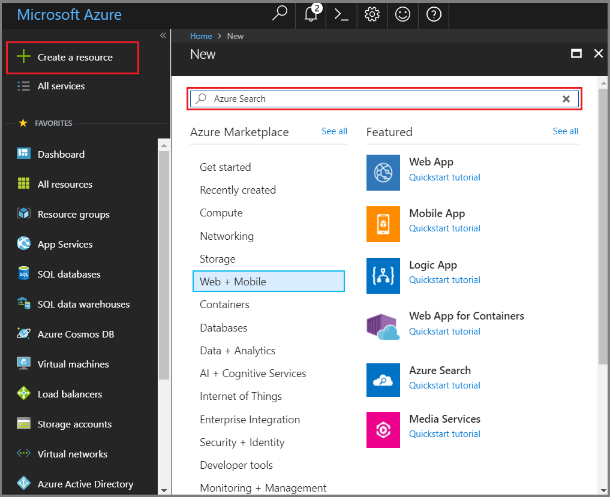

# Tutorial: Enrich indexing with cognitive search (Preview)

Find out how adding enrichment steps, called *cognitive skills*, to an Azure Search indexing pipeline helps you extract structure and information from raw content. By attaching a *skillset* to an Azure Search indexer, you can add named entity recognition, natural language processing, and image analysis that makes inherent information usable and searchable in custom apps. 

In this tutorial, learn how to do the following tasks:

> [!div class="checklist"]
> * Create resources used in an enriched indexing pipeline
> * Assemble a skillset composed of predefined skills (entity recognition, language detection, key phrase extraction, and text extraction from images)
> * Map inputs to outputs
> * Run code and review results
> * Reset the index and indexers for further development

The output is a full text searchable index, which you can further augment with other Azure Search functionality, such as [synonyms](search-synonyms.md), [scoring profiles](https://docs.microsoft.com/rest/api/searchservice/add-scoring-profiles-to-a-search-index), [analyzers](search-analyzers.md), and [filters](search-filters.md).

> [!Note]
> Enrichment is a preview feature with limited availability. Be sure to create a search service in one of the data regions providing this feature.

## Prerequisites

To issue REST calls to Azure Search, use a web test tool such as Telerik Fiddler or Postman to formulate HTTP calls. If these tools are new to you, see [Explore Azure Search REST APIs using Fiddler or Postman](https://docs.microsoft.com/azure/search/search-fiddler).

Use the [Azure portal](https://portal.azure.com/) to create services used in an end-to-end workflow. 

 

### Set up Azure Search

First, sign up for the Azure Search service. If you don't have an Azure subscription, create a [free account](https://azure.microsoft.com/free/?WT.mc_id=A261C142F) before you begin.

1. Go to the [Azure portal](https://portal.azure.com) and sign in by using your Azure account.

1. Click **Create a resource**, search for Azure Search, and click **Create**. See [Create a service in the portal](search-create-service-portal.md) if you are setting up a search service for the first time.

1. For Resource group, create a resource group for all resources you create today to make cleanup easier.

1. For Location, choose either **South Central US** or **West Europe**. Currently, the preview is available only in those regions.

1. For Pricing tier, you can create a **Free** service to complete tutorials and quickstarts. For deeper investigation using your own data, create a [paid service](https://azure.microsoft.com/pricing/details/search/) such as **Basic** or **Standard**. 

  A Free service is limited to 3 indexes, 16-MB maximum blob size, and 2 minutes of indexing, which is insufficient for exercising the full capabilities of cognitive search. To review limits for different tiers, see [Service Limits](https://docs.microsoft.com/azure/search/search-limits-quotas-capacity).

1. Pin the service to the dashboard for fast access to service information.

  

1. After the service is created, collect the following information once the search service is created: "endpoint", "api-key" (either primary or secondary).

  

### Set up Azure Blob service and load sample data

The enrichment pipeline pulls from Azure data sources. Source data must originate from a [supported data source type](https://docs.microsoft.com/azure/search/search-indexer-overview). For this exercise, we use blob storage to showcase multiple content types.

1. [Download sample data](https://1drv.ms/f/s!As7Oy81M_gVPa-LCb5lC_3hbS-4). Sample data consists of a very small file set of different types. 

1. [Sign up for Azure Blob storage](https://docs.microsoft.com/azure/storage/blobs/storage-quickstart-blobs-storage-explorer) and upload sample files. Create a storage account, log in to Storage Explorer, create a collection, and upload the sample files.

1. Collect the following information from the portal:

  + The container name you created when uploading the files. The sample script used to create the data source in a later step assumes you named it `basicdemo`.

  + The connection string for your storage account from  **Settings** > **Access keys**. The connection string should be a URL similar to the following example:

  ```http
  DefaultEndpointsProtocol=https;AccountName=cogsrchdemostorage;AccountKey=y5NIlE4wFVBIyrCi392GzZl+JO4TEGdqOerqfbT79C8zrn28Te8DsWlxvKKnjh69P/HM5k50ztz2shOt8vqlbg==;EndpointSuffix=core.windows.net
  ```

There are other ways to specify the connection string, such as proviing a shared access signature. To learn more about data source credentials, see [Indexing Azure Blob Storage](https://docs.microsoft.com/azure/search/search-howto-indexing-azure-blob-storage).

## Create a data source

Now that your services and source files are prepared, start assembling the components of your indexing pipeline. Begin with a [data source object](https://docs.microsoft.com/rest/api/searchservice/create-data-source) that tells Azure Search how to retrieve external source data.

For this tutorial, use REST API and tool like Postman or Fiddler to formulate and submit HTTP requests. In the request header, provide the service name and api-key generated for your search service. In the request body, specify the blob container name and connection string.

### Sample Request
```http
POST https://[service name].search.windows.net/datasources?api-version=2017-11-11-Preview
Content-Type: application/json  
api-key: [admin key]  
```
#### Request Body Syntax
```json
{   
    "name" : "demodata",  
    "description" : "Demo files to demonstrate cognitive search capabilities.",  
    "type" : "azureblob",
    "credentials" :
    { "connectionString" :
      "DefaultEndpointsProtocol=https;=<your account name>;AccountName=<your account name>;AccountKey=<your account key>;"
    },  
    "container" : { "name" : "<your blob container name>" }
}  
```
The web test tool should return a status code of 201 confirming success. Since this is your first request, check the Azure portal to confirm the data source was created in Azure Search. On the search service dashboard page, verify the Data Sources tile has a new item. You might need to wait a few minutes for the portal page to refresh. 

If you got a 403 or 404 error, check the request construction: `api-version=2017-11-11-Preview` should be on the endpoint, `api-key` should be in the Header after `Content-Type` and its value must be valid for a search service. You can reuse the header for the remaining steps in this tutorial.

> [!Tip]
> Now, before you do a lot of work, is a good time to verify that the search service is running in one of the supported locations providing the preview feature: South Central US or West Europe.

## Create a skillset

In this step, define a set of enrichment steps that you want to apply to your data. We call each enrichment step a *skill*, and the set of enrichment steps a *skillset*. You can use [predefined cognitive skills](cognitive-search-predefined-skills.md) or create custom skills and hook them up to the enrichment pipeline.

For this exercise, start with built-in skills, defining four enrichment steps to run on your data:

1. Extract the names of organizations from the content of documents in the blob container using the [named entity recognition skill](cognitive-search-skill-named-entity-recognition.md). 

2. Identify the language of a document using the [language detection skill](cognitive-search-skill-language-detection.md).

3. Extract the top key phrases from the document using the [key phrase extraction skill](cognitive-search-skill-keyphrases.md). Use the language detected in the previous step as an input. 

4. Since the key phrase skill only works with text that is at most 5,000 characters, use the [pagination skill](cognitive-search-skill-pagination.md) to break the content into several pages first before calling the key phrase extraction skill.

Each step executes on the content of the document. During processing, Azure Search cracks each document to read content from different file formats. Found text originating in the source file is placed into a generated ```content``` field, one for each document. As such, set the input as ```"/document/content"```.

A graphical representation of the skillset is shown below:


### Sample Request
Make sure to replace the service name and the admin key in the request below. Reference the skillset name ```demoskillset``` for the rest of this demo.

```http
PUT https://[servicename].search.windows.net/skillsets/demoskillset?api-version=2017-11-11-Preview
api-key: [admin key]
Content-Type: application/json
```
#### Request Body Syntax
```json
{
  "description": 
  "Extract entities, detect language and extract key-phrases",
  "skills":
  [
    {
      "@odata.type": "#Microsoft.Skills.Text.NamedEntityRecognitionSkill",
      "categories": [ "Organization" ],
      "defaultLanguageCode": "en",
      "inputs": [
        {
          "name": "text", "source": "/document/content"
        }
      ],
      "outputs": [
        {
          "name": "organizations", "targetName": "organizations"
        }
      ]
    },
    {
      "@odata.type": "#Microsoft.Skills.Text.LanguageDetectionSkill",
      "inputs": [
        {
          "name": "text", "source": "/document/content"
        }
      ],
      "outputs": [
        {
          "name": "languageCode",
          "targetName": "languageCode"
        }
      ]
    },
    {
      "@odata.type": "#Microsoft.Skills.Text.PaginationSkill",
      "maximumPageLength": 4000,
      "inputs": [
      {
        "name": "text",
        "source": "/document/content"
      },
      { 
        "name": "languageCode",
        "source": "/document/languageCode"
      }
    ],
    "outputs": [
      {
        "name": "pages",
        "targetName": "pages"
      }
    ]
  },
  {
      "@odata.type": "#Microsoft.Skills.Text.KeyPhraseExtractionSkill",
      "context": "/document/pages/*",
      "inputs": [
        {
          "name": "text", "source": "/document/pages/*"
        },
        {
          "name":"languageCode", "source": "/document/languageCode"
        }
      ],
      "outputs": [
        {
          "name": "keyPhrases",
          "targetName": "keyPhrases"
        }
      ]
    }
  ]
}
```
Notice how the key phrase extraction skill is applied for each page. By setting the context to ```"document/pages/*"``` you run this enricher for each member of the document/pages array (for each page in the document).

For more information about skillset fundamentals, see [How to define a skillset](cognitive-search-defining-skillset.md).

## Create an index

Now let's define what fields to include in the searchable index, and the search attributes for each field. Fields have a type and can take attributes that determine how the field is used (searchable, sortable, and so forth). Field names in an index are not required to identically match the field names in the source. In a later step, you add field mappings in an indexer to connect source-destination fields. For this step, define the index using whatever field naming conventions make sense for your search application.

This exercise uses the following fields and field types:

| field-names: | id       | content   | language | keyphrases         | organizations     |
|--------------|----------|-------|----------|--------------------|-------------------|
| field-types: | Edm.String|Edm.String| Edm.String| List<Edm.String>  | List<Edm.String>  |


### Sample Request
Make sure to replace the service name and the admin key in the request below.
Recall that ```demoindex``` is the index name in this exercise.

```http
PUT https://[servicename].search.windows.net/indexes/demoindex?api-version=2017-11-11-Preview
api-key: [api-key]
Content-Type: application/json
```
#### Request Body Syntax

```json
{
  "fields": [
    {
      "name": "id",
      "type": "Edm.String",
      "key": true,
      "searchable": true,
      "filterable": false,
      "facetable": false,
      "sortable": true
    },
    {
      "name": "content",
      "type": "Edm.String",
      "sortable": false,
      "searchable": true,
      "filterable": false,
      "facetable": false
    },
    {
      "name": "language",
      "type": "Edm.String",
      "searchable": true,
      "filterable": false,
      "facetable": false
    },
    {
      "name": "keyphrases",
      "type": "Collection(Edm.String)",
      "searchable": true,
      "filterable": false,
      "facetable": false
    },
    {
      "name": "organizations",
      "type": "Collection(Edm.String)",
      "searchable": true,
      "sortable": false,
      "filterable": false,
      "facetable": false
    }
  ]
}
```

To learn more about defining an index, see [Create an Azure Search Index](ref-create-index.md).


## Create an indexer, map fields, and execute transformations

So far, you have created a data source, a skillset, and an index. All become part of an [indexer](search-indexer-overview.md) that pulls each piece together into a single multi-phased operation. That said, you need to add a bit of glue between these components before you can run it. In this step, you define field mappings, which are part of the indexer definition, and execute the transformations when you submit the request.

For non-enriched indexing, the indexer definition provides an optional *fieldMappings* section if field names or data types do not precisely match, or if you want to use a function.

For cognitive search workloads having an enrichment pipeline, an indexer requires *outputFieldMappings*. These mappings are used when an internal process (the enrichment pipeline) is the source of field values. Behaviors unique to *outputFieldMappings* include the ability to handle complex types created as part of enrichment (through the shaper skill). Also, there may be many elements per document (for instance, multiple organizations in a document). The *outputFieldMappings* construct can direct the system to "flatten" collections of elements into a single record.

### Sample Request
Make sure to replace the service name and the admin key in the request below.
Also, provide the name of your indexer. You can reference it as ```demoindexer``` for the rest of this exercise.

```http
PUT https://[servicename].search.windows.net/indexers/demoindexer?api-version=2017-11-11-Preview
api-key: [api-key]
Content-Type: application/json
```
#### Request Body Syntax

```json
{
  "name":"demoindexer",	
  "dataSourceName" : "demodata",
  "targetIndexName" : "demoindex",
  "skillsetName" : "demoskillset",
  "fieldMappings" : [
        {
          "sourceFieldName" : "metadata_storage_path",
          "targetFieldName" : "id",
          "mappingFunction" : { "name" : "base64Encode" }
        },
        {
          "sourceFieldName" : "content",
          "targetFieldName" : "content"
        }
   ],
  "outputFieldMappings" : 
  [
        {
          "sourceFieldName" : "/document/organizations", 
          "targetFieldName" : "organizations"
        },
        {
          "sourceFieldName" : "/document/pages/*/keyPhrases/*", 
          "targetFieldName" : "keyphrases"
        },
        {
            "sourceFieldName": "/document/languageCode",
            "targetFieldName": "language"
        }      
  ],
  "parameters":
  {
  	"maxFailedItems":-1,
  	"maxFailedItemsPerBatch":-1,
  	"configuration": 
    {
    	"dataToExtract": "contentAndMetadata",
     	"imageAction": "embedTextInContentField"
		}
  }
}

```

Expect this step to take several second to complete. Even though the data set is small, analytical skills are computation-intensive. Some skills, such as image analysis, are particularly long-running.

> [!Tip]
> This step, creating the indexer, invokes the pipeline. If there are problems reaching the data, mapping inputs and outputs, or order of operations, they appear at this stage. To re-run the pipeline with code or script changes, you might need to drop objects first. For more information, see [Reset and re-run](#reset).

### Explore the script

The script sets ```"maxFailedItems"```  to -1, which instructs the indexing engine to ignore errors during data import. This is useful because there are so few documents in the demo data source. For a larger data source, you would set the value to greater than 0.

Also notice the ```"dataToExtract":"contentAndMetadata"``` statement in the configuration parameters. This statement tells the indexer to automatically extract the content from different file formats as well as metadata related to each file. 

When content is extracted, you can set ```ImageAction``` to extract text from images found in the data source. The ```"ImageAction":"embedTextInContentField"``` tells the indexer to extract text from the images (for example, the word "stop" from a traffic Stop sign), and embed it as part of the content field. This behavior applies to both the images embedded in the documents (think of an image inside a PDF), as well as images found in the data source, for instance a JPG file.

In this preview, ```"embedTextInContentField"``` is the only valid value for ```"ImageAction"```.

## Check indexer status

Once the indexer is defined, it runs automatically when you submit the request. Depending on which cognitive skills you defined, indexing can take longer than you expect. To find out whether the indexer is still runing, send the following request to check the indexer status.

```http
GET https://[servicename].search.windows.net/indexers/demoindexer/status?api-version=2017-11-11-Preview
api-key: [api-key]
Content-Type: application/json
```

The response tells you whether the indexer is running. After indexing is finished, GET STATUS reports any errors and warnings that occurred during enrichment.  
 
## Verify content

After indexing is finished, run queries that return the contents of individual fields. By default, Azure Search returns the top 50 results. The sample data is small so the defaults work fine. However, when working with larger data sets, you might need to include parameters in the query string to return more results. For instructions, see [How to page results in Azure Search](https://docs.microsoft.com/azure/search/search-pagination-page-layout).

As a verification step, query the index for all of the fields.

```http
https://[servicename].search.windows.net/indexes/demoindex?api-version=2017-11-11-Preview
api-key: [api-key]
Content-Type: application/json
```

The output is the index schema, with the name, type, and attributes of each field.

Submit a second query for "*" to return all contents of a single field, such as `organizations`.

```http
GET https://[servicename].search.windows.net/indexes/demoindex/docs?search=*&$select=organizations&api-version=2017-11-11-Preview
api-key: [api-key]
Content-Type: application/json
```

Repeat for additional fields: content, language, keyphrases, and organizations in this exercise. You can return multiple fields via `$select` using a comma-delimited list.

You can use GET or POST, depending on query string complexity and length. For more information, see [Query using the REST API](https://docs.microsoft.com/azure/search/search-query-rest-api).

## Accessing the enriched document

*For the private preview*, we added a mechanism that allows you to see the structure of the enriched document. Enriched documents are temporary structures created during enrichment, and then deleted when the process is complete.

To capture an enriched document created during indexing, add a field called ```enriched``` to your index. The indexer automatically dumps into it a string representation of all the enrichments for that document.

The enriched field will contain a string that is a logical representation of the in memory enriched document in json.  The field value is a valid json document, however, quotes are escaped so you'll need to replace \" with " in order to view the document as formatted json.  The enriched field is intended for debugging purposes only to help you understand the logical shape of the content that expressions are being evaluated against.

This implementation is temporary, likely to be replaced by public preview or general release. For now, it can be a useful tool to understand what's going on and help you debug your skillset.

Repeat the previous exercise, including an `enriched` field to capture the contents of an enriched document:

#### Request Body Syntax
```json
{
  "fields": [
    {
      "name": "id",
      "type": "Edm.String",
      "key": true,
      "searchable": true,
      "filterable": false,
      "facetable": false,
      "sortable": true
    },
    {
      "name": "content",
      "type": "Edm.String",
      "sortable": false,
      "searchable": true,
      "filterable": false,
      "facetable": false
    },
    {
      "name": "language",
      "type": "Edm.String",
      "searchable": true,
      "filterable": false,
      "facetable": false
    },
    {
      "name": "keyphrases",
      "type": "Collection(Edm.String)",
      "searchable": true,
      "filterable": false,
      "facetable": false
    },
    {
      "name": "organizations",
      "type": "Collection(Edm.String)",
      "searchable": true,
      "sortable": false,
      "filterable": false,
      "facetable": false
    },
    {
      "name": "enriched",
      "type": "Edm.String",
      "searchable": false,
      "sortable": false,
      "filterable": false,
      "facetable": false
    }
  ]
}
```
<a name="reset"></a>

## Reset and re-run

In the early experimental stages of pipeline development, the most practical approach for evolving a solution is to delete the objects from Azure Search and allow your code to rebuild them at run time. Resource names are unique in the service so you must delete objects to recreate them using the same name.

You can use the portal to delete data sources, indexes, and indexers. Skillsets are new and must be deleted using an HTTP command:

```http
DELETE https://[servicename].search.windows.net/indexers/demoindexer?api-version=2017-11-11-Preview
api-key: [api-key]
Content-Type: application/json
```

Status code 204 is returned on successful deletion.

As your code matures, this approach becomes impractical, especially if you want to preserve existing computations such as analyzed images. For more guidance, see [How to perform incremental indexing](search-howto-index-incremental.md).

## Takeaways

This tutorial demonstrates the basic steps for building an enriched indexing pipeline through the creation of component parts: a data source, skillset, index, and indexer.

[Predefined skills](cognitive-search-predefined-skills.md) were introduced, along with skillset definition and the mechanics of chaining skills together through inputs and outputs. You also learned that `outputFieldMappings` in the indexer definition is required for routing enriched values from the pipeline into a searchable index on an Azure Search service.

Finally, you learned how to test results and reset the system for further iterations. You learned that issuing queries against the index returns the output created by the enriched indexing pipline. In this release, there is a mechanism for viewing internal constructs (enriched documents created by the system). You also learned how to check indexer status, and which objects to delete before re-running a pipeline.

## Clean up resources

The fastest way to clean up after a tutorial is by deleting the resource group containing the Azure Search service and Azure Blob service. Assuming you put both services in the same group, delete the resource group now to permanently delete services and any stored content that you created for this tutorial. In the portal, the resource group name is on the Overview page of each service.

## Next steps

Customize or extend the pipeline with custom skills. Creating a custom skill and adding it to a skillset allows you to onboardtext or image analysis that you write yourself. 

> [!div class="nextstepaction"]
> [Example: create a custom skill](cognitive-search-create-custom-skill-example.md)
