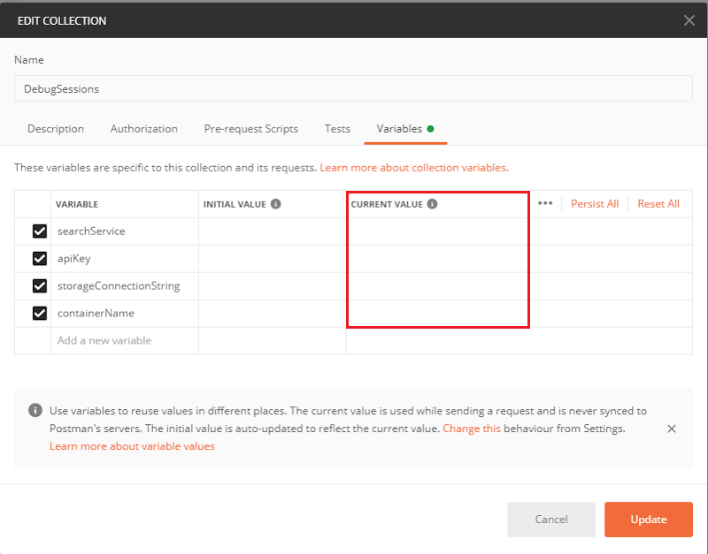
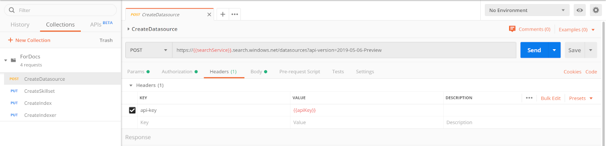
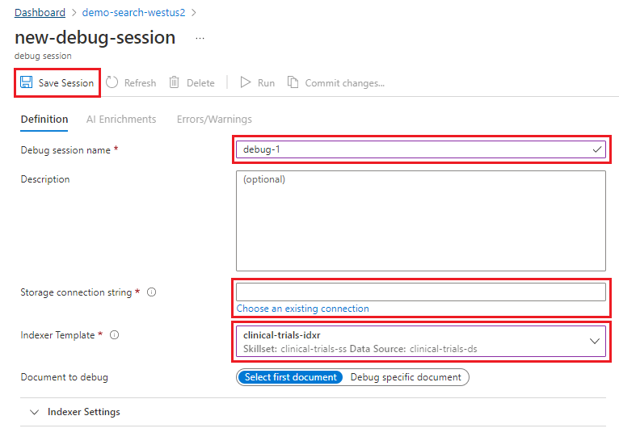
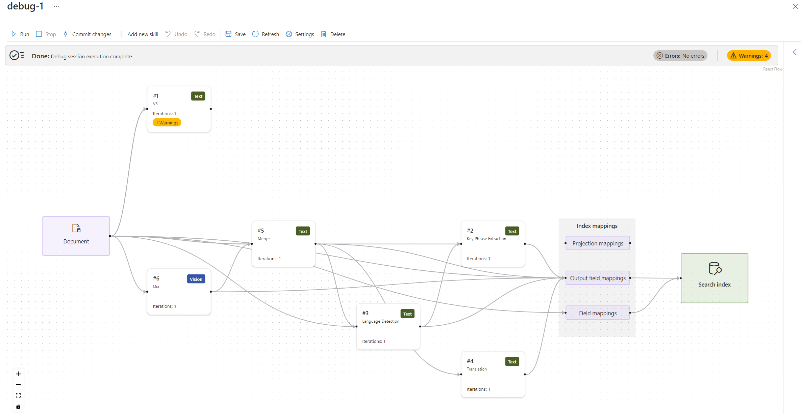
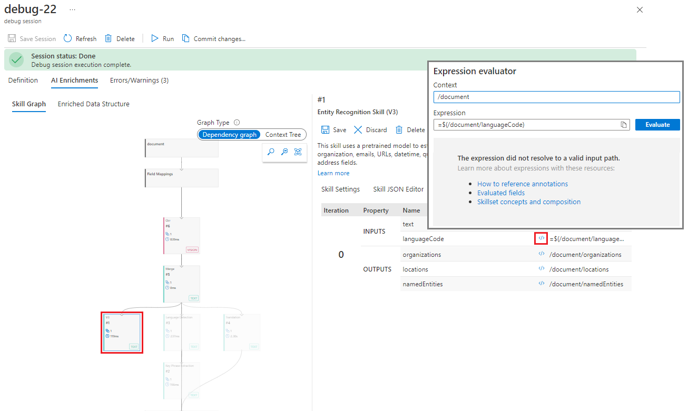
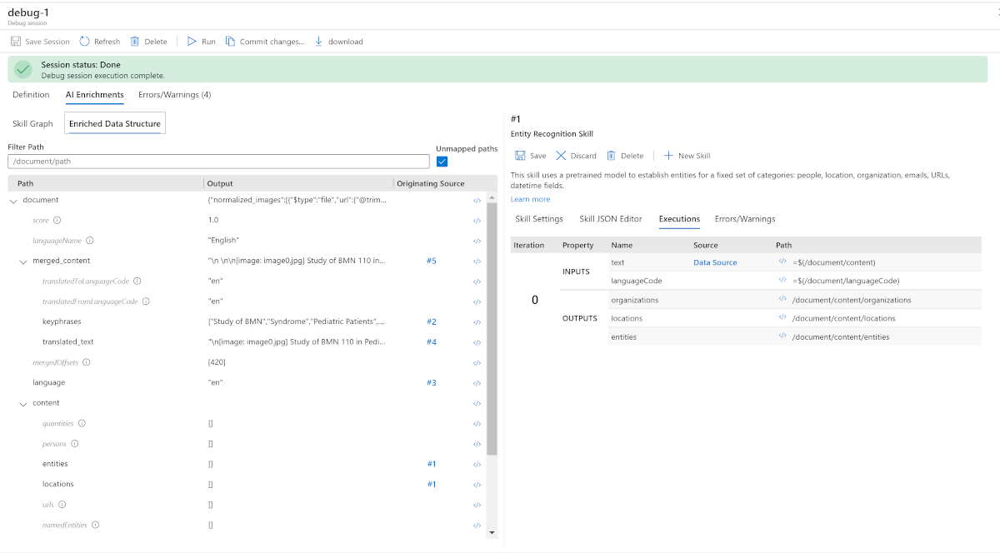

# Tutorial: Diagnose, repair, and commit changes to your skillset

In this article, you will use the Azure portal to access Debug sessions to repair issues with the provided skillset. The skillset has some errors which need to be addressed. This tutorial will take you through a debug session to identify and resolve issues with skill inputs and outputs.

> [!Important]
> Debug sessions support for Azure Cognitive Search is available [upon request](https://aka.ms/DebugSessions) as a limited-access preview. Preview features are provided without a service level agreement, and are not recommended for production workloads. For more information, see [Supplemental Terms of Use for Microsoft Azure Previews](https://azure.microsoft.com/support/legal/preview-supplemental-terms/).
>
> Once you are granted access to the preview, you'll be able to access and use Debug sessions for your service using the Azure portal.
>   

If you don't have an Azure subscription, create a [free account](https://azure.microsoft.com/free/?WT.mc_id=A261C142F) before you begin.

## Prerequisites

> [!div class="checklist"]
> * An Azure subscription. Create a [free account](https://azure.microsoft.com/free/?WT.mc_id=A261C142F) or use your current subscription
> * An Azure Cognitive Search service instance
> * An Azure Storage account
> * [Postman desktop app](https://www.getpostman.com/)

## Create services and load data

This tutorial uses Azure Cognitive Search and Azure Storage services.

* [Download sample data](https://github.com/Azure-Samples/azure-search-sample-data/tree/master/clinical-trials-pdf-19) consisting of 19 files.

* [Create an Azure storage account](https://docs.microsoft.com/azure/storage/common/storage-quickstart-create-account?tabs=azure-portal) or [find an existing account](https://ms.portal.azure.com/#blade/HubsExtension/BrowseResourceBlade/resourceType/Microsoft.Storage%2storageAccounts/). 

   Choose the same region as Azure Cognitive Search to avoid bandwidth charges.
   
   Choose the StorageV2 (general purpose V2) account type.

* Open the storage services pages and create a container. Best practice is to specify the access level "private". Name your container `clinicaltrialdataset`.

* In container, click **Upload** to upload the sample files you downloaded and unzipped in the first step.

* [Create an Azure Cognitive Search service](search-create-service-portal.md) or [find an existing service](https://ms.portal.azure.com/#blade/HubsExtension/BrowseResourceBlade/resourceType/Microsoft.Search%2FsearchServices). You can use a free service for this quickstart.

## Get a key and URL

REST calls require the service URL and an access key on every request. A search service is created with both, so if you added Azure Cognitive Search to your subscription, follow these steps to get the necessary information:

1. [Sign in to the Azure portal](https://portal.azure.com/), and in your search service **Overview** page, get the URL. An example endpoint might look like `https://mydemo.search.windows.net`.

1. In **Settings** > **Keys**, get an admin key for full rights on the service. There are two interchangeable admin keys, provided for business continuity in case you need to roll one over. You can use either the primary or secondary key on requests for adding, modifying, and deleting objects.

All requests require an api-key on every request sent to your service. Having a valid key establishes trust, on a per request basis, between the application sending the request and the service that handles it.

## Create data source, skillset, index, and indexer

In this section, Postman and a provided collection are used to create the search service's data source, skillset, index, and indexer.

1. If you do not have Postman, you can [download the Postman desktop app here](https://www.getpostman.com/).
1. [Download the Debug Sessions Postman collection](https://github.com/Azure-Samples/azure-search-postman-samples/tree/master/Debug-sessions)
1. Start Postman
1. Under **Files** > **New**, select the collection to import.
1. After the collection is imported, expand the actions list (...).
1. Click **Edit**.
1. Enter the name of your searchService (for example, if the endpoint is https://mydemo.search.windows.net, then the service name is "mydemo").
1. Enter the apiKey with either the primary or secondary key of your search service.
1. Enter the storageConnectionString from the keys page of your Azure Storage account.
1. Enter the containerName for the container you created in the storage account.

> [!div class="mx-imgBorder"]
> 

The collection contains four different REST calls that are used to complete this section.

The first call creates the data source. `clinical-trials-ds`. The second call creates the skillset, `clinical-trials-ss`. The third call creates the index, `clinical-trials`. The fourth and final call creates the indexer, `clinical-trials-idxr`. After  all of the calls in the collection have been completed, close Postman and return to the Azure portal.

> [!div class="mx-imgBorder"]
> 

## Check the results

The skillset contains a few, common errors. In this section, running an empty query to return all documents will display multiple errors. In subsequent steps, the issues will be resolved using a debug session.

1. Go to your search service in the Azure portal. 
1. Select the **Indexes** tab. 
1. Select the `clinical-trials` index
1. Click **Search** to run an empty query. 

After the search has finished, two fields with no data listed; "organizations" and "locations" are listed in the window. Follow the steps to discover all of the issues produced by the skillset.

1. Return to the search service Overview page.
1. Select the **Indexers** tab. 
1. Click `clinical-trials-idxr` and select the warnings notification. 

There are many issues with projection output field mappings and on page three there are warnings because one or more skill inputs are invalid.

Return to the search service overview screen.

## Start your debug session

> [!div class="mx-imgBorder"]
> 

1. Click on the Debug sessions (preview) tab.
1. Select +NewDebugSession
1. Give the session a name. 
1. Connect the session to your storage account. 
1. Provide the indexer name. The indexer has references to the data source, the skillset, and index.
1. Accept the default document choice for the first document in the collection. 
1. **Save** the session. Saving the session will kick off the AI enrichment pipeline as defined by the skillset.

> [!Important]
> A debug session only works with a single document. A specific document in the data set can be > selected or the session will default to the first document.

> [!div class="mx-imgBorder"]
> 

When the debug session has finished executing, the session defaults to the AI Enrichments tab, highlighting the Skill Graph.

+ The Skill Graph provides a visual hierarchy of the skillset and its order of execution from top to bottom. Skills that are side by side in the graph are executed in parallel. Color coding of skills in the graph indicate the types of skills that are being executed in the skillset. In the example, the green skills are text and the red skill is vision. Clicking on an individual skill in the graph will display the details of that instance of the skill in the right pane of the session window. The skill settings, a JSON editor, execution details, and errors/warnings are all available for review and editing.
+ The Enriched Data Structure details the nodes in the enrichment tree generated by the skills from the source document's contents.

The Errors/Warnings tab will provide a much smaller list than the one displayed earlier because this list is only detailing the errors for a single document. Like the list displayed by the indexer, you can click on a warning message and see the details of this warning.

## Fix missing skill input value

In the Errors/Warnings tab, there is an error for an operation labeled `Enrichment.NerSkillV2.#1`. The detail of this error explains that there is a problem with a skill input value '/document/languageCode'. 

1. Return to the AI Enrichments tab.
1. Click on the **Skill Graph**.
1. Click on the skill labeled #1 to display its details in the right pane.
1. Locate the input for "languageCode".
1. Select the **</>** symbol at the beginning of the line and open the Expression Evaluator.
1. Click the **Evaluate** button to confirm that this expression is resulting in an error. It will confirm that the "languageCode" property is not a valid input.

> [!div class="mx-imgBorder"]
> 

There are two ways to research this error in the session. The first is to look at where the input is coming from - what skill in the hierarchy is supposed to produce this result? The Executions tab in the skill details pane should display the source of the input. If there is no source, this indicates a field mapping error.

1. Click the **Executions** tab.
1. Look at the INPUTS and find "languageCode". There is no source for this input listed. 
1. Switch the left pane to display the Enriched Data Structure. There is no mapped path corresponding to "languageCode".

> [!div class="mx-imgBorder"]
> 

There is a mapped path for "language." So, there is a typo in the skill settings. To fix this the expression in the #1 skill with the expression '/document/language' will need to be updated.

1. Open the Expression Evaluator **</>** for the path "language."
1. Copy the expression. Close the window.
1. Go to the Skill Settings for the #1 skill and open the Expression Evaluator **</>** for the input "languageCode."
1. Paste the new value, '/document/language' into the Expression box and click **Evaluate**.
1. It should display the correct input "en". Click Apply to update the expression.
1. Click **Save** in the right, skill details pane.
1. Click **Run** in the session's window menu. This will kick off another execution of the skillset using the document. 

Once the debug session execution completes, click the Errors/Warnings tab and it will show that the error labeled "Enrichment.NerSkillV2.#1" is gone. However, there are still two warnings that the service could not map output fields for organizations and locations to the search index. There are missing values: '/document/merged_content/organizations' and '/document/merged_content/locations'.

## Fix missing skill output values

> [!div class="mx-imgBorder"]
> 

There are missing output values from a skill. To identify the skill with the error go to the Enriched Data Structure, find the value name and look at its Originating Source. In the case of the missing organizations and locations values, they are outputs from skill #1. Opening the Expression Evaluator </> for each path, will display the expressions listed as '/document/content/organizations' and '/document/content/locations', respectively.

> [!div class="mx-imgBorder"]
> 

The output for these entities is empty and it should not be empty. What are the inputs producing this result?

1. Go to **Skill Graph** and select skill #1.
1. Select **Executions** tab in the right skill details pane.
1. Open the Expression Evaluator **</>** for the INPUT "text."

> [!div class="mx-imgBorder"]
> 

The displayed result for this input doesn’t look like a text input. It looks like an image that is surrounded by new lines. The lack of text means that no entities can be identified. Looking at the hierarchy of the skillset displays the content is first processed by the #6 (OCR) skill and then passed to the #5 (Merge) skill. 

1. Select the #5 (Merge) skill in the **Skill Graph**.
1. Select the **Executions** tab in the right skill details pane and open the Expression Evaluator **</>** for the OUTPUTS "mergedText".

> [!div class="mx-imgBorder"]
> 

Here the text is paired with the image. Looking at the expression '/document/merged_content' the error in the "organizations" and "locations" paths for the #1 skill is visible. Instead of using '/document/content' it should use '/document/merged_content' for the "text" inputs.

1. Copy the expression for the "mergedText" output and close the Expression Evaluator window.
1. Select skill #1 in the **Skill Graph**.
1. Select the **Skill Settings** tab in the right skill details pane.
1. Open the Expression Evaluator **</>** for the "text" input.
1. Paste the new expression into the box. Click **Evaluate**.
1. The correct input with the added text should be displayed. Click **Apply** to update the Skill Settings.
1. Click **Save** in the right, skill details pane.
1. Click **Run** in the sessions window menu. This will kick off another execution of the skillset using the document.

After the indexer has finished running, the errors are still there. Go back to skill #1 and investigate. The input to the skill was corrected to 'merged_content' from 'content'. What are the outputs for these entities in the skill?

1. Select the **AI Enrichments** tab.
1. Select **Skill Graph** and click on skill #1.
1. Navigate the **Skill Settings** to find "outputs."
1. Open the Expression Evaluator **</>** for the "organizations" entity.

> [!div class="mx-imgBorder"]
> 

Evaluating the result of the expression gives the correct result. The skill is working to identify the correct value for the entity, "organizations." However, the output mapping in the entity's path is still throwing an error. In comparing the output path in the skill to the output path in the error, the skill that is parenting the outputs, organizations and locations under the /document/content node. While the output field mapping is expecting the results to be parented under the /document/merged_content node. In the previous step, the input changed from '/document/content' to '/document/merged_content'. The context in the skill settings needs to be changed in order to ensure the output is generated with the right context.

1. Select the **AI Enrichments** tab.
1. Select **Skill Graph** and click on skill #1.
1. Navigate the **Skill Settings** to find "context."
1. Double-click the setting for "context" and edit it to read '/document/merged_content'.
1. Click **Save** in the right, skill details pane.
1. Click **Run** in the sessions window menu. This will kick off another execution of the skillset using the document.

> [!div class="mx-imgBorder"]
> 

All of the errors have been resolved.

## Commit changes to the skillset

When the debug session was initiated, the search service created a copy of the skillset. This was done so changes made would not affect the production system. Now that you have finished debugging your skillset, the fixes can be committed (overwrite the original skillset) to the production system. If you want to continue to make changes to the skillset without impacting the production system, the debug session can be saved and reopened later.

1. Click **Commit changes** in the main Debug sessions menu.
1. Click **OK** to confirm that you wish to update your skillset.
1. Close Debug session and select the **Indexers** tab.
1. Open your 'clinical-trials-idxr'.
1. Click **Reset**.
1. Click **Run**. Click **OK** to confirm.

When the indexer has finished running, there should be a green checkmark and the word Success next to the time stamp for the latest run in the Execution history tab. To ensure that the changes have been applied:

1. Exit **Indexer** and select the **Index** tab.
1. Open the 'clinical-trials' index and in the Search explorer tab, click **Search**.
1. The result window should show that organizations and locations entities are now populated with the expected values.

## Clean up resources

When you're working in your own subscription, it's a good idea at the end of a project to identify whether you still need the resources you created. Resources left running can cost you money. You can delete resources individually or delete the resource group to delete the entire set of resources.

You can find and manage resources in the portal, using the **All resources** or **Resource groups** link in the left-navigation pane.

If you are using a free service, remember that you are limited to three indexes, indexers, and data sources. You can delete individual items in the portal to stay under the limit. 

## Next steps

> [!div class="nextstepaction"]
> [Learn more about skillsets](https://docs.microsoft.com/azure/search/cognitive-search-working-with-skillsets)
> [Learn more about incremental enrichment and caching](https://docs.microsoft.com/azure/search/cognitive-search-incremental-indexing-conceptual)