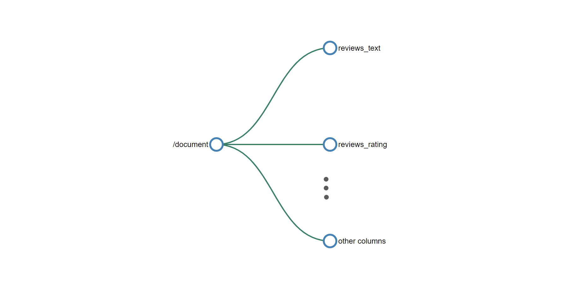
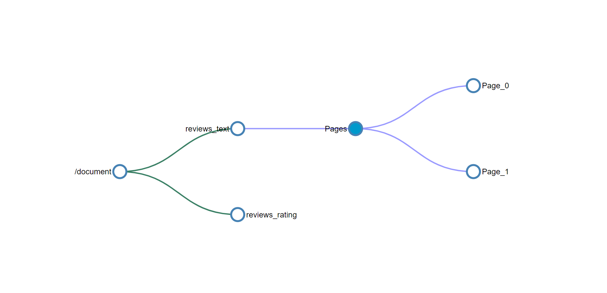
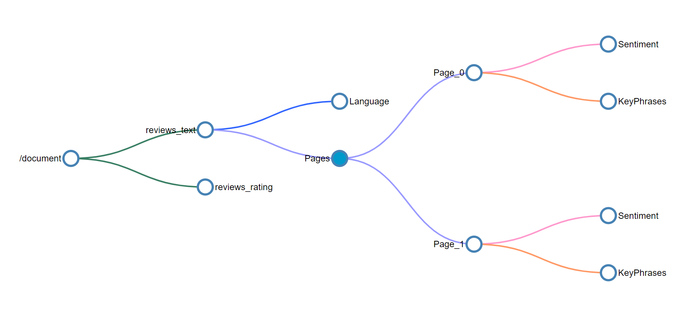

# Skillset concepts in Azure AI Search

This article is for developers who need a deeper understanding of skillset concepts and composition, and assumes familiarity with the high-level concepts of [AI enrichment](cognitive-search-concept-intro.md).

A skillset is a reusable resource in Azure AI Search that's attached to [an indexer](search-indexer-overview.md). It contains one or more skills that call built-in AI or external custom processing over documents retrieved from an external data source.

The following diagram illustrates the basic data flow of skillset execution. 

:::image type="content" source="media/cognitive-search-working-with-skillsets/skillset-process-diagram-1.png" alt-text="Diagram showing skillset data flows, with focus on inputs, outputs, and mappings." border="true":::

From the onset of skillset processing to its conclusion, skills read from and write to an [*enriched document*](#enrichment-tree). Initially, an enriched document is just the raw content extracted from a data source (articulated as the `"/document"` root node). With each skill execution, the enriched document gains structure and substance as skill writes its output as nodes in the graph. 

After skillset execution is done, the output of an enriched document finds its way into an index through *output field mappings*. Any raw content that you want transferred intact, from source to an index, is defined through *field mappings*.

To configure enrichment, you'll specify settings in a skillset and indexer.

## Skillset definition

A skillset is an array of one or more *skills* that perform an enrichment, such as translating text or OCR on an image file. Skills can be the [built-in skills](cognitive-search-predefined-skills.md) from Microsoft, or [custom skills](cognitive-search-create-custom-skill-example.md) for processing logic that you host externally. A skillset produces enriched documents that are either consumed during indexing or projected to a knowledge store.

Skills have a context, inputs, and outputs:

:::image type="content" source="media/cognitive-search-working-with-skillsets/skillset-process-diagram-2.png" alt-text="Diagram showing which properties of skillsets establish the data path." border="true":::

+ [Context](#skill-context) refers to the scope of the operation, which could be once per document or once for each item in a collection.

+ Inputs originate from nodes in an enriched document, where a "source" and "name" identify a given node.

+ Output is sent back to the enriched document as a new node. Values are the node "name" and node content. If a node name is duplicated, you can set a target name for disambiguation.

### Skill context

Each skill has a context, which can be the entire document (`/document`) or a node lower in the tree (`/document/countries/*`). A context determines:

+ The number of times the skill executes, over a single value (once per field, per document), or for context values of type collection, where adding an `/*` results in skill invocation, once for each instance in the collection. 

+ Output declaration, or where in the enrichment tree the skill outputs are added. Outputs are always added to the tree as children of the context node.

+ Shape of the inputs. For multi-level collections, setting the context to the parent collection will affect the shape of the input for the skill. For example if you have an enrichment tree with a list of countries/regions, each enriched with a list of states containing a list of ZIP codes, how you set the context will determine how the input is interpreted.

  |Context|Input|Shape of Input|Skill Invocation|
  |-------|-----|--------------|----------------|
  |`/document/countries/*` |`/document/countries/*/states/*/zipcodes/*` |A list of all ZIP codes in the country/region |Once per country/region |
  |`/document/countries/*/states/*` |`/document/countries/*/states/*/zipcodes/*` |A list of ZIP codes in the state | Once per combination of country/region and state|

### Skill dependencies

Skills can execute independently and in parallel, or sequentially if you feed the output of one skill into another skill. The following example demonstrates two [built-in skills](cognitive-search-predefined-skills.md) that execute in sequence:

+ Skill #1 is a [Text Split skill](cognitive-search-skill-textsplit.md) that accepts the contents of the "reviews_text" source field as input, and splits that content into "pages" of 5000 characters as output. Splitting large text into smaller chunks can produce better outcomes for skills like sentiment detection.

+ Skill #2 is a [Sentiment Detection skill](cognitive-search-skill-sentiment.md) accepts "pages" as input, and produces a new field called "Sentiment" as output that contains the results of sentiment analysis.

Notice how the output of the first skill ("pages") is used in sentiment analysis, where "/document/reviews_text/pages/*" is both the context and input. For more information about path formulation, see [How to reference annotations](cognitive-search-concept-annotations-syntax.md).

```json
{
    "skills": [
        {
            "@odata.type": "#Microsoft.Skills.Text.SplitSkill",
            "name": "#1",
            "description": null,
            "context": "/document/reviews_text",
            "defaultLanguageCode": "en",
            "textSplitMode": "pages",
            "maximumPageLength": 5000,
            "inputs": [
                {
                    "name": "text",
                    "source": "/document/reviews_text"
                }
            ],
            "outputs": [
                {
                    "name": "textItems",
                    "targetName": "pages"
                }
            ]
        },
        {
            "@odata.type": "#Microsoft.Skills.Text.SentimentSkill",
            "name": "#2",
            "description": null,
            "context": "/document/reviews_text/pages/*",
            "defaultLanguageCode": "en",
            "inputs": [
                {
                    "name": "text",
                    "source": "/document/reviews_text/pages/*",
                }
            ],
            "outputs": [
                {
                    "name": "sentiment",
                    "targetName": "sentiment"
                },
                {
                    "name": "confidenceScores",
                    "targetName": "confidenceScores"
                },
                {
                    "name": "sentences",
                    "targetName": "sentences"
                }
            ]
        }
      . . .
  ]
}
```

## Enrichment tree

An enriched document is a temporary, tree-like data structure created during skillset execution that collects all of the changes introduced through skills. Collectively, enrichments are represented as a hierarchy of addressable nodes. Nodes also include any unenriched fields that are passed in verbatim from the external data source. 

An enriched document exists for the duration of skillset execution, but can be [cached](cognitive-search-incremental-indexing-conceptual.md) or sent to a [knowledge store](knowledge-store-concept-intro.md). 

Initially, an enriched document is simply the content extracted from a data source during [*document cracking*](search-indexer-overview.md#document-cracking), where text and images are extracted from the source and made available for language or image analysis. 

The initial content is metadata and the *root node* (`document/content`). The root node is usually a whole document or a normalized image that is extracted from a data source during document cracking. How it's articulated in an enrichment tree varies for each data source type. The following table shows the state of a document entering into the enrichment pipeline for several supported data sources:

|Data Source\Parsing Mode|Default|JSON, JSON Lines & CSV|
|---|---|---|
|Blob Storage|/document/content<br>/document/normalized_images/*<br>…|/document/{key1}<br>/document/{key2}<br>…|
|Azure SQL|/document/{column1}<br>/document/{column2}<br>…|N/A |
|Azure Cosmos DB|/document/{key1}<br>/document/{key2}<br>…|N/A|

As skills execute, output is added to the enrichment tree as new nodes. If skill execution is over the entire document, nodes are added at the first level under the root.

Nodes can be used as inputs for downstream skills. For example, skills that create content, such as translated strings, could become input for skills that recognize entities or extract key phrases.

:::image type="content" source="media/cognitive-search-working-with-skillsets/skillset-def-enrichment-tree.png" alt-text="Skills read and write from enrichment tree" border="false":::

Although you can visualize and work with an enrichment tree through the [Debug Sessions visual editor](cognitive-search-debug-session.md), it's mostly an internal structure. 

Enrichments are immutable: once created, nodes can't be edited. As your skillsets get more complex, so will your enrichment tree, but not all nodes in the enrichment tree need to make it to the index or the knowledge store. 

You can selectively persist just a subset of the enrichment outputs so that you're only keeping what you intend to use. The [output field mappings](cognitive-search-output-field-mapping.md) in your indexer definition will determine what content actually gets ingested in the search index. Likewise, if you're creating a knowledge store, you can map outputs into [shapes](knowledge-store-projection-shape.md) that are assigned to projections.

> [!NOTE]
> The enrichment tree format enables the enrichment pipeline to attach metadata to even primitive data types. The metadata won't be a valid JSON object, but can be projected into a valid JSON format in projection definitions in a knowledge store. For more information, see [Shaper skill](cognitive-search-skill-shaper.md).

## Indexer definition

An indexer has properties and parameters used to configure indexer execution. Among those properties are mappings that set the data path to fields in a search index.

:::image type="content" source="media/cognitive-search-working-with-skillsets/skillset-process-diagram-3.png" alt-text="Diagram showing which properties of indexers establish the data path to fields in an index." lightbox="media/cognitive-search-working-with-skillsets/skillset-process-diagram-3.png" border="true":::

There are two sets of mappings:

+ ["fieldMappings"](search-indexer-field-mappings.md) map a source field to a search field.

+ ["outputFieldMappings"](cognitive-search-output-field-mapping.md) map a node in an enriched document to a search field. 

The "sourceFieldName" property specifies either a field in your data source or a node in an enrichment tree. The "targetFieldName" property specifies the search field in an index that receives the content.

## Enrichment example

Using the [hotel reviews skillset](https://github.com/Azure-Samples/azure-search-sample-data/blob/main/hotelreviews/HotelReviews_skillset.json) as a reference point, this example explains how an [enrichment tree](cognitive-search-working-with-skillsets.md#enrichment-tree) evolves through skill execution using conceptual diagrams.

This example also shows:

+ How a skill's context and inputs work to determine how many times a skill executes
+ What the shape of the input is based on the context

In this example, source fields from a CSV file include customer reviews about hotels ("reviews_text") and ratings ("reviews_rating"). The indexer adds metadata fields from Blob storage, and skills add translated text, sentiment scores, and key phrase detection.

In the hotel reviews example, a "document" within the enrichment process represents a single hotel review.

> [!TIP]
> You can create a search index and knowledge store for this data in [Azure portal](knowledge-store-create-portal.md) or through [Postman and the REST APIs](knowledge-store-create-rest.md). You can also use [Debug Sessions](cognitive-search-debug-session.md) for insights into skillset composition, dependencies, and effects on an enrichment tree. Images in this article are pulled from Debug Sessions.

Conceptually, the initial enrichment tree looks as follows:



The root node for all enrichments is `"/document"`. When you're working with blob indexers, the `"/document"` node will have child nodes of `"/document/content"` and `"/document/normalized_images"`. When the data is CSV, as in this example, the column names will map to nodes beneath `"/document"`.

### Skill #1: Split skill

When source content consists of large chunks of text, it's helpful to break it into smaller components for greater accuracy of language, sentiment, and key phrase detection. There are two grains available: pages and sentences. A page consists of approximately 5000 characters.

A text split skill is typically first in a skillset.

```json
"@odata.type": "#Microsoft.Skills.Text.SplitSkill",
"name": "#1",
"description": null,
"context": "/document/reviews_text",
"defaultLanguageCode": "en",
"textSplitMode": "pages",
"maximumPageLength": 5000,
"inputs": [
{
    "name": "text",
    "source": "/document/reviews_text"
}
],
"outputs": [
{
    "name": "textItems",
    "targetName": "pages"
}
```

With the skill context of `"/document/reviews_text"`, the split skill executes once for the `reviews_text`. The skill output is a list where the `reviews_text` is chunked into 5000 character segments. The output from the split skill is named `pages` and it's added to the enrichment tree. The `targetName` feature allows you to rename a skill output before being added to the enrichment tree.

The enrichment tree now has a new node placed under the context of the skill. This node is available to any skill, projection, or output field mapping. 
 


To access any of the enrichments added to a node by a skill, the full path for the enrichment is needed. For example, if you want to use the text from the ```pages``` node as an input to another skill, you'll need to specify it as ```"/document/reviews_text/pages/*"```. For more information about paths, see [Reference annotations](cognitive-search-concept-annotations-syntax.md).

### Skill #2 Language detection

Hotel review documents include customer feedback expressed in multiple languages. The language detection skill determines which language is used. The result will then be passed to key phrase extraction and sentiment detection (not shown), taking language into consideration when detecting sentiment and phrases.

While the language detection skill is the third (skill #3) skill defined in the skillset, it's the next skill to execute. It doesn't require any inputs so it executes in parallel with the previous skill. Like the split skill that preceded it, the language detection skill is also invoked once for each document. The enrichment tree now has a new node for language.

 

### Skills #3 and #4 (sentiment analysis and key phrase detection)

Customer feedback reflects a range of positive and negative experiences. The sentiment analysis skill analyzes the feedback and assigns a score along a continuum of negative to positive numbers, or neutral if sentiment is undetermined. Parallel to sentiment analysis, key phrase detection identifies and extracts words and short phrases that appear consequential.

Given the context of `/document/reviews_text/pages/*`, both sentiment analysis and key phrase skills will be invoked once for each of the items in the `pages` collection. The output from the skill will be a node under the associated page element. 

You should now be able to look at the rest of the skills in the skillset and visualize how the tree of enrichments will continue to grow with the execution of each skill. Some skills, such as the merge skill and the shaper skill, also create new nodes but only use data from existing nodes and don't create net new enrichments.



The colors of the connectors in the tree above indicate that the enrichments were created by different skills and the nodes will need to be addressed individually and won't be part of the object returned when selecting the parent node.

### Skill #5 Shaper skill

If output includes a [knowledge store](knowledge-store-concept-intro.md), add a [Shaper skill](cognitive-search-skill-shaper.md) as a last step. The Shaper skill creates data shapes out of nodes in an enrichment tree. For example, you might want to consolidate multiple nodes into a single shape. You can then project this shape as a table (nodes become the columns in a table), passing the shape by name to a table projection.

The Shaper skill is easy to work with because it focuses shaping under one skill. Alternatively, you can opt for in-line shaping within individual projections. The Shaper Skill doesn't add or detract from an enrichment tree, so it's not visualized. Instead, you can think of a Shaper skill as the means by which you rearticulate the enrichment tree you already have. Conceptually, this is similar to creating views out of tables in a database.

```json
{
  "@odata.type": "#Microsoft.Skills.Util.ShaperSkill",
  "name": "#5",
  "description": null,
  "context": "/document",
  "inputs": [
    {
      "name": "name",
      "source": "/document/name"
    },
    {
      "name": "reviews_date",
      "source": "/document/reviews_date"
    },
    {
      "name": "reviews_rating",
      "source": "/document/reviews_rating"
    },
    {
      "name": "reviews_text",
      "source": "/document/reviews_text"
    },
    {
      "name": "reviews_title",
      "source": "/document/reviews_title"
    },
    {
      "name": "AzureSearch_DocumentKey",
      "source": "/document/AzureSearch_DocumentKey"
    },
    {
      "name": "pages",
      "sourceContext": "/document/reviews_text/pages/*",
      "inputs": [
        {
          "name": "Sentiment",
          "source": "/document/reviews_text/pages/*/Sentiment"
        },
        {
          "name": "LanguageCode",
          "source": "/document/Language"
        },
        {
          "name": "Page",
          "source": "/document/reviews_text/pages/*"
        },
        {
          "name": "keyphrase",
          "sourceContext": "/document/reviews_text/pages/*/Keyphrases/*",
          "inputs": [
            {
              "name": "Keyphrases",
              "source": "/document/reviews_text/pages/*/Keyphrases/*"
            }
          ]
        }
      ]
    }
  ],
  "outputs": [
    {
      "name": "output",
      "targetName": "tableprojection"
    }
  ]
}
```

## Next steps

With an introduction and example behind you, try creating your first skillset using [built-in skills](cognitive-search-predefined-skills.md).

> [!div class="nextstepaction"]
> [Create your first skillset](cognitive-search-defining-skillset.md)
