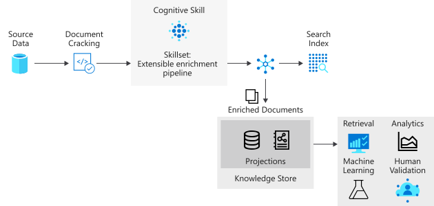
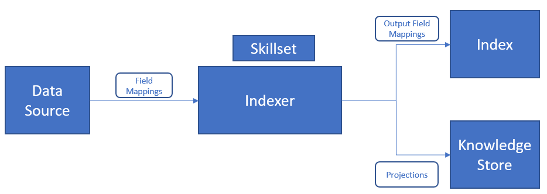

# Skillset concepts in Azure Cognitive Search

This article is for developers who need a deeper understanding of skillset concepts and composition, and assumes familiarity with the AI enrichment process. If you are new to this concept, start with [AI enrichment in Azure Cognitive Search](cognitive-search-concept-intro.md).

## Introducing skillsets

A skillset is a reusable resource in Azure Cognitive Search that is attached to an indexer, and it specifies a collection of skills used for analyzing, transforming, and enriching text or image content during indexing. Skills have inputs and outputs, and often the output of one skill becomes the input of another in a chain or sequence of processes.

A skillset has three main properties:

+ `skills`, an unordered collection of skills for which the platform determines the sequence of execution based on the inputs required for each skill.
+ `cognitiveServices`, the key of a Cognitive Services resource that performs image and text processing for skillsets that include built-in skills.
+ `knowledgeStore`, (optional) an Azure Storage account where your enriched documents will be projected. Enriched documents are also consumed by search indexes.

Skillsets are authored in JSON. The following example is a slightly simplified version of this [hotel-reviews skillset](https://github.com/Azure-Samples/azure-search-sample-data/blob/master/hotelreviews/HotelReviews_skillset.json), used to illustrate concepts in this article. 

The first two skills are shown below:

+ Skill #1 is a [Text Split skill](cognitive-search-skill-textsplit.md) that accepts the contents of the "reviews_text" field as input, and splits that content into "pages" of 5000 characters as output.
+ Skill #2 is a [Sentiment Detection skill](cognitive-search-skill-sentiment.md) accepts "pages" as input, and produces a new field called "Sentiment" as output that contains the results of sentiment analysis.


```json
{
    "skills": [
        {
            "@odata.type": "#Microsoft.Skills.Text.SplitSkill",
            "name": "#1",
            "description": null,
            "context": "/document/reviews_text",
            "defaultLanguageCode": "en",
            "textSplitMode": "pages",
            "maximumPageLength": 5000,
            "inputs": [
                {
                    "name": "text",
                    "source": "/document/reviews_text"
                }
            ],
            "outputs": [
                {
                    "name": "textItems",
                    "targetName": "pages"
                }
            ]
        },
        {
            "@odata.type": "#Microsoft.Skills.Text.SentimentSkill",
            "name": "#2",
            "description": null,
            "context": "/document/reviews_text/pages/*",
            "defaultLanguageCode": "en",
            "inputs": [
                {
                    "name": "text",
                    "source": "/document/reviews_text/pages/*",
                }
            ],
            "outputs": [
                {
                    "name": "score",
                    "targetName": "Sentiment"
                }
            ]
        },
  "cognitiveServices": null,
  "knowledgeStore": {  }
}
```
> [!NOTE]
> You can build complex skillsets with looping and branching, using the [Conditional skill](cognitive-search-skill-conditional.md) to create the expressions. The syntax is based on the [JSON Pointer](https://tools.ietf.org/html/rfc6901) path notation, with a few modifications to identify nodes in the enrichment tree. A `"/"` traverses a level lower in the tree and  `"*"` acts as a for-each operator in the context. Numerous examples in this article illustrate the syntax. 

### Enrichment tree

In the progression of [steps in an enrichment pipeline](cognitive-search-concept-intro.md#enrichment-steps), content processing follows the *document cracking* phase where text and images are extracted from the source. Image content can then be routed to skills that specify image processing, while text content is queued for text processing. For source documents that contain large quantities of text, you can set a *parsing mode* on the indexer to segment text into smaller chunks for more optimal processing. 



Once a document is in the enrichment pipeline, it is represented as a tree of content and associated enrichments. This tree is instantiated as the output of document cracking.  The enrichment tree format enables the enrichment pipeline to attach metadata to even primitive data types, it is not a valid JSON object but can be projected into a valid JSON format. The following table shows the state of a document entering into the enrichment pipeline:

|Data Source\Parsing Mode|Default|JSON, JSON Lines & CSV|
|---|---|---|
|Blob Storage|/document/content<br>/document/normalized_images/*<br>…|/document/{key1}<br>/document/{key2}<br>…|
|SQL|/document/{column1}<br>/document/{column2}<br>…|N/A |
|Cosmos DB|/document/{key1}<br>/document/{key2}<br>…|N/A|

 As skills execute, they add new nodes to the enrichment tree. These new nodes may then be used as inputs for downstream skills, projecting to the knowledge store, or mapping to index fields. Enrichments aren't mutable: once created, nodes cannot be edited. As your skillsets get more complex, so will your enrichment tree, but not all nodes in the enrichment tree need to make it to the index or the knowledge store. 

You can selectively persist only a subset of the enrichments to the index or the knowledge store.

### Context

Each skill requires a context. A context determines:

+ The number of times the skill executes, based on the nodes selected. For context values of type collection, adding an `/*` at the end will result in the skill being invoked once for each instance in the collection. 

+ Where in the enrichment tree the skill outputs are added. Outputs are always added to the tree as children of the context node. 

+ Shape of the inputs. For multi level collections, setting the context to the parent collection will affect the shape of the input for the skill. For example if you have an enrichment tree with a list of countries/regions, each enriched with a list of states containing a list of ZIP codes.

|Context|Input|Shape of Input|Skill Invocation|
|-------|-----|--------------|----------------|
|`/document/countries/*` |`/document/countries/*/states/*/zipcodes/*` |A list of all ZIP codes in the country/region |Once per country/region |
|`/document/countries/*/states/*` |`/document/countries/*/states/*/zipcodes/*`` |A list of ZIP codes in the state | Once per combination of country/region and state|

## Generate enriched data 

Using the [hotel reviews skillset](https://github.com/Azure-Samples/azure-search-sample-data/blob/master/hotelreviews/HotelReviews_skillset.json) as a reference point, we are going to look at:

+ How the enrichment tree evolves with the execution of each skill
+ How the context and inputs work to determine how many times a skill executes
+ What the shape of the input is based on the context

A "document" within the enrichment process represents a single row (a hotel review) within the hotel_reviews.csv source file.

### Skill #1: Split skill

When source content consists of large chunks of text, it's helpful to break it into smaller components for greater accuracy of language, sentiment, and key phrase detection. There are two grains available: pages and sentences. A page consists of approximately 5000 characters.

A text split skill is typically first in a skillset.

```json
      "@odata.type": "#Microsoft.Skills.Text.SplitSkill",
      "name": "#1",
      "description": null,
      "context": "/document/reviews_text",
      "defaultLanguageCode": "en",
      "textSplitMode": "pages",
      "maximumPageLength": 5000,
      "inputs": [
        {
          "name": "text",
          "source": "/document/reviews_text"
        }
      ],
      "outputs": [
        {
          "name": "textItems",
          "targetName": "pages"
        }
```

With the skill context of `"/document/reviews_text"`, the split skill will execute once for the `reviews_text`. The skill output is a list where the `reviews_text` is chunked into 5000 character segments. The output from the split skill is named `pages` and it is added to the enrichment tree. The `targetName` feature allows you to rename a skill output before being added to the enrichment tree.

The enrichment tree now has a new node placed under the context of the skill. This node is available to any skill, projection, or output field mapping. Conceptually, the tree looks as follows:


The root node for all enrichments is `"/document"`. When working with blob indexers, the `"/document"` node will have child nodes of `"/document/content"` and `"/document/normalized_images"`. When working with CSV data, as we are in this example, the column names will map to nodes beneath `"/document"`. 

To access any of the enrichments added to a node by a skill, the full path for the enrichment is needed. For example, if you want to use the text from the ```pages``` node as an input to another skill, you will need to specify it as ```"/document/reviews_text/pages/*"```.
 
 

### Skill #2 Language detection

Hotel review documents include customer feedback expressed in multiple languages. The language detection skill determines which language is used. The result is then passed to key phrase extraction and sentiment detection, taking language into consideration when detecting sentiment and phrases.

While the language detection skill is the third (skill #3) skill defined in the skillset, it is the next skill to execute. Since it is not blocked by requiring any inputs, it will execute in parallel with the previous skill. Like the split skill that preceded it, the language detection skill is also invoked once for each document. The enrichment tree now has a new node for language.

 
 
 ### Skill #3: Key phrases skill 

Given the context of `/document/reviews_text/pages/*` the key phrases skill will be invoked once for each of the items in the `pages` collection. The output from the skill will be a node under the associated page element. 

 You should now be able to look at the rest of the skills in the skillset and visualize how the tree of enrichments will continue to grow with the execution of each skill. Some skills, such as the merge skill and the shaper skill, also create new nodes but only use data from existing nodes and don't create net new enrichments.


The colors of the connectors in the tree above indicate that the enrichments were created by different skills and the nodes will need to be addressed individually and will not be part of the object returned when selecting the parent node.

## Save enrichments

In Azure Cognitive Search, an indexer saves the output it creates. One of the outputs is always a [searchable index](search-what-is-an-index.md). Specifying an index is a requirement, and when you attach a skillset, the data ingested by an index includes the substance of the enrichments. Usually, the outputs of specific skills, such as key phrases or sentiment scores, are ingested into the index in a field created for that purpose.

Optionally, an indexer can also send the output to a [knowledge store](knowledge-store-concept-intro.md) for consumption in other tools or processes. A knowledge store is defined as part of the skillset. It's definition determines whether your enriched documents are projected as tables or objects (files or blobs). Tabular projections are well-suited for interactive analysis in tools like Power BI, whereas files and blobs are typically used in data science or similar processes. In this section, you'll learn how skillset composition can shape the tables or objects you want to project.

### Projections

For content that targets a knowledge store, you will want to consider how the content is structured. *Projection* is the process of selecting the nodes from the enrichment tree and creating a physical expression of them in the knowledge store. Projections are custom shapes of the document (content and enrichments) that can be output as either table or object projections. To learn more about working with projections, see [working with projections](knowledge-store-projection-overview.md).



### SourceContext

The `sourceContext` element is only used in skill inputs and projections. It is used to construct multi-level, nested objects. You may need to create a new object to either pass it as an input to a skill or project into the knowledge store. As enrichment nodes may not be a valid JSON object in the enrichment tree and referencing a node in the tree only returns that state of the node when it was created, using the enrichments as skill inputs or projections requires you to create a well formed JSON object. The `sourceContext` enables you to construct a hierarchical, anonymous type object, which would require multiple skills if you were only using the context. 

Using `sourceContext` is shown in the following examples. Look at the skill output that generated an enrichment to determine if it is a valid JSON object and not a primitive type.

### Slicing projections

When defining a table projection group, a single node in the enrichment tree can be sliced into multiple related tables. If you add a table with a source path that is a child of an existing table projection, the resulting child node will not be a child of the existing table projection, but instead will be projected into the new, related, table. This slicing technique allows you to define a single node in a shaper skill that can be the source for all your table projections. 

### Shaping projections

There are two ways to define a projection:

+ Use the Text Shaper skill to create a new node that is the root node for all the enrichments you are projecting. Then, in your projections, you would only reference the output of the shaper skill.

+ Use an inline shape a projection within the projection definition itself.

The shaper approach is more verbose than inline shaping but ensures that all the mutations of the enrichment tree are contained within the skills and that the output is an object that can be reused. In contrast, inline shaping allows you to create the shape you need, but is an anonymous object and is only available to the projection for which it is defined. The approaches can be used together or separately. The skillset created for you in the portal workflow contains both. It uses a shaper skill for the table projections, but also uses inline shaping to project the key phrases table.

To extend the example, you could choose to remove the inline shaping and use a shaper skill to create a new node for the key phrases. To create a shape projected into three tables, namely, `hotelReviewsDocument`, `hotelReviewsPages`, and `hotelReviewsKeyPhrases`, the two options are described in the following sections.

#### Shaper skill and projection

> [!Note]
> Some of the columns from the document table have been removed from this example for brevity.
>
```json
{
    "@odata.type": "#Microsoft.Skills.Util.ShaperSkill",
    "name": "#5",
    "description": null,
    "context": "/document",
    "inputs": [        
        {
            "name": "reviews_text",
            "source": "/document/reviews_text",
            "sourceContext": null,
            "inputs": []
        },
        {
            "name": "reviews_title",
            "source": "/document/reviews_title",
            "sourceContext": null,
            "inputs": []
        },
        {
            "name": "AzureSearch_DocumentKey",
            "source": "/document/AzureSearch_DocumentKey",
            "sourceContext": null,
            "inputs": []
        },  
        {
            "name": "pages",
            "source": null,
            "sourceContext": "/document/reviews_text/pages/*",
            "inputs": [
                {
                    "name": "SentimentScore",
                    "source": "/document/reviews_text/pages/*/Sentiment",
                    "sourceContext": null,
                    "inputs": []
                },
                {
                    "name": "LanguageCode",
                    "source": "/document/Language",
                    "sourceContext": null,
                    "inputs": []
                },
                {
                    "name": "Page",
                    "source": "/document/reviews_text/pages/*",
                    "sourceContext": null,
                    "inputs": []
                },
                {
                    "name": "keyphrase",
                    "sourceContext": "/document/reviews_text/pages/*/Keyphrases/*",
                    "inputs": [
                        {
                            "source": "/document/reviews_text/pages/*/Keyphrases/*",
                            "name": "Keyphrases"
                        }
                    ]
                }
            ]
        }
    ],
    "outputs": [
        {
            "name": "output",
            "targetName": "tableprojection"
        }
    ]
}
```

With the `tableprojection` node defined in the `outputs` section above, we can now use the slicing feature to project parts of the `tableprojection` node into different tables:

> [!Note]
> This is only a snippet of the projection within the knowledge store configuration.
>
```json
"projections": [
    {
        "tables": [
            {
                "tableName": "hotelReviewsDocument",
                "generatedKeyName": "Documentid",
                "source": "/document/tableprojection"
            },
            {
                "tableName": "hotelReviewsPages",
                "generatedKeyName": "Pagesid",
                "source": "/document/tableprojection/pages/*"
            },
            {
                "tableName": "hotelReviewsKeyPhrases",
                "generatedKeyName": "KeyPhrasesid",
                "source": "/document/tableprojection/pages/*/keyphrase/*"
            }
        ]
    }
]
```

#### Inline shaping projections

The inline shaping approach does not require a shaper skill as all shapes needed for the projections are created at the time they are needed. To project the same data as the previous example, the inline projection option would look like this:

```json
"projections": [
    {
        "tables": [
            {
                "tableName": "hotelReviewsInlineDocument",
                "generatedKeyName": "Documentid",
                "sourceContext": "/document",     
                "inputs": [
                    {
                        "name": "reviews_text",
                        "source": "/document/reviews_text"
                    },
                    {
                        "name": "reviews_title",
                        "source": "/document/reviews_title"
                    },
                    {
                        "name": "AzureSearch_DocumentKey",
                        "source": "/document/AzureSearch_DocumentKey"
                    }                             
                ]
            },
            {
                "tableName": "hotelReviewsInlinePages",
                "generatedKeyName": "Pagesid",
                "sourceContext": "/document/reviews_text/pages/*",
                "inputs": [
                        {
                    "name": "SentimentScore",
                    "source": "/document/reviews_text/pages/*/Sentiment"
                    },
                    {
                        "name": "LanguageCode",
                        "source": "/document/Language"
                    },
                    {
                        "name": "Page",
                        "source": "/document/reviews_text/pages/*"
                    }
                ]
            },
            {
                "tableName": "hotelReviewsInlineKeyPhrases",
                "generatedKeyName": "KeyPhraseId",
                "sourceContext": "/document/reviews_text/pages/*/Keyphrases/*",
                "inputs": [
                    {
                        "name": "Keyphrases",
                        "source": "/document/reviews_text/pages/*/Keyphrases/*"
                    }
                ]
            }
        ]
    }
]
```
  
One observation from both the approaches is how values of `"Keyphrases"` are projected using the `"sourceContext"`. The `"Keyphrases"` node, which contains a collection of strings, is itself a child of the page text. However, because projections require a JSON object and the page is a primitive (string), the `"sourceContext"` is used to wrap the key phrase into an object with a named property. This technique enables even primitives to be projected independently.

## Next steps

As a next step, create your first skillset with cognitive skills.

> [!div class="nextstepaction"]
> [Create your first skillset](cognitive-search-defining-skillset.md).
