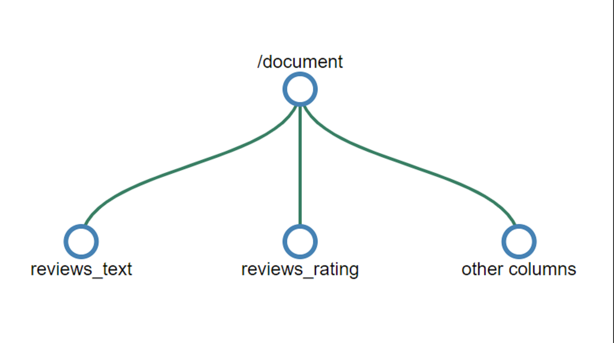
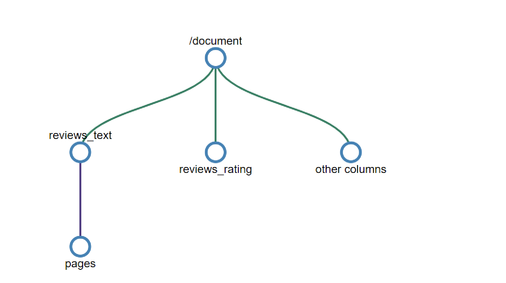
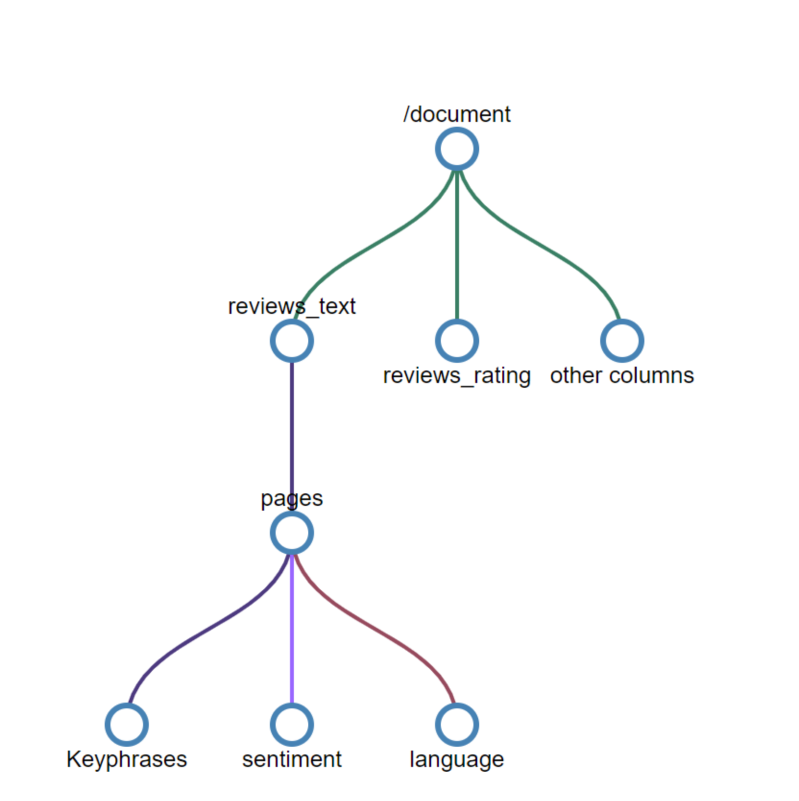

# Working with skillsets

Skillsets are where you author and organize the AI enrichment pipeline to apply to each document. 

A skillset has three properties:

+	```skills```, an unordered collection of skills for which the platform determines the sequence of execution based on the inputs required for each skill
+	```cognitiveServices```, the cognitive services key required for billing the cognitive skills invoked
+	```knowledgeStore```, the storage account where your enriched documents will be projected

Skillsets are authored in JSON. You can build complex skillsets with looping and [branching](https://docs.microsoft.com/en-us/azure/search/cognitive-search-skill-conditional) using the [expression language](https://docs.microsoft.com/azure/search/cognitive-search-skill-conditional). The expression language uses the [JSON Pointer](https://tools.ietf.org/html/rfc6901) path notation with a few modifications to identify nodes in the enrichment tree. A ```"/"``` traverses a level lower in the tree and  ```"*"``` acts as a for-each operator in the context. These concepts are best described with an example. To illustrate some of the concepts and capabilities, we'll walk through the [hotel reviews sample](knowledge-store-connect-powerbi.md) skillset. To view the skillset once you've followed the import data workflow, you'll need to use a REST API client to [get the skillset](https://docs.microsoft.com/en-us/rest/api/searchservice/get-skillset).

## Specify the Skillset

### Enrichment tree

To see how a skillset progressively enriches your document, let’s start with how the document initially looks. The output of document cracking is dependent on the data source and the specific parsing mode selected. The document cracking result is also the state of the document that the [field mappings](search-indexer-field-mappings.md) uses for adding content to the search index.
\

The enrichment tree is the JSON representation of the document and enrichments as it flows through the enrichment pipeline. This tree is instantiated as the output of document cracking. The following table shows the state of a document entering into the enrichment pipeline:

|Data Source\Parsing Mode|Default|JSON|JSON Lines/CSV|
|---|---|---|---|
|Blob Storage|/document/content<br>/document/normalized_images/*<br>…|/document/{key1}<br>/document/{key2}<br>…|/document/{key1}<br>/document/{key2}<br>… |
|SQL|/document/{column1}<br>/document/{column2}<br>…|N/A |N/A|
|Cosmos DB|/document/{key1}<br>/document/{key2}<br>…|N/A|N/A|

 As skills execute, they add new nodes to the enrichment tree. These new nodes may then be used as inputs for downstream skills, projecting to the knowledge store, or mapping to index fields. Enrichments aren't mutable: once created, nodes cannot be edited. As your skillsets get more complex, so will your enrichment tree, but not all nodes in the enrichment tree need to make it to the index or the knowledge store. You can selectively persist only a subset of the enrichments to the index or the knowledge store.

For the rest of this document, we'll assume we're working with [the hotel reviews example](https://docs.microsoft.com/en-us/azure/search/knowledge-store-connect-powerbi), but the same concepts apply to enriching documents from all data sources.

### Context

Each skill requires a context. A context determines:

+	The number of times the skill executes, based on the nodes selected. For context values of type collection, adding an ```/*``` at the end will result in the skill being invoked once for each instance in the collection. 
+	Where in the enrichment tree the skill outputs are added. Outputs are always added to the tree as children of the context node.
+	The nodes to be enriched. For contexts that contain multiple nested collections the context performs the equivalent of a flatmap {>>Reference LINQ `SelectMany`? Not sure if the audience will recognize flatmap? <<} to yield a set of nodes that will be enriched.
+	Where in the tree the input is evaluated. Inputs can only be sourced from nodes scoped by the context. 

### SourceContext

The `sourceContext` is only used in shaper skills and projections. It is used to construct multi-level, nested objects. The `sourceContext` enables you to construct a hierarchical, anonymous type object, which would require multiple skills if you were only using the context. Using `sourceContext` is shown in the next section.

### Projections

Projection is the process of selecting the nodes from the enrichment tree to be saved in the knowledge store. Projections are custom shapes of the document (content and enrichments) that can be output as either table or object projections. To learn more about working with projections, see [working with projections](knowledge-store-projection-overview.md).

|Source |Destination |Selector |
|---|---|---|
|Document content |Index| Field mapping |
|Enrichment (skill) output| Index| Output field mapping |
|Document content |Knowledge store |Projection |
|Enrichment output |Knowledge store |Projection |

The matrix above describes the type of selector you choose given the source and destination of the data.

## Generate enriched data 

Let’s now step through the hotel reviews skillset and look at:

* how the enrichment tree evolves with the execution of each skill 
* how the context and inputs work to determine how many times a skill executes 
* what the shape of the input is based on the context. 

Since we're using the delimited text parsing mode for the indexer, a document within the enrichment process represents a single row within the CSV file.

### Skill #1: Split skill 



{>> Can this be delivered in SVG? If not, please resize so that all images have same size nodes and crop to a max dimension of 1200px <<}

With the skill context of ```"/document/reviews_text"```, this skill will execute once for the `review_text`. The skill output is a list where the `review_text` is chunked into 5000 character segments. The output from the split skill is named `pages` and added to the enrichment tree. The `targetName` feature allows you to rename a skill output before being added to the enrichment tree.

The enrichment tree now has a new node placed under the context of the skill. This node is available to any skill, projection, or output field mapping.


The root node for all enrichments is `"/document"`. When working with blob indexers, the `"/document"` node will have child nodes of `"/document/content"` and `"/document/normalized_images"`. When working with CSV data, as we are in this example, the column names will map to nodes beneath `"/document"`. {>> Please confirm this rewrite <<}

To access any of the enrichments added to a node by a skill, the full path for the enrichment is needed. For example, if you want to use the text from the ```pages``` node as an input to another skill, you will need to specify it as ```"/document/reviews_text/pages/*"```.
 
 
{>> Can "reviews_text" be shifted to side of node to avoid being obscured? <<} 

 ### Skill #2: Key phrases skill 

Given the context of ```/document/reviews_text/pages/*``` the key phrases skill will be invoked once for each of the items in the `pages` collection. The output from the skill will be a node {>> nodes? <<} under the associated page element. {>> Please confirm this rewrite. <<}

 You should now be able to look at the rest of the skills in the skillset and visualize how the tree of enrichments will continue to grow with the execution of each skill. Some skills, such as the merge skill and the shaper skill, also create new nodes but only use data from existing nodes and don't create net new enrichments.



{>> Can `reviews_text` and `pages` be moved to side of node in image? Is `Keyphrases` accurately capitalized? Can image be delivered in SVG (preferred for conceptual art)? If not,    <<}

The colors of the connectors in the tree above indicate that the enrichments were created by different skills and the nodes will need to be addressed individually. {>> Rephrase / rewrite? 'The nodes will need to be addressed individually' by whom or what? <<}

## Keep enrichments in a knowledge store 

Skillsets also define a knowledge store where your enriched documents can be projected as tables or objects. To save your enriched data in the knowledge store, you define a set of projections of your enriched document. To learn more about the knowledge store see [What is knowledge store in Azure Search?](knowledge-store-concept-intro.md)

### Slicing projections

When defining a table projection group, a single node in the enrichment tree can be sliced into multiple related tables. If you add a table with a source path that is a child of an existing table projection, the resulting child node will not be a child of the existing table projection, but instead will be projected into the new, related, table. {>> Please confirm this rewrite.<<} This slicing technique allows you to define a single node in a shaper skill that can be the source for all your table projections. 

### Shaping projections

There are two ways to define a projection. You could use a shaper skill to create a new node that is the root node for all the enrichments you are projecting. Then, in your projections, you would only reference the output of the shaper skill. You could also inline shape a projection within the projection definition itself.

The shaper approach is more verbose than inline shaping but ensures that all the mutations of the enrichment tree are contained within the skills and that the output is an object that can be reused. Inline shaping allows you to create the shape you need, but is an anonymous object and is only available to the projection for which it is defined. The approaches can be used together or separately. The skillset created for you in the portal workflow contains both. It uses a shaper skill for the table projections, but also uses inline shaping to project the key phrases table.

To extend the example, you could choose to remove the inline shaping and use a shaper skill to create a new node for the key phrases. To create a shape projected into three tables, namely, `hotelReviewsDocument`, `hotelReviewsPages`, and `hotelReviewsKeyPhrases`, the two options are described in the following sections.

#### Shaper skill and projection 

> [!Note]
> Some of the columns from the document table have been removed from this example for brevity.
>
```json
{
    "@odata.type": "#Microsoft.Skills.Util.ShaperSkill",
    "name": "#5",
    "description": null,
    "context": "/document",
    "inputs": [        
        {
            "name": "name",
            "source": "/document/name",
            "sourceContext": null,
            "inputs": []
        },
        {
            "name": "reviews_date",
            "source": "/document/reviews_date",
            "sourceContext": null,
            "inputs": []
        },    
       {
            "name": "reviews_rating",
            "source": "/document/reviews_rating",
            "sourceContext": null,
            "inputs": []
        },
        {
            "name": "reviews_text",
            "source": "/document/reviews_text",
            "sourceContext": null,
            "inputs": []
        },
        {
            "name": "reviews_title",
            "source": "/document/reviews_title",
            "sourceContext": null,
            "inputs": []
        },
        {
            "name": "AzureSearch_DocumentKey",
            "source": "/document/AzureSearch_DocumentKey",
            "sourceContext": null,
            "inputs": []
        },  
        {
            "name": "pages",
            "source": null,
            "sourceContext": "/document/reviews_text/pages/*",
            "inputs": [
                {
                    "name": "SentimentScore",
                    "source": "/document/reviews_text/pages/*/Sentiment",
                    "sourceContext": null,
                    "inputs": []
                },
                {
                    "name": "LanguageCode",
                    "source": "/document/Language",
                    "sourceContext": null,
                    "inputs": []
                },
                {
                    "name": "Page",
                    "source": "/document/reviews_text/pages/*",
                    "sourceContext": null,
                    "inputs": []
                },
                {
                    "name": "keyphrase",
                    "sourceContext": "/document/reviews_text/pages/*/Keyphrases/*",
                    "inputs": [
                        {
                            "source": "/document/reviews_text/pages/*/Keyphrases/*",
                            "name": "Keyphrases"
                        }
                    ]
                }
            ]
        }
    ],
    "outputs": [
        {
            "name": "output",
            "targetName": "tableprojection"
        }
    ]
}
```

{>> Is it possible to make consistent the capitalization in `name` and `source` keys? e.g., keyphrase and Keyphrases, document/name vs document/Language, etc. <<}

With the `tableprojection` node defined in the `outputs` section above, we can now use the slicing feature to project parts of the `tableprojection` node into different tables:

> [!Note]
> This is only a snippet of the projection within the knowledge store configuration.
>
```json
"projections": [
    {
        "tables": [
            {
                "tableName": "hotelReviewsDocument",
                "generatedKeyName": "Documentid",
                "source": "/document/tableprojection"
            },
            {
                "tableName": "hotelReviewsPages",
                "generatedKeyName": "Pagesid",
                "source": "/document/tableprojection/pages/*"
            },
            {
                "tableName": "hotelReviewsKeyPhrases",
                "generatedKeyName": "KeyPhrasesid",
                "source": "/document/tableprojection/pages/*/keyphrase/*"
            }
        ]
    }
]
```

#### Inline shaping projections

The inline shaping approach does not require a shaper skill as all shapes needed for the projections are created at the time they are needed. To project the same data as the previous example, the inline projection option would look like this:

```json
"projections": [
    {
        "tables": [
            {
                "tableName": "hotelReviewsInlineDocument",
                "generatedKeyName": "Documentid",
                "sourceContext": "/document",     
                "inputs": [
                    {
                        "name": "name",
                        "source": "/document/name"
                    },
                    {
                        "name": "reviews_date",
                        "source": "/document/reviews_date"
                    },
                    {
                        "name": "reviews_rating",
                        "source": "/document/reviews_rating"
                    },
                    {
                        "name": "reviews_text",
                        "source": "/document/reviews_text"
                    },
                    {
                        "name": "reviews_title",
                        "source": "/document/reviews_title"
                    },
                    {
                        "name": "AzureSearch_DocumentKey",
                        "source": "/document/AzureSearch_DocumentKey"
                    }                             
                ]
            },
            {
                "tableName": "hotelReviewsInlinePages",
                "generatedKeyName": "Pagesid",
                "sourceContext": "/document/reviews_text/pages/*",
                "inputs": [
                        {
                    "name": "SentimentScore",
                    "source": "/document/reviews_text/pages/*/Sentiment"
                    },
                    {
                        "name": "LanguageCode",
                        "source": "/document/Language"
                    },
                    {
                        "name": "Page",
                        "source": "/document/reviews_text/pages/*"
                    }
                ]
            },
            {
                "tableName": "hotelReviewsInlineKeyPhrases",
                "generatedKeyName": "KeyPhraseId",
                "sourceContext": "/document/reviews_text/pages/*/Keyphrases/*",
                "inputs": [
                    {
                        "name": "Keyphrases",
                        "source": "/document/reviews_text/pages/*/Keyphrases/*"
                    }
                ]
            }
        ]
    }
]
```

{>> maybe change `kpidv2` to `KeyPhraseid` to match `PagesId` ? <<}
  
One observation from both the approaches is how values of `"Keyphrases"` are projected using the `"sourceContext"`. The `"Keyphrases"` node, which contains a collection of strings, is itself a child {>> s/child/descendant/ ? <<} of the review text. However, because projections require a JSON object and the review text is a primitive, the `"sourceContext"` is used to wrap the review text into an object with a named property. This technique enables even primitives to be projected independently.

## Next steps

As a next step, create your first skillset with cognitive skills.

> [!div class="nextstepaction"]
> [Create your first skillset](cognitive-search-defining-skillset.md).