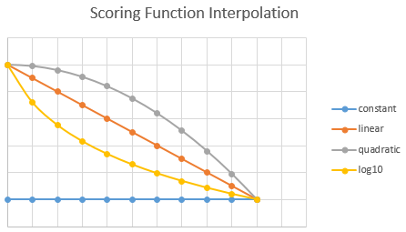

# Add scoring profiles to boost search scores

In this article, you'll learn how to define a scoring profile. A scoring profile is critera for boosting a search score based on parameters that you provide. For example, you might want matches found in a "tags" field to be more relevant than the same match found in "descriptions". Criteria can be a weighted field (such as the "tags" example) or a function. 

Scoring profiles are defined in a search index and invoked on non-vector fields in query requests. You can create multiple profiles and then modify query logic to choose which one is used.

> [!NOTE]
> Unfamiliar with relevance concepts? The following [video segment on YouTube](https://www.youtube.com/embed/Y_X6USgvB1g?version=3&start=463&end=970) fast-forwards to how scoring profiles work in Azure AI Search. You can also visit [Relevance and scoring in Azure AI Search](index-similarity-and-scoring.md) for more background.
>

## Scoring profile definition

A scoring profile is named object defined in an index schema. A profile can be composed of weighted fields, functions, and parameters.

The following definition shows a simple profile named "geo". This example boosts results that have the search term in the hotelName field. It also uses the `distance` function to favor results that are within 10 kilometers of the current location. If someone searches on the term 'inn', and 'inn' happens to be part of the hotel name, documents that include hotels with 'inn' within a 10 KM radius of the current location will appear higher in the search results.  

```json
"scoringProfiles": [
  {  
    "name":"geo",
    "text": {  
      "weights": {  
        "hotelName": 5
      }                              
    },
    "functions": [
      {  
        "type": "distance",
        "boost": 5,
        "fieldName": "location",
        "interpolation": "logarithmic",
        "distance": {
          "referencePointParameter": "currentLocation",
          "boostingDistance": 10
        }                        
      }                                      
    ]                     
  }            
]
```  

To use this scoring profile, your query is formulated to specify scoringProfile parameter in the request. If you're using the REST API, queries are specified through GET and POST requests. In the following example, "currentLocation" has a delimiter of a single dash (`-`). It's followed by longitude and latitude coordinates, where longitude is a negative value.

```http
GET /indexes/hotels/docs?search+inn&scoringProfile=geo&scoringParameter=currentLocation--122.123,44.77233&api-version=2020-06-30
```

Notice the syntax differences when using POST. In POST, "scoringParameters" is plural and it's an array.

```http
POST /indexes/hotels/docs&api-version=2020-06-30
{
    "search": "inn",
    "scoringProfile": "geo",
    "scoringParameters": ["currentLocation--122.123,44.77233"]
}
```  

This query searches on the term "inn" and passes in the current location. Notice that this query includes other parameters, such as scoringParameter. Query parameters, including "scoringParameter", are described in [Search Documents (REST API)](/rest/api/searchservice/Search-Documents).  

See the [Extended example](#bkmk_ex) to review a more detailed example of a scoring profile.  

<a name=what-is-default-scoring></a>

## How scores are computed

Scores are computed for full text search queries. Matches are scored based on how relevant the match is, and the highest scoring matches are returned in the query response. The overall score for each document is an aggregation of the individual scores for each field, where the individual score of each field is computed based on the term frequency and document frequency of the searched terms within that field (known as [TF-IDF](https://en.wikipedia.org/wiki/Tf%E2%80%93idf) or term frequency-inverse document frequency). 

You can use the [featuresMode (preview)](index-similarity-and-scoring.md#featuresmode-parameter-preview) parameter to request extra scoring details with the search results (including the field level scores).

## When to add scoring logic

You should create one or more scoring profiles when the default ranking behavior doesn’t go far enough in meeting your business objectives. For example, you might decide that search relevance should favor newly added items. Likewise, you might have a field that contains profit margin, or some other field indicating revenue potential. Boosting results that are more meaningful to your users or the business is often the deciding factor in adoption of scoring profiles.

Relevancy-based ordering in a search page is also implemented through scoring profiles. Consider search results pages you’ve used in the past that let you sort by price, date, rating, or relevance. In Azure AI Search, scoring profiles can be used to drive the ‘relevance’ option. The definition of relevance is user-defined, predicated on business objectives and the type of search experience you want to deliver.  

## Steps for adding a scoring profile

To implement custom scoring behavior, add a scoring profile to the schema that defines the index. You can have up to 100 scoring profiles within an index (see [Service Limits](search-limits-quotas-capacity.md)), but you can only specify one profile at time in any given query.

1. Start with an index definition. You can add and update scoring profiles on an existing index without having to rebuild it. Use an [Update Index](/rest/api/searchservice/update-index) request to post your revision.

1. Paste in the [Template](#bkmk_template) provided in this article.  

1. Provide a name. Scoring profiles are optional, but if you add one, the name is required. Be sure to follow Azure AI Search [naming conventions](/rest/api/searchservice/naming-rules) for fields (starts with a letter, avoids special characters and reserved words).  

1. Specify boosting criteria. A single profile can contain [weighted fields](#weighted-fields), [functions](#functions), or both. 

You should work iteratively, using a data set that will help you prove or disprove the efficacy of a given profile.

Scoring profiles can be defined in Azure portal as shown in the following screenshot, or programmatically through [REST APIs](/rest/api/searchservice/update-index) or in Azure SDKs, such as the [ScoringProfile](/dotnet/api/azure.search.documents.indexes.models.scoringprofile) class in the Azure SDK for .NET.

   :::image type="content" source="media/scoring-profiles/portal-add-scoring-profile-small.png" alt-text="Add scoring profiles page" lightbox="media/scoring-profiles/portal-add-scoring-profile.png" border="true":::

<a name="weighted-fields"></a>

### Using weighted fields

Use weighted fields when field context is important and queries are full text search. For example, if a query includes the term "airport", you might want "airport" in the Description field to have more weight than in the HotelName. 

Weighted fields are composed of a searchable field and a positive number that is used as a multiplier. If the original field score of HotelName is 3, the boosted score for that field becomes 6, contributing to a higher overall score for the parent document itself.

```json
"scoringProfiles": [  
    {  
      "name": "boostKeywords",  
      "text": {  
        "weights": {  
          "HotelName": 2,  
          "Description": 5 
        }  
      }  
    }
]
```

<a name="functions"></a>

### Using functions

Use functions when simple relative weights are insufficient or don't apply, as is the case of distance and freshness, which are calculations over numeric data. You can specify multiple functions per scoring profile. For more information about the EDM data types used in Azure AI Search, see [Supported data types](/rest/api/searchservice/supported-data-types).

| Function | Description |
|-|-|
| "freshness" | Boosts by values in a datetime field (`Edm.DateTimeOffset`). This function has a "boostingDuration" attribute so that you can specify a value representing a timespan over which boosting occurs. | 
| "magnitude" | Boosts based on how high or low a numeric value is. Scenarios that call for this function include boosting by profit margin, highest price, lowest price, or a count of downloads. This function can only be used with `Edm.Double` and `Edm.Int` fields. For the magnitude function, you can reverse the range, high to low, if you want the inverse pattern (for example, to boost lower-priced items more than higher-priced items). Given a range of prices from $100 to $1, you would set "boostingRangeStart" at 100 and "boostingRangeEnd" at 1 to boost the lower-priced items. | 
| "distance"  | Boosts by proximity or geographic location. This function can only be used with `Edm.GeographyPoint` fields. | 
| "tag"  | Boosts by tags that are common to both search documents and query strings. Tags are provided in a "tagsParameter". This function can only be used with search fields of type `Edm.String` and `Collection(Edm.String)`. | 

### Rules for using functions

+ Functions can only be applied to fields that are attributed as filterable.
+ Function type ("freshness", "magnitude", "distance", "tag") must be lower case.
+ Functions can't include null or empty values.

<a name="bkmk_template"></a>

## Template

 This section shows the syntax and template for scoring profiles. Refer to [Property reference](#bkmk_indexref) in the next section for descriptions of the scoring profile attributes.  

```json
"scoringProfiles": [  
  {   
    "name": "name of scoring profile",   
    "text": (optional, only applies to searchable fields) {   
      "weights": {   
        "searchable_field_name": relative_weight_value (positive #'s),   
        ...   
      }   
    },   
    "functions": (optional) [  
      {   
        "type": "magnitude | freshness | distance | tag",   
        "boost": # (positive number used as multiplier for raw score != 1),   
        "fieldName": "(...)",   
        "interpolation": "constant | linear (default) | quadratic | logarithmic",   

        "magnitude": {
          "boostingRangeStart": #,   
          "boostingRangeEnd": #,   
          "constantBoostBeyondRange": true | false (default)
        }  

        // ( - or -)  

        "freshness": {
          "boostingDuration": "..." (value representing timespan over which boosting occurs)   
        }  

        // ( - or -)  

        "distance": {
          "referencePointParameter": "...", (parameter to be passed in queries to use as reference location)   
          "boostingDistance": # (the distance in kilometers from the reference location where the boosting range ends)   
        }   

        // ( - or -)  

        "tag": {
          "tagsParameter":  "..."(parameter to be passed in queries to specify a list of tags to compare against target field)   
        }
      }
    ],   
    "functionAggregation": (optional, applies only when functions are specified) "sum (default) | average | minimum | maximum | firstMatching"   
  }   
],   
"defaultScoringProfile": (optional) "...", 
```  

<a name="bkmk_indexref"></a> 

## Property reference

|Attribute|Description|  
|---------------|-----------------|  
| name | Required. This is the name of the scoring profile. It follows the same naming conventions of a field. It must start with a letter, can't contain dots, colons or @ symbols, and can't start with the phrase azureSearch (case-sensitive).|  
| text | Contains the weights property.|  
| weights | Optional. Name-value pairs that specify a searchable field and a positive integer or floating-point number by which to boost a field's score. The positive integer or number becomes a multiplier for the original field score generated by the ranking algorithm. For example, if a field score is 2 and the weight value is 3, the boosted score for the field becomes 6. Individual field scores are then aggregated to create a document field score, which is then used to rank the document in the result set. |  
| functions | Optional. A scoring function can only be applied to fields that are filterable.|  
| functions > type | Required for scoring functions. Indicates the type of function to use. Valid values include magnitude, freshness, distance, and tag. You can include more than one function in each scoring profile. The function name must be lower case.|  
| functions > boost | Required for scoring functions. A positive number used as multiplier for raw score. It can't be equal to 1.|  
| functions > fieldname | Required for scoring functions. A scoring function can only be applied to fields that are part of the field collection of the index, and that are filterable. In addition, each function type introduces additional restrictions (freshness is used with datetime fields, magnitude with integer or double fields, and distance with location fields). You can only specify a single field per function definition. For example, to use magnitude twice in the same profile, you would need to include two definitions magnitude, one for each field.|  
| functions > interpolation | Required for scoring functions. Defines the slope for which the score boosting increases from the start of the range to the end of the range. Valid values include Linear (default), Constant, Quadratic, and Logarithmic. See [Set interpolations](#bkmk_interpolation) for details.|  
| functions > magnitude | The magnitude scoring function is used to alter rankings based on the range of values for a numeric field. Some of the most common usage examples of this are: </br></br>"Star ratings:" Alter the scoring based on the value within the "Star Rating" field. When two items are relevant, the item with the higher rating will be displayed first. </br>"Margin:" When two documents are relevant, a retailer may wish to boost documents that have higher margins first. </br>"Click counts:" For applications that track click through actions to products or pages, you could use magnitude to boost items that tend to get the most traffic. </br>"Download counts:" For applications that track downloads, the magnitude function lets you boost items that have the most downloads.|  
| functions > magnitude > boostingRangeStart | Sets the start value of the range over which magnitude is scored. The value must be an integer or floating-point number. For star ratings of 1 through 4, this would be 1. For margins over 50%, this would be 50.|  
| functions > magnitude > boostingRangeEnd | Sets the end value of the range over which magnitude is scored. The value must be an integer or floating-point number. For star ratings of 1 through 4, this would be 4.|  
| functions > magnitude > constantBoostBeyondRange | Valid values are true or false (default). When set to true, the full boost will continue to apply to documents that have a value for the target field that’s higher than the upper end of the range. If false, the boost of this function won’t be applied to documents having a value for the target field that falls outside of the range.|  
| functions > freshness | The freshness scoring function is used to alter ranking scores for items based on values in DateTimeOffset fields. For example, an item with a more recent date can be ranked higher than older items. </br></br>It's also possible to rank items like calendar events with future dates such that items closer to the present can be ranked higher than items further in the future. </br></br>In the current service release, one end of the range will be fixed to the current time. The other end is a time in the past based on the boostingDuration. To boost a range of times in the future, use a negative boostingDuration. </br></br>The rate at which the boosting changes from a maximum and minimum range is determined by the Interpolation applied to the scoring profile (see the figure below). To reverse the boosting factor applied, choose a boost factor of less than 1.|  
| functions > freshness > boostingDuration | Sets an expiration period after which boosting will stop for a particular document. See [Set boostingDuration](#bkmk_boostdur) in the following section for syntax and examples.|  
| functions > distance | The distance scoring function is used to affect the score of documents based on how close or far they're relative to a reference geographic location. The reference location is given as part of the query in a parameter (using the scoringParameter query parameter) as a `lon,lat` argument.|  
|functions >  distance > referencePointParameter | A parameter to be passed in queries to use as reference location (using the scoringParameter query parameter). |  
| functions > distance > boostingDistance | A number that indicates the distance in kilometers from the reference location where the boosting range ends.|  
| functions > tag | The tag scoring function is used to affect the score of documents based on tags in documents and search queries. Documents that have tags in common with the search query will be boosted. The tags for the search query are provided as a scoring parameter in each search request (using the scoringParameter query parameter). |  
| functions > tag > tagsParameter | A parameter to be passed in queries to specify tags for a particular request (using the scoringParameter query parameter). The parameter consists of a comma-delimited list of whole terms. If a given tag within the list is itself a comma-delimited list, you can [use a text normalizer](search-normalizers.md) on the field to strip out the commas at query time (map the comma character to a space). This approach will "flatten" the list so that all terms are a single, long string of comma-delimited terms. |  
| functionAggregation | Optional. Applies only when functions are specified. Valid values include: sum (default), average, minimum, maximum, and firstMatching. A search score is single value that is computed from multiple variables, including multiple functions. This attribute indicates how the boosts of all the functions are combined into a single aggregate boost that then is applied to the base document score. The base score is based on the [tf-idf](http://www.tfidf.com/) value computed from the document and the search query.|  
| defaultScoringProfile | When executing a search request, if no scoring profile is specified, then default scoring is used ([tf-idf](http://www.tfidf.com/) only). </br></br>You can override the built-in default, substituting a custom profile as the one to use when no specific profile is given in the search request.|  

<a name="bkmk_interpolation"></a> 

## Set interpolations

Interpolations allow you to set the shape of the slope used for scoring. Because scoring is high to low, the slope is always decreasing, but the interpolation determines the curve of the downward slope. The following interpolations can be used:  

| Interpolation | Description |  
|-|-|  
|`linear`|For items that are within the max and min range, the boost applied to the item will be done in a constantly decreasing amount. Linear is the default interpolation for a scoring profile.|  
|`constant`|For items that are within the start and ending range, a constant boost will be applied to the rank results.|  
|`quadratic`|In comparison to a Linear interpolation that has a constantly decreasing boost, Quadratic will initially decrease at smaller pace and then as it approaches the end range, it decreases at a much higher interval. This interpolation option isn't allowed in tag scoring functions.|  
|`logarithmic`|In comparison to a Linear interpolation that has a constantly decreasing boost, Logarithmic will initially decrease at higher pace and then as it approaches the end range, it decreases at a much smaller interval. This interpolation option isn't allowed in tag scoring functions.|  

   

<a name="bkmk_boostdur"></a> 

## Set boostingDuration

`boostingDuration` is an attribute of the `freshness` function. You use it to set an expiration period after which boosting will stop for a particular document. For example, to boost a product line or brand for a 10-day promotional period, you would specify the 10-day period as "P10D" for those documents.  

`boostingDuration` must be formatted as an XSD "dayTimeDuration" value (a restricted subset of an ISO 8601 duration value). The pattern for this is: "P[nD][T[nH][nM][nS]]".  

The following table provides several examples.  

|Duration|boostingDuration|  
|--------------|----------------------|  
|1 day|"P1D"|  
|2 days and 12 hours|"P2DT12H"|  
|15 minutes|"PT15M"|  
|30 days, 5 hours, 10 minutes, and 6.334 seconds|"P30DT5H10M6.334S"|  

For more examples, see [XML Schema: Datatypes (W3.org web site)](https://www.w3.org/TR/xmlschema11-2/#dayTimeDuration).  

<a name="bkmk_ex"></a>

## Extended example

The following example shows the schema of an index with two scoring profiles (`boostGenre`, `newAndHighlyRated`). Any query against this index that includes either profile as a query parameter will use the profile to score the result set. 

The `boostGenre` profile uses weighted text fields, boosting matches found in albumTitle, genre, and artistName fields. The fields are boosted 1.5, 5, and 2 respectively. Why is genre boosted so much higher than the others? If search is conducted over data that is somewhat homogenous (as is the case with 'genre' in the musicstoreindex), you might need a larger variance in the relative weights. For example, in the musicstoreindex, 'rock' appears as both a genre and in identically phrased genre descriptions. If you want genre to outweigh genre description, the genre field will need a much higher relative weight.

```json
{  
  "name": "musicstoreindex",  
  "fields": [  
    { "name": "key", "type": "Edm.String", "key": true },  
    { "name": "albumTitle", "type": "Edm.String" },  
    { "name": "albumUrl", "type": "Edm.String", "filterable": false },  
    { "name": "genre", "type": "Edm.String" },  
    { "name": "genreDescription", "type": "Edm.String", "filterable": false },  
    { "name": "artistName", "type": "Edm.String" },  
    { "name": "orderableOnline", "type": "Edm.Boolean" },  
    { "name": "rating", "type": "Edm.Int32" },  
    { "name": "tags", "type": "Collection(Edm.String)" },  
    { "name": "price", "type": "Edm.Double", "filterable": false },  
    { "name": "margin", "type": "Edm.Int32", "retrievable": false },  
    { "name": "inventory", "type": "Edm.Int32" },  
    { "name": "lastUpdated", "type": "Edm.DateTimeOffset" }  
  ],  
  "scoringProfiles": [  
    {  
      "name": "boostGenre",  
      "text": {  
        "weights": {  
          "albumTitle": 1.5,  
          "genre": 5,  
          "artistName": 2  
        }  
      }  
    },  
    {  
      "name": "newAndHighlyRated",  
      "functions": [  
        {  
          "type": "freshness",  
          "fieldName": "lastUpdated",  
          "boost": 10,  
          "interpolation": "quadratic",  
          "freshness": {  
            "boostingDuration": "P365D"  
          }  
        },  
        {
          "type": "magnitude",  
          "fieldName": "rating",  
          "boost": 10,  
          "interpolation": "linear",  
          "magnitude": {  
            "boostingRangeStart": 1,  
            "boostingRangeEnd": 5,  
            "constantBoostBeyondRange": false  
          }  
        }  
      ]  
    }  
  ],  
  "suggesters": [  
    {  
      "name": "sg",  
      "searchMode": "analyzingInfixMatching",  
      "sourceFields": [ "albumTitle", "artistName" ]  
    }  
  ]   
}  
```  

## See also

+ [Relevance and scoring in Azure AI Search](index-similarity-and-scoring.md)
+ [REST API Reference](/rest/api/searchservice/)
+ [Create Index API](/rest/api/searchservice/create-index)
+ [Azure AI Search .NET SDK](/dotnet/api/overview/azure/search?)
+ [What Are Scoring Profiles?](https://social.technet.microsoft.com/wiki/contents/articles/26706.azure-search-what-are-scoring-profiles.aspx)
