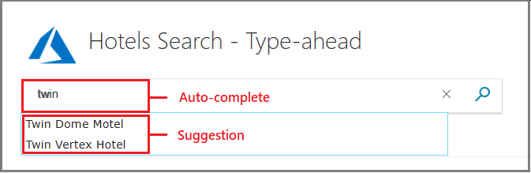

# Create a suggester to enable autocomplete and suggested results in a query

In Azure Cognitive Search, "search-as-you-type" is enabled through a **suggester** construct added to a [search index](search-what-is-an-index.md). A suggester supports two experiences: *autocomplete*, which completes a partial input for a whole term query, and *suggestions* that invites click through to a particular match. Autocomplete produces a query. Suggestions produce a matching document.

The following screenshot from [Create your first app in C#](tutorial-csharp-type-ahead-and-suggestions.md) illustrates both. Autocomplete anticipates a potential term, finishing "tw" with "in". Suggestions are mini search results, where a field like hotel name represents a matching hotel search document from the index. For suggestions, you can surface any field that provides descriptive information.



You can use these features separately or together. To implement these behaviors in Azure Cognitive Search, there is an index and query component. 

+ In the index, add a suggester to an index. You can use the portal, [REST API](https://docs.microsoft.com/rest/api/searchservice/create-index), or [.NET SDK](https://docs.microsoft.com/dotnet/api/microsoft.azure.search.models.suggester?view=azure-dotnet). The remainder of this article is focused on creating a suggester.

+ In the query request, call one of the [APIs listed below](#how-to-use-a-suggester).

Search-as-you-type support is enabled on a per-field basis for string fields. You can implement both typeahead behaviors within the same search solution if you want an experience similar to the one indicated in the screenshot. Both requests target the *documents* collection of specific index and responses are returned after a user has provided at least a three character input string.

## What is a suggester?

A suggester is an internal data structure that supports search-as-you-type behaviors by storing prefixes for matching on partial queries. As with tokenized terms, prefixes are stored in inverted indexes, one for each field specified in a suggester fields collection.

## Define a suggester

To create a suggester, add one to an [index schema](https://docs.microsoft.com/rest/api/searchservice/create-index) and [set each property](#property-reference). The best time to create a suggester is when you are also defining the field that will use it.

+ Use string fields only

+ Use the default standard Lucene analyzer (`"analyzer": null`) or a [language analyzer](index-add-language-analyzers.md) (for example, `"analyzer": "en.Microsoft"`) on the field

### Choose fields

Although a suggester has several properties, it is primarily a collection of string fields for which you are enabling a search-as-you-type experience. There is one suggester for each index, so the suggester list must include all fields that contribute content for both suggestions and autocomplete.

Autocomplete benefits from a larger pool of fields to draw from because the additional content has more term completion potential.

Suggestions, on the other hand, produce better results when your field choice is selective. Remember that the suggestion is a proxy for a search document so you will want fields that best represent a single result. Names, titles, or other unique fields that distinguish among multiple matches work best. If fields consist of repetitive values, the suggestions consist of identical results and a user won't know which one to click.

To satisfy both search-as-you-type experiences, add all of the fields that you need for autocomplete, but then use **$select**, **$top**, **$filter**, and **searchFields** to control results for suggestions.

### Choose analyzers

Your choice of an analyzer determines how fields are tokenized and subsequently prefixed. For example, for a hyphenated string like "context-sensitive", using a language analyzer will result in these token combinations: "context", "sensitive", "context-sensitive". Had you used the standard Lucene analyzer, the hyphenated string would not exist. 

When evaluating analyzers, consider using the [Analyze Text API](https://docs.microsoft.com/rest/api/searchservice/test-analyzer) for insight into how terms are tokenized and subsequently prefixed. Once you build an index, you can try various analyzers on a string to view token output.

Fields that use [custom analyzers](index-add-custom-analyzers.md) or [predefined analyzers](index-add-custom-analyzers.md#predefined-analyzers-reference) (with the exception of standard Lucene) are explicitly disallowed to prevent poor outcomes.

> [!NOTE]
> If you need to work around the analyzer constraint, for example if you need a keyword or ngram analyzer for certain query scenarios, you should use two separate fields for the same content. This will allow one of the fields to have a suggester, while the other can be set up with a custom analyzer configuration.

### When to create a suggester

The best time to create a suggester is when you are also creating the field definition itself.

If you try to create a suggester using pre-existing fields, the API will disallow it. Prefixes are generated during indexing, when partial terms in two or more character combinations are tokenized alongside whole terms. Given that existing fields are already tokenized, you will have to rebuild the index if you want to add them to a suggester. For more information, see [How to rebuild an Azure Cognitive Search index](search-howto-reindex.md).

## Create using REST

In the REST API, add suggesters through [Create Index](https://docs.microsoft.com/rest/api/searchservice/create-index) or [Update Index](https://docs.microsoft.com/rest/api/searchservice/update-index). 

  ```json
  {
    "name": "hotels-sample-index",
    "fields": [
      . . .
          {
              "name": "HotelName",
              "type": "Edm.String",
              "facetable": false,
              "filterable": false,
              "key": false,
              "retrievable": true,
              "searchable": true,
              "sortable": false,
              "analyzer": "en.microsoft",
              "indexAnalyzer": null,
              "searchAnalyzer": null,
              "synonymMaps": [],
              "fields": []
          },
    ],
    "suggesters": [
      {
        "name": "sg",
        "searchMode": "analyzingInfixMatching",
        "sourceFields": ["HotelName"]
      }
    ],
    "scoringProfiles": [
      . . .
    ]
  }
  ```

## Create using .NET

In C#, define a [Suggester object](https://docs.microsoft.com/dotnet/api/microsoft.azure.search.models.suggester?view=azure-dotnet). `Suggesters` is a collection but it can only take one item. 

```csharp
private static void CreateHotelsIndex(SearchServiceClient serviceClient)
{
    var definition = new Index()
    {
        Name = "hotels-sample-index",
        Fields = FieldBuilder.BuildForType<Hotel>(),
        Suggesters = new List<Suggester>() {new Suggester()
            {
                Name = "sg",
                SourceFields = new string[] { "HotelName", "Category" }
            }}
    };

    serviceClient.Indexes.Create(definition);

}
```

## Property reference

|Property      |Description      |
|--------------|-----------------|
|`name`        |The name of the suggester.|
|`searchMode`  |The strategy used to search for candidate phrases. The only mode currently supported is `analyzingInfixMatching`, which currently matches on the beginning of a term.|
|`sourceFields`|A list of one or more fields that are the source of the content for suggestions. Fields must be of type `Edm.String` and `Collection(Edm.String)`. If an analyzer is specified on the field, it must be a named analyzer from [this list](https://docs.microsoft.com/dotnet/api/microsoft.azure.search.models.analyzername?view=azure-dotnet) (not a custom analyzer).<p/> As a best practice, specify only those fields that lend themselves to an expected and appropriate response, whether it's a completed string in a search bar or a dropdown list.<p/>A hotel name is a good candidate because it has precision. Verbose fields like descriptions and comments are too dense. Similarly, repetitive fields, such as categories and tags, are less effective. In the examples, we include "category" anyway to demonstrate that you can include multiple fields. |

<a name="how-to-use-a-suggester"></a>

## Use a suggester

A suggester is used in a query. After a suggester is created, call one of the following APIs for a search-as-you-type experience:

+ [Suggestions REST API](https://docs.microsoft.com/rest/api/searchservice/suggestions) 
+ [Autocomplete REST API](https://docs.microsoft.com/rest/api/searchservice/autocomplete) 
+ [SuggestWithHttpMessagesAsync method](https://docs.microsoft.com/dotnet/api/microsoft.azure.search.idocumentsoperations.suggestwithhttpmessagesasync?view=azure-dotnet)
+ [AutocompleteWithHttpMessagesAsync method](https://docs.microsoft.com/dotnet/api/microsoft.azure.search.idocumentsoperations.autocompletewithhttpmessagesasync?view=azure-dotnet&viewFallbackFrom=azure-dotnet)

In a search application, client code should leverage a library like [jQuery UI Autocomplete](https://jqueryui.com/autocomplete/) to collect the partial query and provide the match. For more information about this task, see [Add autocomplete or suggested results to client code](search-autocomplete-tutorial.md).

API usage is illustrated in the following call to the Autocomplete REST API. There are two takeaways from this example. First, as with all queries, the operation is against the documents collection of an index and the query includes a **search** parameter, which in this case provides the partial query. Second, you must add **suggesterName** to the request. If a suggester is not defined in the index, a call to autocomplete or suggestions will fail.

```http
POST /indexes/myxboxgames/docs/autocomplete?search&api-version=2020-06-30
{
  "search": "minecraf",
  "suggesterName": "sg"
}
```

## Sample code

+ [Create your first app in C# (lesson 3 - Add search-as-you-type)](tutorial-csharp-type-ahead-and-suggestions.md) sample demonstrates a suggester construction, suggested queries, autocomplete, and faceted navigation. This code sample runs on a sandbox Azure Cognitive Search service and uses a pre-loaded Hotels index so all you have to do is press F5 to run the application. No subscription or sign-in is necessary.

+ [DotNetHowToAutocomplete](https://github.com/Azure-Samples/search-dotnet-getting-started/tree/master/DotNetHowToAutocomplete) is an older sample containing both C# and Java code. It also demonstrates a suggester construction, suggested queries, autocomplete, and faceted navigation. This code sample uses the hosted [NYCJobs](https://github.com/Azure-Samples/search-dotnet-asp-net-mvc-jobs) sample data. 

## Next steps

We recommend the following article to learn more about how requests formulation.

> [!div class="nextstepaction"]
> [Add autocomplete and suggestions to client code](search-autocomplete-tutorial.md) 
