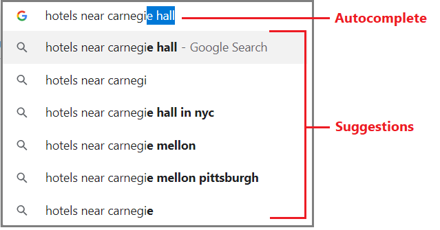

# Add suggesters to an index for typeahead in Azure Search

A **suggester** is a construct in an [Azure Search index](search-what-is-an-index.md) that supports a "search-as-you-type" experience. It contains a list of fields for which you want to enable typeahead query inputs. Within an index, the same suggester supports either or both of these two typeahead variants: *autocomplete* completes the term or phrase you are typing, *suggestions* provides a short list of results. 

The following screenshot illustrates both typeahead features. In this Xbox search page, the autocomplete items take you to a new search results page for that query, whereas the suggestions are actual results that take you to a page for that particular game. You can limit autocomplete to one item in a search bar or provide a list like the one shown here. For suggestions, you can surface any part of a document that best describes the result.



To implement these behaviors in Azure Search, there is an index and query component. 

+ The index component is a suggester. You can use the portal, REST API, or .NET SDK to create a suggester. 

+ The query component is an action specified on the query request (either a suggestion or autocomplete action). 

Search-as-you-type support is enabled on a per-field basis. You can implement both typeahead behaviors within the same search solution if you want an experience similar to the one indicated in the screenshot. Both requests target the *documents* collection of specific index and responses are returned after a user has provided at least a three character input string.

## Create a suggester

Although a suggester has several properties, it is primarily a collection of fields for which you are enabling a typeahead experience. For example, a travel app might want to enable typeahead search on destinations, cities, and attractions. As such, all three fields would go in the fields collection.

To create a suggester, add one to an index schema. You can have one suggester in an index (specifically, one suggester in the suggesters collection). 

### Use the REST API

In the REST API, you can add suggesters through [Create Index](https://docs.microsoft.com/rest/api/searchservice/create-index) or 
[Update Index](https://docs.microsoft.com/rest/api/searchservice/update-index). 

  ```json
  {
    "name": "hotels",
    "fields": [
      . . .
    ],
    "suggesters": [
      {
        "name": "sg",
        "searchMode": "analyzingInfixMatching",
        "sourceFields": ["hotelName", "category"]
      }
    ],
    "scoringProfiles": [
      . . .
    ]
  }
  ```
After a suggester is created, add the [Suggestions API](https://docs.microsoft.com/rest/api/searchservice/suggestions) or [Autocomplete API](https://docs.microsoft.com/rest/api/searchservice/autocomplete) in your query logic to invoke the feature.

### Use the .NET SDK

In C#, define a [Suggester object](https://docs.microsoft.com/dotnet/api/microsoft.azure.search.models.suggester?view=azure-dotnet). `Suggesters` is a collection but it can only take one item. 

```csharp
private static void CreateHotelsIndex(SearchServiceClient serviceClient)
{
    var definition = new Index()
    {
        Name = "hotels",
        Fields = FieldBuilder.BuildForType<Hotel>(),
        Suggesters = new List<Suggester>() {new Suggester()
            {
                Name = "sg",
                SourceFields = new string[] { "HotelId", "Category" }
            }}
    };

    serviceClient.Indexes.Create(definition);

}
```

## Property reference

Key points to notice about suggesters is that there is a name (suggesters are referenced by name on a request), a searchMode (currently just one, "analyzingInfixMatching"), and the list of fields for which typeahead is enabled. 

Properties that define a suggester include the following:

|Property      |Description      |
|--------------|-----------------|
|`name`        |The name of the suggester. You use the name of the suggester when calling the [Suggestions REST API](https://docs.microsoft.com/rest/api/searchservice/suggestions) or [Autocomplete REST API](https://docs.microsoft.com/rest/api/searchservice/autocomplete).|
|`searchMode`  |The strategy used to search for candidate phrases. The only mode currently supported is `analyzingInfixMatching`, which performs flexible matching of phrases at the beginning or in the middle of sentences.|
|`sourceFields`|A list of one or more fields that are the source of the content for suggestions. Only fields of type `Edm.String` and `Collection(Edm.String)` may be sources for suggestions. Only fields that don't have a custom language analyzer set can be used.<p/>Specify only those fields that lend themselves to an expected and appropriate response, whether it's a completed string in a search bar or a dropdown list.<p/>A hotel name is a good candidate because it has precision. Verbose fields like descriptions and comments are too dense. Similarly, repetitive fields, such as categories and tags, are less effective. In the examples, we include "category" anyway to demonstrate that you can include multiple fields. |

## When to create a suggester

To avoid an index rebuild, a suggester and the fields specified in `sourceFields` must be created at the same time.

If you add a suggester to an existing index, where existing fields are included in `sourceFields`, the field definition fundamentally changes and a rebuild is required. For more information, see [How to rebuild an Azure Search index](search-howto-reindex.md).

## How to use a suggester

As previously noted, you can use a suggester for suggested queries, autocomplete, or both. 

A suggester is referenced on the request along with the operation. For example, on a GET REST call, specify either `suggest` or `autocomplete` on the documents collection. For REST, after a suggester is created, use the [Suggestions API](https://docs.microsoft.com/rest/api/searchservice/suggestions) or the [Autocomplete API](https://docs.microsoft.com/rest/api/searchservice/autocomplete) in your query logic.

For .NET, use [SuggestWithHttpMessagesAsync](https://docs.microsoft.com/dotnet/api/microsoft.azure.search.idocumentsoperations.suggestwithhttpmessagesasync?view=azure-dotnet) or [AutocompleteWithHttpMessagesAsync](https://docs.microsoft.com/dotnet/api/microsoft.azure.search.idocumentsoperations.autocompletewithhttpmessagesasync?view=azure-dotnet&viewFallbackFrom=azure-dotnet).

For an example demonstrating both requests, see [Example for adding autocomplete and suggestions in Azure Search](search-autocomplete-tutorial.md).

## Sample code

The [DotNetHowToAutocomplete](https://github.com/Azure-Samples/search-dotnet-getting-started/tree/master/DotNetHowToAutocomplete) sample contains both C# and Java code, and demonstrates a suggester construction, suggested queries, autocomplete, and facet navigation. 

It uses a sandbox Azure Search service and a pre-loaded index so all you have to do is press F5 to run it. No subscription or sign in necessary.

## Next steps

We recommend the following example to see how the requests are formulated.

> [!div class="nextstepaction"]
> [Suggestions and autocomplete examples](search-autocomplete-tutorial.md) 
