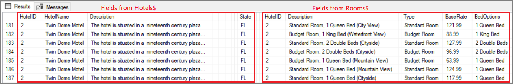
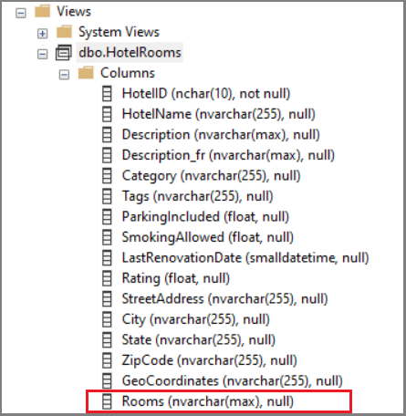
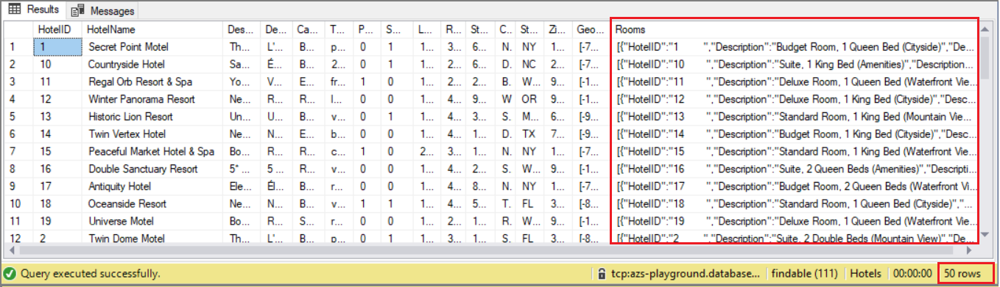
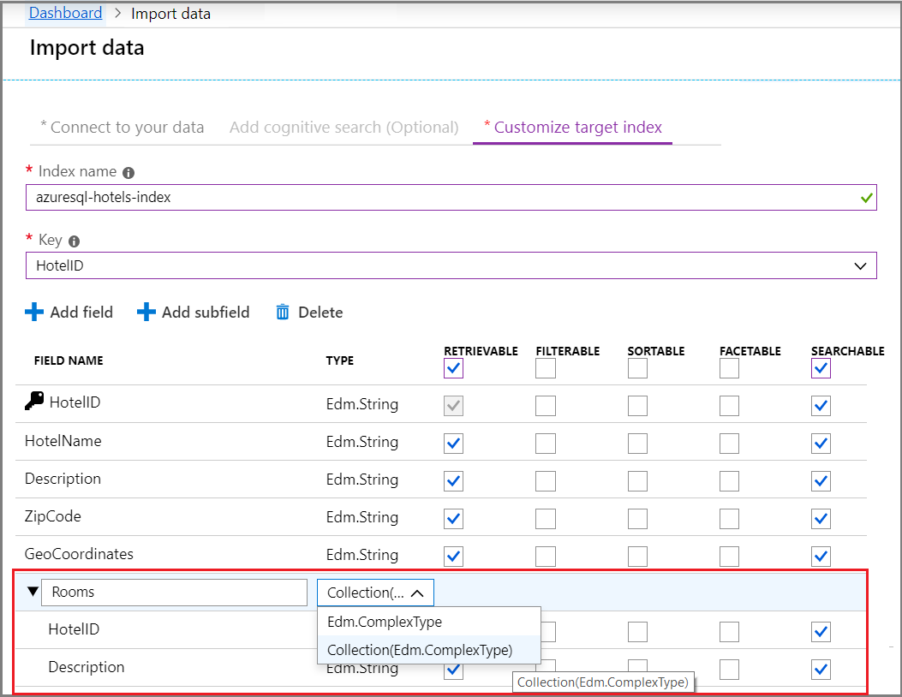

# How to model relational SQL data for import and indexing in Azure AI Search

Azure AI Search accepts a flat rowset as input to the [indexing pipeline](search-what-is-an-index.md). If your source data originates from joined tables in a SQL Server relational database, this article explains how to construct the result set, and how to model a parent-child relationship in an Azure AI Search index.

As an illustration, we refer to a hypothetical hotels database, based on [demo data](https://github.com/Azure-Samples/azure-search-sample-data/tree/main/hotels). Assume the database consists of a Hotels$ table with 50 hotels, and a Rooms$ table with rooms of varying types, rates, and amenities, for a total of 750 rooms. There's a one-to-many relationship between the tables. In our approach, a view provides the query that returns 50 rows, one row per hotel, with associated room detail embedded into each row.

   

## The problem of denormalized data

One of the challenges in working with one-to-many relationships is that standard queries built on joined tables return denormalized data, which doesn't work well in an Azure AI Search scenario. Consider the following example that joins hotels and rooms.

```sql
SELECT * FROM Hotels$
INNER JOIN Rooms$
ON Rooms$.HotelID = Hotels$.HotelID
```

Results from this query return all of the Hotel fields, followed by all Room fields, with preliminary hotel information repeating for each room value.

   

While this query succeeds on the surface (providing all of the data in a flat row set), it fails in delivering the right document structure for the expected search experience. During indexing, Azure AI Search creates one search document for each row ingested. If your search documents looked like the above results, you would have perceived duplicates - seven separate documents for the Twin Dome hotel alone. A query on "hotels in Florida" would return seven results for just the Twin Dome hotel, pushing other relevant hotels deep into the search results.

To get the expected experience of one document per hotel, you should provide a rowset at the right granularity, but with complete information. This article explains how.

## Define a query that returns embedded JSON

To deliver the expected search experience, your data set should consist of one row for each search document in Azure AI Search. In our example, we want one row for each hotel, but we also want our users to be able to search on other room-related fields they care about, such as the nightly rate, size and number of beds, or a view of the beach, all of which are part of a room detail.

The solution is to capture the room detail as nested JSON, and then insert the JSON structure into a field in a view, as shown in the second step. 

1. Assume you've two joined tables, Hotels$ and Rooms$, that contain details for 50 hotels and 750 rooms and are joined on the HotelID field. Individually, these tables contain 50 hotels and 750 related rooms.

    ```sql
    CREATE TABLE [dbo].[Hotels$](
      [HotelID] [nchar](10) NOT NULL,
      [HotelName] [nvarchar](255) NULL,
      [Description] [nvarchar](max) NULL,
      [Description_fr] [nvarchar](max) NULL,
      [Category] [nvarchar](255) NULL,
      [Tags] [nvarchar](255) NULL,
      [ParkingIncluded] [float] NULL,
      [SmokingAllowed] [float] NULL,
      [LastRenovationDate] [smalldatetime] NULL,
      [Rating] [float] NULL,
      [StreetAddress] [nvarchar](255) NULL,
      [City] [nvarchar](255) NULL,
      [State] [nvarchar](255) NULL,
      [ZipCode] [nvarchar](255) NULL,
      [GeoCoordinates] [nvarchar](255) NULL
    ) ON [PRIMARY] TEXTIMAGE_ON [PRIMARY]
    GO

    CREATE TABLE [dbo].[Rooms$](
      [HotelID] [nchar](10) NULL,
      [Description] [nvarchar](255) NULL,
      [Description_fr] [nvarchar](255) NULL,
      [Type] [nvarchar](255) NULL,
      [BaseRate] [float] NULL,
      [BedOptions] [nvarchar](255) NULL,
      [SleepsCount] [float] NULL,
      [SmokingAllowed] [float] NULL,
      [Tags] [nvarchar](255) NULL
    ) ON [PRIMARY]
    GO
    ```

1. Create a view composed of all fields in the parent table (`SELECT * from dbo.Hotels$`), with the addition of a new *Rooms* field that contains the output of a nested query. A **FOR JSON AUTO** clause on `SELECT * from dbo.Rooms$` structures the output as JSON. 

     ```sql
   CREATE VIEW [dbo].[HotelRooms]
   AS
   SELECT *, (SELECT *
              FROM dbo.Rooms$
              WHERE dbo.Rooms$.HotelID = dbo.Hotels$.HotelID FOR JSON AUTO) AS Rooms
   FROM dbo.Hotels$
   GO
   ```

   The following screenshot shows the resulting view, with the *Rooms* nvarchar field at the bottom. The *Rooms* field exists only in the HotelRooms view.

   

1. Run `SELECT * FROM dbo.HotelRooms` to retrieve the row set. This query returns 50 rows, one per hotel, with associated room information as a JSON collection. 

   

This rowset is now ready for import into Azure AI Search.

> [!NOTE]
> This approach assumes that embedded JSON is under the [maximum column size limits of SQL Server](/sql/sql-server/maximum-capacity-specifications-for-sql-server). 

## Use a complex collection for the "many" side of a one-to-many relationship

On the Azure AI Search side, create an index schema that models the one-to-many relationship using nested JSON. The result set you created in the previous section generally corresponds to the index schema provided below (we cut some fields for brevity).

The following example is similar to the example in [How to model complex data types](search-howto-complex-data-types.md#create-complex-fields). The *Rooms* structure, which has been the focus of this article, is in the fields collection of an index named *hotels*. This example also shows a complex type for *Address*, which differs from *Rooms* in that it's composed of a fixed set of items, as opposed to the multiple, arbitrary number of items allowed in a collection.

```json
{
  "name": "hotels",
  "fields": [
    { "name": "HotelId", "type": "Edm.String", "key": true, "filterable": true },
    { "name": "HotelName", "type": "Edm.String", "searchable": true, "filterable": false },
    { "name": "Description", "type": "Edm.String", "searchable": true, "analyzer": "en.lucene" },
    { "name": "Description_fr", "type": "Edm.String", "searchable": true, "analyzer": "fr.lucene" },
    { "name": "Category", "type": "Edm.String", "searchable": true, "filterable": true, "facetable": true },
    { "name": "ParkingIncluded", "type": "Edm.Boolean", "filterable": true, "facetable": true },
    { "name": "Tags", "type": "Collection(Edm.String)", "searchable": true, "filterable": true, "facetable": true },
    { "name": "Address", "type": "Edm.ComplexType",
      "fields": [
        { "name": "StreetAddress", "type": "Edm.String", "filterable": false, "sortable": false, "facetable": false, "searchable": true },
        { "name": "City", "type": "Edm.String", "searchable": true, "filterable": true, "sortable": true, "facetable": true },
        { "name": "StateProvince", "type": "Edm.String", "searchable": true, "filterable": true, "sortable": true, "facetable": true }
      ]
    },
    { "name": "Rooms", "type": "Collection(Edm.ComplexType)",
      "fields": [
        { "name": "Description", "type": "Edm.String", "searchable": true, "analyzer": "en.lucene" },
        { "name": "Description_fr", "type": "Edm.String", "searchable": true, "analyzer": "fr.lucene" },
        { "name": "Type", "type": "Edm.String", "searchable": true },
        { "name": "BaseRate", "type": "Edm.Double", "filterable": true, "facetable": true },
        { "name": "BedOptions", "type": "Edm.String", "searchable": true, "filterable": true, "facetable": false },
        { "name": "SleepsCount", "type": "Edm.Int32", "filterable": true, "facetable": true },
        { "name": "SmokingAllowed", "type": "Edm.Boolean", "filterable": true, "facetable": false},
        { "name": "Tags", "type": "Edm.Collection", "searchable": true }
      ]
    }
  ]
}
```

Given the previous result set and the above index schema, you've all the required components for a successful indexing operation. The flattened data set meets indexing requirements yet preserves detail information. In the Azure AI Search index, search results will fall easily into hotel-based entities, while preserving the context of individual rooms and their attributes.

## Facet behavior on complex type subfields

Fields that have a parent, such as the fields under Address and Rooms, are called *subfields*. Although you can assign a "facetable" attribute to a subfield, the count of the facet will always be for the main document.

For complex types like Address, where there's just one "Address/City" or "Address/stateProvince" in the document, the facet behavior works as expected. However, in the case of Rooms, where there are multiple subdocuments for each main document, the facet counts can be misleading.

As noted in [Model complex types](search-howto-complex-data-types.md): "the document counts returned in the facet results are calculated for the parent document (a hotel), not the subdocuments in a complex collection (rooms). For example, suppose a hotel has 20 rooms of type "suite". Given this facet parameter facet=Rooms/Type, the facet count is one for the hotel, not 20 for the rooms."

## Next steps

Using your own data set, you can use the [Import data wizard](search-import-data-portal.md) to create and load the index. The wizard detects the embedded JSON collection, such as the one contained in *Rooms*, and infers an index schema that includes a complex type collection. 

  

Try the following quickstart to learn the basic steps of the Import data wizard.

> [!div class="nextstepaction"]
> [Quickstart: Create a search index using Azure portal](search-get-started-portal.md)
