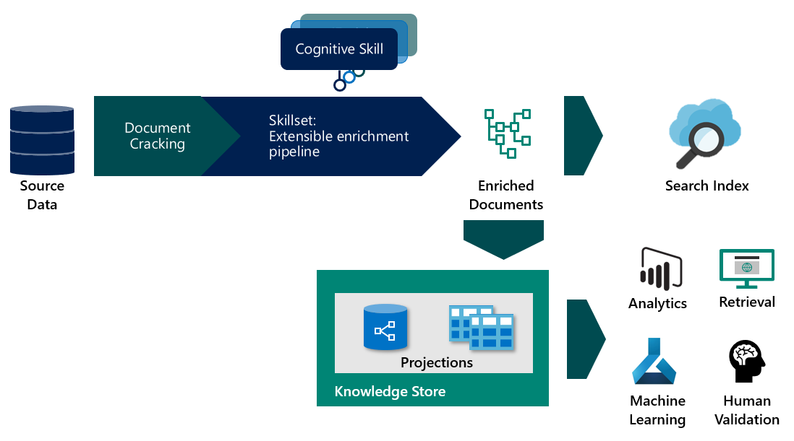

# What is knowledge store in Azure Search?

> [!Note]
> Knowledge store is in preview and not intended for production use. The [REST API version 2019-05-06-Preview](search-api-preview.md) provides this feature. There is no .NET SDK support at this time.
>

Knowledge store is an optional feature of Azure Search that saves enriched documents and metadata created by an AI-based indexing pipeline [(cognitive search)](cognitive-search-concept-intro.md). Knowledge store is backed by an Azure storage account that you configure as part of the pipeline. When enabled, the search service uses this storage account to cache a representation of each enriched document. 

If you have used cognitive search in the past, you already know that skillsets can be used to move a document through a sequence of enrichments. The outcome can be an Azure Search index, or (new in this preview) projections in a knowledge store.

Projections are your mechanism for structuring data for consumption in a downstream app. You can use [Storage Explorer](https://docs.microsoft.com/azure/vs-azure-tools-storage-manage-with-storage-explorer?tabs=windows) built for Azure storage, or any app that connects to Azure storage, which opens up new possibilities for consuming enriched documents. Some examples are data science pipelines and custom analytics.



To use knowledge store, add a `knowledgeStore` element to a skillset that defines step-wise operations in an indexing pipeline. During execution, Azure Search creates a space in your Azure storage account and fills it with definitions and content created by the pipeline.

## Benefits of knowledge store

A knowledge store gives you structure, context, and actual content - gleaned from unstructured and semi-structured data files like blobs, image files that have undergone analysis, or even structured data that is reshaped into new forms. In a [step-by-step walkthrough](knowledge-store-howto.md) written for this preview, you can see first-hand how a dense JSON document is partitioned out into substructures, reconstituted into new structures, and otherwise made available for downstream processes like machine learning and data science workloads.

Although it's useful to see what an AI-based indexing pipeline can produce, the real power of knowledge store is the ability to reshape data. You might start with a basic skillset, and then iterate over it to add increasing levels of structure, which you can then combine into new structures, consumable in other apps besides Azure Search.

Enumerated, the benefits of knowledge store include the following:

+ Consume enriched documents in [analytics and reporting tools](#tools-and-apps) other than search. Power BI with Power Query is a compelling choice, but any tool or app that can connect to Azure storage can pull from a knowledge store that you create.

+ Refine an AI-indexing pipeline while debugging steps and skillset definitions. A knowledge store shows you the product of a skillset definition in an AI-indexing pipeline. You can use those results to design a better skillset because you can see exactly what the enrichments look like. You can use [Storage Explorer](https://docs.microsoft.com/azure/vs-azure-tools-storage-manage-with-storage-explorer?tabs=windows) in Azure storage to view the contents of a knowledge store.

+ Shape the data into new forms. The reshaping is codified in skillsets, but the point is that a skillset can now provide this capability. The [Shaper skill](cognitive-search-skill-shaper.md) in Azure Search has been extended to accommodate this task. Reshaping allows you to define a projection that aligns with your intended use of the data while preserving relationships.

> [!Note]
> Not familiar with AI-based indexing using Cognitive Services? Azure Search integrates with Cognitive Services Vision and Language features to extract and enrich source data using Optical Character Recognition (OCR) over image files, entity recognition and key phrase extraction from text files, and more. For more information, see [What is cognitive search?](cognitive-search-concept-intro.md).

## Create a knowledge store

A knowledge store is part of a skillset definition. In this preview, creating it requires the REST API, using `api-version=2019-05-06-Preview` or the **Import data** wizard in the portal.

The following JSON specifies a `knowledgeStore`, which is part of a skillset, which is invoked by an indexer (not shown). The specification of projections within the `knowledgeStore` determines whether tables or objects are created in Azure storage.

If you are already familiar with AI-based indexing, the skillset definition determines the creation, organization, and substance of each enriched document.

```json
{
  "name": "my-new-skillset",
  "description": 
  "Example showing knowledgeStore placement, supported in api-version=2019-05-06-Preview. You need at least one skill, most likely a Shaper skill if you are modulating data structures.",
  "skills":
  [
    {
    "@odata.type": "#Microsoft.Skills.Util.ShaperSkill",
    "context": "/document/content/phrases/*",
    "inputs": [
        {
        "name": "text",
        "source": "/document/content/phrases/*"
        },
        {
        "name": "sentiment",
        "source": "/document/content/phrases/*/sentiment"
        }
    ],
    "outputs": [
        {
        "name": "output",
        "targetName": "analyzedText"
        }
    ]
    },
  ],
  "cognitiveServices": 
    {
    "@odata.type": "#Microsoft.Azure.Search.CognitiveServicesByKey",
    "description": "mycogsvcs resource in West US 2",
    "key": "<your key goes here>"
    },
  "knowledgeStore": { 
    "storageConnectionString": "<your connection string goes here>", 
    "projections": [ 
        { 
            "tables": [  
            { "tableName": "Reviews", "generatedKeyName": "ReviewId", "source": "/document/Review" , "sourceContext": null, "inputs": []}, 
            { "tableName": "Sentences", "generatedKeyName": "SentenceId", "source": "/document/Review/Sentences/*", "sourceContext": null, "inputs": []}, 
            { "tableName": "KeyPhrases", "generatedKeyName": "KeyPhraseId", "source": "/document/Review/Sentences/*/KeyPhrases", "sourceContext": null, "inputs": []}, 
            { "tableName": "Entities", "generatedKeyName": "EntityId", "source": "/document/Review/Sentences/*/Entities/*" ,"sourceContext": null, "inputs": []} 

            ], 
            "objects": [ 
                { 
                "storageContainer": "Reviews", 
                "format": "json", 
                "source": "/document/Review", 
                "key": "/document/Review/Id" 
                } 
            ]      
        }    
    ]     
    } 
}
```

## Components backing a knowledge store

To create a knowledge store, you need the following services and artifacts.

### 1 - Source data

The data or documents you want to enrich must exist in an Azure data source supported by Azure Search indexers: 

* [Azure SQL](search-howto-connecting-azure-sql-database-to-azure-search-using-indexers.md)

* [Azure Cosmos DB](search-howto-index-cosmosdb.md)

* [Azure Blob storage](search-howto-indexing-azure-blob-storage.md)

[Azure Table storage](search-howto-indexing-azure-tables.md) can be used for outbound data in a knowledge store, but cannot be used as a resource for inbound data to an AI-based indexing pipeline.

### 2 - Azure Search service

You also need an Azure Search service and the REST API to create and configure objects used for data enrichment. The REST API for creating a knowledge store is `api-version=2019-05-06-Preview`.

Azure Search provides the indexer feature, and indexers are used to drive the entire process end-to-end, resulting in persisted, enriched documents in Azure storage. Indexers use a data source, an index, and a skillset - all of which are required for creating and populating a knowledge store.

| Object | REST API | Description |
|--------|----------|-------------|
| data source | [Create Data Source](https://docs.microsoft.com/rest/api/searchservice/create-data-source)  | A resource identifying an external Azure data source providing source data used to create enriched documents.  |
| skillset | [Create Skillset (api-version=2019-05-06)](https://docs.microsoft.com/rest/api/searchservice/create-skillset)  | A resource coordinating the use of [built-in skills](cognitive-search-predefined-skills.md) and [custom cognitive skills](cognitive-search-custom-skill-interface.md) used in an enrichment pipeline during indexing. |
| index | [Create Index](https://docs.microsoft.com/rest/api/searchservice/create-index)  | A schema expressing an Azure Search index. Fields in the index map to fields in source data or to fields manufactured during the enrichment phase (for example, a field for organization names created by entity recognition). |
| indexer | [Create Indexer (api-version=2019-05-06)](https://docs.microsoft.com/rest/api/searchservice/create-skillset)  | A resource defining components used during indexing: including a data source, a skillset, field associations from source and intermediary data structures to target index, and the index itself. Running the indexer is the trigger for data ingestion and enrichment. The output is a search index based on the index schema, populated with source data, enriched through skillsets.  |

### 3 - Cognitive Services

Enrichments specified in a skillset are based on the Computer Vision and Language features in Cognitive Services. Cognitive Services functionality is leveraged during indexing through your skillset. A skillset is a composition of skills, and skills are bound to specific Computer Vision and Language features. To integrate Cognitive Services, you'll [attach a Cognitive Services resource](cognitive-search-attach-cognitive-services.md) to a skillset.

### 4 - Storage account

Under your Azure Storage account, Azure Search creates a Blob container or tables, depending on how you configure a skillset. If your data originates from Azure Blob or Table storage, you are already set. Otherwise, you will need to create an Azure storage account. Tables and objects in Azure storage contain the enriched documents created by the AI-based indexing pipeline.

The storage account is specified in the skillset. In `api-version=2019-05-06-Preview`, a skillset definition includes a knowledge store definition so that you can provide account information.

<a name="tools-and-apps"></a>

### 5 - Access and consume

Once the enrichments exist in storage, any tool or technology that connects to Azure Blob or Table storage can be used to explore, analyze, or consume the contents. The following list is a start:

+ [Storage Explorer](https://docs.microsoft.com/azure/vs-azure-tools-storage-manage-with-storage-explorer?tabs=windows) to view enriched document structure and content. Consider this as your baseline tool for viewing knowledge store contents.

+ [Power BI with Power Query](https://support.office.com/article/connect-to-microsoft-azure-blob-storage-power-query-f8165faa-4589-47b1-86b6-7015b330d13e) for natural language queries, or use the reporting and analysis tools if you have numeric data.

+ [Azure Data Factory](https://docs.microsoft.com/azure/data-factory/) for further manipulation.

+ Azure Search index for full-text search over content that you've indexed using [cognitive search](cognitive-search-concept-intro.md).

## Document persistence

Within the storage account, the enrichments can be expressed as tables within Azure Table storage or as objects in Azure Blob storage. Recall that enrichments, once stored, can be used as a source to load data into other databases and tools,

+ Table storage is useful when you want a schema-aware representation of the data in tabular form. If you want to reshape or recombine elements in new ways, Table storage gives you the necessary granularity.

+ Blob storage creates one all-inclusive JSON representation of each document. You can use both storage options in one skillset to get a full range of expressions.

+ Azure Search persists content in an index. If your scenario is non-search-related, for example if your objective is analysis in another tool, you can delete the index that the pipeline creates. But you could also keep the index and use a built-in tool like [Search Explorer](search-explorer.md) as a third medium (behind Storage Explorer and your analytics app) for interacting with your content.

Along with document contents, enriched documents include the metadata of the skillset version that produced the enrichments.  

## Inside a knowledge store

The knowledge store consists of an annotation cache and projections. The *cache* is used by the service internally to cache the results from skills and track changes. A *projection* defines the schema and structure of the enrichments that match your intended use. There is one cache per knowledge store, but multiple projections. 

The cache is always a blob container, but projections can be articulated as tables or objects:

+ As an object, the projection maps to Blob storage, where the projection is saved to a container, within which are the objects or hierarchical representations in JSON for scenarios like a data science pipeline.

+ As a table, the projection maps to Table storage. A tabular representation preserves relationships for scenarios like data analysis or export as data frames for machine learning. The enriched projections can then be easily imported into other data stores. 

You can create multiple projections in a knowledge store to accommodate various constituencies in your organization. A developer might need access to the full JSON representation of an enriched document, while data scientists or analysts might want granular or modular data structures shaped by your skillset.

For example, if one of the goals of the enrichment process is to also create a dataset used to train a model, projecting the data into the object store would be one way to use the data in your data science pipelines. Alternatively, if you want to create a quick Power BI dashboard based on the enriched documents the tabular projection would work well.

<!---
## Data lifecycle and billing

Each time you run the indexer, the cache in Azure storage is updated if the skillset definition or underlying source data has changed. As input documents are edited or deleted, changes are propagated through the annotation cache to the projections, ensuring that your projected data is a current representation of your inputs at the end of the indexer run. 

Generally speaking, pipeline processing can be an all-or-nothing operation, but Azure Search can process incremental changes, which saves you time and money.

If a document is new or updated, all skills are run. If only the skillset changes, reprocessing is scoped to just those skills and documents affected by your edit.

### Changes to a skillset
Suppose that you have a pipeline composed of multiple skills, operating over a large body of static data (for example, scanned documents), that takes 8 hours and costs $200 to create the knowledge store. Now suppose you need to tweak one of the skills in the skillset. Rather than starting over, Azure Search can determine which skill is affected, and reprocess only that skill. Cached data and projections that are unaffected by the change remain intact in the knowledge store.

### Changes in the data
Scenarios can vary considerably, but let's suppose instead of static data, you have volatile data that changes between indexer invocations. Given no changes to the skillset, you are charged for processing the delta of new and modified document. The timestamp information varies by data source, but for illustration, in a Blob container, Azure Search looks at the `lastmodified` date to determine which blobs need to be ingested.

> [!Note]
> While you can edit the data in the projections, any edits will be overwritten on the next pipeline invocation, assuming the document in source data is updated. 

### Deletions

Although Azure Search creates and updates structures and content in Azure storage, it does not delete them. Projections and cached documents continue to exist even when the skillset is deleted. As the owner of the storage account, you should delete a projection if it is no longer needed. 

### Tips for development

+ Start small with a representative sample of your data as you make significant changes to skillset composition. As your design finalizes, you can slowly add more data during later-stage development, and then roll in the entire data set when you are comfortable with the pipeline composition.

+ Retain control over indexer invocation. Indexers can run on a schedule, which is helpful for solutions that are rolled into production, but less helpful if you are actively developing your pipeline. During development, avoid schedules so that you don’t lose track of cache or projection state. Once your solution is in production and skillset composition is static, you can put the indexer on a schedule to pick up routine changes in the external source data. 

-->

## Where do I start?

We recommend the Free service for learning purposes, but be aware that the number of free transactions is limited to 20 documents per day, per subscription.

When using multiple services, create all of your services in the same region for best performance and to minimize costs. You are not charged for bandwidth for inbound data or outbound data that goes to another service in the same region.

**Step 1: [Create an Azure Search resource](search-create-service-portal.md)** 

**Step 2: [Create an Azure storage account](https://docs.microsoft.com/azure/storage/common/storage-quickstart-create-account?tabs=azure-portal)** 

**Step 3: [Create a Cognitive Services resource](https://docs.microsoft.com/azure/cognitive-services/cognitive-services-apis-create-account)** 

**Step 4: [Get started with the portal](cognitive-search-quickstart-blob.md) - or - [Get started with sample data using REST and Postman](knowledge-store-howto.md)** 

You can use REST `api-version=2019-05-06-Preview` to construct an AI-based pipeline that includes knowledge store. In the newest preview API, the Skillset object provides the `knowledgeStore` definition.

## Takeaways

Knowledge store offers a variety of benefits including but not limited to enabling use of the enriched documents in scenarios other than search, cost controls, and managing drift in your enrichment process. These features are all available to use simply by adding a storage account to your skillset and using the updated expression language as described in [How to get started with knowledge store](knowledge-store-howto.md). 

## Next steps

The simplest approach for creating enriched documents is through the **Import data** wizard.

> [!div class="nextstepaction"]
> [Quickstart: Try cognitive search in a portal walkthrough](cognitive-search-quickstart-blob.md)
