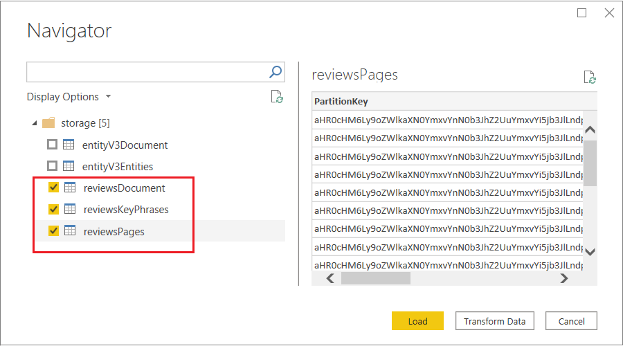
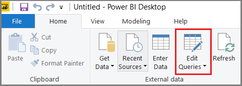
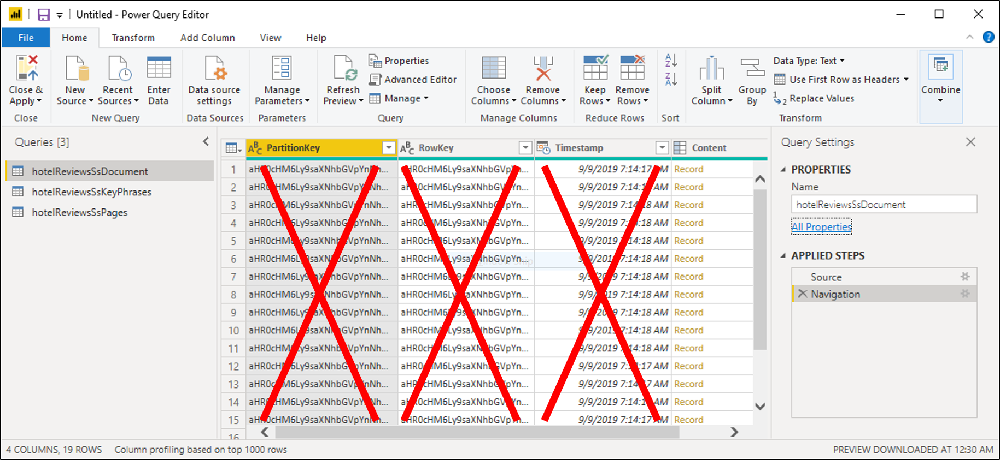
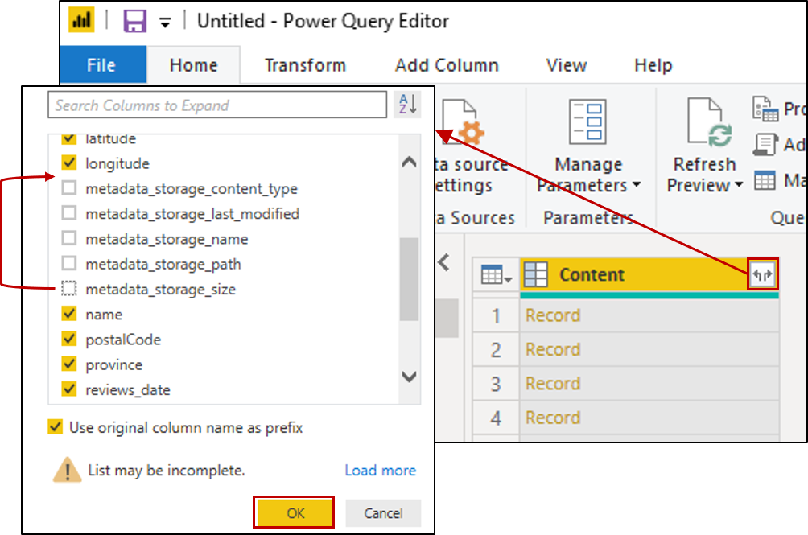
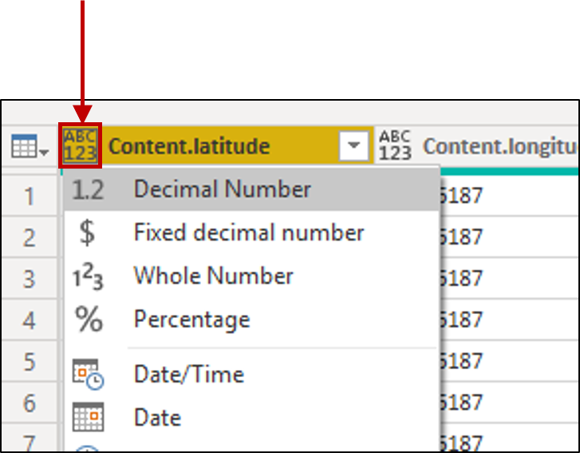
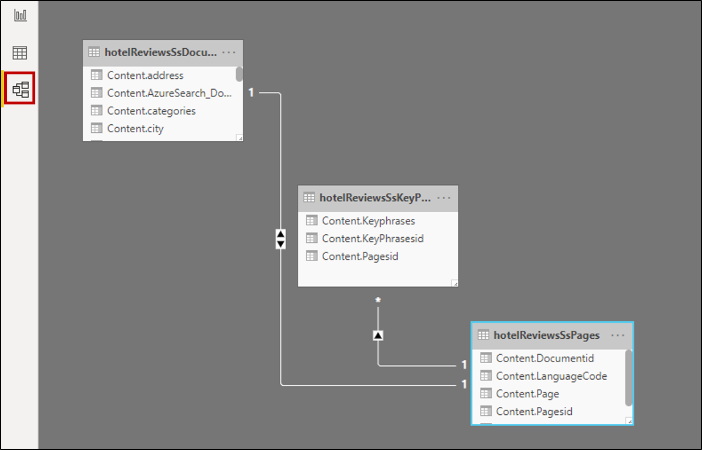
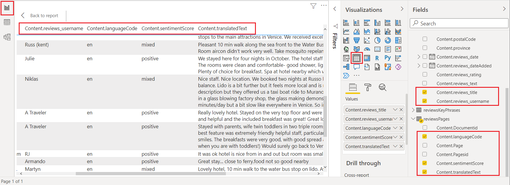
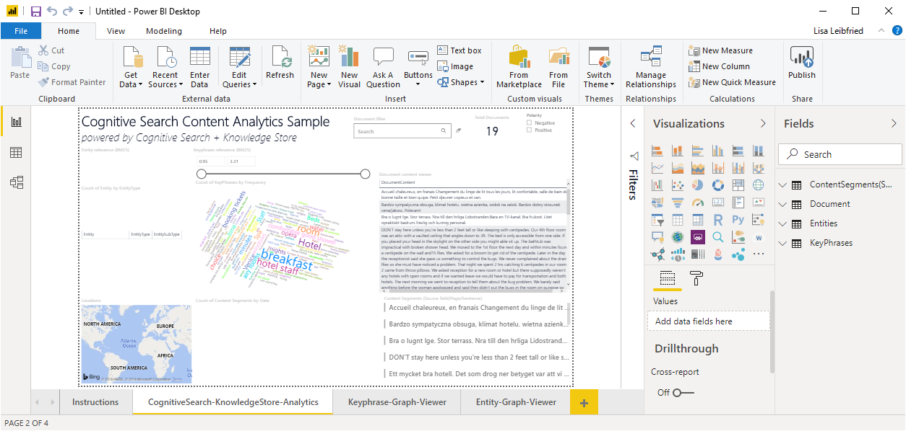

# Connect a knowledge store with Power BI

In this article, learn how to connect to and query a knowledge store using Power Query in the Power BI Desktop app. You can get started faster with templates, or build a custom dashboard from scratch.

A knowledge store that's composed of tables in Azure Storage work best in Power BI. If the tables contain projections from the same skillset and projection group, you can easily "join" them to build table visualizations that include fields from related tables.

Follow the steps in this article using sample data and a knowledge store as [created in this portal quickstart](knowledge-store-create-portal.md) or through [Postman and REST APIs](knowledge-store-create-rest.md). 

## Connect to Azure Storage

1. Start [Power BI Desktop](https://powerbi.microsoft.com/downloads/) and select **Get data**. 

1. In the **Get Data** window, select **Azure**, and then select **Azure Table Storage**.

1. Select **Connect**.

1. For **Account Name or URL**, enter in your Azure Storage account name (the full URL will be created for you).

1. If prompted, enter the storage account key.

## Set up tables

1. Select the checkbox next to all of the tables that were created from the same skillset, and then select **Load**.

   

1. On the top ribbon, select **Transform Data** to open the **Power Query Editor**.

   

1. Open *hotelReviewsDocument* and remove its *PartitionKey*, *RowKey*, and *Timestamp* columns. Those columns are used for table relationships in Azure Table Storage. Power BI doesn't need them. You should be left with one column named "Content" showing *Record* in each one. 

   

1. Click the icon with opposing arrows at the upper right side of the table to expand *Content*. When the list of columns appears, select all columns. Clear columns starting with 'metadata'. Click **OK** to include the selected columns.

   

1. Change the data type for the following columns by clicking the  ABC-123 icon at the top left of the column.

   + For *content.latitude* and *Content.longitude*, select **Decimal Number**.
   + For *Content.reviews_date* and *Content.reviews_dateAdded*,  select **Date/Time**.

   

1. Open *hotelReviewsSsPages* and repeat column deletion steps, expanding *Content* to select columns from the records. There are no data type modifications for this table.

1. Open *hotelReviewsSsKeyPhrases* and repeat column deletion steps, expanding *Content* to select columns from the records. There are no data type modifications for this table.

1. On the command bar, click **Close and Apply**.

## Check table relationships

1. Click on the Model tile on the left navigation pane and validate that Power BI shows relationships between all three tables.

   

1. Double-click each relationship and make sure that the **Cross-filter direction** is set to **Both**.  This enables your visuals to refresh when a filter is applied.

## Build a report

1. Click on the Report tile on the left navigation pane to explore data through visualizations. For text fields, tables and cards are useful visualizations.

1. Choose fields from each of the three tables to fill in the table or card.

   

## Sample Power BI template - Azure portal only

When creating a [knowledge store using the Azure portal](knowledge-store-create-portal.md), you have the option of downloading a [Power BI template](https://github.com/Azure-Samples/cognitive-search-templates) on the second page of the **Import data** wizard. This template gives you several visualizations, such as WordCloud and Network Navigator, for text-based content. 

Click **Get Power BI Template** on the **Add cognitive skills** page to retrieve and download the template from its public GitHub location. The wizard modifies the template to accommodate the shape of your data, as captured in the knowledge store projections specified in the wizard. For this reason, the template you download will vary each time you run the wizard, assuming different data inputs and skill selections.

> [!NOTE]
> The template is downloaded while the wizard is in mid-flight. You'll have to wait until the knowledge store is actually created in Azure Table Storage before you can use it.

## Video introduction

For a demonstration of using Power BI with a knowledge store, watch the following video.

> [!VIDEO https://www.youtube.com/embed/XWzLBP8iWqg?version=3]

## Next steps

> [!div class="nextstepaction"]
> [Tables in Power BI reports and dashboards](/power-bi/visuals/power-bi-visualization-tables)
