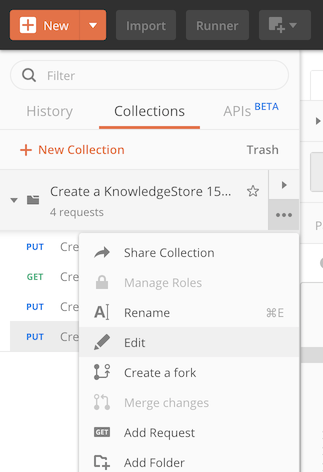
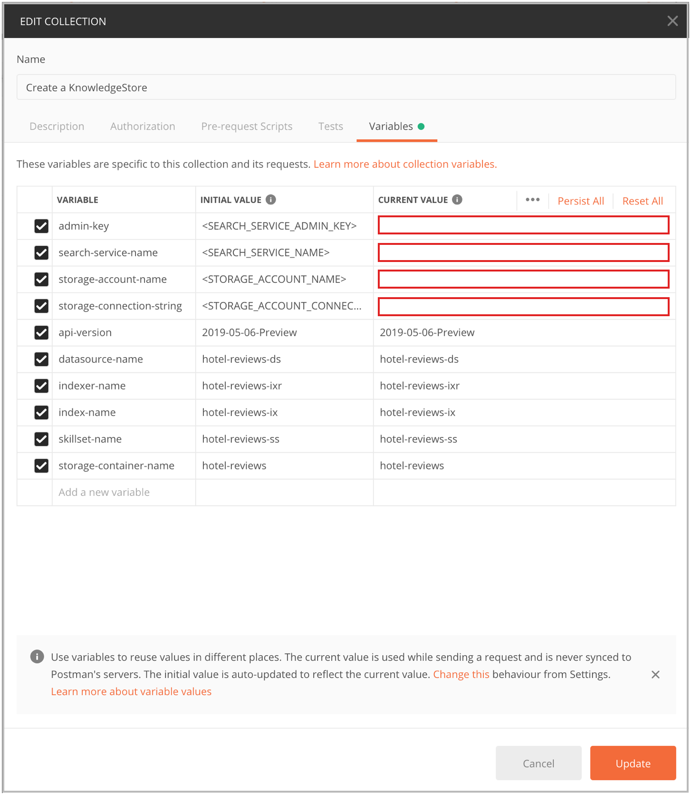
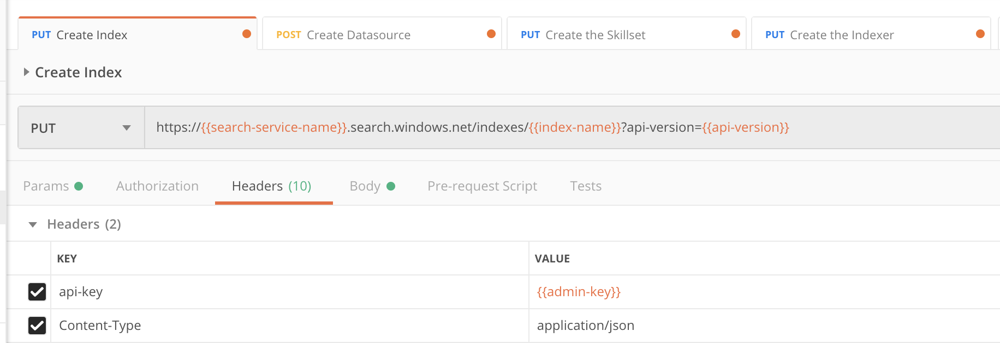

# Create a knowledge store using REST and Postman

In Azure AI Search, a [knowledge store](knowledge-store-concept-intro.md) is a repository of [AI-generated content](cognitive-search-concept-intro.md) that's used for non-search scenarios. You create the knowledge store using an indexer and skillset, and specify Azure Storage to store the output. After the knowledge store is populated, use tools like [Storage Explorer](../vs-azure-tools-storage-manage-with-storage-explorer.md) or [Power BI](knowledge-store-connect-power-bi.md) to explore the content.

In this article, you use the REST API to ingest, enrich, and explore a set of customer reviews of hotel stays in a knowledge store. The knowledge store contains original text content pulled from the source, plus AI-generated content that includes a sentiment score, key phrase extraction, language detection, and text translation of non-English customer comments.

To make the initial data set available, the hotel reviews are first imported into Azure Blob Storage. Post-processing, the results are saved as a knowledge store in Azure Table Storage.

> [!NOTE]
> This article provides detailed explanations of each step. For a faster approach, see [Create a knowledge store in Azure portal](knowledge-store-create-portal.md) instead.

## Prerequisites

+ [Postman app](https://www.postman.com/downloads/)

+ An Azure account with an active subscription. [Create an account for free](https://azure.microsoft.com/free/).

+ Azure AI Search. [Create a service](search-create-service-portal.md) or [find an existing one](https://portal.azure.com/#blade/HubsExtension/BrowseResourceBlade/resourceType/Microsoft.Search%2FsearchServices). You can use the free service for this exercise.

+ Azure Storage. [Create an account](../storage/common/storage-account-create.md) or [find an existing one](https://portal.azure.com/#blade/HubsExtension/BrowseResourceBlade/resourceType/Microsoft.Storage%2storageAccounts/). The account type must be **StorageV2 (general purpose V2)**.

+ Sample data loaded into Blob Storage (instructions provided in the next section).

## Load data

This step uses Azure AI Search, Azure Blob Storage, and [Azure AI services](https://azure.microsoft.com/services/cognitive-services/) for the AI. Because the workload is so small, Azure AI services is tapped behind the scenes to provide free processing for up to 20 transactions daily. A small workload means that you can skip creating or attaching an Azure AI multi-service resource.

1. [Download HotelReviews_Free.csv](https://github.com/Azure-Samples/azure-search-sample-data/blob/main/hotelreviews/HotelReviews_data.csv). This CSV contains 19 pieces of customer feedback about a single hotel (originates from Kaggle.com). The file is in a repo with other sample data. If you don't want the whole repo, copy the raw content and paste it into a spreadsheet app on your device.

1. In Azure portal, on the Azure Storage resource page, use **Storage Browser** to create a blob container named **hotel-reviews**.

1. Select **Upload** at the top of the page to load the **HotelReviews-Free.csv** file you downloaded from the previous step.

   :::image type="content" source="media/knowledge-store-create-portal/blob-container-storage-explorer.png" alt-text="Screenshot of Storage Browser with uploaded file and left nav pane" border="true":::

## Decide on a connection strategy

During skillset execution, the indexer connects to Azure Storage and creates the knowledge store. The connection information is specified in the "knowledgeStore" section of the skillset. You can choose from the following approaches when setting up your connection:

+ Option 1: Obtain a full access Azure Storage connection string that includes an access key:

  In the Azure Storage portal page, select **Access Keys** on the left navigation pane.

  In **Access Keys**, select **Show Keys** at the top of the page to unhide the connection strings, and then copy the connection string for either key1 or key2.

  A full access connection string has the following format:

  ```json
  "knowledgeStore": {
      "storageConnectionString": "DefaultEndpointsProtocol=https;AccountName=<YOUR-ACCOUNT-NAME>;AccountKey=<YOUR-ACCOUNT-KEY>;EndpointSuffix=core.windows.net;"
  }
  ```

+ Option 2: Use your search service's system managed identity or user-assigned managed identity to connect to Azure Storage. Follow the instructions and examples in [Connect using a managed identity](search-howto-managed-identities-data-sources.md). You need to set up the managed identity, assign roles, and assemble a connection string.

  A connection string for a system managed identity has the following format:

  ```json
  "knowledgeStore": {
      "storageConnectionString": "ResourceId=/subscriptions/{YOUR-SUBSCRIPTION-ID}/resourceGroups/{YOUR-RESOURCE-GROUP-NAME}/providers/Microsoft.Storage/storageAccounts/{YOUR-ACCOUNT-NAME};"
   }
  ```

Once you decide on an approach, you'll provide the connection string as a variable in the Postman collection, as described in the next step.

## Configure requests

1. Download the [azure-search-postman-samples](https://github.com/Azure-Samples/azure-search-postman-samples) from GitHub and unzip the file. There are multiple collections in the repo. You use the collection in the knowledge-store folder.

1. In Postman, select **File** > **Import** to import the KnowledgeStore.postman_collection.json file.

1. Select the **Collections** tab, and then select the **...** (ellipsis) button.

1. Select **Edit**.

   

1. In the **Edit** dialog box, select the **Variables** tab. 

On the **Variables** tab, you can add values that Postman swaps in every time it encounters a specific variable inside double braces. For example, Postman replaces the symbol `{{admin-key}}` with the current value that you set for `admin-key`. Postman makes the substitution in URLs, headers, the request body, and so on. 

Variables are defined for Azure services, service connections, and object names. Replace the service and connection placeholder values with actual values for your search service and storage account. You can find these values in the Azure portal.

+ To get the values for `search-service-name` and `search-service-admin-key`, go to the Azure AI Search service in the portal and copy the values from **Overview** and **Keys** pages.

+ To get the values for `storage-account-name` and `storage-account-connection-string`, check the **Access Keys** page in the portal, or format a [connection string that references a managed identity](search-howto-managed-identities-data-sources.md).



| Variable    | Where to get it |
|-------------|-----------------|
| `admin-key` | On the **Keys** page of the Azure AI Search service.  |
| `api-version` | Leave as **2020-06-30**. |
| `datasource-name` | Leave as **hotel-reviews-ds**. | 
| `indexer-name` | Leave as **hotel-reviews-ixr**. | 
| `index-name` | Leave as **hotel-reviews-ix**. | 
| `search-service-name` | The name of the Azure AI Search service. If the URL is `https://mySearchService.search.windows.net`, the value you should enter is `mySearchService`. | 
| `skillset-name` | Leave as **hotel-reviews-ss**. | 
| `storage-account-name` | The Azure storage account name. | 
| `storage-connection-string` | Use the storage account's connection string from **Access Keys** or paste in a connection string that references a managed identity. | 
| `storage-container-name` | Leave as **hotel-reviews**. | 

### Review the request collection in Postman

Knowledge stores are defined in skillsets, which are in turn attached to indexers. Creating a knowledge store requires that you create all of the upstream objects, including an index, data source, skillset, and indexer. Although an index is unrelated to a knowledge store, an indexer requires it for execution, so you create one as an indexer prerequisite.

When you create a knowledge store, you issue four HTTP requests: 

+ **PUT request to create the index**: This index contains searchable data returned in query requests issued to your search service.

+ **POST request to create the datasource**: This data source provides connection information to the indexer. The indexer connects to your Azure Storage account to retrieve the sample data.

+ **PUT request to create the skillset**: The skillset specifies the enrichments that are applied to your data. It also specifies the structure of the knowledge store.

+ **PUT request to create the indexer**: Running the indexer reads the data, applies the skillset, creates the knowledge store in Azure Storage, and saves the results. You must run this request last.

The variables you set up earlier are used in the headers and URL. The following screenshot for the Create Index request shows where these variables appear in the request.



> [!Note]
> All of the requests in the collection set `api-key` and `Content-type` headers, which are required. If Postman recognizes a variable, the variable appears in orange text, as with `{{admin-key}}` in the preceding screenshot. If the variable is misspelled, it appears in red text.
>

## Create an index

Use the [Create Index (REST API)](/rest/api/searchservice/create-index) to create a search index on the search service. A search index is unrelated to a knowledge store, but the indexer requires that you create one. The search index contains the same content as the knowledge store. If you want an alternative approach for exploring your content, you can query this index by sending query requests to your search service. 

Create the index by issuing a PUT request to `https://{{search-service-name}}.search.windows.net/indexes/{{index-name}}?api-version={{api-version}}`. The index schema is provided in the body of the quest.

```JSON
{
    "name": "{{index-name}}",
    "fields": [
        { "name": "name", "type": "Edm.String", "filterable": false, "sortable": false, "facetable": false },
        { "name": "reviews_date", "type": "Edm.DateTimeOffset", "searchable": false, "filterable": false, "sortable": false, "facetable": false },
        { "name": "reviews_rating", "type": "Edm.String", "searchable": false, "filterable": false, "sortable": false, "facetable": false },
        { "name": "reviews_text", "type": "Edm.String", "filterable": false,  "sortable": false, "facetable": false },
        { "name": "reviews_title", "type": "Edm.String", "searchable": false, "filterable": false, "sortable": false, "facetable": false },
        { "name": "reviews_username", "type": "Edm.String", "searchable": false, "filterable": false, "sortable": false, "facetable": false },
        { "name": "AzureSearch_DocumentKey", "type": "Edm.String", "searchable": false, "filterable": false, "sortable": false, "facetable": false, "key": true },
        { "name": "language", "type": "Edm.String", "filterable": true, "sortable": false, "facetable": true },
        { "name": "translated_text", "type": "Edm.String", "filterable": false, "sortable": false, "facetable": false },
        { "name": "sentiment", "type": "Collection(Edm.String)", "searchable": false, "filterable": true, "retrievable": true, "sortable": false, "facetable": true },
        { "name": "keyphrases", "type": "Collection(Edm.String)", "filterable": true, "sortable": false, "facetable": true }
    ]
}
```

This index definition is a combination of data that you'd like to present to the user. It includes fields mapped directly to the CSV (name of the hotel, review date, and so forth) and fields created by the skillset (sentiment, key phrases, language, and translated text).

Select **Send** to issue the PUT request.

You should see the status `201 - Created`. If you see a different status, in the **Body** pane, look for a JSON response that contains an error message. If you're using a free search service, make sure you have room for the new objects (the free service has a maximum of three).

At this point, the index is created but not loaded. Importing documents occurs later when you run the indexer. 

## Create a data source

Next, connect Azure AI Search to the hotel data you stored in Blob storage. To create the data source, send a [Create Data Source](/rest/api/searchservice/create-data-source) POST request to `https://{{search-service-name}}.search.windows.net/datasources?api-version={{api-version}}`. 

In Postman, go to the **Create Datasource** request, and then to the **Body** pane. You should see the following code:

```json
{
  "name" : "{{datasource-name}}",
  "description" : "Demo files to demonstrate knowledge store capabilities.",
  "type" : "azureblob",
  "credentials" : { "connectionString" : "{{storage-connection-string}}" },
  "container" : { "name" : "{{storage-container-name}}" }
}
```

Select **Send** to issue the POST request. 

## Create a skillset 

The next step creates the skillset, which specifies both the enhancements to be applied and the knowledge store where the results will be stored. This request sends a [Create Skillset](/rest/api/searchservice/create-skillset) PUT request to `https://{{search-service-name}}.search.windows.net/skillsets/{{skillset-name}}?api-version={{api-version}}`.

There are two large top-level objects: `skills` and `knowledgeStore`:

+ "skills" is the skillset. Each object inside the `skills` object is an enrichment service. Each enrichment service has `inputs` and `outputs`. The `LanguageDetectionSkill` has an output `targetName` of `Language`. The value of this node is used by most of the other skills as an input. The source is `document/Language`. The capability of using the output of one node as the input to another is even more evident in `ShaperSkill`, which specifies how the data flows into the tables of the knowledge store.

+ "knowledgeStore" includes the connection string to the storage account and a series of projections. Each projection item in the projections array results in a table in Azure Storage. Columns in the table include generated columns used for cross-linking and content fields. They'll also include content fields created during enrichment.

  Projections accept data shapes as input. You can provide the shapes through a Shaper skill, mapping the skill output to a projection, or you can define inline shapes in each projection item. 

To generate the skillset, select the **Send** button in Postman to PUT the request:

```json
{
    "name": "{{skillset-name}}",
    "description": "Skillset to detect language, translate text, extract key phrases, and score sentiment",
    "skills": [ 
        {
            "@odata.type": "#Microsoft.Skills.Text.SplitSkill", 
            "context": "/document/reviews_text", "textSplitMode": "pages", "maximumPageLength": 5000,
            "inputs": [ 
                { "name": "text", "source": "/document/reviews_text" }
            ],
            "outputs": [
                { "name": "textItems", "targetName": "pages" }
            ]
        },
        {
            "@odata.type": "#Microsoft.Skills.Text.V3.SentimentSkill",
            "context": "/document/reviews_text/pages/*",
            "inputs": [
                { "name": "text", "source": "/document/reviews_text/pages/*" },
                { "name": "languageCode", "source": "/document/language" }
            ],
            "outputs": [
                { "name": "sentiment", "targetName": "sentiment" }
            ]
        },
        {
            "@odata.type": "#Microsoft.Skills.Text.LanguageDetectionSkill",
            "context": "/document",
            "inputs": [
                { "name": "text", "source": "/document/reviews_text" }
            ],
            "outputs": [
                { "name": "languageCode", "targetName": "language" }
            ]
        },
        {
            "@odata.type": "#Microsoft.Skills.Text.TranslationSkill",
            "context": "/document/reviews_text/pages/*",
            "defaultFromLanguageCode": null,
            "defaultToLanguageCode": "en",
            "inputs": [
                { "name": "text", "source": "/document/reviews_text/pages/*" }
            ],
            "outputs": [
                { "name": "translatedText", "targetName": "translated_text" }
            ]
        },
        {
            "@odata.type": "#Microsoft.Skills.Text.KeyPhraseExtractionSkill",
            "context": "/document/reviews_text/pages/*",
            "inputs": [
                { "name": "text",  "source": "/document/reviews_text/pages/*" },
                { "name": "languageCode",  "source": "/document/language" }
            ],
            "outputs": [
                { "name": "keyPhrases" , "targetName": "keyphrases" }
            ]
        },
        {
            "@odata.type": "#Microsoft.Skills.Util.ShaperSkill",
            "context": "/document",
            "inputs": [
                { "name": "name",  "source": "/document/name" },
                { "name": "reviews_date",  "source": "/document/reviews_date" },
                { "name": "reviews_rating",  "source": "/document/reviews_rating" },
                { "name": "reviews_text",  "source": "/document/reviews_text" },
                { "name": "reviews_title",  "source": "/document/reviews_title" },
                { "name": "reviews_username",  "source": "/document/reviews_username" },
                { "name": "AzureSearch_DocumentKey",  "source": "/document/AzureSearch_DocumentKey" },
                {
                "name": "pages",
                "sourceContext": "/document/reviews_text/pages/*",
                "inputs": [
                    {
                    "name": "languageCode",
                    "source": "/document/language"
                    },
                    {
                    "name": "translatedText",
                    "source": "/document/reviews_text/pages/*/translated_text"
                    },
                    { 
                    "name": "sentiment",
                    "source": "/document/reviews_text/pages/*/sentiment"
                    },
                    {
                    "name": "keyPhrases",
                    "source": "/document/reviews_text/pages/*/keyphrases/*"
                    },
                    {
                    "name": "Page",
                    "source": "/document/reviews_text/pages/*"
                    }
                ]
                }
            ],
            "outputs": [
                { "name": "output" , "targetName": "tableprojection" }
            ]
        }
    ],
    "knowledgeStore": {
        "storageConnectionString": "{{storage-connection-string}}",
        "projections": [
            {
                "tables": [
                    { "tableName": "hotelReviews1Document", "generatedKeyName": "Documentid", "source": "/document/tableprojection" },
                    { "tableName": "hotelReviews2Pages", "generatedKeyName": "Pagesid", "source": "/document/tableprojection/pages/*" },
                    { "tableName": "hotelReviews3KeyPhrases", "generatedKeyName": "KeyPhrasesid", "source": "/document/tableprojection/pages/*/keyPhrases/*" }
                ],
                "objects": []
            },
            {
                "tables": [
                    { 
                        "tableName": "hotelReviews4InlineProjectionDocument", "generatedKeyName": "Documentid", "sourceContext": "/document",
                        "inputs": [
                            { "name": "name", "source": "/document/name"},
                            { "name": "reviews_date", "source": "/document/reviews_date"},
                            { "name": "reviews_rating", "source": "/document/reviews_rating"},
                            { "name": "reviews_username", "source": "/document/reviews_username"},
                            { "name": "reviews_title", "source": "/document/reviews_title"},
                            { "name": "reviews_text", "source": "/document/reviews_text"},
                            { "name": "AzureSearch_DocumentKey", "source": "/document/AzureSearch_DocumentKey" }
                        ]
                    },
                    { 
                        "tableName": "hotelReviews5InlineProjectionPages", "generatedKeyName": "Pagesid", "sourceContext": "/document/reviews_text/pages/*",
                        "inputs": [
                            { "name": "Sentiment", "source": "/document/reviews_text/pages/*/sentiment"},
                            { "name": "LanguageCode", "source": "/document/language"},
                            { "name": "Keyphrases", "source": "/document/reviews_text/pages/*/keyphrases"},
                            { "name": "TranslatedText", "source": "/document/reviews_text/pages/*/translated_text"},
                            { "name": "Page", "source": "/document/reviews_text/pages/*" }
                        ]
                    },
                    { 
                        "tableName": "hotelReviews6InlineProjectionKeyPhrases", "generatedKeyName": "kpidv2", "sourceContext": "/document/reviews_text/pages/*/keyphrases/*",
                        "inputs": [
                            { "name": "Keyphrases", "source": "/document/reviews_text/pages/*/keyphrases/*" }
                        ]
                    }
                ],
                "objects": []
            }
        ]
    }
}
```

## Create an indexer

The final step is the [Create Indexer](/rest/api/searchservice/create-indexer) request. The indexer reads the data and activates the skillset. The definition of the indexer refers to several other resources that you already created: the datasource, the index, and the skillset. 

+ The `parameters/configuration` object controls how the indexer ingests the data. In this case, the input data is in a single CSV file that has a header line and comma-separated values. 

+ Field mappings create "AzureSearch_DocumentKey" is a unique identifier for each document that's generated by the blob indexer (based on metadata storage path). 

+ Output field mappings specify how enriched fields are mapped to fields in a search index. Output field mappings aren't used in knowledge stores (knowledge stores use shapes and projections to express the physical data structures).

Select **Send** in Postman to create and run the indexer. Data import, skillset execution, and knowledge store creation occur in this step.

```json
{
    "name": "{{indexer-name}}",
    "dataSourceName": "{{datasource-name}}",
    "skillsetName": "{{skillset-name}}",
    "targetIndexName": "{{index-name}}",
    "parameters": {
        "configuration": {
            "dataToExtract": "contentAndMetadata",
            "parsingMode": "delimitedText",
            "firstLineContainsHeaders": true,
            "delimitedTextDelimiter": ","
        }
    },
    "fieldMappings": [
        {
            "sourceFieldName": "AzureSearch_DocumentKey",
            "targetFieldName": "AzureSearch_DocumentKey",
            "mappingFunction": { "name": "base64Encode" }
        }
    ],
    "outputFieldMappings": [
        { "sourceFieldName": "/document/reviews_text/pages/*/Keyphrases/*", "targetFieldName": "Keyphrases" },
        { "sourceFieldName": "/document/Language", "targetFieldName": "Language" },
        { "sourceFieldName": "/document/reviews_text/pages/*/Sentiment", "targetFieldName": "Sentiment" }
    ]
}
```

## Check status

After you send each request, the search service should respond with a 201 success message. If you get errors, recheck your variables and make sure that the search service has room for the new index, indexer, data source, and skillset (the free tier is limited to three of each).

In the Azure portal, go to the Azure AI Search service's **Overview** page. Select the **Indexers** tab, and then select **hotels-reviews-ixr**. Within a minute or two, status should progress from "In progress" to "Success" with zero errors and warnings.

## Check tables in Azure portal

In the Azure portal, switch to your Azure Storage account and use **Storage Browser** to view the new tables. You should see six tables, one for each projection defined in the skillset.

Each table is generated with the IDs necessary for cross-linking the tables in queries. When you open a table, scroll past these fields to view the content fields added by the pipeline.

   :::image type="content" source="media/knowledge-store-create-portal/azure-table-hotel-reviews.png" alt-text="Screenshot of the knowledge store tables in Storage Browser" border="true":::

In this walkthrough, the knowledge store is composed of a various tables showing different ways of shaping and structuring a table. Tables one through three use output from a Shaper skill to determine the columns and rows. Tables four through six are created from inline shaping instructions, embedded within the projection itself. You can use either approach to achieve the same outcome.

| Table | Description |
|-------|-------------|
| hotelReviews1Document | Contains fields carried forward from the CSV, such as reviews_date and reviews_text. |
| hotelReviews2Pages | Contains enriched fields created by the skillset, such as sentiment score and translated text. |
| hotelReviews3KeyPhrases | Contains a long list of just the key phrases. |
| hotelReviews4InlineProjectionDocument | Alternative to the first table, using inline shaping instead of the Shaper skill to shape data for the projection. |
| hotelReviews5InlineProjectionPages | Alternative to the second table, using inline shaping. |
| hotelreviews6InlineProjectionKeyPhrases | Alternative to the third table, using inline shaping. |

## Clean up

When you're working in your own subscription, it's a good idea at the end of a project to identify whether you still need the resources you created. Resources left running can cost you money. You can delete resources individually or delete the resource group to delete the entire set of resources.

You can find and manage resources in the portal, using the **All resources** or **Resource groups** link in the left-navigation pane.

If you're using a free service, remember that you're limited to three indexes, indexers, and data sources. You can delete individual items in the portal to stay under the limit.

> [!TIP]
> If you want to repeat this exercise or try a different AI enrichment walkthrough, delete the **hotel-reviews-idxr** indexer and the related objects to recreate them. Deleting the indexer resets the free daily transaction counter to zero.

## Next steps

Now that you've enriched your data by using Azure AI services and projected the results to a knowledge store, you can use Storage Explorer or other apps to explore your enriched data set.

> [!div class="nextstepaction"]
> [Get started with Storage Explorer](../vs-azure-tools-storage-manage-with-storage-explorer.md)
