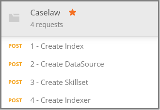

# How to get started with knowledge mining in Azure Search

> [!Note]
> Knowledge store is in preview and not intended for production use. The [REST API version 2019-05-06-Preview](search-api-preview.md) provides this feature. There is no .NET SDK support at this time.
>
[Knowledge store](knowledge-store-concept-intro.md) saves AI-enriched documents created during indexing to your Azure storage account for downstream knowledge mining in other apps. You can also use saved enrichments to understand and refine an Azure Search indexing pipeline. 

A knowledge store is defined by a *skillset* and created by an *indexer*. The physical expression of a knowledge store is specified through *projections* that determine the data structures in storage. By the time you finish this walkthrough, you will have created all of these objects and you'll know how they all fit together. 

In this exercise, start with sample data, services, and tools to learn the basic workflow for creating and using your first knowledge store, with emphasis on skillset definition.

## Prerequisites

Knowledge store is at the center of multiple services, with Azure Blob storage and Azure Table storage providing physical storage, and Azure Search and Cognitive Services for object creation and updates. Familiarity with the [basic architecture](knowledge-store-concept-intro.md) is a prerequisite to this walkthrough.

The following services and tools are used in this quickstart. 

+ [Get Postman desktop app](https://www.getpostman.com/), used for sending HTTP requests to Azure Search.

+ [Create an Azure storage account](https://docs.microsoft.com/azure/storage/common/storage-quickstart-create-account) for storing sample data and the knowledge store. Your knowledge store will exist in Azure storage.

+ [Create a Cognitive Services resource](https://docs.microsoft.com/azure/cognitive-services/cognitive-services-apis-create-account) at the S0 pay-as-you-go tier for broad-spectrum access to the full range of skills used in AI enrichments. Cognitive Services and your Azure Search service are required to be in the same region.

+ [Create an Azure Search service](search-create-service-portal.md) or [find an existing service](https://ms.portal.azure.com/#blade/HubsExtension/BrowseResourceBlade/resourceType/Microsoft.Search%2FsearchServices) under your current subscription. You can use a free service for this tutorial. 

Sample JSON documents and a Postman collection file are also required. Instructions for locating and loading supplementary files is provided in the [Prepare sample data](#prepare-sample-data) section.

## Get a key and URL

REST calls require the service URL and an access key on every request. A search service is created with both, so if you added Azure Search to your subscription, follow these steps to get the necessary information:

1. [Sign in to the Azure portal](https://portal.azure.com/), and in your search service **Overview** page, get the URL. An example endpoint might look like `https://mydemo.search.windows.net`.

1. In **Settings** > **Keys**, get an admin key for full rights on the service. There are two interchangeable admin keys, provided for business continuity in case you need to roll one over. You can use either the primary or secondary key on requests for adding, modifying, and deleting objects.

    

All requests require an api-key on every request sent to your service. You'll provide the service name and API-key in each HTTP request in the following sections.

<a name="prepare-sample-data"></a>

## Prepare sample data

A knowledge store contains the output of an enrichment pipeline. Inputs consist of "unusable" data that ultimately becomes "usable" as it progresses through the pipeline. Examples of unusable data might include image files that need to be analyzed for text or image characteristics, or dense text files that can be analyzed for entities, key phrases, or sentiment. 

This exercise uses dense text files (case law information) that originates from the [Caselaw Access Project](https://case.law/bulk/download/) Public Bulk Data download page. We uploaded a 10-document sample to GitHub for this exercise. 

In this task, you'll create an Azure Blob container for these documents to use as an input to the pipeline. 

1. Download and extract the [Azure Search Sample Data](https://github.com/Azure-Samples/azure-search-sample-data/tree/master/caselaw) repository to get the [Caselaw data set](https://github.com/Azure-Samples/azure-search-sample-data/tree/master/caselaw). 

1. [Sign in to the Azure portal](https://portal.azure.com), navigate to your Azure storage account, click **Blobs**, and then click **+ Container**.

1. [Create a Blob container](https://docs.microsoft.com/azure/storage/blobs/storage-quickstart-blobs-portal) to contain sample data: 

   1. Name the container `caselaw-test`. 
   
   1. Set the Public Access Level to any of its valid values.

1. After the container is created, open it and select **Upload** on the command bar.

   

1. Navigate to the folder containing the **caselaw-sample.json** sample file. Select the file and then click **Upload**.

1. While you are in Azure storage, get the connection string and container name.  You will need both of these strings in [Create Data Source](#create-data-source):

   1. In the overview page, click **Access Keys** and copy a *connection string*. It starts with `DefaultEndpointsProtocol=https;` and concludes with `EndpointSuffix=core.windows.net`. Your account name and key are in between. 

   1. The container name should be `caselaw-test` or whatever name you assigned.


## Set up Postman

Postman is the client app you'll use to send requests and JSON documents to Azure Search. Several of the requests can be formulated using just the information in this article. However, two of the largest requests (creating an index, creating a skillset) include verbose JSON that is too big to embed in an article. 

To make all of the JSON documents and requests fully available, we created a Postman collection file. Downloading and then importing this file is your first task in setting up the client.

1. Download and unzip the [Azure Search Postman samples](https://github.com/Azure-Samples/azure-search-postman-samples) repository.

1. Start Postman and import the Caselaw Postman collection:

   1. Click **Import** > **Import files** > **Choose files**. 

   1. Navigate to the \azure-search-postman-samples-master\azure-search-postman-samples-master\Caselaw folder.

   1. Select **Caselaw.postman_collection_v2.json**. You should see four **POST** requests in the collection.

   
   

## Create an index
    
The first request uses the [Create Index API](https://docs.microsoft.com/rest/api/searchservice/create-data-source), creating an Azure Search index that stores all searchable data. An index specifies all fields, parameters, and attributes.

You don't necessarily need an index for knowledge mining, but an indexer won't run unless an index is provided. 

1. In the URL `https://YOUR-AZURE-SEARCH-SERVICE-NAME.search.windows.net/indexes?api-version=2019-05-06-Preview`, replace `YOUR-AZURE-SEARCH-SERVICE-NAME` with the name of your search service. 

1. In the Header section, replace `<YOUR AZURE SEARCH ADMIN API-KEY>` with an admin API key for Azure Search.

1. In the Body section, the JSON document is an index schema. Collapsed for visibility, the outer shell of an index consists of the following elements. The fields collection corresponds to fields in the caselaw data set.

   ```json
   {
      "name": "caselaw",
      "defaultScoringProfile": null,
      "fields": [],
      "scoringProfiles": [],
      "corsOptions": null,
      "suggesters": [],
      "analyzers": [],
      "tokenizers": [],
      "tokenFilters": [],
      "charFilters": [],
      "encryptionKey": null
   }
   ```

1. Expand the `fields` collection. It contains the bulk of the index definition, composed of simple fields, [complex fields](search-howto-complex-data-types.md) with nested substructures, and collections.

   Take a moment to review the field definition for the `casebody` complex field on lines 302-384. Notice that a complex field can contain other complex fields when hierarchical representations are needed. Hierarchical structures can be modeled in an index, as shown here, and also as a projection in a skillset, thus creating a nested data structure in the knowledge store.

   ```json
   {
    "name": "casebody",
    "type": "Edm.ComplexType",
    "fields": [
        {
            "name": "status",
            "type": "Edm.String",
            "searchable": true,
            "filterable": true,
            "retrievable": true,
            "sortable": true,
            "facetable": true,
            "key": false,
            "indexAnalyzer": null,
            "searchAnalyzer": null,
            "analyzer": null,
            "synonymMaps": []
        },
        {
            "name": "data",
            "type": "Edm.ComplexType",
            "fields": [
                {
                    "name": "head_matter",
                    "type": "Edm.String",
                    "searchable": true,
                    "filterable": false,
                    "retrievable": true,
                    "sortable": false,
                    "facetable": false,
                    "key": false,
                    "indexAnalyzer": null,
                    "searchAnalyzer": null,
                    "analyzer": null,
                    "synonymMaps": []
                },
                {
                    "name": "opinions",
                    "type": "Collection(Edm.ComplexType)",
                    "fields": [
                        {
                            "name": "author",
                            "type": "Edm.String",
                            "searchable": true,
                            "filterable": true,
                            "retrievable": true,
                            "sortable": false,
                            "facetable": true,
                            "key": false,
                            "indexAnalyzer": null,
                            "searchAnalyzer": null,
                            "analyzer": null,
                            "synonymMaps": []
                        },
                        {
                            "name": "text",
                            "type": "Edm.String",
                            "searchable": true,
                            "filterable": false,
                            "retrievable": true,
                            "sortable": false,
                            "facetable": false,
                            "key": false,
                            "indexAnalyzer": null,
                            "searchAnalyzer": null,
                            "analyzer": null,
                            "synonymMaps": []
                        },
                        {
                            "name": "type",
                            "type": "Edm.String",
                            "searchable": true,
                            "filterable": true,
                            "retrievable": true,
                            "sortable": false,
                            "facetable": true,
                            "key": false,
                            "indexAnalyzer": null,
                            "searchAnalyzer": null,
                            "analyzer": null,
                            "synonymMaps": []
                        }
                    ]
                },
    . . .
   ```

1. Click **Send** to execute the request.  You should get a **Status: 201 Created** message as a response.

<a name="create-data-source"></a>

## Create a data source

The second request uses the [Create Data Source API](https://docs.microsoft.com/rest/api/searchservice/create-data-source) to connect to Azure Blob storage. 

1. In the URL `https://YOUR-AZURE-SEARCH-SERVICE-NAME.search.windows.net/datasources?api-version=2019-05-06-Preview`, replace `YOUR-AZURE-SEARCH-SERVICE-NAME` with the name of your search service. 

1. In the Header section, replace `<YOUR AZURE SEARCH ADMIN API-KEY>` with an admin API key for Azure Search.

1. In the Body section, the JSON document includes your storage account connection string and blob container name. The connection string can be found in the Azure portal inside your storage account's **Access Keys**. 

    ```json
    {
        "name": "caselaw-ds",
        "description": null,
        "type": "azureblob",
        "subtype": null,
        "credentials": {
            "connectionString": "DefaultEndpointsProtocol=https;AccountName=<YOUR-STORAGE-ACCOUNT>;AccountKey=<YOUR-STORAGE-KEY>;EndpointSuffix=core.windows.net"
        },
        "container": {
            "name": "<YOUR-BLOB-CONTAINER-NAME>",
            "query": null
        },
        "dataChangeDetectionPolicy": null,
        "dataDeletionDetectionPolicy": null
    }
    ```

1. Click **Send** to execute the request.  You should get a **Status: 201 Created** message as a response.


<a name="create-skillset"></a>

## Create a skillset and knowledge store

The third request uses the [Create Skillset API](https://docs.microsoft.com/rest/api/searchservice/create-skillset), creating an Azure Search object that specifies what cognitive skills to call, how to chain skills together, and most importantly for this walkthrough - how to specify a knowledge store.

1. In the URL `https://YOUR-AZURE-SEARCH-SERVICE-NAME.search.windows.net/skillsets?api-version=2019-05-06-Preview`, replace `YOUR-AZURE-SEARCH-SERVICE-NAME` with the name of your search service. 

1. In the Header section, replace `<YOUR AZURE SEARCH ADMIN API-KEY>` with an admin API key for Azure Search.

1. In the Body section, the JSON document is a skillset definition. Collapsed for visibility, the outer shell of a skillset consists of the following elements. The `skills` collection defines the in-memory enrichments, but the `knowledgeStore` definition specifies how the output is stored. The `cognitiveServices` definition is your connection to the AI enrichment engines.

   ```json
   {
    "name": "caselaw-ss",
    "description": null,
    "skills": [],
    "cognitiveServices": [],
    "knowledgeStore": []
   }
   ```

1. Expand `cognitiveServices` and `knowledgeStore` so that you can provide connection information. In the example, these strings are located after the skillset definition, towards the end of the request body. 

   For `cognitiveServices`, provision a resource at the S0 tier, located in the same region as Azure Search. You can get the cognitiveServices name and key from the same page in the Azure portal. 
   
   For `knowledgeStore`, you can use the same connection string used for the caselaw Blob container.

    ```json
    "cognitiveServices": {
        "@odata.type": "#Microsoft.Azure.Search.CognitiveServicesByKey",
        "description": "YOUR-SAME-REGION-S0-COGNITIVE-SERVICES-RESOURCE",
        "key": "YOUR-COGNITIVE-SERVICES-KEY"
    },
    "knowledgeStore": {
        "storageConnectionString": "YOUR-STORAGE-ACCOUNT-CONNECTION-STRING",
    ```

1. Expand the skills collection, in particular the Shaper skills on lines 85 and 179, respectively. The Shaper skill is important because it assembles the data structures you want for knowledge mining. During skillset execution, these structures are in-memory only, but as you move to the next step, you'll see how this output can be saved to a knowledge store for further exploration.

   The following snippet is from line 217. 

    ```json
    "name": "Opinions",
    "source": null,
    "sourceContext": "/document/casebody/data/opinions/*",
    "inputs": [
        {
            "name": "Text",
            "source": "/document/casebody/data/opinions/*/text"
        },
        {
            "name": "Author",
            "source": "/document/casebody/data/opinions/*/author"
        },
        {
            "name": "Entities",
            "source": null,
            "sourceContext": "/document/casebody/data/opinions/*/text/pages/*/entities/*",
            "inputs": [
                {
                    "name": "Entity",
                    "source": "/document/casebody/data/opinions/*/text/pages/*/entities/*/value"
                },
                {
                    "name": "EntityType",
                    "source": "/document/casebody/data/opinions/*/text/pages/*/entities/*/category"
                }
            ]
        }
    ]
   . . .
   ```

1. Expand `projections` element in `knowledgeStore`, starting on line 262. Projections specify the knowledge store composition. Projections are specified in tables-objects pairs, but currently only one at time. As you can see in the first projection, `tables` is specified but `objects` is not. In the second, it's the opposite.

   In Azure storage, tables will be created in Table storage for each table you create, and each object gets a container in Blob storage.

   Blob objects typically contain the full expression of an enrichment. Tables typically contain partial enrichments, in combinations that you arrange for specific purposes. This example shows a Cases table and an Opinions table, but not shown are other tables like Entities, Attorneys, Judges, and Parties.

    ```json
    "projections": [
        {
            "tables": [
                {
                    "tableName": "Cases",
                    "generatedKeyName": "CaseId",
                    "source": "/document/Case"
                },
                {
                    "tableName": "Opinions",
                    "generatedKeyName": "OpinionId",
                    "source": "/document/Case/OpinionsSnippets/*"
                }
            ],
            "objects": []
        },
        {
            "tables": [],
            "objects": [
                {
                    "storageContainer": "enrichedcases",
                    
                    "source": "/document/CaseFull"
                }
            ]
        }
    ]
    ```

1. Click **Send** to execute the request. The response should be **201** and look similar to the following example, showing the first part of the response.

    ```json
    {
    "name": "caselaw-ss",
    "description": null,
    "skills": [
        {
            "@odata.type": "#Microsoft.Skills.Text.SplitSkill",
            "name": "SplitSkill#1",
            "description": null,
            "context": "/document/casebody/data/opinions/*/text",
            "defaultLanguageCode": "en",
            "textSplitMode": "pages",
            "maximumPageLength": 5000,
            "inputs": [
                {
                    "name": "text",
                    "source": "/document/casebody/data/opinions/*/text
                }
            ],
            "outputs": [
                {
                    "name": "textItems",
                    "targetName": "pages"
                }
            ]
        },
        . . .
    ```

## Create and run an indexer

The fourth request uses the [Create Indexer API](https://docs.microsoft.com/rest/api/searchservice/create-indexer), creating an Azure Search indexer. An indexer is the execution engine of the indexing pipeline. All of the definitions you have created so far are put into motion with this step.

1. In the URL `https://YOUR-AZURE-SEARCH-SERVICE-NAME.search.windows.net/indexers?api-version=2019-05-06-Preview`, replace `YOUR-AZURE-SEARCH-SERVICE-NAME` with the name of your search service. 

1. In the Header section, replace `<YOUR AZURE SEARCH ADMIN API-KEY>` with an admin API key for Azure Search.

1. In the Body section, the JSON document specifies the indexer name. A data source and index are required by the indexer. A skillset is optional for an indexer, but required for AI enrichment.

    ```json
    {
        "name": "caselaw-idxr",
        "description": null,
        "dataSourceName": "caselaw-ds",
        "skillsetName": "caselaw-ss",
        "targetIndexName": "caselaw",
        "disabled": null,
        "schedule": null,
        "parameters": { },
        "fieldMappings": [],
        "outputFieldMappings": [ ]
    ```

1. Expand outputFieldMappings. In contrast with fieldMappings, which are used for custom mapping between fields in a data source and fields in an index, the outputFieldMappings are used for mapping enriched fields, created and populated by the pipeline, to output fields in an index or projection.

    ```json
    "outputFieldMappings": [
        {
            "sourceFieldName": "/document/casebody/data/opinions/*/text/pages/*/people/*",
            "targetFieldName": "people",
            "mappingFunction": null
        },
        {
            "sourceFieldName": "/document/casebody/data/opinions/*/text/pages/*/organizations/*",
            "targetFieldName": "orginizations",
            "mappingFunction": null
        },
        {
            "sourceFieldName": "/document/casebody/data/opinions/*/text/pages/*/locations/*",
            "targetFieldName": "locations",
            "mappingFunction": null
        },
        {
            "sourceFieldName": "/document/Case/OpinionsSnippets/*/Entities/*",
            "targetFieldName": "entities",
            "mappingFunction": null
        },
        {
            "sourceFieldName": "/document/casebody/data/opinions/*/text/pages/*/keyPhrases/*",
            "targetFieldName": "keyPhrases",
            "mappingFunction": null
        }
    ]
    ```

1. Click **Send** to execute the request. The response should be **201** and the response body should look almost identical to the request payload you provided (trimmed for brevity).

    ```json
    {
        "name": "caselaw-idxr",
        "description": null,
        "dataSourceName": "caselaw-ds",
        "skillsetName": "caselaw-ss",
        "targetIndexName": "caselaw",
        "disabled": null,
        "schedule": null,
        "parameters": { },
        "fieldMappings": [],
        "outputFieldMappings": [ ]
    }
    ```

## Explore knowledge store

You can start exploring as soon as the first document is imported. For this task, use [**Storage Explorer**](https://docs.microsoft.com/azure/storage/blobs/storage-quickstart-blobs-storage-explorer) in the portal.

It's important to realize that a knowledge store is fully detached from Azure Search. The Azure Search index and the knowledge store both contain data representation and contents, but part ways from there. Use the index for full text search, filtered search, and all the scenarios supported in Azure Search. Or, move forward with just your knowledge store, attaching other tools to analyze contents.

## Takeaways

You've now created your first knowledge store in Azure storage and used Storage Explorer to view the enrichments. This is the fundamental experience for working with stored enrichments. 

## Next steps

The Shaper skill does the heavy lifting on creating granular data forms that can be combined into new shapes. As a next step, review the reference page for this skill for details on how it's used.

> [!div class="nextstepaction"]
> [Shaper skill reference](cognitive-search-skill-shaper.md)


<!---
## Keep This

How to convert unformatted JSON into an indented JSON document structure that allows you to quickly identify nested structures. Useful for creating an index that includes complex types.

1. Use Visual Studio Code.
2. Open data.jsonl
--->
