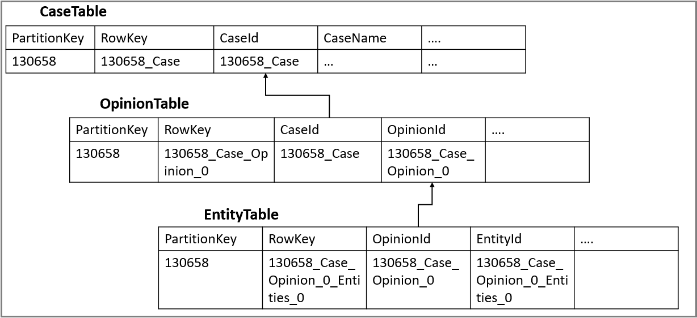

# Working with projections in a knowledge store in Azure Search

> [!Note]
> Knowledge store is in preview and not intended for production use. The [REST API version 2019-05-06-Preview](search-api-preview.md) provides this feature. There is no .NET SDK support at this time.
>

Azure Search enables content enrichment through AI cognitive skills and custom skills as part of indexing. Enrichments add structure to your documents and make searching more effective. In many instances, the enriched documents are useful for scenarios other than search, such as for knowledge mining.

Projections, a component of [knowledge store](knowledge-store-concept-intro.md), are views of enriched documents that can be saved to physical storage for knowledge mining purposes. A projection lets you "project" your data into a shape that aligns with your needs, preserving relationships so that tools like Power BI can read the data with no additional effort. 

Projections can be tabular, with data stored in rows and columns in Azure Table storage, or JSON objects stored in Azure Blob storage. You can define multiple projections of your data as it is being enriched. This is useful when you want the same data shaped differently for individual use cases. 

The knowledge store supports two types of projections:

+ **Tables**: For data that is best represented as rows and columns, table projections allow you to define a schematized shape or projection in Table storage. 

+ **Objects**: When you need a JSON representation of your data and enrichments, object projections are saved as blobs.

To see projections defined in context, step through [How to get started with knowledge store](knowledge-store-howto.md)

## Projection groups

In some cases, you will need to project your enriched data in different shapes to meet different objectives. The knowledge store allows you to define multiple groups of projections. Projection groups have the following key characteristics of mutual exclusivity and relatedness.

### Mutually exclusivity

All content projected into a single group is independent of data projected into other projection groups. 
This implies that you can have the same data shaped differently, yet repeated in each projection group. 

One constraint enforced in projection groups is the mutual exclusivity of projection types with a projection group. You can only define either table projections or object projections within a single group. If you want both tables and objects, define one projection group for tables, and a second projection group for objects.

### Relatedness

All content projected within a single projection group preserves relationships within the data. Relationships are based on a generated key and each child node retains a reference to the parent node. Relationships do not span projection groups, and tables or objects created in one projection group have no relationship to data generated in other projection groups.

## Input shaping
Getting your data in the right shape or structure is key to effective use, be it tables or objects. The ability to shape or structure your data based on how you plan to access and use it is a key capability exposed as the **Shaper** skill within the skillset.  

Projections are easier to define when you have an object in the enrichment tree that matches the schema of the projection. The updated [Shaper skill](cognitive-search-skill-shaper.md) allows you to compose an object from different nodes of the enrichment tree and parent them under a new node. The **Shaper** skill allows you to define complex types with nested objects.

When you have a new shape defined that contains all the elements you need to project out, you can now use this shape as the source for your projections or as an input to another skill.

## Table projections

Because it makes importing easier, we recommend table projections for data exploration with Power BI. Additionally, table projections allow for changing change the cardinality between table relationship. 

You can project a single document in your index into multiple tables, preserving the relationships. When projecting to multiple tables, the complete shape will be projected into each table, unless a child node is the source of another table within the same group.

### Defining a table projection

When defining a table projection within the `knowledgeStore` element of your skillset, start by mapping a node on the enrichment tree to the table source. Typically this node is the output of a **Shaper** skill that you added to the list of skills to produce a specific shape that you need to project into tables. The node you choose to project can be sliced to project into multiple tables. The tables definition is a list of tables that you want to project. 

Each table requires three properties:

+ tableName: The name of the table in Azure Storage.

+ generatedKeyName: The column name for the key that uniquely identifies this row.

+ source: The node from the enrichment tree you are sourcing your enrichments from. This is usually the output of a shaper, but could be the output of any of the skills.

Here is an example of table projections.

```json
{
    "name": "your-skillset",
    "skills": [
      …your skills
      
    ],
"cognitiveServices": {
… your cognitive services key info
    },

    "knowledgeStore": {
      "storageConnectionString": "an Azure storage connection string",
      "projections" : [
        {
          "tables": [
            { "tableName": "MainTable", "generatedKeyName": "SomeId", "source": "/document/EnrichedShape" },
            { "tableName": "KeyPhrases", "generatedKeyName": "KeyPhraseId", "source": "/document/EnrichedShape/*/KeyPhrases/*" },
            { "tableName": "Entities", "generatedKeyName": "EntityId", "source": "/document/EnrichedShape/*/Entities/*" }
          ]
        },
        {
          "objects": [
            
          ]
        }
      ]
    }
}
```
As demonstrated in this example, the key phrases and entities are modeled into different tables and will contain a reference back to the parent (MainTable) for each row. 

The following illustration is a reference to the Caselaw exercise in [How to get started with knowledge store](knowledge-store-howto.md). In a scenario where a case has multiple opinions, and each opinion is enriched by identifying entities contained within it, you could model the projections as shown here.



## Object projections

Object projections are JSON representations of the enrichment tree that can be sourced from any node. In many cases, the same **Shaper** skill that creates a table projection can be used to generate an object projection. 

```json
{
 
    "name": "your-skillset",
    "skills": [
      …your skills
      
    ],
"cognitiveServices": {
… your cognitive services key info
    },

    "knowledgeStore": {
      "storageConnectionString": "an Azure storage connection string",
      "projections" : [
        {
          "tables": [ ]
        },
        {
          "objects": [
            {
              "storageContainer": "Reviews", 
              "format": "json", 
              "source": "/document/Review", 
              "key": "/document/Review/Id" 
            }
          ]
        }
      ]
    }
}
```

Generating an object projection requires a few object-specific attributes:

+ storageContainer: The container where the objects will be saved
+ source: The path to the node of the enrichment tree that is the root of the projection
+ key: A path that represents a unique key for the object to be stored. It will be used to create the name of the blob in the container.

## Projection Lifecycle

Your projections have a lifecycle that is tied to the source data in your data source. As your data is updated and re-indexed, your projections are updated with the results of the enrichments ensuring your projections are eventually consistent with the data in your data source. The projections inherit the delete policy you have configured for your index. 

## Using projections

After the indexer is run, you can read the projected data in the containers or tables you specified through projections. 

For analytics, exploration in Power BI is as simple as setting Azure Table storage as the data source. You can very easily create a set of visualizations on your data leveraging the relationships within.

Alternatively, if you need to use the enriched data in a data science pipeline, you could [load the data from blobs into a Pandas DataFrame](../machine-learning/team-data-science-process/explore-data-blob.md).

Finally, if you need to export your data from the knowledge store, Azure Data Factory has connectors to export the data and land it in the database of your choice. 

## Next steps

As a next step, create your first knowledge store using sample data and instructions.

> [!div class="nextstepaction"]
> [How to create a knowlege store](knowledge-store-howto.md).