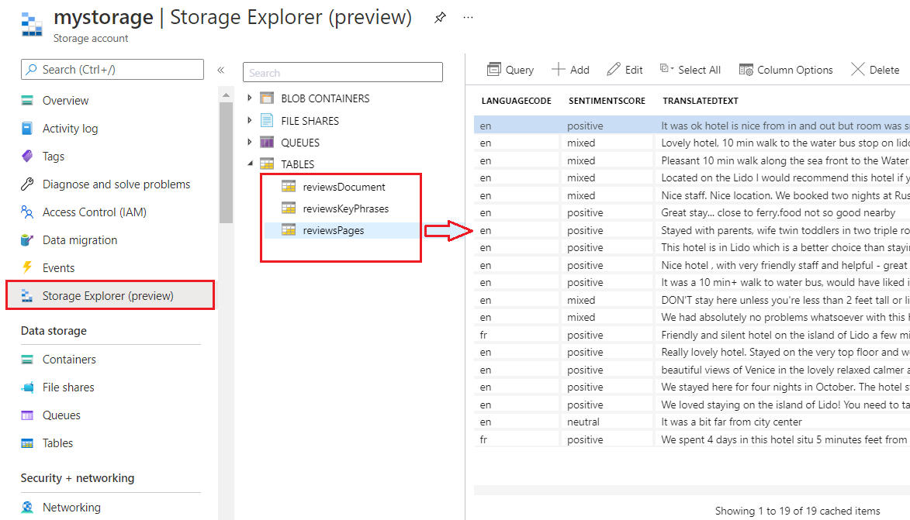
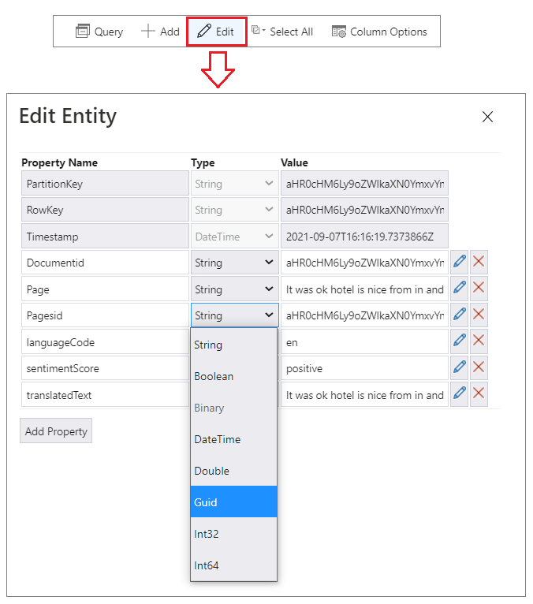
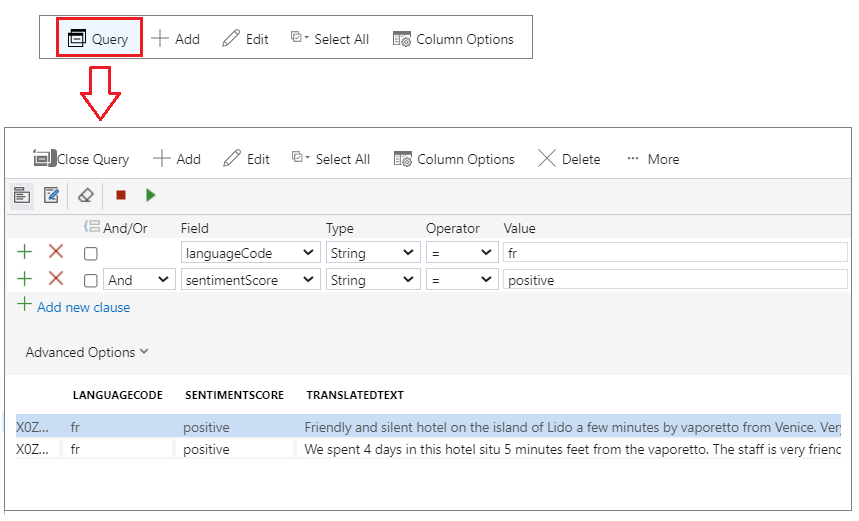

# View a knowledge store with Storage Explorer

In this article, you'll learn by example how to connect to and explore a knowledge store using Storage Explorer in the Azure portal.

## Prerequisites

+ Follow the steps in [Create a knowledge store in Azure portal](knowledge-store-create-portal.md) to create the sample knowledge store used in this walkthrough.

+ You will also need the name of the Azure storage account that you used to create the knowledge store, along with its access key from the Azure portal.

## View, edit, and query a knowledge store in Storage Explorer

1. In the Azure portal, [open the Storage account](https://ms.portal.azure.com/#blade/HubsExtension/BrowseResourceBlade/resourceType/Microsoft.Storage%2storageAccounts/) that you used to create the knowledge store.

1. In the storage account's left navigation pane, click **Storage Explorer**.

1. Expand the **TABLES** list to show a list of Azure table projections that were created when you ran the **Import Data** wizard on your hotel reviews sample data.

Select any table to view the enriched data, including key phrases and sentiment scores.

   

To change the data type for any table value or to change individual values in your table, click **Edit**. When you change the data type for any column in one table row, it will be applied to all rows.

   

To run queries, click **Query** on the command bar and enter your conditions.  

   

## Clean up

When you're working in your own subscription, it's a good idea at the end of a project to identify whether you still need the resources you created. Resources left running can cost you money. You can delete resources individually or delete the resource group to delete the entire set of resources.

You can find and manage resources in the portal, using the **All resources** or **Resource groups** link in the left-navigation pane.

If you are using a free service, remember that you are limited to three indexes, indexers, and data sources. You can delete individual items in the portal to stay under the limit.

## Next steps

Connect this knowledge store to Power BI for deeper analysis, or move forward with code, using the REST API and Postman to create a different knowledge store.

> [!div class="nextstepaction"]
> [Connect with Power BI](knowledge-store-connect-power-bi.md)
> [Create a knowledge store in REST](knowledge-store-create-rest.md)
