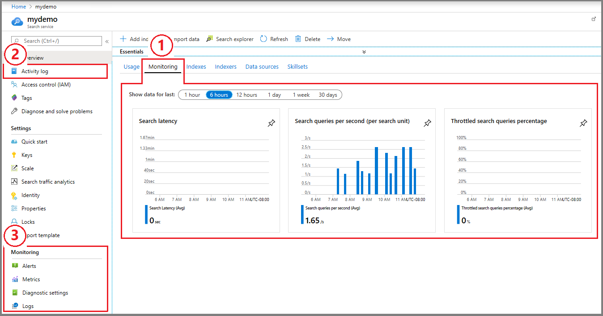

# Monitoring Azure Cognitive Search

[Azure Monitor](../azure-monitor/overview.md) is enabled with every subscription to provide monitoring capabilities over all Azure resources, including Cognitive Search. When you sign up for search, Azure Monitor collects [**activity logs**](../azure-monitor/data-sources.md#azure-activity-log) and [**platform metrics**](../azure-monitor/essentials/data-platform-metrics.md) as soon as you start using the service. 

Optionally, you can enable diagnostic settings to collect [**resource logs**](../azure-monitor/essentials/resource-logs.md). Resource logs contain detailed information about search service operations that's useful for deeper analysis and investigation. 

This article explains how monitoring works for Azure Cognitive Search. It also describes the system APIs that return information about your service.

> [!NOTE]
> Cognitive Search doesn't monitor individual user access to content on the search service. If you require this level of monitoring, you'll need to implement it in your client application.

## Monitoring in Azure portal

In the search service pages in Azure portal, you can find the current status of operations and capacity.

  

+ **Monitoring** tab in the **Overview** page summarizes key [query metrics](search-monitor-queries.md), including search latency, search queries per second, and throttled queries. On the next tab over (not shown), **Usage** shows available capacity and the quantity of indexes, indexers, data sources, and skillsets relative to the maximum allowed for your [service tier](search-sku-tier.md).

+ **Activity log** on the navigation menu captures service-level events: service creation, configuration, and deletion.

+ Further down the navigation menu, the **Monitoring** section includes actions for Azure Monitor, filtered for search. Here, you can enable diagnostic settings and resource logging, and specify how you want the data stored.

> [!NOTE]
> Because portal pages are refreshed every few minutes, the numbers reported are approximate, intended to give you a general sense of how well your system is handling requests. Actual metrics, such as queries per second (QPS) may be higher or lower than the number shown on the page. If precision is a requirement, consider using APIs.

## Get system data from REST APIs

Cognitive Search REST APIs provide the **Usage** data that's visible in the portal. This information is retrieved from your search service, which you can obtain programmatically:

+ [Service Statistics (REST)](/rest/api/searchservice/get-service-statistics)
+ [Index Statistics (REST)](/rest/api/searchservice/get-index-statistics)
+ [Document Counts (REST)](/rest/api/searchservice/count-documents)
+ [Indexer Status (REST)](/rest/api/searchservice/get-indexer-status)

For REST calls, use an [admin API key](search-security-api-keys.md) and [Postman](search-get-started-rest.md) or another REST client to query your search service.

## Monitor activity logs

In Azure Cognitive Search, [**activity logs**](../azure-monitor/data-sources.md#azure-activity-log) reflect control plane activity, such as service creation and configuration, or API key usage or management. 

Activity logs are collected [free of charge](../azure-monitor/usage-estimated-costs.md#pricing-model), with no configuration required. Data retention is 90 days, but you can configure durable storage for longer retention.

1. In the Azure portal, find your search service. From the menu on the left, select **Activity logs** to view the logs for your search service. See [Azure Monitor activity log](../azure-monitor/essentials/activity-log.md) for general guidance on working with activity logs.

1. Review the entries. Entries often include **Get Admin Key**, one entry for every call that [provided an admin API key](search-security-api-keys.md) on the request. There are no details about the call itself, just a notification that the admin key was used.

1. For other entires, see the [Management REST API reference](/rest/api/searchmanagement/) for control plane activity that might appear in the log.

The following screenshot shows the activity log signals that can be configured in an alert. These signals represent the entries you might see in the activity log.

:::image type="content" source="media/search-monitor-usage/activity-log-signals.png" alt-text="Screenshot of the activity log signals that can be used in an alert." border="true":::

## Monitor metrics

In Azure Cognitive Search, [**platform metrics**](../azure-monitor/essentials/data-platform-metrics.md) measure query performance, indexing volume, and skillset invocation.

Metrics are collected [free of charge](../azure-monitor/usage-estimated-costs.md#pricing-model), with no configuration required. Platform metrics are stored for 93 days. However, in the portal you can only query a maximum of 30 days' worth of platform metrics data on any single chart.

In the Azure portal, find your search service. From the menu on the left, under Monitoring, select **Metrics** to open metrics explorer.

The following links provide more information about working with platform metrics:

+ [Tutorial: Analyze metrics for an Azure resource](../azure-monitor/essentials/tutorial-metrics.md) for general guidance on using metrics explorer.

+ [Microsoft.Search/searchServices (Azure Monitor)](../azure-monitor/essentials/metrics-supported.md#microsoftsearchsearchservices) for the platform metrics reference.

+ [Monitoring data reference](monitor-azure-cognitive-search-data-reference.md) for supplemental descriptions and dimensions.

+ [Monitor queries](search-monitor-queries.md) has details about the query metrics.

## Set up alerts

Alerts help you to identify and address issues before they become a problem for application users. You can set alerts on [metrics](../azure-monitor/alerts/alerts-metric-overview.md), [resource logs](../azure-monitor/alerts/alerts-unified-log.md), and [activity logs](../azure-monitor/alerts/activity-log-alerts.md). Alerts are billable (see the [Pricing model](../azure-monitor/usage-estimated-costs.md#pricing-model) for details).

1. In the Azure portal, find your search service. From the menu on the left, under Monitoring, select **Alerts** to open metrics explorer.

1. See [Tutorial: Create a metric alert for an Azure resource](../azure-monitor/alerts/tutorial-metric-alert.md) for general guidance on setting up alerts from metrics explorer.

The following table describes several rules. On a search service, throttling or query latency that exceeds a given threshold are the most commonly used alerts, but you might also want to be notified if a search service is deleted.

| Alert type | Condition | Description  |
|:---|:---|:---|
| Search Latency (metric alert) | Whenever the average search latency is greater than a user-specified threshold (in  seconds) | Send an SMS alert when average query response time exceeds the threshold. |
| Throttled search queries percentage (metric alert) | Whenever the total throttled search queries percentage is greater than or equal to a user-specified threshold | Send an SMS alert when dropped queries begin to exceed the threshold.|
| Delete Search Service (activity log alert) | Whenever the Activity Log has an event with Category='Administrative', Signal name='Delete Search Service (searchServices)', Level='critical' | Send an email if a search service is deleted in the subscription. |

> [!NOTE]
> Currently, there are no storage-related alerts (storage consumption data isn't aggregated or logged into the **AzureMetrics** table). To get storage alerts, you could [build a custom solution](/previous-versions/azure/azure-monitor/insights/solutions) that emits resource-related notifications, where your code checks for storage size and handles the response.

## Enable resource logging

In Azure Cognitive Search, [**resource logs**](../azure-monitor/essentials/resource-logs.md) capture indexing and query operations on the search service itself.

Resource Logs aren't collected and stored until you create a diagnostic setting. A diagnostic setting specifies data collection and storage. You can create multiple settings if you want to keep metrics and log data separate, or if you want more than one of each type of destination.

Resource logging is billable (see the [Pricing model](../azure-monitor/usage-estimated-costs.md#pricing-model) for details), starting when you create a diagnostic setting. See [Diagnostic settings in Azure Monitor](../azure-monitor/essentials/diagnostic-settings.md) for general guidance.

1. In the Azure portal, find your search service. From the menu on the left, under Monitoring, select **Diagnostic settings**.

1. Select **+ Add diagnostic setting**.

1. Give the diagnostic setting a name. Use granular and descriptive names if you're creating more than one setting.

1. Select the logs and metrics that are in scope for this setting. Selections include "allLogs", "audit", "OperationLogs", "AllMetrics". You can exclude activity logs by selecting the "OperationLogs" category.

   + See [Microsoft.Search/searchServices (in Supported categories for Azure Monitor resource logs)](../azure-monitor/essentials/resource-logs-categories.md#microsoftsearchsearchservices)

   + See [Microsoft.Search/searchServices (in Supported metrics)](../azure-monitor/essentials/metrics-supported.md#microsoftsearchsearchservices)

   + See [Azure Cognitive Search monitoring data reference](monitor-azure-cognitive-search-data-reference.md) for the extended schema 

1. Select **Send to Log Analytics workspace**. Kusto queries and data exploration will target the workspace.

1. Optionally, select [other destinations](../azure-monitor/essentials/diagnostic-settings.md#destinations).

1. Select **Save**.

[!INCLUDE [audit log categories tip](../azure-monitor/includes/azure-monitor-log-category-groups-tip.md)]

Once the workspace contains data, you can run log queries:

+ See [Tutorial: Collect and analyze resource logs from an Azure resource](../azure-monitor/essentials/tutorial-resource-logs.md) for general guidance on log queries.

+ See [Analyze performance in Azure Cognitive Search](search-performance-analysis.md) for examples and guidance specific to search services.

## Sample Kusto queries

> [!IMPORTANT]
> When you select **Logs** from the Azure Cognitive Search menu, Log Analytics is opened with the query scope set to the current search service. This means that log queries will only include data from that resource. If you want to query over multiple search services or combine data from other Azure services, select **Logs** from the **Azure Monitor** menu. See [Log query scope and time range in Azure Monitor Log Analytics](../azure-monitor/logs/scope.md) for details.

Kusto is the query language used for Log Analytics. The next section has some queries to get you started. See the [**Azure Cognitive Search monitoring data reference**](monitor-azure-cognitive-search-data-reference.md) for descriptions of schema elements used in a query. See [Analyze performance in Azure Cognitive Search](search-performance-analysis.md) for more examples and guidance specific to search service.

### List metrics by name

Return a list of metrics and the associated aggregation. The query is scoped to the current search service over the time range that you specify.

```kusto
AzureMetrics
| project MetricName, Total, Count, Maximum, Minimum, Average
```

### List operations by name

Return a list of operations and a count of each one.

```kusto
AzureDiagnostics
| summarize count() by OperationName
```

### Long-running queries

This Kusto query against AzureDiagnostics returns `Query.Search` operations, sorted by duration (in milliseconds). For more examples of `Query.Search` queries, see [Analyze performance in Azure Cognitive Search](search-performance-analysis.md).

```Kusto
AzureDiagnostics
| project OperationName, resultSignature_d, DurationMs, Query_s, Documents_d, IndexName_s
| where OperationName == "Query.Search"
| sort by DurationMs   
```

### Indexer status

This Kusto query returns the status of indexer operations. Results include the operation name, description of the request (which includes the name of the indexer), result status (Success or Failure), and the [HTTP status code](/rest/api/searchservice/http-status-codes). For more information about indexer execution, see [Monitor indexer status](search-howto-monitor-indexers.md).

```Kusto
AzureDiagnostics
| project OperationName, Description_s, Documents_d, ResultType, resultSignature_d
| where OperationName == "Indexers.Status"
```

## Next steps

The monitoring framework for Azure Cognitive Search is provided by [Azure Monitor](../azure-monitor/overview.md). If you're not familiar with this service, start with [Monitoring Azure resources with Azure Monitor](../azure-monitor/essentials/monitor-azure-resource.md) to review the main concepts. You can also review the following articles for Azure Cognitive Search:

+ [Analyze performance in Azure Cognitive Search](search-performance-analysis.md)
+ [Monitor queries](search-monitor-queries.md)
+ [Monitor indexer-based indexing](search-howto-monitor-indexers.md)
