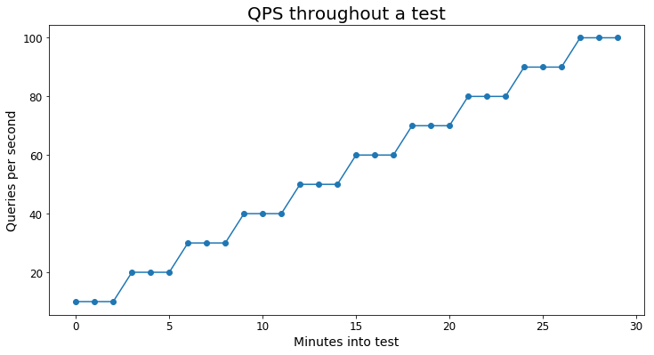
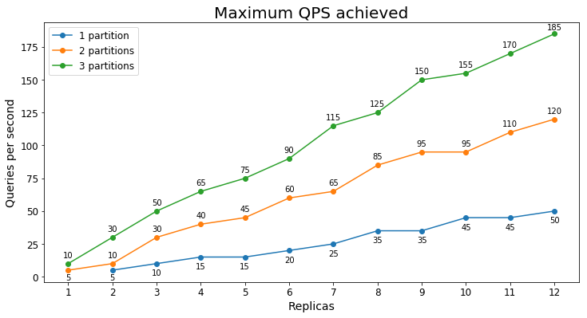
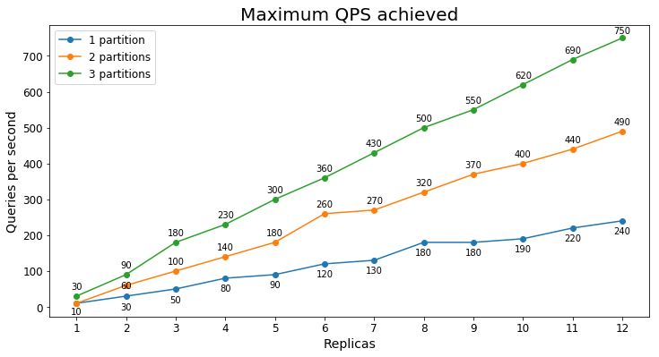
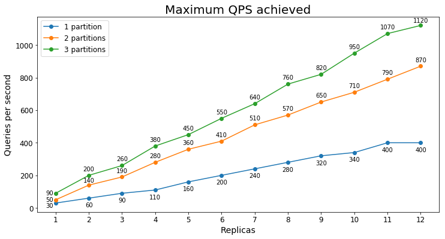
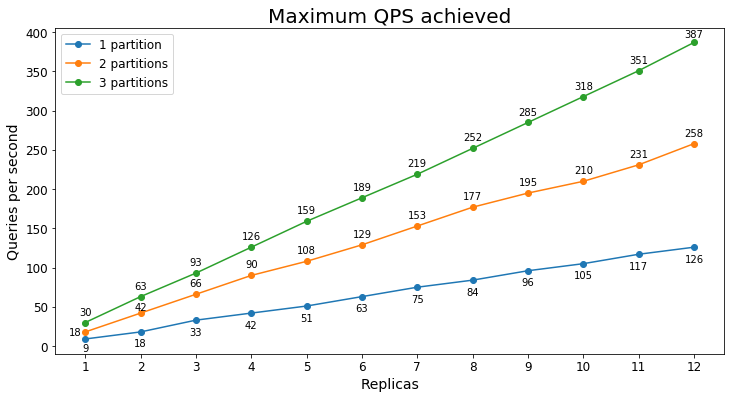
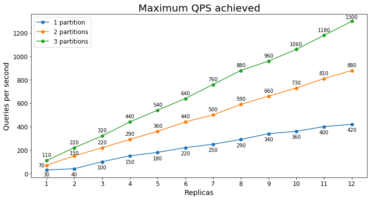

# Azure AI Search performance benchmarks

Azure AI Search's performance depends on a [variety of factors](search-performance-tips.md) including the size of your search service and the types of queries you're sending. To help estimate the size of search service needed for your workload, we've run several benchmarks to document the performance for different search services and configurations. These benchmarks in no way guarantee a certain level of performance from your service but can give you an idea of the performance you can expect.

To cover a range of different use cases, we ran benchmarks for two main scenarios:

* **E-commerce search** - This benchmark emulates a real e-commerce scenario and is based on the Nordic e-commerce company [CDON](https://cdon.com).
* **Document search** - This scenario is comprised of keyword search over full text documents from [Semantic Scholar](https://www.aclweb.org/anthology/2020.acl-main.447/). This emulates a typical document search solution.

While these scenarios reflect different use cases, every scenario is different so we always recommend performance testing your individual workload. We've published a [performance testing solution using JMeter](https://github.com/Azure-Samples/azure-search-performance-testing) so you can run similar tests against your own service.

## Testing methodology

To benchmark Azure AI Search's performance, we ran tests for two different scenarios at different tiers and replica/partition combinations.

To create these benchmarks, the following methodology was used:

1. The test begins at `X` queries per second (QPS) for 180 seconds. This was usually 5 or 10 QPS.
2. QPS then increased by `X` and ran for another 180 seconds
3. Every 180 seconds, the test increased by `X` QPS until average latency increased above 1000 ms or less than 99% of queries succeeded.

The following graph gives a visual example of what the test's query load looks like:

Each scenario used at least 10,000 unique queries to avoid tests being overly skewed by caching.

> [!IMPORTANT]
> These tests only include query workloads. If you expect to have a high volume of indexing operations, be sure to factor that into your estimation and performance testing. Sample code for simulating indexing can be found in this [tutorial](tutorial-optimize-indexing-push-api.md).

### Definitions

- **Maximum QPS** -  the maximum QPS numbers are based on the highest QPS achieved in a test where 99% of queries completed successfully without throttling and average latency stayed under 1000 ms.

- **Percentage of max QPS** - A percentage of the maximum QPS achieved for a particular test. For example, if a given test reached a maximum of 100 QPS, 20% of max QPS would be 20 QPS.

- **Latency** - The server's latency for a query; these numbers don't include [round trip delay (RTT)](https://en.wikipedia.org/wiki/Round-trip_delay). Values are in milliseconds (ms).

### Disclaimer

The code we used to run these benchmarks is available on the [azure-search-performance-testing](https://github.com/Azure-Samples/azure-search-performance-testing/tree/main/other_tools) repository. It's worth noting that we observed slightly lower QPS levels with the [JMeter performance testing solution](https://github.com/Azure-Samples/azure-search-performance-testing) than in the benchmarks. The differences can be attributed to differences in the style of the tests. This speaks to the importance of making your performance tests as similar to your production workload as possible.

These benchmarks in no way guarantee a certain level of performance from your service but can give you an idea of the performance you can expect based on your scenario.

If you have any questions or concerns, reach out to us at azuresearch_contact@microsoft.com.

## Benchmark 1: E-commerce search

:::row:::
   :::column span="1":::
      
   :::column-end:::
   :::column span="3":::
      This benchmark was created in partnership with the e-commerce company, [CDON](https://cdon.com), the Nordic region's largest online marketplace with operations in Sweden, Finland, Norway, and Denmark. Through its 1,500 merchants, CDON offers a wide range assortment that includes over 8 million products. In 2020, CDON had over 120 million visitors and 2 million active customers. You can learn more about CDON's use of Azure AI Search in [this article](https://pulse.microsoft.com/transform/na/fa1-how-cdon-has-been-using-technology-to-become-the-leading-marketplace-in-the-nordics/).
   :::column-end:::
:::row-end:::

To run these tests, we used a snapshot of CDON's production search index and thousands of unique queries from their [website](https://cdon.com).

### Scenario Details

- **Document Count**: 6,000,000 
- **Index Size**: 20 GB
- **Index Schema**: a wide index with 250 fields total, 25 searchable fields, and 200 facetable/filterable fields
- **Query Types**: full text search queries including facets, filters, ordering, and scoring profiles

### S1 Performance

#### Queries per second

The following chart shows the highest query load a service could handle for an extended period of time in terms of queries per second (QPS).

#### Query latency

Query latency varies based on the load of the service and services under higher stress will have a higher average query latency. The following table shows the 25th, 50th, 75th, 90th, 95th, and 99th percentiles of query latency for three different usage levels.

| Percentage of max QPS  | Average latency | 25% | 75% | 90% | 95% | 99%|
|---|---|---|---| --- | --- | --- | 
| 20%  | 104 ms  | 35 ms  | 115 ms   | 177 ms | 257 ms | 738 ms |
| 50%  | 140 ms  | 47 ms  | 144 ms   | 241 ms | 400 ms | 1175 ms |
| 80%  | 239 ms  | 77 ms  | 248 ms   | 466 ms | 763 ms | 1752 ms | 

### S2 Performance

#### Queries per second

The following chart shows the highest query load a service could handle for an extended period of time in terms of queries per second (QPS).

#### Query latency

Query latency varies based on the load of the service and services under higher stress will have a higher average query latency. The following table shows the 25th, 50th, 75th, 90th, 95th, and 99th percentiles of query latency for three different usage levels.

| Percentage of max QPS  | Average latency | 25% | 75% | 90% | 95% | 99%|
|---|---|---|---| --- | --- | --- | 
| 20%  | 56 ms | 21 ms | 68 ms  | 106 ms  | 132 ms | 210 ms | 
| 50%  | 71 ms  | 26 ms  | 83 ms   | 132 ms | 177 ms | 329 ms |
| 80%  | 140 ms  | 47 ms  | 153 ms   | 293 ms | 452 ms | 924 ms | 

### S3 Performance

#### Queries per second

The following chart shows the highest query load a service could handle for an extended period of time in terms of queries per second (QPS).

In this case, we see that adding a second partition significantly increases the maximum QPS but adding a third partition provides diminishing marginal returns. The smaller improvement is likely because all of the data is already being pulled into the S3's active memory with just two partitions.

#### Query latency

Query latency varies based on the load of the service and services under higher stress will have a higher average query latency. The following table shows the 25th, 50th, 75th, 90th, 95th, and 99th percentiles of query latency for three different usage levels.

| Percentage of max QPS  | Average latency | 25% | 75% | 90% | 95% | 99%|
|---|---|---|---| --- | --- | --- |
| 20%  | 50 ms  | 20 ms  | 64 ms   | 83 ms | 98 ms | 160 ms |
| 50%  | 62 ms  | 24 ms  | 80 ms   | 107 ms | 130 ms | 253 ms |
| 80%  | 115 ms  | 38 ms  | 121 ms   | 218 ms | 352 ms | 828 ms |

## Benchmark 2: Document search

### Scenario Details

- **Document Count**: 7.5 million
- **Index Size**: 22 GB
- **Index Schema**: 23 fields; 8 searchable, 10 filterable/facetable
- **Query Types**: keyword searches with facets and hit highlighting

### S1 Performance

#### Queries per second

The following chart shows the highest query load a service could handle for an extended period of time in terms of queries per second (QPS).

#### Query latency

Query latency varies based on the load of the service and services under higher stress will have a higher average query latency. The following table shows the 25th, 50th, 75th, 90th, 95th, and 99th percentiles of query latency for three different usage levels.

| Percentage of max QPS  | Average latency | 25% | 75% | 90% | 95% | 99%|
|---|---|---|---| --- | --- | --- |
| 20%  | 67 ms  | 44 ms  | 77 ms   | 103 ms | 126 ms | 216 ms |
| 50%  | 93 ms  | 59 ms  | 110 ms   | 150 ms | 184 ms | 304 ms |
| 80%  | 150 ms  | 96 ms  | 184 ms   | 248 ms | 297 ms | 424 ms |

### S2 Performance

#### Queries per second

The following chart shows the highest query load a service could handle for an extended period of time in terms of queries per second (QPS).

#### Query latency

Query latency varies based on the load of the service and services under higher stress will have a higher average query latency. The following table shows the 25th, 50th, 75th, 90th, 95th, and 99th percentiles of query latency for three different usage levels.

| Percentage of max QPS  | Average latency | 25% | 75% | 90% | 95% | 99%|
|---|---|---|---| --- | --- | --- |
| 20%  | 45 ms  | 31 ms  | 55 ms   | 73 ms | 84 ms | 109 ms |
| 50%  | 63 ms  | 39 ms  | 81 ms   | 106 ms | 123 ms | 163 ms |
| 80%  | 115 ms  | 73 ms  | 145 ms   | 191 ms | 224 ms | 291 ms |

### S3 Performance

#### Queries per second

The following chart shows the highest query load a service could handle for an extended period of time in terms of queries per second (QPS).

#### Query latency

Query latency varies based on the load of the service and services under higher stress will have a higher average query latency. The following table shows the 25th, 50th, 75th, 90th, 95th, and 99th percentiles of query latency for three different usage levels.

| Percentage of max QPS  | Average latency | 25% | 75% | 90% | 95% | 99%|
|---|---|---|---| --- | --- | --- |
| 20%  | 43 ms  | 29 ms  | 53 ms   | 74 ms | 86 ms | 111 ms |
| 50%  | 65 ms  | 37 ms  | 85 ms   | 111 ms | 128 ms | 164 ms |
| 80%  | 126 ms  | 83 ms  | 162 ms   | 205 ms | 233 ms | 281 ms |

## Takeaways

Through these benchmarks, you can get an idea of the performance Azure AI Search offers. You can also see difference between services at different tiers.

Some key take ways from these benchmarks are:

* An S2 can typically handle at least four times the query volume as an S1
* An S2 will typically have lower latency than an S1 at comparable query volumes
* As you add replicas, the QPS a service can handle typically scales linearly (for example, if one replica can handle 10 QPS then five replicas can usually handle 50 QPS)
* The higher the load on the service, the higher the average latency will be

You can also see that performance can vary drastically between scenarios. If you're not getting the performance you expect, check out the [tips for better performance](search-performance-tips.md).

## Next steps

Now that you've seen the performance benchmarks, you can learn more about how to analyze Azure AI Search's performance and key factors that influence performance.

+ [Analyze performance](search-performance-analysis.md)
+ [Tips for better performance](search-performance-tips.md)
+ [Case Study: Use Cognitive Search to Support Complex AI Scenarios](https://techcommunity.microsoft.com/t5/azure-ai/case-study-effectively-using-cognitive-search-to-support-complex/ba-p/2804078)
