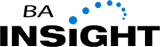
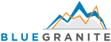
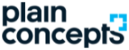

# Partner spotlight

Get expert help from Microsoft partners who build comprehensive solutions that include Azure AI Search. The following partners have deep experience with integration of full-text search and AI enrichment across a range of business and technical scenarios.

| Partner | Description | Product link |
|---------|-------------|----------------------|
|  | [**BA Insight Search for Workplace**](https://www.bainsight.com/azure-search/) is a complete enterprise search solution powered by Azure AI Search. It's the first of its kind solution, bringing the internet to enterprises for secure, "askable", powerful search to help organizations get a return on information. It delivers a web-like search experience, connects to 80+ enterprise systems and provides automated and intelligent meta tagging. | [Product page](https://www.bainsight.com/azure-search/) |
|  | [**BlueGranite**](https://www.bluegranite.com/) offers 25 years of experience in Modern Business Intelligence, Data Platforms, and AI solutions across multiple industries. Their Knowledge Mining services enable organizations to obtain unique insights from structured and unstructured data sources. Modular AI capabilities perform searches on numerous file types to index data and associate that data with more traditional data sources. Analytics tools extract patterns and trends from the enriched data and showcase results to users at all levels. | [Product page](https://www.bluegranite.com/knowledge-mining) |
|  | [**Enlighten Designs**](https://www.enlighten.co.nz) is an award-winning innovation studio that has been enabling client value and delivering digitally transformative experiences for over 22 years. We're pushing the boundaries of the Microsoft technology toolbox, harnessing Azure AI Search, application development, and advanced Azure services that have the potential to transform our world. As experts in Power BI and data visualization, we hold the titles for the most viewed, and the most downloaded Power BI visuals in the world and are Microsoft's Data Journalism agency of record when it comes to data storytelling. | [Product page](https://www.enlighten.co.nz/Services/Data-Visualisation/Azure-Cognitive-Search) |
|  | [**Neudesic**](https://www.neudesic.com/) is the trusted technology partner in business innovation, delivering impactful business results to clients through digital modernization and evolution. Our consultants bring business and technology expertise together, offering a wide range of cloud and data-driven solutions, including custom application development, data and artificial intelligence, comprehensive managed services, and business software products. Founded in 2002, Neudesic is a privately held company headquartered in Irvine, California. | [Product page](https://www.neudesic.com/services/modern-workplace/document-intelligence-platform-schedule-demo/)|
|  | [**OrangeNXT**](https://orangenxt.com/) offers expertise in data consolidation, data modeling, and building skillsets that include custom logic developed for specific use-cases.  digitalNXT Search is an OrangeNXT solution that combines AI, optical character recognition (OCR), and natural language processing in Azure AI Search pipeline to help you extract search results from multiple structured and unstructured data sources. Integral to digitalNXT Search is advanced custom cognitive skills for interpreting and correlating selected data.  | [Product page](https://orangenxt.com/solutions/digitalnxt/digitalnxt-search/)|
|  | [**Plain Concepts**](https://www.plainconcepts.com/contact/) is a Microsoft Partner with over 15 years of cloud, data, and AI expertise on Azure, and more than 12 Microsoft MVP awards. We specialize in the creation of new data relationships among heterogeneous information  sources, which combined with our experience with Artificial Intelligence, Machine Learning, and Azure AI services, exponentially increases the productivity of both machines and human teams. We help customers to face the digital revolution with the AI-based solutions that best suits their company requirements.| [Product page](https://www.plainconcepts.com/artificial-intelligence/) |
|  | [**Raytion**](https://www.raytion.com/) is an internationally operating IT business consultancy with a strategic focus on collaboration, search and cloud. Raytion offers intelligent and fully featured search solutions based on Microsoft Azure AI Search and the Raytion product suite. Raytion's solutions enable an easy indexation of a broad range of enterprise content systems and provide a sophisticated search experience, which can be tailored to individual requirements. They're the foundation of enterprise search, knowledge searches, service desk agent support and many more applications. | [Product page](https://www.raytion.com/connectors) |
