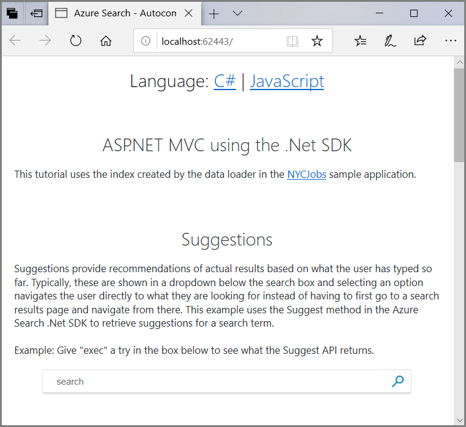

## Add autocomplete or suggested results to client code

Search-as-you-type functionality requires a suggester data structure that stores prefixes used for matching, a query that includes the Autocomplete or Suggestions API on the request, and a control that handles auto-completed text inputs in your client app. You can use the jQuery Autocomplete widget or an equivalent control for this purpose.

In Azure Cognitive Search, autocompleted queries and suggested results are retrieved from the search index, and in particular, from selected fields that you have listed with the suggester. A suggester is defined within the index schema, and specifies which fields will provide content that either completes a term or suggests a result. Choosing suitable fields that are unique, or at least not repetitive, is essential to the experience. For more information, see [Create a suggester](index-add-suggesters.md).

The remainder of this article is focused on queries and client code.

## Set up a request

Structuring a request for search-as-you-type has the following components: a suggesterName, an API, text input. For example, `GET /indexes/myxboxgames/docs/`**`autocomplete`**`?`**`search=minecraf`**`&`**`suggesterName=sg`** or `GET /indexes/myxboxgames/docs/`**`suggestions`**`?`**`search=minecraf`**`&`**`suggesterName=sg`**.

The **`suggesterName=sg`** gives you the suggester-aware fields that will be used to complete terms or suggestions. For suggestions in particular, choose unique fields that disambiguate among matching results. For example, on a site that sells computer games, the suggestion might be a game title.

The **search** parameter will get dynamic strings from the jQuery Autocomplete control. In the above example, "minecraf" is an static illustration of what the control might have passed in.

The APIs do not impose requirements on the partial query. It can be as little as one character, but you would typically set a higher minimum in jQuery Autocomplete, such as two or three, for a more efficient and effective query.

Matches are on the beginning of a term anywhere in the input string. Given "the quick brown fox", both autocomplete and suggestions will match on partial versions of "the", "quick", "brown", or "fox" but not on partial terms like "rown" or "ox". Furthermore, each match sets the scope for downstream expansions. A partial query of "quick br" will match on "quick brown" or "quick bread", but neither "brown" or "bread" by themselves would be match if "quick" precedes them.

Responses for autocomplete and suggestions are what you might expect for the pattern, returning just a list of terms, or terms plus a document ID. Because results are already shaped, you do not need $select, $searchFields, $count, or other parameters that you might otherwise use to scope the query or structure results. Suggestions, consisting of actual matches, return the contents of a suggester-aware field (such as a game title) plus a document ID so that you can retrieve the entire document.

## Add an input control

The client app must provide a control that gives users a list of suggestion while typing the beginning word in the search box. 

## Examples

### REST APIs

For rudimentary testing of the Autocomplete or Suggestions APIs, you can use Postman to send HTTP requests that call the REST APIs. The advantage of this approach is that you can call the APIs without having to write any prior code. The responses provide helpful information if you are undecided about source fields for the suggester or analyzers on the fields. A sample index and queries can be found at [Azure-Search-Postman-Samples](https://github.com/Azure-Samples/azure-search-postman-samples).

### C# code

TBD

<!-- 
search-as-you-type

    Request needs to include:
        an API: docs/suggest or docs/autocomplete
        suggesterName=sg
        search= to collect the partial query

    A client app will use a library like jQuery Autocomplete to collect the partial query.

   partial query can be 1 character, but set a higher minimum, such as two or three, in jQuery Autocomplete for a more efficient and effective query.

   Matches are on the beginning of a term. Given "the quick brown fox", both autocomplete and suggestions will match on partial versions of "the", "quick", "brown", or "fox" but not on "row" or "ox". Furthermore, each match sets the scope for downstream expansions. A partial query of "quick br" will match on "quick brown" or "quick bread", but neither "brown" or "bread" by themselves would be match if "quick" precedes them.
   
   Responses for autocomplete and suggestions are what you might expect for the pattern, which means you don't need $select, $count, or other parameters that shape the results. Suggestions, consisting of actual matches, return the contents of a suggester-aware field (such as a hotel name or book title) plus a document ID so that you can retrieve the entire document. Autocomplete acts as a smart query; it looks for whole terms in suggester-aware fields and returns those terms as potential queries. 
   
   suggesterName gives you the suggester-aware fields that will be queries. For suggestions, choose unique fields that disambiguate among results. For example, on a site that sells games or books, the suggestion might be a title.  

   Analysis for query processing is set by `"searchMode": "analyzingInfixMatching"1, which is fixed. Currently, no other search modes exist. Analysis for indexing is set by  `"analyzer": null` (default) or a language analyzer.

   You can test with Postman to get a better understanding of how each API behaves. Each request is standalone, which means you have to manually send each request to mimic a search-as-you-type response: "w" <send>, "wo" <send>, "wol" <send>, "wolf" <send>. In an actual client app, you would use jQuery Autocomplete or an equivalent library to capture the input.
 -->

# Add suggestions or autocomplete to your Azure Cognitive Search application

This example demonstrates a search box that supports search-as-you-type behaviors. There are two features, which you can use together or separately:

+ *Suggestions* generate search results as you type, where each suggestion is a single result or search document from the index that matches what you've typed so far. 

+ *Autocomplete* generates queries by "finishing" the word or phrase. Instead of returning results, it completes a query, which you can then execute to return results. As with suggestions, a completed word or phrase in a query is predicated on a match in the index. The service won't offer queries that return zero results in the index.

Sample code demonstrates both suggestions and autocomplete, in both C# and JavaScript language versions. 

C# developers can step through an ASP.NET MVC-based application that uses the [Azure Cognitive Search .NET SDK](https://aka.ms/search-sdk). The logic for making autocomplete and suggested query calls can be found in the HomeController.cs file. 

JavaScript developers will find equivalent query logic in IndexJavaScript.cshtml, which includes direct calls to the [Azure Cognitive Search REST API](https://docs.microsoft.com/rest/api/searchservice/). 

For both language versions, the front-end user experience is based on the [jQuery UI](https://jqueryui.com/autocomplete/) and [XDSoft](https://xdsoft.net/jqplugins/autocomplete/) libraries. We use these libraries to build the search box supporting both suggestions and autocomplete. Inputs collected in the search box are paired with suggestions and autocomplete actions, such as those as defined in HomeController.cs or IndexJavaScript.cshtml.


## About the sample

1. Open **AutocompleteTutorial.sln** in Visual Studio. The solution contains an ASP.NET MVC project with a connection to an existing search service and index.

1. If you want to run this program, update the NuGet Packages first:

   1. In Solution Explorer, right-click **DotNetHowToAutoComplete** and select **Manage NuGet Packages**.  
   1. Select the **Updates** tab, select all packages, and click **Update**. Accept any license agreements. More than one pass might be required to update all of the packages.

1. Press F5 to run the project and load the page in a browser.

At the top, you'll see an option to select C# or JavaScript. 

The C# option calls into the HomeController from the browser and uses the Azure Cognitive Search .NET SDK to retrieve results. 

The JavaScript option calls the Azure Cognitive Search REST API directly from the browser. This option will typically have noticeably better performance since it takes the controller out of the flow. You can choose the option that suits your needs and language preferences. There are several autocomplete examples on the page with some guidance for each. Each example has some recommended sample text you can try.  



Try typing in a few letters in each search box to see what happens.

## Query inputs

For both C# and JavaScript versions, the search box implementation is exactly the same. 

Open the **Index.cshtml** file under the folder \Views\Home to view the code:

```html
<input class="searchBox" type="text" id="example1a" placeholder="search">
```

This example is a simple input text box with a class for styling, an ID to be referenced by JavaScript, and placeholder text.  The magic is in the embedded JavaScript.

The C# language sample uses JavaScript in Index.cshtml to leverage the [jQuery UI Autocomplete library](https://jqueryui.com/autocomplete/). This library adds the autocomplete experience to the search box by making asynchronous calls to the MVC controller to retrieve suggestions. The JavaScript language version is in IndexJavaScript.cshtml. It includes the script below for the search bar, as well as REST API calls to Azure Cognitive Search.

Let's look at the JavaScript code for the first example, which calls jQuery UI Autocomplete function, passing in a request for suggestions:

```javascript
$(function () {
    $("#example1a").autocomplete({
        source: "/home/suggest?highlights=false&fuzzy=false&",
        minLength: 3,
        position: {
            my: "left top",
            at: "left-23 bottom+10"
        }
    });
});
```

The above code runs in the browser on page load to configure jQuery UI autocomplete for the "example1a" input box.  `minLength: 3` ensures that recommendations will only be shown when there are at least three characters in the search box.  The source value is important:

```javascript
source: "/home/suggest?highlights=false&fuzzy=false&",
```

The above line tells the jQuery UI Autocomplete function where to get the list of items to show under the search box. Since this project is an MVC project, it calls the Suggest function in HomeController.cs that contains the logic for returning query suggestions (more about Suggest in the next section). This function also passes a few parameters to control highlights, fuzzy matching, and term. The autocomplete JavaScript API adds the term parameter.

### Extending the sample to support fuzzy matching

Fuzzy search allows you to get results based on close matches even if the user misspells a word in the search box. While not required, it significantly improves the robustness of a typeahead experience. Let's try this out by changing the source line to enable fuzzy matching.

Change the following line from this:

```javascript
source: "/home/suggest?highlights=false&fuzzy=false&",
```

to this:

```javascript
source: "/home/suggest?highlights=false&fuzzy=true&",
```

Launch the application by pressing F5.

Try typing something like "execative" and notice how results come back for "executive", even though they are not an exact match to the letters you typed.

### jQuery Autocomplete  backed by Azure Cognitive Search autocomplete

So far, the search UX code has been centered on the suggestions. The next code block shows the jQuery UI Autocomplete function (line 91 in index.cshtml), passing in a request for Azure Cognitive Search autocomplete:

```javascript
$(function () {
    // using modified jQuery Autocomplete plugin v1.2.6 https://xdsoft.net/jqplugins/autocomplete/
    // $.autocomplete -> $.autocompleteInline
    $("#example2").autocompleteInline({
        appendMethod: "replace",
        source: [
            function (text, add) {
                if (!text) {
                    return;
                }

                $.getJSON("/home/autocomplete?term=" + text, function (data) {
                    if (data && data.length > 0) {
                        currentSuggestion2 = data[0];
                        add(data);
                    }
                });
            }
        ]
    });

    // complete on TAB and clear on ESC
    $("#example2").keydown(function (evt) {
        if (evt.keyCode === 9 /* TAB */ && currentSuggestion2) {
            $("#example2").val(currentSuggestion2);
            return false;
        } else if (evt.keyCode === 27 /* ESC */) {
            currentSuggestion2 = "";
            $("#example2").val("");
        }
    });
});
```

## C# example

Now that we have reviewed the JavaScript code for the web page, let's look at the C# server-side controller code that actually retrieves the suggested matches using the Azure Cognitive Search .NET SDK.

Open the **HomeController.cs** file under the Controllers directory. 

The first thing you might notice is a method at the top of the class called `InitSearch`. This method creates an authenticated HTTP index client to the Azure Cognitive Search service. For more information, see [How to use Azure Cognitive Search from a .NET Application](https://docs.microsoft.com/azure/search/search-howto-dotnet-sdk).

On line 41, notice the Suggest function. It is based on the [DocumentsOperationsExtensions.Suggest method](/dotnet/api/microsoft.azure.search.documentsoperationsextensions.suggest?view=azure-dotnet).

```csharp
public ActionResult Suggest(bool highlights, bool fuzzy, string term)
{
    InitSearch();

    // Call suggest API and return results
    SuggestParameters sp = new SuggestParameters()
    {
        UseFuzzyMatching = fuzzy,
        Top = 5
    };

    if (highlights)
    {
        sp.HighlightPreTag = "<b>";
        sp.HighlightPostTag = "</b>";
    }

    DocumentSuggestResult resp = _indexClient.Documents.Suggest(term, "sg", sp);

    // Convert the suggest query results to a list that can be displayed in the client.
    List<string> suggestions = resp.Results.Select(x => x.Text).ToList();
    return new JsonResult
    {
        JsonRequestBehavior = JsonRequestBehavior.AllowGet,
        Data = suggestions
    };
}
```

The Suggest function takes two parameters that determine whether hit highlights are returned or fuzzy matching is used in addition to the search term input. The method creates a [SuggestParameters object](https://docs.microsoft.com/dotnet/api/microsoft.azure.search.models.suggestparameters?view=azure-dotnet), which is then passed to the Suggest API. The result is then converted to JSON so it can be shown in the client.

On line 69, notice the Autocomplete function. It is based on the [DocumentsOperationsExtensions.Autocomplete method](https://docs.microsoft.com/dotnet/api/microsoft.azure.search.documentsoperationsextensions.autocomplete?view=azure-dotnet).

```csharp
public ActionResult AutoComplete(string term)
{
    InitSearch();
    //Call autocomplete API and return results
    AutocompleteParameters ap = new AutocompleteParameters()
    {
        AutocompleteMode = AutocompleteMode.OneTermWithContext,
        UseFuzzyMatching = false,
        Top = 5
    };
    AutocompleteResult autocompleteResult = _indexClient.Documents.Autocomplete(term, "sg", ap);

    // Conver the Suggest results to a list that can be displayed in the client.
    List<string> autocomplete = autocompleteResult.Results.Select(x => x.Text).ToList();
    return new JsonResult
    {
        JsonRequestBehavior = JsonRequestBehavior.AllowGet,
        Data = autocomplete
    };
}
```

The Autocomplete function takes the search term input. The method creates an [AutoCompleteParameters object](https://docs.microsoft.com/rest/api/searchservice/autocomplete). The result is then converted to JSON so it can be shown in the client.

(Optional) Add a breakpoint to the start of the Suggest function and step through the code. Notice the response returned by the SDK and how it is converted to the result returned from the method.

The other examples on the page follow the same pattern to add hit highlighting and facets to support client-side caching of the autocomplete results. Review each of these to understand how they work and how to leverage them in your search experience.

## JavaScript example

A JavaScript implementation of autocomplete and suggestions calls the REST API, using a URI as the source to specify the index and operation. 

To review the JavaScript implementation, open **IndexJavaScript.cshtml**. Notice that the jQuery UI Autocomplete function is also used for the search box, collecting search term inputs and making asynchronous calls to Azure Cognitive Search to retrieve suggested matches or completed terms. 

Let's look at the JavaScript code for the first example:

```javascript
$(function () {
    $("#example1a").autocomplete({
        source: function (request, response) {
        $.ajax({
            type: "POST",
            url: suggestUri,
            dataType: "json",
            headers: {
                "api-key": searchServiceApiKey,
                "Content-Type": "application/json"
            },
            data: JSON.stringify({
                top: 5,
                fuzzy: false,
                suggesterName: "sg",
                search: request.term
            }),
                success: function (data) {
                    if (data.value && data.value.length > 0) {
                        response(data.value.map(x => x["@@search.text"]));
                    }
                }
            });
        },
        minLength: 3,
        position: {
            my: "left top",
            at: "left-23 bottom+10"
        }
    });
});
```

If you compare this example to the example above that calls the Home controller, you'll notice several similarities.  The autocomplete configuration for `minLength` and `position` are exactly the same. 

The significant change here is the source. Instead of calling the Suggest method in the home controller, a REST request is created in a JavaScript function and executed using Ajax. The response is then processed in "success" and used as the source.

REST calls use URIs to specify whether an [Autocomplete](https://docs.microsoft.com/rest/api/searchservice/autocomplete) or [Suggestions](https://docs.microsoft.com/rest/api/searchservice/suggestions) API call is being made. The following URIs are on lines 9 and 10, respectively.

```javascript
var suggestUri = "https://" + searchServiceName + ".search.windows.net/indexes/" + indexName + "/docs/suggest?api-version=" + apiVersion;
var autocompleteUri = "https://" + searchServiceName + ".search.windows.net/indexes/" + indexName + "/docs/autocomplete?api-version=" + apiVersion;
```

On line 148, you can find a script that calls the `autocompleteUri`. The first call to `suggestUri` is on line 39.

> [!Note]
> Making REST calls to the service in JavaScript is offered here as a convenient demonstration of the REST API, but should not be construed as a best practice or recommendation. The inclusion of an API key and endpoint in a script opens your service up to denial of service attacks to anyone who can read those values off the script. While its safe to use JavaScript for learning purposes, perhaps on indexes hosted on the free service, we recommend using Java or C# for indexing and query operations in production code. 


## Next steps

This example demonstrates the basic steps for building a search box that supports autocomplete and suggestions. You saw how you could build an ASP.NET MVC application and use either the Azure Cognitive Search .NET SDK or REST API to retrieve suggestions.

As a next step, trying integrating suggestions and autocomplete into your search experience. The following reference articles should help.

> [!div class="nextstepaction"]
> [Autocomplete REST API](https://docs.microsoft.com/rest/api/searchservice/autocomplete)
> [Suggestions REST API](https://docs.microsoft.com/rest/api/searchservice/suggestions)
> [Facets index attribute on a Create Index REST API](https://docs.microsoft.com/rest/api/searchservice/create-index)

+ [Suggestions REST API](https://docs.microsoft.com/rest/api/searchservice/suggestions) 
+ [Autocomplete REST API](https://docs.microsoft.com/rest/api/searchservice/autocomplete) 
+ [SuggestWithHttpMessagesAsync method](https://docs.microsoft.com/dotnet/api/microsoft.azure.search.idocumentsoperations.suggestwithhttpmessagesasync?view=azure-dotnet)
+ [AutocompleteWithHttpMessagesAsync method](https://docs.microsoft.com/dotnet/api/microsoft.azure.search.idocumentsoperations.autocompletewithhttpmessagesasync?view=azure-dotnet&viewFallbackFrom=azure-dotnet)