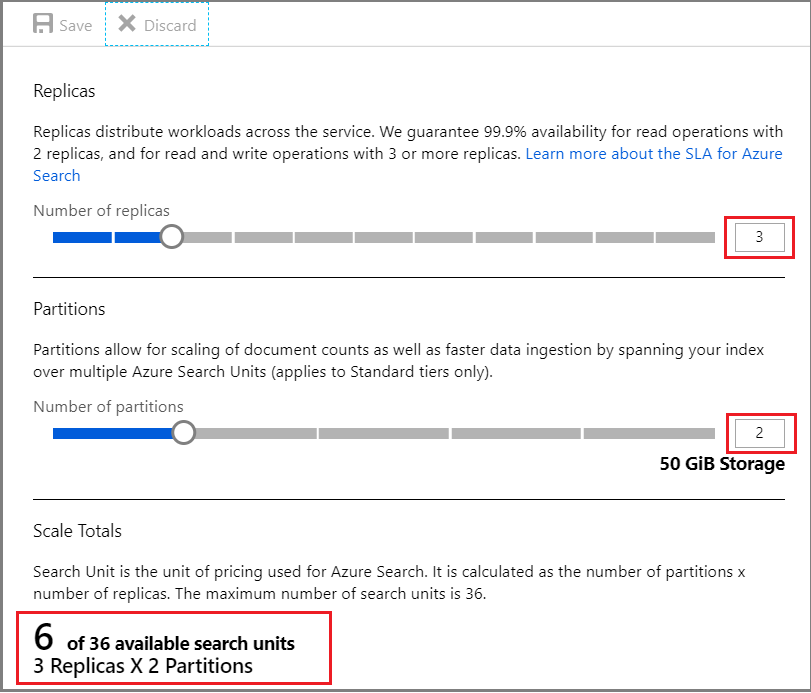
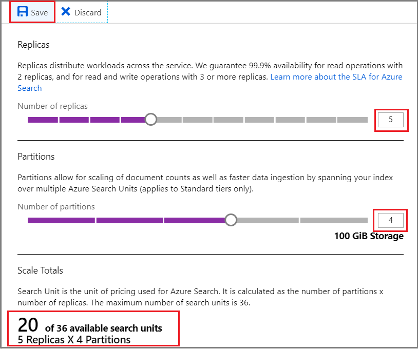
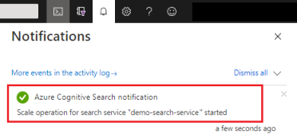
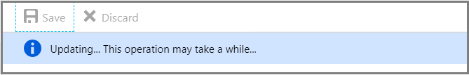

# Scale partitions and replicas for query and indexing workloads in Azure Search
After you [choose a pricing tier](search-sku-tier.md) and [provision a search service](search-create-service-portal.md), the next step is to optionally increase the number of replicas or partitions used by your service. Each tier offers a fixed number of billing units. This article explains how to allocate those units to achieve an optimal configuration that balances your requirements for query execution, indexing, and storage.

Resource configuration is available when you set up a service at the [Basic tier](https://aka.ms/azuresearchbasic) or one of the [Standard or Storage Optimized tiers](search-limits-quotas-capacity.md). For services at these tiers, capacity is purchased in increments of *search units* (SUs) where each partition and replica counts as one SU. 

Using fewer SUs results in a proportionally lower bill. Billing is in effect for as long as the service is set up. If you are temporarily not using a service, the only way to avoid billing is by deleting the service and then re-creating it when you need it.

> [!Note]
> Deleting a service deletes everything on it. There is no facility within Azure Search for backing up and restoring persisted search data. To redeploy an existing index on a new service, you should run the program used to create and load it originally. 

## Terminology: replicas and partitions
Replicas and partitions are the primary resources that back a search service.

| Resource | Definition |
|----------|------------|
|*Partitions* | Provides index storage and I/O for read/write operations (for example, when rebuilding or refreshing an index).|
|*Replicas* | Instances of the search service, used primarily to load balance query operations. Each replica always hosts one copy of an index. If you have 12 replicas, you will have 12 copies of every index loaded on the service.|

> [!NOTE]
> There is no way to directly manipulate or manage which indexes run on a replica. One copy of each index on every replica is part of the service architecture.
>

## How to allocate replicas and partitions
In Azure Search, a service is initially allocated a minimal level of resources consisting of one partition and one replica. For tiers that support it, you can incrementally adjust computational resources by increasing partitions if you need more storage and I/O, or add more replicas for larger query volumes or better performance. A single service must have sufficient resources to handle all workloads (indexing and queries). You cannot subdivide workloads among multiple services.

To increase or change the allocation of replicas and partitions, we recommend using the Azure portal. The portal enforces limits on allowable combinations that stay below maximum limits. If you require a script-based or code-based provisioning approach, the [Azure PowerShell](search-manage-powershell.md) or the [Management REST API](https://docs.microsoft.com/rest/api/searchmanagement/services) are alternative solutions.

Generally, search applications need more replicas than partitions, particularly when the service operations are biased toward query workloads. The section on [high availability](#HA) explains why.

1. Sign in to the [Azure portal](https://portal.azure.com/) and select the search service.

2. In **Settings**, open the **Scale** page to modify replicas and partitions. 

   The following screenshot shows a standard service provisioned with one replica and partition. The formula at the bottom indicates how many search units are being used (1). If the unit price was $100 (not a real price), the monthly cost of running this service would be $100 on average.

   

3. Use the slider to increase or decrease the number of partitions. The formula at the bottom indicates how many search units are being used.

   This example doubles capacity, with two replicas and partitions each. Notice the search unit count; it is now four because the billing formula is replicas multiplied by partitions (2 x 2). Doubling capacity more than doubles the cost of running the service. If the search unit cost was $100, the new monthly bill would now be $400.

   For the current per unit costs of each tier, visit the [Pricing page](https://azure.microsoft.com/pricing/details/search/).

   

3. Click **Save** to confirm the changes.

   

   Changes in capacity take several hours to complete. You cannot cancel once the process has started and there is no real-time monitoring for replica and partition adjustments. However, the following message remains visible while changes are underway.

   

> [!NOTE]
> After a service is provisioned, it cannot be upgraded to a higher SKU. You must create a search service at the new tier and reload your indexes. See [Create an Azure Search service in the portal](search-create-service-portal.md) for help with service provisioning.
>
>

## Partition and replica combinations

A Basic service can have exactly one partition and up to three replicas, for a maximum limit of three SUs. The only adjustable resource is replicas. You need a minimum of two replicas for high availability on queries.

All Standard and Storage Optimized search services can assume the following combinations of replicas and partitions, subject to the 36-SU limit. 

|   | **1 partition** | **2 partitions** | **3 partitions** | **4 partitions** | **6 partitions** | **12 partitions** |
| --- | --- | --- | --- | --- | --- | --- |
| **1 replica** |1 SU |2 SU |3 SU |4 SU |6 SU |12 SU |
| **2 replicas** |2 SU |4 SU |6 SU |8 SU |12 SU |24 SU |
| **3 replicas** |3 SU |6 SU |9 SU |12 SU |18 SU |36 SU |
| **4 replicas** |4 SU |8 SU |12 SU |16 SU |24 SU |N/A |
| **5 replicas** |5 SU |10 SU |15 SU |20 SU |30 SU |N/A |
| **6 replicas** |6 SU |12 SU |18 SU |24 SU |36 SU |N/A |
| **12 replicas** |12 SU |24 SU |36 SU |N/A |N/A |N/A |

SUs, pricing, and capacity are explained in detail on the Azure website. For more information, see [Pricing Details](https://azure.microsoft.com/pricing/details/search/).

> [!NOTE]
> The number of replicas and partitions divides evenly into 12 (specifically, 1, 2, 3, 4, 6, 12). This is because Azure Search pre-divides each index into 12 shards so that it can be spread in equal portions across all partitions. For example, if your service has three partitions and you create an index, each partition will contain four shards of the index. How Azure Search shards an index is an implementation detail, subject to change in future releases. Although the number is 12 today, you shouldn't expect that number to always be 12 in the future.
>

## High availability
Because it's easy and relatively fast to scale up, we generally recommend that you start with one partition and one or two replicas, and then scale up as query volumes build. Query workloads run primarily on replicas. If you need more throughput or high availability, you will probably require additional replicas.

General recommendations for high availability are:

* Two replicas for high availability of read-only workloads (queries)

* Three or more replicas for high availability of read/write workloads (queries plus indexing as individual documents are added, updated, or deleted)

Service level agreements (SLA) for Azure Search are targeted at query operations and at index updates that consist of adding, updating, or deleting documents.

Basic tier tops out at one partition and three replicas. If you want the flexibility to immediately respond to fluctuations in demand for both indexing and query throughput, consider one of the Standard tiers.  If you find your storage requirements are growing much more rapidly than your query throughput, consider one of the Storage Optimized tiers.

### Index availability during a rebuild

High availability for Azure Search pertains to queries and index updates that don't involve rebuilding an index. If you delete a field, change a data type, or rename a field, you will need to rebuild the index. To rebuild the index, you must delete the index, re-create the index, and reload the data.

> [!NOTE]
> You can add new fields to an Azure Search index without rebuilding the index. The value of the new field will be null for all documents already in the index.

To maintain index availability during a rebuild, you must have a copy of the index with a different name on the same service, or a copy of the index with the same name on a different service, and then provide redirection or failover logic in your code.

## Disaster recovery
Currently, there is no built-in mechanism for disaster recovery. Adding partitions or replicas would be the wrong strategy for meeting disaster recovery objectives. The most common approach is to add redundancy at the service level by setting up a second search service in another region. As with availability during an index rebuild, the redirection or failover logic must come from your code.

## Increase query performance with replicas
Query latency is an indicator that additional replicas are needed. Generally, a first step toward improving query performance is to add more of this resource. As you add replicas, additional copies of the index are brought online to support bigger query workloads and to load balance the requests over the multiple replicas.

We cannot provide hard estimates on queries per second (QPS): query performance depends on the complexity of the query and competing workloads. Although adding replicas clearly results in better performance, the result is not strictly linear: adding three replicas does not guarantee triple throughput.

For guidance in estimating QPS for your workloads, see [Azure Search performance and optimization considerations](search-performance-optimization.md).

## Increase indexing performance with partitions
Search applications that require near real-time data refresh will need proportionally more partitions than replicas. Adding partitions spreads read/write operations across a larger number of compute resources. It also gives you more disk space for storing additional indexes and documents.

Larger indexes take longer to query. As such, you might find that every incremental increase in partitions requires a smaller but proportional increase in replicas. The complexity of your queries and query volume will factor into how quickly query execution is turned around.

## Next steps

[Choose a pricing tier for Azure Search](search-sku-tier.md)
