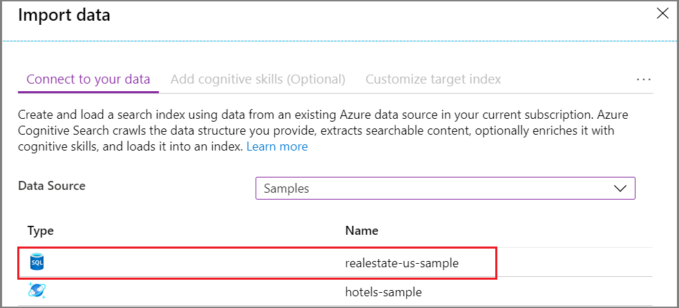
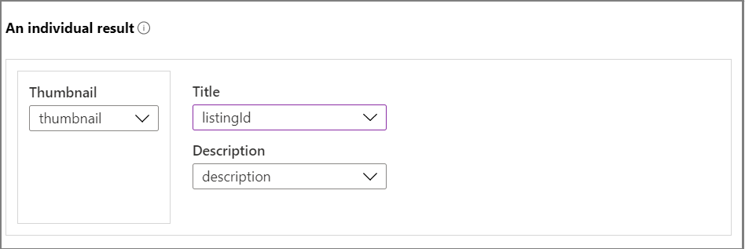
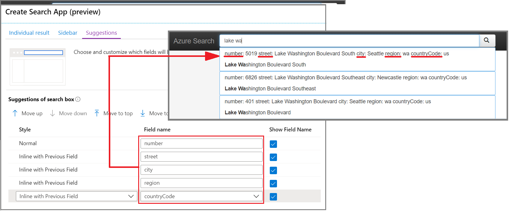
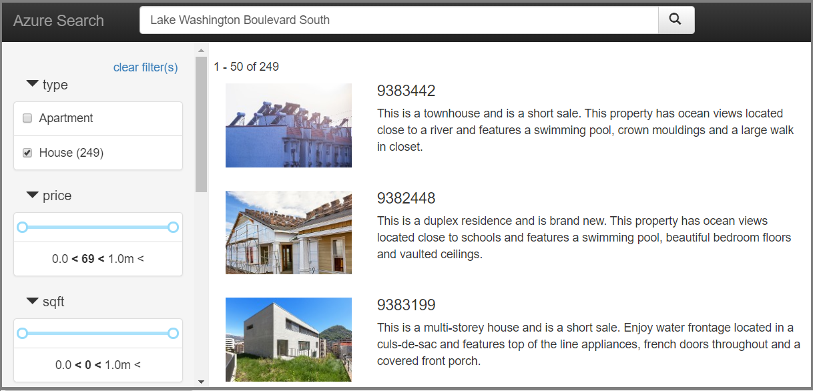

# Quickstart: Create a search app in the portal (Azure Cognitive Search)

Use the Azure portal's **Create search app** wizard to generate a downloadable, "localhost"-style web app that runs in a browser. Depending on its configuration, the generated app is operational on first use, with a live connection to a remote index. A default app can include a search bar, results area, sidebar filters, and typeahead support.

## Prerequisites

Before you begin, you must have the following:

+ An Azure account with an active subscription. [Create an account for free](https://azure.microsoft.com/free/).

+ An Azure Cognitive Search service. [Create a service](search-create-service-portal.md) or [find an existing service](https://ms.portal.azure.com/#blade/HubsExtension/BrowseResourceBlade/resourceType/Microsoft.Search%2FsearchServices) under your current subscription. You can use a free service for this quickstart. 

+ [Microsoft Edge (latest version)](https://www.microsoft.com/edge) or Google Chrome.

+ A [search index](search-create-index-portal.md) to use as the basis of your generated application. 

  This quickstart uses the built-in Real Estate sample data and index because it has thumbnail images (the wizard supports adding images to the results page). To create the index used in this exercise, run the **Import data** wizard, choosing the *realestate-us-sample* data source.

  

When the index is ready to use, move on to the next step.

## Start the wizard

1. Sign in to the [Azure portal](https://portal.azure.com/) with your Azure account.

1. [Find your search service](https://ms.portal.azure.com/#blade/HubsExtension/BrowseResourceBlade/resourceType/Microsoft.Storage%2storageAccounts/) and on the Overview page, from the links on the middle of the page, select **Indexes**. 

1. Choose *realestate-us-sample-index* from the list of existing indexes.

1. On the index page, at the top, select **Create search app (preview)** to start the wizard.

1. On the first wizard page, select **Enable Cross Origin Resource Sharing (CORS)** to add CORS support to your index definition. This step is optional, but your local web app won't connect to the remote index without it.

## Configure search results

The wizard provides a basic layout for rendered search results that includes space for a thumbnail image, a title, and description. Backing each of these elements is a field in your index that provides the data. 

1. In Thumbnail, choose the *thumbnail* field in the *realestate-us-sample* index. This sample happens to include image thumbnails in the form of URL-addressed images stored in a field called *thumbnail*. If your index doesn't have images, leave this field blank.

1. In Title, choose a field that conveys the uniqueness of each document. In this sample, the listing ID is a reasonable selection.

1. In Description, choose a field that provides details that might help someone decide whether to click through to that particular document.

   

## Add a sidebar

The search service supports faceted navigation, which is often rendered as a sidebar. Facets are based on filterable and facetable fields, as expressed in the index schema.

In Azure Cognitive Search, faceted navigation is a cumulative filtering experience. Within a category, selecting multiple filters expands the results (for example, selecting Seattle and Bellevue within City). Across categories, selecting multiple filters narrows results.

> [!TIP]
> You can view the full index schema in the portal. Look for the **Index definition (JSON)** link in each index's overview page. Fields that qualify for faceted navigation have "filterable: true" and "facetable: true" attributes.

Accept the current selection of facets and continue to the next page.

## Add typeahead

Typeahead functionality is available in the form of autocomplete and query suggestions. The wizard supports query suggestions. Based on keystroke inputs provided by the user, the search service returns a list of "completed" query strings that can be selected as the input.

Suggestions are enabled on specific field definitions. The wizard gives you options for configuring how much information is included in a suggestion. 

The following screenshot shows options in the wizard, juxtaposed with a rendered page in the app. You can see how field selections are used, and how "Show Field Name" is used to include or exclude labeling within the suggestion.

## Create, download and execute

1. Select **Create search app** to generate the HTML file.

1. When prompted, select **Download your app** to download the file.

1. Open the file. You should see a page similar to the following screenshot. Enter a term and use filters to narrow results. 

The underlying index is composed of fictitious, generated data that has been duplicated across documents, and descriptions sometimes do not match the image. You can expect a more cohesive experience when you create an app based on your own indexes.

## Clean up resources

When you're working in your own subscription, it's a good idea at the end of a project to identify whether you still need the resources you created. Resources left running can cost you money. You can delete resources individually or delete the resource group to delete the entire set of resources.

You can find and manage resources in the portal, using the **All resources** or **Resource groups** link in the left-navigation pane.

If you are using a free service, remember that you are limited to three indexes, indexers, and data sources. You can delete individual items in the portal to stay under the limit. 

## Next steps

While the default app is useful for initial exploration and small tasks, reviewing the APIs early on will help you understand the concepts and workflow on a deeper level:

> [!div class="nextstepaction"]
> [Create an index using .NET SDK](https://docs.microsoft.com/azure/search/search-create-index-dotnet)