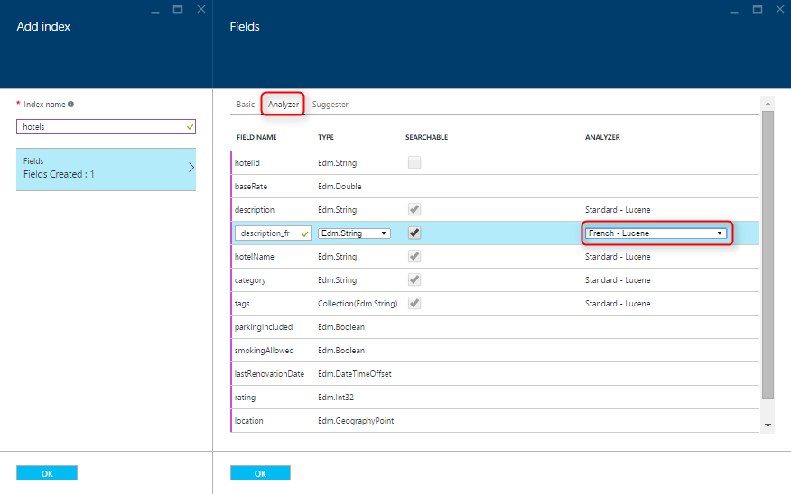

<properties
	pageTitle="Create an Azure Search index using the Azure Portal | Microsoft Azure | Hosted cloud search service"
	description="Create an index using the Azure Portal."
	services="search"
	authors="ashmaka"
	documentationCenter=""/>

<tags
	ms.service="search"
	ms.devlang="NA"
	ms.workload="search"
	ms.topic="article"
	ms.tgt_pltfrm="na"
	ms.date="05/31/2016"
	ms.author="ashmaka"/>

# Create an Azure Search index using the Azure Portal
> [AZURE.SELECTOR]
- [Overview](search-what-is-an-index.md)
- [Portal](search-create-index-portal.md)
- [.NET](search-create-index-dotnet.md)
- [REST](search-create-index-rest-api.md)

This article will walk you through the process of creating an Azure Search [index](search-what-is-an-index.md) using the Azure Portal.

Before following this guide and creating an index, you should have already [created an Azure Search service](search-create-service-portal.md).

## I. Go to your Azure Search blade
1. Click on "All resources" in the menu on the left side of the [Azure Portal](https://portal.azure.com/#blade/HubsExtension/BrowseResourceBlade/resourceType/Microsoft.Search%2FsearchServices)
2. Select your Azure Search service

## II. Add and name your index
1. Click on the "Add index" button
2. Name your Azure Search index. Since we are creating an index to search for hotels in this guide, we have named our index "hotels".
  * The index name must start with a letter and contain only lowercase letters, digits, or dashes ("-").
  * Similar to your service name, the index name you pick will also be part of the endpoint URL where you will send your HTTP requests for the Azure Search API
3. Click on the "Fields" entry to open a new blade

## III. Create and define the fields of your index
1. By selecting the "Fields" entry, a new blade will open with a form to enter your index definition.
2. Add fields to your index using the form.

  * A *key* field of type Edm.String is mandatory for every Azure Search index. This key field is created by default with the field name "id". We have changed it to "hotelId" in our index.
  * Certain properties of your index schema can only be set once and cannot be updated in the future. Because of this, any schema updates that would require re-indexing such as changing field types are not currently possible after the initial configuration.
  * We have carefully chosen the property values for each field based on how we think they will be used in an application. Keep your search user experience and business needs in mind when designing your index as each field must be assigned the [appropriate properties](https://msdn.microsoft.com/library/azure/dn798941.aspx). These properties control which search features (filtering, faceting, sorting, full-text search, etc.) apply to which fields. For example, it is likely that people searching for hotels will be interested in keyword matches on the "description" field, so we enable full-text search for that field by setting the "Searchable" property.
	* You can also set the [language analyzer](https://msdn.microsoft.com/en-us/library/azure/dn879793.aspx) for each field by clicking on the "Analyzer" tab at the top of the blade. You can see below that we have selected a French analyzer for a field in our index intended for French text.

3. Click **OK** on the "Fields" blade to confirm your field definitions
4. Click **OK** on the "Add index" blade to save and create the index you just defined.

In the screenshots below, you can see how we have named and defined the fields for our "hotels" index.

## Next
After creating an Azure Search index, you will be ready to [upload your content into the index](search-what-is-data-import.md) so you can start searching your data.
