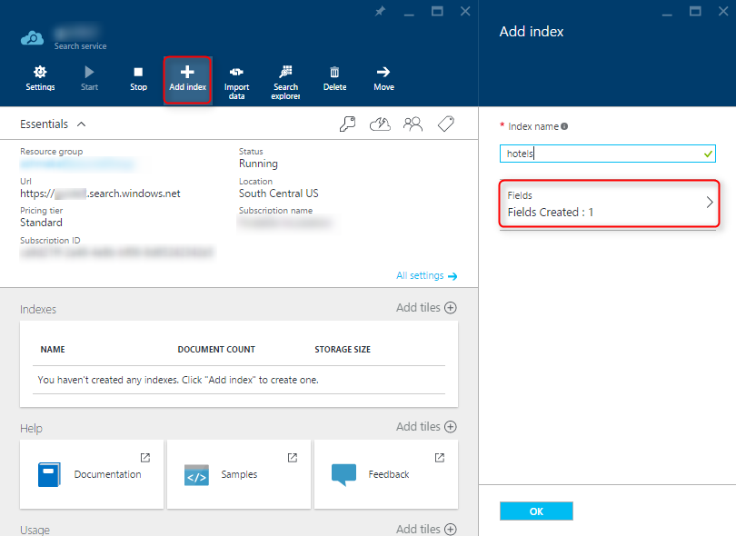
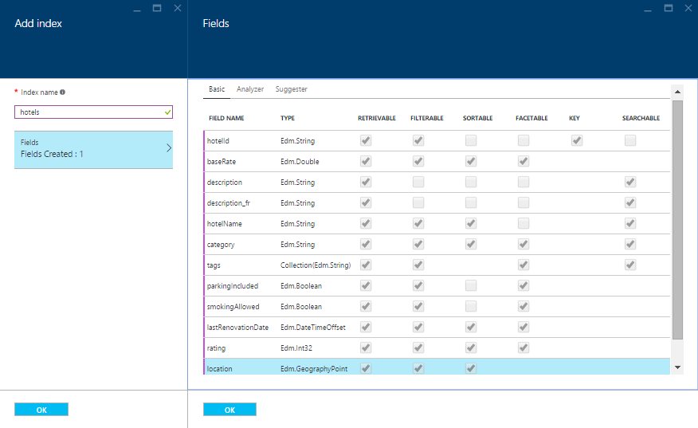

# Create an Azure Cognitive Search index in the portal

Azure Cognitive Search includes a built-in index designer in the portal useful for prototypes or creating a [search index](search-what-is-an-index.md) hosted on your Azure Cognitive Search service. The tool is used for schema construction. When you save the definition, an empty index becomes fully expressed in Azure Cognitive Search. How you load it with searchable content is up to you.

The index designer is only one approach for creating an index. Alternatively, you can both create and load an index using the [Import data wizard](search-get-started-portal.md). The wizard only works with indexes that it creates itself. Programmatically, you can create an index using the [.NET](search-create-index-dotnet.md) or [REST](search-create-index-rest-api.md) APIs.

## Start index designer

1. Sign in to the [Azure portal](https://portal.azure.com) and open the service dashboard. You can click **All services** in the jump bar to search for existing "search services" in the current subscription. 

2. Click the **Add index** link in the command bar at the top of the page.

   

3. Name your Azure Cognitive Search index. Index names are referenced in indexing and query operations. The index name becomes part of the endpoint URL used on connections to the index and for sending HTTP requests in the Azure Cognitive Search REST API.

   * Start with a letter.
   * Use only lowercase letters, digits, or dashes ("-").
   * Limit the name to 60 characters.

## Add fields

Index composition includes a *Fields collection* that defines the searchable data in your index. Altogether, the fields collection specifies the structure of documents that you upload separately. A Fields collection includes required and optional fields, named and typed, with index attributes that determine how the field can be used.

1. Add fields to fully specify the documents you will upload, setting a [data type](https://docs.microsoft.com/rest/api/searchservice/supported-data-types) for each one. For example, if documents consist of a *hotel-id*, *hotel-name*, *address*, *city*, and *region*, create a corresponding field for each one in the index. Review the [design guidance in the section below](#design) for help with setting attributes.

1. If incoming data is hierarchical in nature, your schema should include [complex types](search-howto-complex-data-types.md) to represent the nested structures. The built-in sample data set, Hotels, illustrates complex types using an Address (contains multiple sub-fields) that has a one-to-one relationship with each hotel, and a Rooms complex collection, where multiple rooms are associated with each hotel. 

1. Specify a *key* field of type Edm.String. A key field is mandatory for every Azure Cognitive Search index and it must be a string. Values for this field must uniquely identify each document. By default, the field is named *id* but you can rename it as long as the string satisfies [naming rules](https://docs.microsoft.com/rest/api/searchservice/Naming-rules). For example, if your fields collection includes *hotel-id*, you would choose that for your key. 

1. Set attributes on each field. The index designer excludes any attributes that are invalid for the data type, but doesn't suggest what to include. Review the guidance in the next section to understand what the attributes are for.

    Azure Cognitive Search API documentation includes code examples featuring a simple *hotels* index. In the screenshot below, you can see the index definition, including the French language analyzer specified during index definition, which you can recreate as a practice exercise in the portal.

    

1. When finished, click **Create** to save and create the index.

## Set attributes

Although you can add new fields at any time, existing field definitions are locked in for the lifetime of the index. For this reason, developers typically use the portal for creating simple indexes, testing ideas, or using the portal pages to look up a setting. Frequent iteration over an index design is more efficient if you follow a code-based approach so that you can rebuild the index easily.

Analyzers and suggesters are associated with fields before the index is saved. Be sure to add language analyzers or suggesters to your index definition while you are creating it.

String fields are often marked as **Searchable** and **Retrievable**. Fields used to narrow search results include **Sortable**, **Filterable**, and **Facetable**.

Field attributes determine how a field is used, such as whether it is used in full text search, faceted navigation, sort operations, and so forth. The following table describes each attribute.

|Attribute|Description|  
|---------------|-----------------|  
|**searchable**|Full-text searchable, subject to lexical analysis such as word-breaking during indexing. If you set a searchable field to a value like "sunny day", internally it will be split into the individual tokens "sunny" and "day". For details, see [How full text search works](search-lucene-query-architecture.md).|  
|**filterable**|Referenced in **$filter** queries. Filterable fields of type `Edm.String` or `Collection(Edm.String)` do not undergo word-breaking, so comparisons are for exact matches only. For example, if you set such a field f to "sunny day", `$filter=f eq 'sunny'` will find no matches, but `$filter=f eq 'sunny day'` will. |  
|**sortable**|By default the system sorts results by score, but you can configure sort based on fields in the documents. Fields of type `Collection(Edm.String)` cannot be **sortable**. |  
|**facetable**|Typically used in a presentation of search results that includes a hit count by category (for example, hotels in a specific city). This option cannot be used with fields of type `Edm.GeographyPoint`. Fields of type `Edm.String` that are **filterable**, **sortable**, or **facetable** can be at most 32 kilobytes in length. For details, see [Create Index (REST API)](https://docs.microsoft.com/rest/api/searchservice/create-index).|  
|**key**|Unique identifier for documents within the index. Exactly one field must be chosen as the key field and it must be of type `Edm.String`.|  
|**retrievable**|Determines whether the field can be returned in a search result. This is useful when you want to use a field (such as *profit margin*) as a filter, sorting, or scoring mechanism, but do not want the field to be visible to the end user. This attribute must be `true` for `key` fields.|  

## Next steps

After creating an Azure Cognitive Search index, you can move to the next step: [upload searchable data into the index](search-what-is-data-import.md).

Alternatively, you could also take a [deeper look at indexes](search-what-is-an-index.md). In addition to the Fields collection, an index also specifies analyzers, suggesters, scoring profiles, and CORS settings. The portal provides tabbed pages for defining the most common elements: Fields, analyzers, and suggesters. To create or modify other elements, you can use the REST API or .NET SDK.

## See also

 [How full text search works](search-lucene-query-architecture.md)  
 [Search service REST API](https://docs.microsoft.com/rest/api/searchservice/)
 [.NET SDK](https://docs.microsoft.com/dotnet/api/overview/azure/search?view=azure-dotnet)

