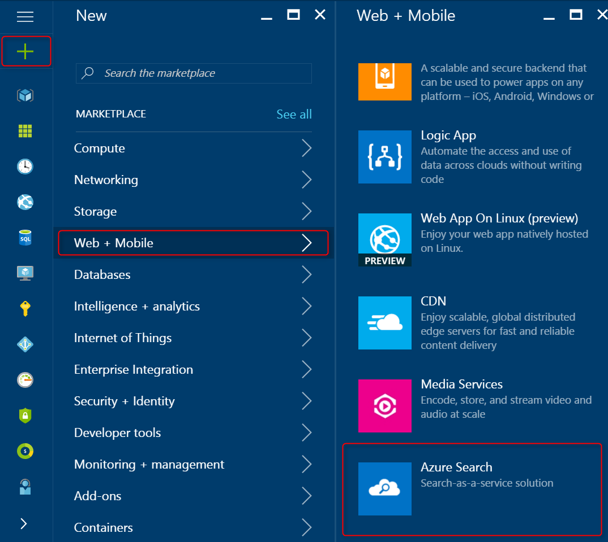
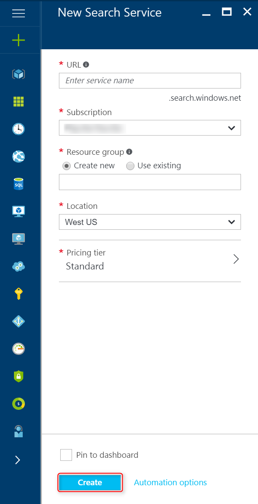
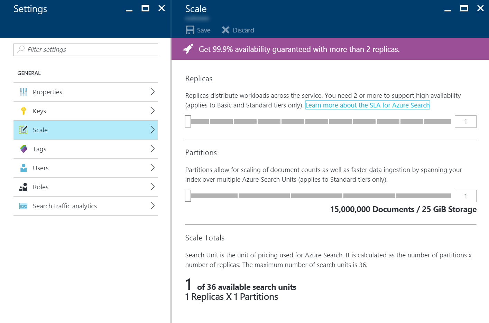

<properties
	pageTitle="Create an Azure Search service using the Azure Portal | Microsoft Azure | Hosted cloud search service"
	description="Learn how to provision an Azure Search service using the Azure Portal."
	services="search"
	authors="ashmaka"
	documentationCenter=""/>

<tags
	ms.service="search"
	ms.devlang="NA"
	ms.workload="search"
	ms.topic="article"
	ms.tgt_pltfrm="na"
	ms.date="07/13/2016"
	ms.author="ashmaka"/>

# Create an Azure Search service using the Azure Portal

This guide will walk you through the process of creating (or provisioning) an Azure Search service using the [Azure Portal](https://portal.azure.com/).

This guide assumes that you already have an Azure Subscription and can log into the Azure Portal.

## Find Azure Search in the Azure Portal
1. Go to the [Azure Portal](https://portal.azure.com/) and log in.
1. Click on the plus sign ("+") in the top left corner.
2. Select **Data + Storage**.
3. Select **Azure Search**.

## Pick a service name and URL endpoint for your service
1. Your service name will be part of your Azure Search service's endpoint URL against which you will make your API calls to manage and use the search service.
2. Type your service name in the **URL** field. The service name:
  * must only contain lowercase letters, digits or dashes ("-")
  * cannot use a dash ("-") as the first 2 characters or last single character
  * cannot contain consecutive dashes ("--")
  * is limited between 2 and 60 characters in length

## Select a subscription where you will keep your service
If you have more than one subscription, you can select which one will include this Azure Search service.

## Select a resource group for your service
Create a new resource group or select an existing one. A resource group is a collection of Azure services and resources that are used together. For example, if you are using Azure Search to index a SQL database, then both of these services should be part of the same resource group.

## Select the location where your service will be hosted
As an Azure service, Azure Search is available to be hosted in datacenters around the world. Please note that [prices can differ](https://azure.microsoft.com/pricing/details/search/) by geography.

## Select your pricing tier
[Azure Search is currently offered in multiple pricing tiers](https://azure.microsoft.com/pricing/details/search/): Free, Basic, or Standard. Each tier has its own [capacity and limits](search-limits-quotas-capacity.md). See [Choose a pricing tier or SKU](search-sku-tier.md) for guidance.

In this case, we have chosen the Standard tier for our service.

## Select the "Create" button to provision your service

## Scale your service

After your service is provisioned, you can scale it to meet your needs. If you have chosen the Standard tier for your Azure Search service, you can scale your service in two dimensions: replicas and partitions. If you have chosen the Basic tier, you can only add replicas.

*__Partitions__* allow your service to store and search through more documents.

*__Replicas__* allow your service to handle a higher load of search queries - [a service requires 2 replicas to achieve a read-only SLA and requires 3 replicas to achieve a read/write SLA](https://azure.microsoft.com/support/legal/sla/search/v1_0/).

1. Go to your Azure Search service's management blade in the Azure Portal.
2. In the **Settings** blade, select **Scale**.
3. You can scale your service by adding Replicas or Partitions.
  * You cannot scale your service past 36 search units. Your total number of search units is the product of your replicas and partitions (Replicas * Partitions = Total Search Units).
  * If you have chosen the Basic tier, you can only scale to 3 replicas. Basic services are bound to a single partition.

## Next
After provisioning an Azure Search service, you will be ready to [define an Azure Search index](search-what-is-an-index.md) so you can upload and search your data.

See [Get started with Azure Search in the portal](search-get-started-portal.md) for a quick tutorial.
