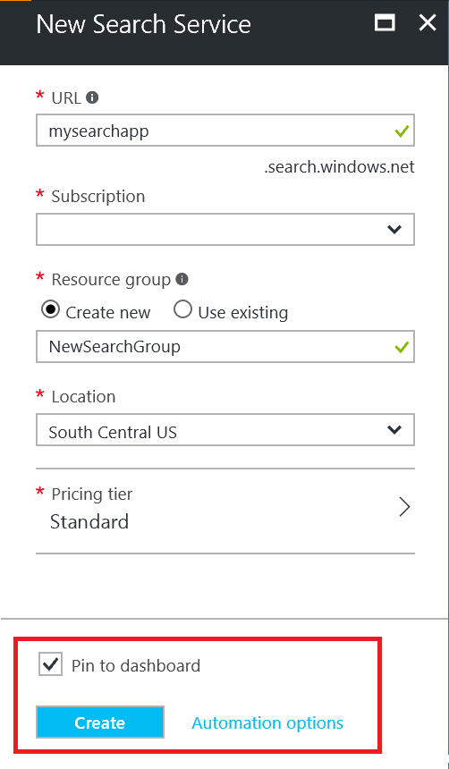

# Create an Azure Search service in the portal

This article explains how to create or provision an Azure Search service in the portal. For instructions on how to do this in PowerShell, see [Manage Azure Search with Powershell](search-manage-powershell.md).

## Subscribe (free or paid)

[Open a free Azure account](https://azure.microsoft.com/pricing/free-trial/?WT.mc_id=A261C142F) and use free credits to try out paid Azure services. After credits are used up, keep the account and continue to use free Azure services, such as Websites. Your credit card is never charged unless you explicitly change your settings and ask to be charged.

Alternatively, [activate MSDN subscriber benefits](https://azure.microsoft.com/pricing/member-offers/msdn-benefits-details/?WT.mc_id=A261C142F). An MSDN subscription gives you credits every month you can use for paid Azure services. 

## Find Azure Search
1. Sign in to the [Azure portal](https://portal.azure.com/).
2. Click on the plus sign ("+") in the top left corner.
3. Select **Web + Mobile**.
4. Select **Azure Search**.

## Name the service and URL endpoint
1. Your service name will be part of your Azure Search service's endpoint URL against which you will make your API calls to manage and use the search service.
2. Type your service name in the **URL** field. The service name:
   * 2 and 60 characters in length
   * lowercase letters, digits or dashes ("-")
   * no dash ("-") as the first 2 characters or last single character
   * no consecutive dashes ("--")

## Select a subscription
If you have more than one subscription, choose one for your service. If applicable, choose a subscription having data or file storage services. Azure Search can auto-detect Azure Table and Blob storage, SQL Database, and DocumentDB for indexing, but only if the services are in the same subscription.

## Select a resource group
A resource group is a collection of Azure services and resources that are used together. For example, if you are using Azure Search to index a SQL database, then both services should be part of the same resource group.

> [!TIP]
> Deleting a resource group also deletes the services within it. For prototype projects utilizing multiple services, putting all services in the same resource group makes cleanup easier after the project is over. 

## Select ta hosting location 
As an Azure service, Azure Search can be hosted in datacenters around the world. Please note that [prices can differ](https://azure.microsoft.com/pricing/details/search/) by geography.

## Select a pricing tier (SKU)
[Azure Search is currently offered in multiple pricing tiers](https://azure.microsoft.com/pricing/details/search/): Free, Basic, or Standard. Each tier has its own [capacity and limits](search-limits-quotas-capacity.md). See [Choose a pricing tier or SKU](search-sku-tier.md) for guidance.

In this walkthrough, we have chosen the Standard tier for our service.

## Create your service

Remember to pin your service to the dashboard for easy access whenever you sign in.

## Scale your service
It can take a few minutes to create a service (15 minutes or more depending on the tier). After your service is provisioned, you can scale it to meet your needs. Because you chose the Standard tier for your Azure Search service, you can scale your service in two dimensions: replicas and partitions. Had you chosen the Basic tier, you can only add replicas. If you provisioned the free service, scale is not available.

***Partitions*** allow your service to store and search through more documents.

***Replicas*** allow your service to handle a higher load of search queries.

> [!Important]
> A service must have [2 replicas for read-only SLA and 3 replicas for read/write SLA](https://azure.microsoft.com/support/legal/sla/search/v1_0/).

1. Go to your search service blade in the Azure portal.
2. In the left-navigation pane, select **Scale** or 
3. Adjust capacity by adding Replicas or Partitions.

> [!Note] 
> Each tier has different [limits](search-limits-quotas-capacity.md) on the total number of Search Units allowed in a single service (Replicas * Partitions = Total Search Units).

## Next steps
After provisioning an Azure Search service, you are ready to [define an Azure Search index](search-what-is-an-index.md) so you can upload and search your data.

See [Build and query your first index](search-get-started-portal.md) for a quick tutorial.

