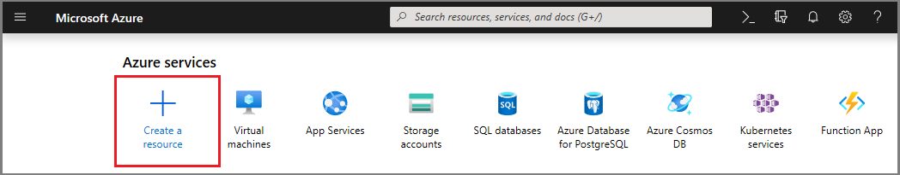
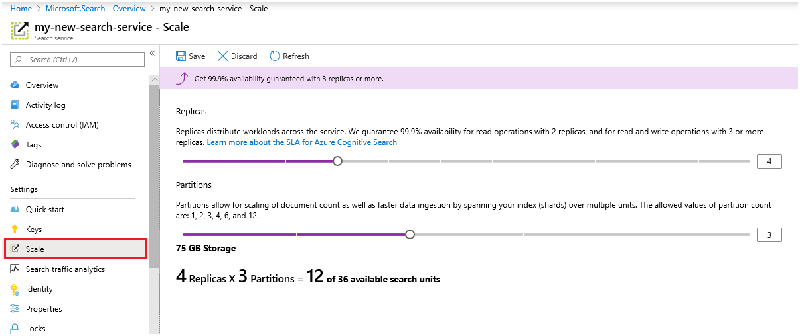

# Create an Azure Search service in the portal

Learn how to create or provision an Azure Search service in the portal. 

Prefer PowerShell? Use the Azure Resource Manager [service template](https://azure.microsoft.com/resources/templates/101-azure-search-create/). For help getting started, see [Manage Azure Search with PowerShell](search-manage-powershell.md) for background.

## Subscribe (free or paid)

[Open a free Azure account](https://azure.microsoft.com/pricing/free-trial/?WT.mc_id=A261C142F) and use free credits to try out paid Azure services. After credits are used up, keep the account and continue to use free Azure services, such as Websites. Your credit card is never charged unless you explicitly change your settings and ask to be charged.

Alternatively, [activate MSDN subscriber benefits](https://azure.microsoft.com/pricing/member-offers/msdn-benefits-details/?WT.mc_id=A261C142F). An MSDN subscription gives you credits every month you can use for paid Azure services. 

## Find Azure Search
1. Sign in to the [Azure portal](https://portal.azure.com/).
2. Click the plus sign ("+ Create Resource") in the top left corner.
3. Select **Web** > **Azure Search**.

## Name the service and URL endpoint

A service name is part of the URL endpoint against which API calls are issued: `https://your-service-name.search.windows.net`. Enter your service name in the **URL** field. 

Service name requirements:
   * It must be unique within the search.windows.net namespace
   * 2 and 60 characters in length
   * Use lowercase letters, digits, or dashes ("-")
   * Avoid dashes ("-") in the first 2 characters or as the last single character
   * No consecutive dashes ("--") anywhere

## Select a subscription
If you have more than one subscription, choose one that also has data or file storage services. Azure Search can auto-detect Azure Table and Blob storage, SQL Database, and Azure Cosmos DB for indexing via [*indexers*](search-indexer-overview.md), but only for services in the same subscription.

## Select a resource group
A resource group is a collection of Azure services and resources used together. For example, if you are using Azure Search to index a SQL database, then both services should be part of the same resource group.

> [!TIP]
> Deleting a resource group also deletes the services within it. For prototype projects utilizing multiple services, putting all of them in the same resource group makes cleanup easier after the project is over. 

## Select a hosting location 
As an Azure service, Azure Search can be hosted in datacenters around the world. Note that [prices can differ](https://azure.microsoft.com/pricing/details/search/) by geography.

## Select a pricing tier (SKU)
[Azure Search is currently offered in multiple pricing tiers](https://azure.microsoft.com/pricing/details/search/): Free, Basic, or Standard. Each tier has its own [capacity and limits](search-limits-quotas-capacity.md). See [Choose a pricing tier or SKU](search-sku-tier.md) for guidance.

Standard is usually chosen for production workloads, but most customers start with the Free service.

A pricing tier cannot be changed once the service is created. If you need a higher or lower tier later, you have to re-create the service.

## Create your service

Remember to pin your service to the dashboard for easy access whenever you sign in.

## Scale your service
It can take a few minutes to create a service (15 minutes or more depending on the tier). After your service is provisioned, you can scale it to meet your needs. Because you chose the Standard tier for your Azure Search service, you can scale your service in two dimensions: replicas and partitions. Had you chosen the Basic tier, you can only add replicas. If you provisioned the free service, scale is not available.

***Partitions*** allow your service to store and search through more documents.

***Replicas*** allow your service to handle a higher load of search queries.

Adding resources increases your monthly bill. The [pricing calculator](https://azure.microsoft.com/pricing/calculator/) can help you understand the billing ramifications of adding resources. Remember that you can adjust resources based on load. For example, you might increase resources to create a full initial index, and then reduce resources later to a level more appropriate for incremental indexing.

> [!Important]
> A service must have [2 replicas for read-only SLA and 3 replicas for read/write SLA](https://azure.microsoft.com/support/legal/sla/search/v1_0/).

1. Go to your search service page in the Azure portal.
2. In the left-navigation pane, select **Settings** > **Scale**.
3. Use the slidebar to add resources of either type.

> [!Note] 
> Each tier has different [limits](search-limits-quotas-capacity.md) on the total number of Search Units allowed in a single service (Replicas * Partitions = Total Search Units).

## When to add a second service

A large majority of customers use just one service provisioned at a tier providing the [right balance of resources](search-sku-tier.md). One service can host multiple indexes, subject to the [maximum limits of the tier you select](search-capacity-planning.md), with each index isolated from another. In Azure Search, requests can only be directed to one index, minimizing the chance of accidental or intentional data retrieval from other indexes in the same service.

Although most customers use just one service, service redundancy might be necessary if operational requirements include the following:

+ Disaster recovery (data center outage). Azure Search does not provide instant failover in the event of an outage. For recommendations and guidance, see [Service administration](search-manage.md).
+ Your investigation of multi-tenancy modeling has determined that additional services is the optimal design. For more information, see [Design for multi-tenancy](search-modeling-multitenant-saas-applications.md).
+ For globally deployed applications, you might require an instance of Azure Search in multiple regions to minimize latency of your application’s international traffic.

> [!NOTE]
> In Azure Search, you cannot segregate indexing and querying workloads; thus, you would never create multiple services for segregated workloads. An index is always queried on the service in which it was created (you cannot create an index in one service and copy it to another).
>

A second service is not required for high availability. High availability for queries is achieved when you use 2 or more replicas in the same service. Replica updates are sequential, which means at least one is operational when a service update is rolled out. For more information about uptime, see [Service Level Agreements](https://azure.microsoft.com/support/legal/sla/search/v1_0/).

## Next steps
After provisioning an Azure Search service, you are ready to [define an index](search-what-is-an-index.md) so you can upload and search your data. 

> [!div class="nextstepaction"]
> [How to use Azure Search in .NET](search-howto-dotnet-sdk.md)
