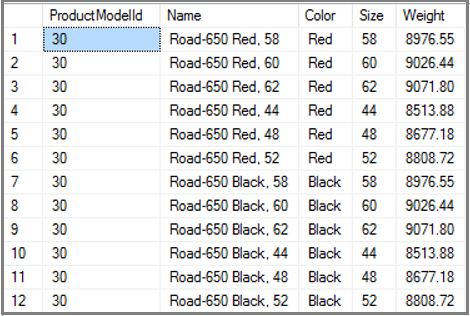
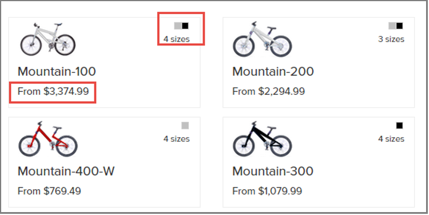

# Example: Model the AdventureWorks Inventory database for Azure Search

Modeling structured database content into an efficient search index is rarely a straightforward exercise. Scheduling and change management aside, there exists the challenge of denormalizing source rows away from their table-joined state into search-friendly entities. This article uses the AdventureWorks sample data, available online, to highlight common experiences in the transition from database to search. 

## About AdventureWorks

If you have a SQL Server instance, you might be familiar with the AdventureWorks sample database. Among the tables included in this database are five tables that expose product information.

+ **ProductModel**: name
+ **Product**: name, color, cost, size, weight, image, category (each row joins to a specific ProductModel)
+ **ProductDescription**: description
+ **ProductModelProductDescription**: locale (each row joins a ProductModel to a specific ProductDescription for a specific language)
+ **ProductCategory**: name, parent category

Combining all of this data into a flattened rowset that can be ingested into a search index is the task at hand. 

## Considering our options

The naïve approach would be to index all rows from the Product table (joined where appropriate) since the Product table has the most specific information. However, that approach would expose the search index to perceived duplicates in a resultset. For example, the Road-650 model is available in two colors and six sizes. A query for "road bikes" would then be dominated by twelve instances of the same model, differentiated only by size and color. The other six road-specific models would all be relegated to the nether world of search: page two.

  
 
Notice that the Road-650 model has twelve options. One-to-many entity rows are best represented as multi-value fields or pre-aggregated-value fields in the search index.

Resolving this issue is not as simple as moving the target index to the ProductModel table. Doing so would ignore the important data in the Product table that should still be represented in search results.

## Use a Collection data type

The "correct approach" is to utilize a search-schema feature that does not have a direct parallel in the database model: **Collection(Edm.String)**. A Collection data type is used when you have a list of individual strings, rather than a very long (single) string. If you have tags or keywords, you would use a Collection data type for this field.

By defining multi-value index fields of **Collection(Edm.String)** for "color", "size", and "image", the ancillary information is retained for faceting and filtering without polluting the index with duplicate entries. Similarly, apply aggregate functions to the numeric Product fields, indexing **minListPrice** instead of every single product **listPrice**.

Given an index with these structures, a search for "mountain bikes" would show discrete bicycle models, while preserving important metadata like color, size, and lowest price. The following screenshot provides an illustration.

  

## Use script for data manipulation

Unfortunately, this type of modeling cannot be easily achieved through SQL statements alone. Instead, use a simple NodeJS script to load the data and then map it into search-friendly JSON entities.

The final database-search mapping looks like this:

+ model (Edm.String: searchable, filterable, retrievable) from "ProductModel.Name"
+ description_en (Edm.String: searchable) from "ProductDescription" for the model where culture=’en’
+ color (Collection(Edm.String): searchable, filterable, facetable, retrievable): unique values from "Product.Color" for the model
+ size (Collection(Edm.String): searchable, filterable, facetable, retrievable): unique values from "Product.Size" for the model
+ image (Collection(Edm.String): retrievable): unique values from "Product.ThumbnailPhoto" for the model
+ minStandardCost (Edm.Double: filterable, facetable, sortable, retrievable): aggregate minimum of all "Product.StandardCost" for the model
+ minListPrice (Edm.Double: filterable, facetable, sortable, retrievable): aggregate minimum of all "Product.ListPrice" for the model
+ minWeight (Edm.Double: filterable, facetable, sortable, retrievable): aggregate minimum of all "Product.Weight" for the model
+ products (Collection(Edm.String): searchable, filterable, retrievable): unique values from "Product.Name" for the model

After joining the ProductModel table with Product, and ProductDescription, use [lodash](https://lodash.com/) (or Linq in C#) to quickly transform the resultset:

```javascript
var records = queryYourDatabase();
var models = _(records)
  .groupBy('ModelName')
  .values()
  .map(function(d) {
    return {
      model: _.first(d).ModelName,
      description: _.first(d).Description,
      colors: _(d).pluck('Color').uniq().compact().value(),
      products: _(d).pluck('ProductName').uniq().compact().value(),
      sizes: _(d).pluck('Size').uniq().compact().value(),
      images: _(d).pluck('ThumbnailPhotoFilename').uniq().compact().value(),
      minStandardCost: _(d).pluck('StandardCost').min(),
      maxStandardCost: _(d).pluck('StandardCost').max(),
      minListPrice: _(d).pluck('ListPrice').min(),
      maxListPrice: _(d).pluck('ListPrice').max(),
      minWeight: _(d).pluck('Weight').min(),
      maxWeight: _(d).pluck('Weight').max(),
    };
  })
  .value();
```

The resulting JSON looks like this:

```json
[
  {
    "model": "HL Road Frame",
    "colors": [
      "Black",
      "Red"
    ],
    "products": [
      "HL Road Frame - Black, 58",
      "HL Road Frame - Red, 58",
      "HL Road Frame - Red, 62",
      "HL Road Frame - Red, 44",
      "HL Road Frame - Red, 48",
      "HL Road Frame - Red, 52",
      "HL Road Frame - Red, 56",
      "HL Road Frame - Black, 62",
      "HL Road Frame - Black, 44",
      "HL Road Frame - Black, 48",
      "HL Road Frame - Black, 52"
    ],
    "sizes": [
      "58",
      "62",
      "44",
      "48",
      "52",
      "56"
    ],
    "images": [
      "no_image_available_small.gif"
    ],
    "minStandardCost": 868.6342,
    "maxStandardCost": 1059.31,
    "minListPrice": 1431.5,
    "maxListPrice": 1431.5,
    "minWeight": 961.61,
    "maxWeight": 1043.26
  }
]
```

Finally, here is the SQL query to return the initial recordset. I used the [mssql](https://www.npmjs.com/package/mssql) npm module to load the data into my NodeJS app.

```T-SQL
SELECT
  m.Name as ModelName,
  d.Description,
  p.Name as ProductName,
  p.*
FROM 
  SalesLT.ProductModel m
INNER JOIN 
  SalesLT.ProductModelProductDescription md
  ON m.ProductModelId = md.ProductModelId
INNER JOIN 
  SalesLT.ProductDescription d
  ON md.ProductDescriptionId = d.ProductDescriptionId
LEFT JOIN 
  SalesLT.product p
  ON m.ProductModelId = p.ProductModelId
WHERE
  md.Culture='en'
```

## Next steps

> [!div class="nextstepaction"]
> [Example: Multi-level facet taxonomies in Azure Search](search-example-adventureworks-multilevel-faceting.md)


