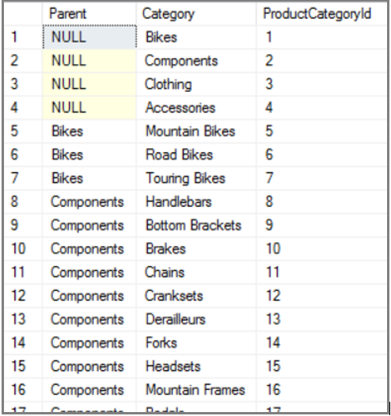
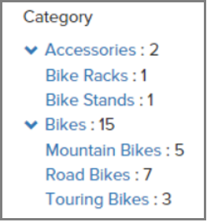

# Example: Multi-level facets in Azure Search

Azure Search schemas do not explicitly support multi-level taxonomy categories, but you can approximate them by manipulating content prior to indexing and then applying some special handling to the results. 

## Start with the data

The example in this article builds on a previous example, [Model the AdventureWorks Inventory database](search-example-adventureworks-modeling.md), to demonstrate multi-level faceting in Azure Search.

AdventureWorks has a simple two-level taxonomy with a parent-child relationship. For fixed-length taxonomy depths of this structure, a simple SQL join query can be used to group the taxonomy:

```T-SQL
SELECT 
  parent.Name Parent, category.Name Category, category.ProductCategoryId
FROM 
  SalesLT.ProductCategory category
LEFT JOIN
  SalesLT.ProductCategory parent
  ON category.ParentProductCategoryId=parent.ProductCategoryId
```

  

## Indexing to a Collection field

In the index containing this structure, create a **Collection(Edm.String)** field in the Azure Search schema to store this data, making sure that field attributes include searchable, filterable, facetable, and retrievable.

Now, when indexing content that refers to a specific taxonomy category, submit the taxonomy as an array containing text from each level of the taxonomy. For example, for an entity with `ProductCategoryId = 5 (Mountain Bikes)`, submit the field as `[ "Bikes", "Bikes|Mountain Bikes"]`

Notice the inclusion of the parent category "Bikes" in the child category value "Mountain Bikes". Each subcategory should embed its entire path relative to the root element. The pipe character separator is arbitrary, but it must be consistent and should not appear in the source text. The separator character will be used in application code to reconstruct the taxonomy tree from facet results.

## Construct the query

When issuing queries, include the following facet specification (where taxonomy is your facetable taxonomy field):
`facet = taxonomy,count:50,sort:value`

The count value must be high enough to return all possible taxonomy values. The AdventureWorks data contains 41 distinct taxonomy values, so `count:50` is sufficient.

  

## Build the structure in client code

In your client application code, reconstruct the taxonomy tree by splitting each facet value on the pipe character.

```javascript
var sum = 0
  , categories = {children:{},length:0}
  , results = getSearchResults();
separator = separator || '|';
field = field || 'taxonomy';
results['@search.facets'][field].forEach(function(d) {
  var node = categories;
  var parts = d.value.split(separator);
  sum += d.count;
  parts.forEach(function(c, i) {
    if (!_(node.children).has(c)) {
      node.children[c] = {};
      node.children[c].count = d.count;
      node.children[c].children = {};
      node.children[c].length = 0;
      node.children[c].filter = parts.slice(0,i+1).join(separator);
      node.length++;
    }
    node = node.children[c];
  });
});
categories.count = sum;
```

The **categories** object can now be used to render a collapsible taxonomy tree with accurate counts:

  

 
Each link in the tree should apply the related filter. For example:

+ **taxonomy/any**`(x:x eq 'Accessories')` returns all documents in the Accessories branch
+ **taxonomy/any**`(x:x eq 'Accessories|Bike Racks')` returns only the documents with a subcategory of Bike Racks under the Accessories branch.

This technique will scale to cover more complex scenarios like deeper taxonomy trees and duplicated subcategories that occur under different parent categories (for example, `Bike Components|Forks` and `Camping Equipment|Forks`).

> [!TIP]
> Query speed is affected by the number of facets returned. To support very large taxonomy sets, consider adding a facetable **Edm.String** field to hold the top-level taxonomy value for each document. Then apply the same technique above, but only perform the collection-facet query (filtered on the root taxonomy field) when the user expands a top-level node. Or, if 100% recall is not required, simply reduce the facet count to a reasonable number, and ensure the facet entries are sorted by count.

## See also

[Example: Model the AdventureWorks Inventory database for Azure Search](search-example-adventureworks-modeling.md)