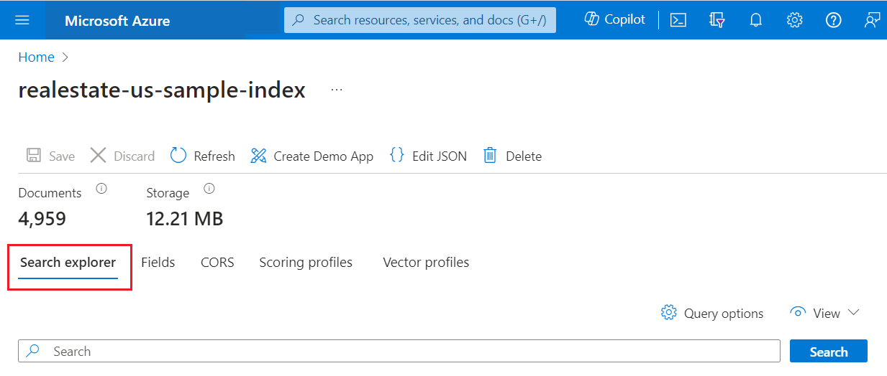

# Quickstart: Use Search explorer to run queries in the portal

**Search explorer** is a built-in query tool used for running queries against a search index in Azure Cognitive Search. This tool makes it easy to learn query syntax, test a query or filter expression, or confirm data refresh by checking whether new content exists in the index.

This quickstart uses an existing index to demonstrate Search explorer. Requests are formulated using the [Search REST API](https://docs.microsoft.com/rest/api/searchservice/), with responses returned as JSON documents.

## Prerequisites

Before you begin, you must have the following:

+ An Azure account with an active subscription. [Create an account for free](https://azure.microsoft.com/free/).

+ An Azure Cognitive Search service. [Create a service](search-create-service-portal.md) or [find an existing service](https://ms.portal.azure.com/#blade/HubsExtension/BrowseResourceBlade/resourceType/Microsoft.Search%2FsearchServices) under your current subscription. You can use a free service for this quickstart. 

+ The *realestate-us-sample-index* is used for this quickstart. Use the [**Import data**](search-import-data-portal.md) wizard to create the index. In the first step, when asked for the data source, choose **Samples** and then select the **realestate-us-sample** data source. Accept all of the wizard defaults to create the index.

## Start Search explorer

1. In the [Azure portal](https://portal.azure.com), open the search service page from the dashboard or [find your service](https://ms.portal.azure.com/#blade/HubsExtension/BrowseResourceBlade/resourceType/Microsoft.Search%2FsearchServices).

1. Open Search explorer from the command bar:

   

    Or use the embedded **Search explorer** tab on an open index:

   

## Unspecified query

For a first look at content, execute an empty search by clicking **Search** with no terms provided. An empty search is useful as a first query because it returns entire documents so that you can review document composition. On an empty search, there is no search rank and documents are returned in arbitrary order (`"@search.score": 1` for all documents). By default, 50 documents are returned in a search request.

Equivalent syntax for an empty search is `*` or `search=*`.
   
   ```http
   search=*
   ```

   **Results**
   
   

## Free text search

Free-form queries, with or without operators, are useful for simulating user-defined queries sent from a custom app to Azure Cognitive Search. Only those fields attributed as **Searchable** in the index definition are scanned for matches. 

Notice that when you provide search criteria, such as query terms or expressions, search rank comes into play. The following example illustrates a free text search.

   ```http
   Seattle apartment "Lake Washington" miele OR thermador appliance
   ```

   **Results**

   You can use Ctrl-F to search within results for specific terms of interest.

   

## Count of matching documents 

Add **$count=true** to get the number of matches found in an index. On an empty search, count is the total number of documents in the index. On a qualified search, it's the number of documents matching the query input.

   ```http
   $count=true
   ```

   **Results**

   

## Limit fields in search results

Add [**$select**](search-query-odata-select.md) to limit results to the explicitly named fields for more readable output in **Search explorer**. To keep the search string and **$count=true**, prefix arguments with **&**. 

   ```http
   search=seattle condo&$select=listingId,beds,baths,description,street,city,price&$count=true
   ```

   **Results**

   

## Return next batch of results

Azure Cognitive Search returns the top 50 matches based on the search rank. To get the next set of matching documents, append **$top=100,&$skip=50** to increase the result set to 100 documents (default is 50, maximum is 1000), skipping the first 50 documents. Recall that you need to provide search criteria, such as a query term or expression, to get ranked results. Notice that search scores decrease the deeper you reach into search results.

   ```http
   search=seattle condo&$select=listingId,beds,baths,description,street,city,price&$count=true&$top=100&$skip=50
   ```

   **Results**

   

## Filter expressions (greater than, less than, equal to)

Use the [**$filter**](search-query-odata-filter.md) parameter when you want to specify precise criteria rather than free text search. The field must be attributed as **Filterable** in the index. This example searches for bedrooms greater than 3:

   ```http
   search=seattle condo&$filter=beds gt 3&$count=true
   ```
   
   **Results**

   

## Order-by expressions

Add [**$orderby**](search-query-odata-orderby.md) to sort results by another field besides search score. The field must be attributed as **Sortable** in the index. An example expression you can use to test this out is:

   ```http
   search=seattle condo&$select=listingId,beds,price&$filter=beds gt 3&$count=true&$orderby=price asc
   ```
   
   **Results**

   

Both **$filter** and **$orderby** expressions are OData constructions. For more information, see [Filter OData syntax](https://docs.microsoft.com/rest/api/searchservice/odata-expression-syntax-for-azure-search).

<a name="start-search-explorer"></a>

## Takeaways

In this quickstart, you used **Search explorer** to query an index using the REST API.

+ Results are returned as verbose JSON documents so that you can view document construction and content, in entirety. You can use query expressions, shown in the examples, to limit which fields are returned.

+ Documents are composed of all fields marked as **Retrievable** in the index. To view index attributes in the portal, click *realestate-us-sample* in the **Indexes** list on the search overview page.

+ Free-form queries, similar to what you might enter in a commercial web browser, are useful for testing an end-user experience. For example, assuming the built-in realestate sample index, you could enter "Seattle apartments lake washington", and then you can use Ctrl-F to find terms within the search results. 

+ Query and filter expressions are articulated in a syntax supported by Azure Cognitive Search. The default is a [simple syntax](https://docs.microsoft.com/rest/api/searchservice/simple-query-syntax-in-azure-search), but you can optionally use [full Lucene](https://docs.microsoft.com/rest/api/searchservice/lucene-query-syntax-in-azure-search) for more powerful queries. [Filter expressions](https://docs.microsoft.com/rest/api/searchservice/odata-expression-syntax-for-azure-search) are an OData syntax.

## Clean up resources

When you're working in your own subscription, it's a good idea at the end of a project to identify whether you still need the resources you created. Resources left running can cost you money. You can delete resources individually or delete the resource group to delete the entire set of resources.

You can find and manage resources in the portal, using the **All resources** or **Resource groups** link in the left-navigation pane.

If you are using a free service, remember that you are limited to three indexes, indexers, and data sources. You can delete individual items in the portal to stay under the limit. 

## Next steps

To learn more about query structures and syntax, use Postman or an equivalent tool to create query expressions that leverage more parts of the API. The [Search REST API](https://docs.microsoft.com/rest/api/searchservice/) is especially helpful for learning and exploration.

> [!div class="nextstepaction"]
> [Create a basic query in Postman](search-query-simple-examples.md)