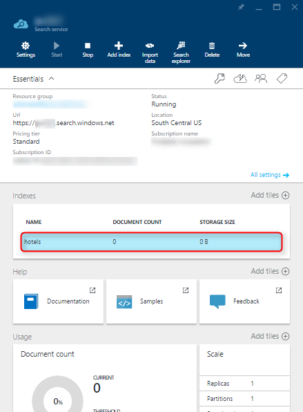
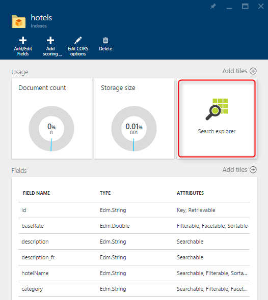
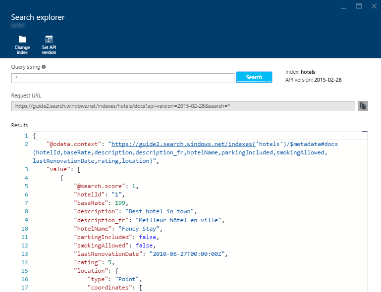

<properties
    pageTitle="Query your Azure Search Index using the Azure Portal | Microsoft Azure | Hosted cloud search service"
    description="Issue a search query in the Azure Portal's Search Explorer."
    services="search"
    documentationCenter=""
	authors="ashmaka"
/>

<tags
    ms.service="search"
    ms.devlang="NA"
    ms.workload="search"
    ms.topic="get-started-article"
    ms.tgt_pltfrm="na"
    ms.date="05/31/2016"
    ms.author="ashmaka"
/>
# Query your Azure Search index using the Azure Portal
> [AZURE.SELECTOR]
- [Overview](search-query-overview.md)
- [Portal](search-explorer.md)
- [.NET](search-query-dotnet.md)
- [REST](search-query-rest-api.md)

This guide will show you how to query your Azure Search index in the Azure Portal.

Before beginning this walkthrough, you should already have [created an Azure Search index](search-what-is-an-index.md) and [populated it with data](search-what-is-data-import.md).

## I. Go to your Azure Search blade
1. Click on "All resources" in the menu on the left side of the [Azure Portal](https://portal.azure.com/#blade/HubsExtension/BrowseResourceBlade/resourceType/Microsoft.Search%2FsearchServices)
2. Select your Azure Search service

## II. Select the index you would like to search
1. Select the index you would like to search from the "Indexes" tile.

## III. Click on the "Search Explorer" tile

## III. Start searching
1. To search your Azure Search index, start typing into the "*Query string*" field and then press "**Search**".
 * When using the Search Explorer, you can specify any of the [query parameters](https://msdn.microsoft.com/library/dn798927.aspx)

2. In the "*Results*" section, the query's results will be presented in the raw JSON that you would receiving in an HTTP Response Body when issuing search requests against the Azure Search REST API.
3. The query string is automatically parsed into the proper request URL to submit a HTTP request against the Azure Search REST API

