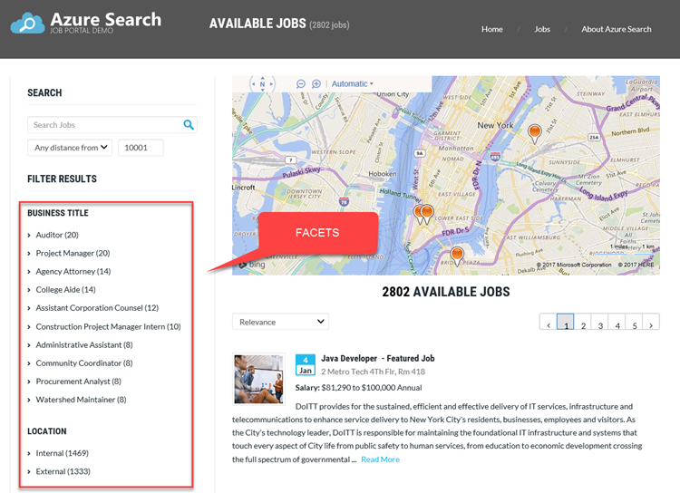
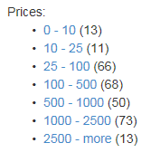
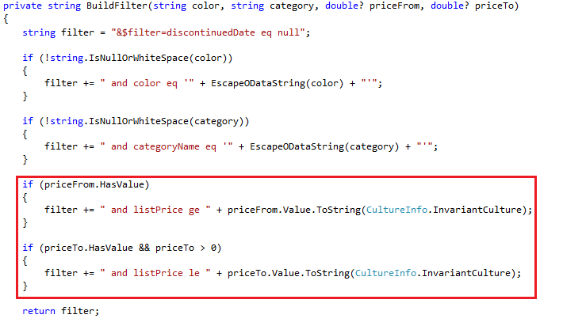
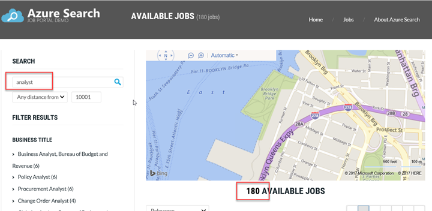
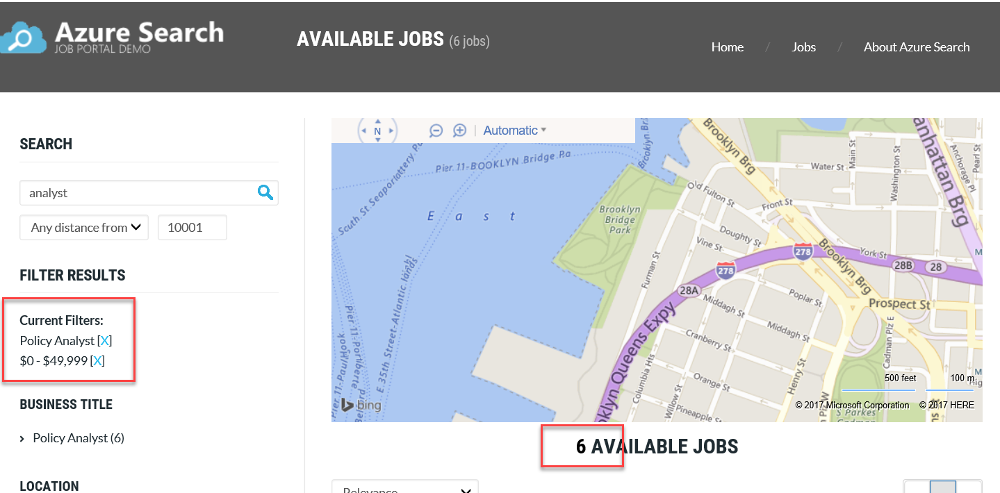

# How to implement faceted navigation in Azure Cognitive Search

Faceted navigation is a filtering mechanism that provides self-directed drilldown navigation in search applications. The term 'faceted navigation' may be unfamiliar, but you've probably used it before. As the following example shows, faceted navigation is nothing more than the categories used to filter results.

 

Faceted navigation is an alternative entry point to search. It offers a convenient alternative to typing complex search expressions by hand. Facets can help you find what you're looking for, while ensuring that you don't get zero results. As a developer, facets let you expose the most useful search criteria for navigating your search index. In online retail applications, faceted navigation is often built over brands, departments (kid's shoes), size, price, popularity, and ratings. 

Implementing faceted navigation differs across search technologies. In Azure Cognitive Search, faceted navigation is built at query time, using fields that you previously attributed in your schema.

-   In the queries that your application builds, a query must send *facet query parameters* to get the available facet filter values for that document result set.

-   To actually trim the document result set, the application must also apply a `$filter` expression.

In your application development, writing code that constructs queries constitutes the bulk of the work. Many of the application behaviors that you would expect from faceted navigation are provided by the service, including built-in support for defining ranges and getting counts for facet results. The service also includes sensible defaults that help you avoid unwieldy navigation structures. 

## Sample code and demo
This article uses a job search portal as an example. The example is implemented as an ASP.NET MVC application.

- See and test the working demo online at [Azure Cognitive Search Job Portal Demo](https://aka.ms/azjobsdemo).

- Download the code from the [Azure-Samples repo on GitHub](https://github.com/Azure-Samples/search-dotnet-asp-net-mvc-jobs).

## Get started
If you're new to search development, the best way to think of faceted navigation is that it shows the possibilities for self-directed search. It's a type of drill-down search experience, based on predefined filters, used for quickly narrowing down search results through point-and-click actions. 

### Interaction model

The search experience for faceted navigation is iterative, so let's start by understanding it as a sequence of queries that unfold in response to user actions.

The starting point is an application page that provides faceted navigation, typically placed on the periphery. Faceted navigation is often a tree structure, with checkboxes for each value, or clickable text. 

1. A query sent to Azure Cognitive Search specifies the faceted navigation structure via one or more facet query parameters. For instance, the query might include `facet=Rating`, perhaps with a `:values` or `:sort` option to further refine the presentation.
2. The presentation layer renders a search page that provides faceted navigation, using the facets specified on the request.
3. Given a faceted navigation structure that includes Rating, you click "4" to indicate that only products with a rating of 4 or higher should be shown. 
4. In response, the application sends a query that includes `$filter=Rating ge 4` 
5. The presentation layer updates the page, showing a reduced result set, containing just those items that satisfy the new criteria (in this case, products rated 4 and up).

A facet is a query parameter, but do not confuse it with query input. It is never used as selection criteria in a query. Instead, think of facet query parameters as inputs to the navigation structure that comes back in the response. For each facet query parameter you provide, Azure Cognitive Search evaluates how many documents are in the partial results for each facet value.

Notice the `$filter` in step 4. The filter is an important aspect of faceted navigation. Although facets and filters are independent in the API, you need both to deliver the experience you intend. 

### App design pattern

In application code, the pattern is to use facet query parameters to return the faceted navigation structure along with facet results, plus a $filter expression.  The filter expression handles the click event on the facet value. Think of the `$filter` expression as the code behind the actual trimming of search results returned to the presentation layer. Given a Colors facet, clicking the color Red is implemented through a `$filter` expression that selects only those items that have a color of red. 

### Query basics

In Azure Cognitive Search, a request is specified through one or more query parameters (see [Search Documents](https://docs.microsoft.com/rest/api/searchservice/Search-Documents) for a description of each one). None of the query parameters are required, but you must have at least one in order for a query to be valid.

Precision, understood as the ability to filter out irrelevant hits, is achieved through one or both of these expressions:

-   **search=**  
    The value of this parameter constitutes the search expression. It might be a single piece of text, or a complex search expression that includes multiple terms and operators. On the server, a search expression is used for full-text search, querying searchable fields in the index for matching terms, returning results in rank order. If you set `search` to null, query execution is over the entire index (that is, `search=*`). In this case, other elements of the query, such as a `$filter` or scoring profile, are the primary factors affecting which documents are returned `($filter`) and in what order (`scoringProfile` or `$orderby`).

-   **$filter=**  
    A filter is a powerful mechanism for limiting the size of search results based on the values of specific document attributes. A `$filter` is evaluated first, followed by faceting logic that generates the available values and corresponding counts for each value

Complex search expressions decrease the performance of the query. Where possible, use well-constructed filter expressions to increase precision and improve query performance.

To better understand how a filter adds more precision, compare a complex search expression to one that includes a filter expression:

-   `GET /indexes/hotel/docs?search=lodging budget +Seattle –motel +parking`
-   `GET /indexes/hotel/docs?search=lodging&$filter=City eq 'Seattle' and Parking and Type ne 'motel'`

Both queries are valid, but the second is superior if you're looking for non-motels with parking in Seattle.
-   The first query relies on those specific words being mentioned or not mentioned in string fields like Name, Description, and any other field containing searchable data.
-   The second query looks for precise matches on structured data and is likely to be much more accurate.

In applications that include faceted navigation, make sure that each user action over a faceted navigation structure is accompanied by a narrowing of search results. To narrow results, use a filter expression.

<a name="howtobuildit"></a>

## Build a faceted navigation app
You implement faceted navigation with Azure Cognitive Search in your application code that builds the search request. The faceted navigation relies on elements in your schema that you defined previously.

Predefined in your search index is the `Facetable [true|false]` index attribute, set on selected fields to enable or disable their use in a faceted navigation structure. Without `"Facetable" = true`, a field cannot be used in facet navigation.

The presentation layer in your code provides the user experience. It should list the constituent parts of the faceted navigation, such as the label, values, check boxes, and the count. The Azure Cognitive Search REST API is platform agnostic, so use whatever language and platform you want. The important thing is to include UI elements that support incremental refresh, with updated UI state as each additional facet is selected. 

At query time, your application code creates a request that includes `facet=[string]`, a request parameter that provides the field to facet by. A query can have multiple facets, such as `&facet=color&facet=category&facet=rating`, each one separated by an ampersand (&) character.

Application code must also construct a `$filter` expression to handle the click events in faceted navigation. A `$filter` reduces the search results, using the facet value as filter criteria.

Azure Cognitive Search returns the search results, based on one or more terms that you enter, along with updates to the faceted navigation structure. In Azure Cognitive Search, faceted navigation is a single-level construction, with facet values, and counts of how many results are found for each one.

In the following sections, we take a closer look at how to build each part.

<a name="buildindex"></a>

## Build the index
Faceting is enabled on a field-by-field basis in the index, via this index attribute: `"Facetable": true`.  
All field types that could possibly be used in faceted navigation are `Facetable` by default. Such field types include `Edm.String`, `Edm.DateTimeOffset`, and all the numeric field types (essentially, all field types are facetable except `Edm.GeographyPoint`, which can't be used in faceted navigation). 

When building an index, a best practice for faceted navigation is to explicitly turn faceting off for fields that should never be used as a facet.  In particular, string fields for singleton values, such as an ID or product name, should be set to `"Facetable": false` to prevent their accidental (and ineffective) use in faceted navigation. Turning faceting off where you don't need it helps keep the size of the index small, and typically improves performance.

Following is part of the schema for the Job Portal Demo sample app, trimmed of some attributes to reduce the size:

```json
{
  ...
  "name": "nycjobs",
  "fields": [
    { "name": "id",                 "type": "Edm.String",              "searchable": false, "filterable": false, ... "facetable": false, ... },
    { "name": "job_id",             "type": "Edm.String",              "searchable": false, "filterable": false, ... "facetable": false, ... },
    { "name": "agency",              "type": "Edm.String",             "searchable": true,  "filterable": true, ...  "facetable": true, ...  },
    { "name": "posting_type",        "type": "Edm.String",             "searchable": true,  "filterable": true, ...  "facetable": true, ...  },
    { "name": "num_of_positions",    "type": "Edm.Int32",              "searchable": false, "filterable": true, ...  "facetable": true, ...  },
    { "name": "business_title",      "type": "Edm.String",             "searchable": true,  "filterable": true, ...  "facetable": true, ...  },
    { "name": "civil_service_title", "type": "Edm.String",             "searchable": true,  "filterable": true, ...  "facetable": true, ...  },
    { "name": "title_code_no",       "type": "Edm.String",             "searchable": true,  "filterable": true, ...  "facetable": true, ...  },
    { "name": "level",               "type": "Edm.String",             "searchable": true,  "filterable": true, ...  "facetable": true, ...  },
    { "name": "salary_range_from",   "type": "Edm.Int32",              "searchable": false, "filterable": true, ...  "facetable": true, ...  },
    { "name": "salary_range_to",     "type": "Edm.Int32",              "searchable": false, "filterable": true, ...  "facetable": true, ...  },
    { "name": "salary_frequency",    "type": "Edm.String",             "searchable": true,  "filterable": true, ...  "facetable": true, ...  },
    { "name": "work_location",       "type": "Edm.String",             "searchable": true,  "filterable": true, ...  "facetable": true, ...  },
…
    { "name": "geo_location",        "type": "Edm.GeographyPoint",     "searchable": false, "filterable": true, ...  "facetable": false, ... },
    { "name": "tags",                "type": "Collection(Edm.String)", "searchable": true,  "filterable": true, ...  "facetable": true, ...  }
  ],
…
}
```

As you can see in the sample schema, `Facetable` is turned off for string fields that shouldn't be used as facets, such as ID values. Turning faceting off where you don't need it helps keep the size of the index small, and typically improves performance.

> [!TIP]
> As a best practice, include the full set of index attributes for each field. Although `Facetable` is on by default for almost all fields, purposely setting each attribute can help you think through the implications of each schema decision. 

<a name="checkdata"></a>

## Check the data
The quality of your data has a direct effect on whether the faceted navigation structure materializes as you expect it to. It also affects the ease of constructing filters to reduce the result set.

If you want to facet by Brand or Price, each document should contain values for *BrandName* and *ProductPrice* that are valid, consistent, and productive as a filter option.

Here are a few reminders of what to scrub for:

* For every field that you want to facet by, ask yourself whether it contains values that are suitable as filters in self-directed search. The values should be short, descriptive, and sufficiently distinctive to offer a clear choice between competing options.
* Misspellings or nearly matching values. If you facet on Color, and field values include Orange and Ornage (a misspelling), a facet based on the Color field would pick up both.
* Mixed case text can also wreak havoc in faceted navigation, with orange and Orange appearing as two different values. 
* Single and plural versions of the same value can result in a separate facet for each.

As you can imagine, diligence in preparing the data is an essential aspect of effective faceted navigation.

<a name="presentationlayer"></a>

## Build the UI
Working back from the presentation layer can help you uncover requirements that might be missed otherwise, and understand which capabilities are essential to the search experience.

In terms of faceted navigation, your web or application page displays the faceted navigation structure, detects user input on the page, and inserts the changed elements. 

For web applications, AJAX is commonly used in the presentation layer because it allows you to refresh incremental changes. You could also use ASP.NET MVC or any other visualization platform that can connect to an Azure Cognitive Search service over HTTP. The sample application referenced throughout this article -- the **Azure Cognitive Search Job Portal Demo** – happens to be an ASP.NET MVC application.

In the sample, faceted navigation is built into the search results page. The following example, taken from the `index.cshtml` file of the sample application, shows the static HTML structure for displaying faceted navigation on the search results page. The list of facets is built or rebuilt dynamically when you submit a search term, or select or clear a facet.

```html
<div class="widget sidebar-widget jobs-filter-widget">
  <h5 class="widget-title">Filter Results</h5>
    <p id="filterReset"></p>
    <div class="widget-content">

      <h6 id="businessTitleFacetTitle">Business Title</h6>
      <ul class="filter-list" id="business_title_facets">
      </ul>

      <h6>Location</h6>
      <ul class="filter-list" id="posting_type_facets">
      </ul>

      <h6>Posting Type</h6>
      <ul class="filter-list" id="posting_type_facets"></ul>

      <h6>Minimum Salary</h6>
      <ul class="filter-list" id="salary_range_facets">
      </ul>

  </div>
</div>
```

The following code snippet from the `index.cshtml` page dynamically builds the HTML to display the first facet, Business Title. Similar functions dynamically build the HTML for the other facets. Each facet has a label and a count, which displays the number of items found for that facet result.

```js
function UpdateBusinessTitleFacets(data) {
  var facetResultsHTML = '';
  for (var i = 0; i < data.length; i++) {
    facetResultsHTML += '<li><a href="javascript:void(0)" onclick="ChooseBusinessTitleFacet(\'' + data[i].Value + '\');">' + data[i].Value + ' (' + data[i].Count + ')</span></a></li>';
  }

  $("#business_title_facets").html(facetResultsHTML);
}
```

> [!TIP]
> When you design the search results page, remember to add a mechanism for clearing facets. If you add check boxes, you can easily see how to clear the filters. For other layouts, you might need a breadcrumb pattern or another creative approach. For example, in the Job Search Portal sample application, you can click the `[X]` after a selected facet to clear the facet.

<a name="buildquery"></a>

## Build the query
The code that you write for building queries should specify all parts of a valid query, including search expressions, facets, filters, scoring profiles– anything used to formulate a request. In this section, we explore where facets fit into a query, and how filters are used with facets to deliver a reduced result set.

Notice that facets are integral in this sample application. The search experience in the Job Portal Demo is designed around faceted navigation and filters. The prominent placement of faceted navigation on the page demonstrates its importance. 

An example is often a good place to begin. The following example, taken from the `JobsSearch.cs` file, builds a request that creates facet navigation based on Business Title, Location, Posting Type, and Minimum Salary. 

```cs
SearchParameters sp = new SearchParameters()
{
  ...
  // Add facets
  Facets = new List<String>() { "business_title", "posting_type", "level", "salary_range_from,interval:50000" },
};
```

A facet query parameter is set to a field and depending on the data type, can be further parameterized by comma-delimited list that includes `count:<integer>`, `sort:<>`, `interval:<integer>`, and `values:<list>`. A values list is supported for numeric data when setting up ranges. See [Search Documents (Azure Cognitive Search API)](https://docs.microsoft.com/rest/api/searchservice/Search-Documents) for usage details.

Along with facets, the request formulated by your application should also build filters to narrow down the set of candidate documents based on a facet value selection. For a bike store, faceted navigation provides clues to questions like *What colors, manufacturers, and types of bikes are available?*. Filtering answers questions like *Which exact bikes are red, mountain bikes, in this price range?*. When you click "Red" to indicate that only Red products should be shown, the next query the application sends includes `$filter=Color eq 'Red'`.

The following code snippet from the `JobsSearch.cs` page adds the selected Business Title to the filter if you select a value from the Business Title facet.

```cs
if (businessTitleFacet != "")
  filter = "business_title eq '" + businessTitleFacet + "'";
```

<a name="tips"></a> 

## Tips and best practices

### Indexing tips
**Improve index efficiency if you don't use a Search box**

If your application uses faceted navigation exclusively (that is, no search box), you can mark the field as `searchable=false`, `facetable=true` to produce a more compact index. In addition, indexing occurs only on whole facet values, with no word-break or indexing of the component parts of a multi-word value.

**Specify which fields can be used as facets**

Recall that the schema of the index determines which fields are available to use as a facet. Assuming a field is facetable, the query specifies which fields to facet by. The field by which you are faceting provides the values that appear below the label. 

The values that appear under each label are retrieved from the index. For example, if the facet field is *Color*, the values available for additional filtering are the values for that field - Red, Black, and so forth.

For Numeric and DateTime values only, you can explicitly set values on the facet field (for example, 
`facet=Rating,values:1|2|3|4|5`). A values list is allowed for these field types to simplify the separation of facet results into contiguous ranges (either ranges based on numeric values or time periods). 

**By default you can only have one level of faceted navigation** 

As noted, there is no direct support for nesting facets in a hierarchy. By default, faceted navigation in Azure Cognitive Search only supports one level of filters. However, workarounds do exist. You can encode a hierarchical facet structure in a `Collection(Edm.String)` with one entry point per hierarchy. Implementing this workaround is beyond the scope of this article. 

### Querying tips
**Validate fields**

If you build the list of facets dynamically based on untrusted user input, validate that the names of the faceted fields are valid. Or, escape the names when building URLs by using either `Uri.EscapeDataString()` in .NET, or the equivalent in your platform of choice.

### Filtering tips
**Increase search precision with filters**

Use filters. If you rely on just search expressions alone, stemming could cause a document to be returned that doesn't have the precise facet value in any of its fields.

**Increase search performance with filters**

Filters narrow down the set of candidate documents for search and exclude them from ranking. If you have a large set of documents, using a selective facet drill-down often gives you better performance.
  
**Filter only the faceted fields**

In faceted drill-down, you typically want to only include documents that have the facet value in a specific (faceted) field, not anywhere across all searchable fields. Adding a filter reinforces the target field by directing the service to search only in the faceted field for a matching value.

**Trim facet results with more filters**

Facet results are documents found in the search results that match a facet term. In the following example, in search results for *cloud computing*, 254 items also have *internal specification* as a content type. Items are not necessarily mutually exclusive. If an item meets the criteria of both filters, it is counted in each one. This duplication is possible when faceting on `Collection(Edm.String)` fields, which are often used to implement document tagging.

        Search term: "cloud computing"
        Content type
           Internal specification (254)
           Video (10) 

In general, if you find that facet results are consistently too large, we recommend that you add more filters to give users more options for narrowing the search.

### Tips about result count

**Limit the number of items in the facet navigation**

For each faceted field in the navigation tree, there is a default limit of 10 values. This default makes sense for navigation structures because it keeps the values list to a manageable size. You can override the default by assigning a value to count.

* `&facet=city,count:5` specifies that only the first five cities found in the top ranked results are returned as a facet result. Consider a sample query with a search term of "airport" and 32 matches. If the query specifies `&facet=city,count:5`, only the first five unique cities with the most documents in the search results are included in the facet results.

Notice the distinction between facet results and search results. Search results are all the documents that match the query. Facet results are the matches for each facet value. In the example, search results include City names that are not in the facet classification list (5 in our example). Results that are filtered out through faceted navigation become visible when you clear facets, or choose other facets besides City. 

> [!NOTE]
> Discussing `count` when there is more than one type can be confusing. The following table offers a brief summary of how the term is used in Azure Cognitive Search API, sample code, and documentation. 

* `@colorFacet.count`<br/>
  In presentation code, you should see a count parameter on the facet, used to display the number of facet results. In facet results, count indicates the number of documents that match on the facet term or range.
* `&facet=City,count:12`<br/>
  In a facet query, you can set count to a value.  The default is 10, but you can set it higher or lower. Setting `count:12` gets the top 12 matches in facet results by document count.
* "`@odata.count`"<br/>
  In the query response, this value indicates the number of matching items in the search results. On average, it's larger than the sum of all facet results combined, due to the presence of items that match the search term, but have no facet value matches.

**Get counts in facet results**

When you add a filter to a faceted query, you might want to retain the facet statement (for example, `facet=Rating&$filter=Rating ge 4`). Technically, facet=Rating isn't needed, but keeping it returns the counts of facet values for ratings 4 and higher. For example, if you click "4" and the query includes a filter for greater or equal to "4", counts are returned for each rating that is 4 and higher.  

**Make sure you get accurate facet counts**

Under certain circumstances, you might find that facet counts do not match the result sets (see [Faceted navigation in Azure Cognitive Search (Microsoft Q&A question page)](https://docs.microsoft.com/answers/topics/azure-cognitive-search.html)).

Facet counts can be inaccurate due to the sharding architecture. Every search index has multiple shards, and each shard reports the top N facets by document count, which is then combined into a single result. If some shards have many matching values, while others have fewer, you may find that some facet values are missing or under-counted in the results.

Although this behavior could change at any time, if you encounter this behavior today, you can work around it by artificially inflating the count:\<number> to a large number to enforce full reporting from each shard. If the value of count: is greater than or equal to the number of unique values in the field, you are guaranteed accurate results. However, when document counts are high, there is a performance penalty, so use this option judiciously.

### User interface tips
**Add labels for each field in facet navigation**

Labels are typically defined in the HTML or form (`index.cshtml` in the sample application). There is no API in Azure Cognitive Search for facet navigation labels or any other metadata.

<a name="rangefacets"></a>

## Filter based on a range
Faceting over ranges of values is a common search application requirement. Ranges are supported for numeric data and DateTime values. You can read more about each approach in [Search Documents (Azure Cognitive Search API)](https://docs.microsoft.com/rest/api/searchservice/Search-Documents).

Azure Cognitive Search simplifies range construction by providing two approaches for computing a range. For both approaches, Azure Cognitive Search creates the appropriate ranges given the inputs you've provided. For instance, if you specify range values of 10|20|30, it automatically creates ranges of 0-10, 10-20, 20-30. Your application can optionally remove any intervals that are empty. 

**Approach 1: Use the interval parameter**  
To set price facets in $10 increments, you would specify: `&facet=price,interval:10`

**Approach 2: Use a values list**  
For numeric data, you can use a values list.  Consider the facet range for a `listPrice` field, rendered as follows:

  

To specify a facet range like the one in the preceding screenshot, use a values list:

    facet=listPrice,values:10|25|100|500|1000|2500

Each range is built using 0 as a starting point, a value from the list as an endpoint, and then trimmed of the previous range to create discrete intervals. Azure Cognitive Search does these things as part of faceted navigation. You do not have to write code for structuring each interval.

### Build a filter for a range
To filter documents based on a range you select, you can use the `"ge"` and `"lt"` filter operators in a two-part expression that defines the endpoints of the range. For example, if you choose the range 10-25 for a `listPrice` field, the filter would be `$filter=listPrice ge 10 and listPrice lt 25`. In the sample code, the filter expression uses **priceFrom** and **priceTo** parameters to set the endpoints. 

  

<a name="geofacets"></a> 

## Filter based on distance
It's common to see filters that help you choose a store, restaurant, or destination based on its proximity to your current location. While this type of filter might look like faceted navigation, it's just a filter. We mention it here for those of you who are specifically looking for implementation advice for that particular design problem.

There are two Geospatial functions in Azure Cognitive Search, **geo.distance** and **geo.intersects**.

* The **geo.distance** function returns the distance in kilometers between two points. One point is a field and other is a constant passed as part of the filter. 
* The **geo.intersects** function returns true if a given point is within a given polygon. The point is a field and the polygon is specified as a constant list of coordinates passed as part of the filter.

You can find filter examples in [OData expression syntax (Azure Cognitive Search)](query-odata-filter-orderby-syntax.md).

<a name="tryitout"></a>

## Try the demo
The Azure Cognitive Search Job Portal Demo contains the examples referenced in this article.

-   See and test the working demo online at [Azure Cognitive Search Job Portal Demo](https://aka.ms/azjobsdemo).

-   Download the code from the [Azure-Samples repo on GitHub](https://github.com/Azure-Samples/search-dotnet-asp-net-mvc-jobs).

As you work with search results, watch the URL for changes in query construction. This application happens to append facets to the URI as you select each one.

1. To use the mapping functionality of the demo app, get a Bing Maps key from the [Bing Maps Dev Center](https://www.bingmapsportal.com/). Paste it over the existing key in the `index.cshtml` page. The `BingApiKey` setting in the `Web.config` file is not used. 

2. Run the application. Take the optional tour, or dismiss the dialog box.
   
3. Enter a search term, such as "analyst", and click the Search icon. The query executes quickly.
   
   A faceted navigation structure is also returned with the search results. In the search result page, the faceted navigation structure includes counts for each facet result. No facets are selected, so all matching results are returned.
   
   

4. Click a Business Title, Location, or Minimum Salary. Facets were null on the initial search, but as they take on values, the search results are trimmed of items that no longer match.
   
   

5. To clear the faceted query so that you can try different query behaviors, click the `[X]` after the selected facets to clear the facets.
   
<a name="nextstep"></a>

## Learn more
Watch [Azure Cognitive Search Deep Dive](https://channel9.msdn.com/Events/TechEd/Europe/2014/DBI-B410). At 45:25, there is a demo on how to implement facets.

For more insights on design principles for faceted navigation, we recommend the following links:

* [Design Patterns: Faceted Navigation](https://alistapart.com/article/design-patterns-faceted-navigation)
* [Front End Concerns When Implementing Faceted Search – Part 1](https://articles.uie.com/faceted_search2/)

